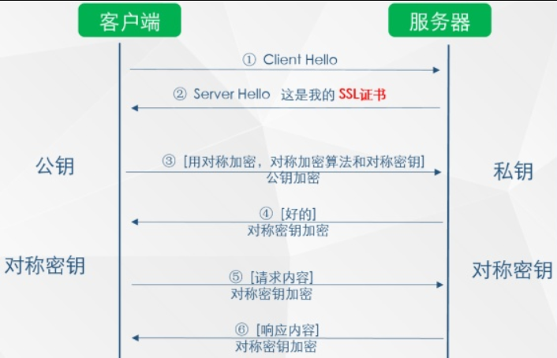
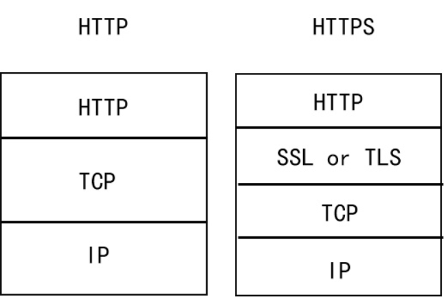

> HTTP和HTTPS的请求流程也是面试的时候一大考点，如果不掌握的话，容易丢失印象分。这两种请求都是基于TCP/IP，不明白的请看上一篇文章。这里总结HTTP/HTTPS请求的整个过程，以备不时之需。

### 一、HTTP请求的过程

#### 1.浏览器根据域名解析IP地址

浏览器根据访问的域名找到其IP地址。DNS查找过程如下：
>- 浏览器缓存：首先搜索浏览器自身的DNS缓存（缓存的时间比较短，大概只有1分钟，且只能容纳1000条缓存），看自身的缓存中是否是有域名对应的条目，而且没有过期，如果有且没有过期则解析到此结束。
>- 系统缓存：如果浏览器自身的缓存里面没有找到对应的条目，那么浏览器会搜索操作系统自身的DNS缓存，如果找到且没有过期则停止搜索解析到此结束。
>- 路由器缓存：如果系统缓存也没有找到，则会向路由器发送查询请求。
>- ISP（互联网服务提供商） DNS缓存：如果在路由缓存也没找到，最后要查的就是ISP缓存DNS的服务器。

#### 2.浏览器与WEB服务器建立一个TCP连接

TCP的3次握手过程。

#### 3.浏览器给WEB服务器发送一个HTTP请求

一个HTTP请求报文由`请求行`（request line）、`请求头部`（headers）、`空行`（blank line）和`请求数据`（request body）4个部分组成。

##### 请求行

请求行分为三个部分：***请求方法***、***URL***和***HTTP***协议版本，它们之间用空格分割。例如，GET /index.html HTTP/1.1；

***请求方法***

HTTP/1.1 定义的请求方法有8种：GET（完整请求一个资源）、POST（提交表单）、PUT（上传文件）、DELETE（删除）、PATCH、HEAD（仅请求响应首部）、OPTIONS（返回请求的资源所支持的方法）、TRACE（追求一个资源请求中间所经过的代理）。最常的两种GET和POST，如果是RESTful接口的话一般会用到GET、POST、DELETE、PUT。

***URL***

统一资源定位符，是一种资源位置的抽象唯一识别方法。
组成：<协议>://<主机>:<端口>/<路径>

***协议版本***

协议版本的格式为：HTTP/主版本号.次版本号，常用的有HTTP/1.0和HTTP/1.1

##### 请求头部

请求头部为请求报文添加了一些附加信息，由“名/值”对组成，每行一对，名和值之间使用冒号分隔。请求头部的最后会有一个空行，表示请求头部结束，接下来为请求数据。下面列出小部分请求头内容：

| 请求头 | 说明 |
| ------ | ------ |
| Host | 接受请求的服务器地址，可以是IP:端口，也可以是域名 |
| User-Agent | 发送请求的应用程序信息 |
| Connection | 指定与连接相关的属性，如Connection:Keep-Alive |

##### 请求数据

请求数据一般用在POST、PUT等请求上，如：
```
username=aa&password=1234
//或
{"username":"aa","password":"1234"}
```

#### 4.服务器端响应HTTP请求，浏览器得到HTML代码

HTTP响应报文由`状态行`（status line）、`响应头部`（headers）、`空行`（blank line）和`响应数据`（response body）4个部分组成。

##### 状态行

状态行由3部分组成，分别为：`协议版本`、`状态码`、`状态码描述`。其中协议版本与请求报文一致，状态码描述是对状态码的简单描述。如下：
```
Status Code: 200 OK
//或者
Status Code: 302 Found
```

##### 响应头部

下面列出部分响应头内容：
| 响应头 | 说明 |
| ----- | ----- |
| Server | 服务器应用程序软件的名称和版本 |
| Content-Type | 响应正文的类型 |
| Content-Length | 响应正文长度 |

##### 响应数据

用于存放需要返回给客户端的数据信息。如下：

```
<html>
<head><title>响应信息</title></head>
<body>我是正文</body>
</html>
```

#### 5.浏览器解析HTML代码，并请求HTML代码中的资源

浏览器拿到HTML文件后，开始解析HTML代码，遇到静态资源时，就向服务器端去请求下载。

#### 6.关闭TCP连接，浏览器对页面进行渲染呈现给用户

浏览器利用自己内部的工作机制，把请求到的静态资源和HTML代码进行渲染，呈现给用户。完成后根据Connection来决定是否关闭TCP连接。

### 二、HTTPS请求的过程

HTTP 协议由于其简单快速、占用资源少，一直被用于网站服务器和浏览器之间进行数据传输。但是在数据传输的过程中也存在很明显的问题，由于 HTTP 是明文协议，不会对数据进行任何方式的加密。当黑客攻击窃取了网站服务器和浏览器之间的传输报文的时，可以直接读取传输的信息，造成网站、用户资料的泄密。因此 HTTP 不适用于敏感信息的传播，这个时候需要引入 HTTPS（超文本传输安全协议）。

我们下面将具体过程整理如下：

>- 1.客户端想服务器发起HTTPS的请求，连接到服务器的443端口；
>- 2.服务器将非对称加密的公钥传递给客户端，以证书的形式回传到客户端；
>- 3.客户端接受到该公钥进行验证，如果有问题，则HTTPS请求无法继续；如果没有问题，客户端这个时候随机生成一个私钥，称为`client key`,用于对称加密数据的。使用前面的公钥对`client key`进行非对称加密；客户端发起二次HTTP请求，将加密之后的`client key`传递给服务器；
>- 4.服务器使用私钥进行解密，得到`client key`,使用`client key`对数据进行对称加密；
>- 5.将对称加密的数据传递给客户端，客户端使用对称解密，得到服务器发送的数据，完成第二次HTTP请求。



### 三、HTTPS和HTTP的区别

通过上面详细对HTTPS的分析，我们可得：
>- HTTPS是密文传输，HTTP是明文传输；
>- 默认连接的端口号是不同的，HTTPS是443端口，而HTTP是80端口；
>- HTTPS请求的过程需要CA证书要验证身份以保证客户端请求到服务器端之后，传回的响应是来自于服务器端，而HTTP则不需要CA证书；
>- HTTPS=HTTP+加密+认证+完整性保护。



### 四、HTTPS 加密算法

为了保护数据的安全，HTTPS 运用了诸多加密算法：

1. ***对称加密：***有流式、分组两种，加密和解密都是使用的同一个密钥。

 例如：DES、AES-GCM、ChaCha20-Poly1305 等。

2. ***非对称加密：***加密使用的密钥和解密使用的密钥是不相同的，分别称为：公钥、私钥，公钥和算法都是公开的，私钥是保密的。非对称加密算法性能较低，但是安全性超强，由于其加密特性，非对称加密算法能加密的数据长度也是有限的。

 例如：RSA、DSA、ECDSA、 DH、ECDHE 等。

3. ***哈希算法：***将任意长度的信息转换为较短的固定长度的值，通常其长度要比信息小得多，且算法不可逆。

 例如：MD5、SHA-1、SHA-2、SHA-256 等。

4. ***数字签名：***签名就是在信息的后面再加上一段内容（信息经过 hash 后的值），可以证明信息没有被修改过。hash 值一般都会加密后（也就是签名）再和信息一起发送，以保证这个 hash 值不被修改。


