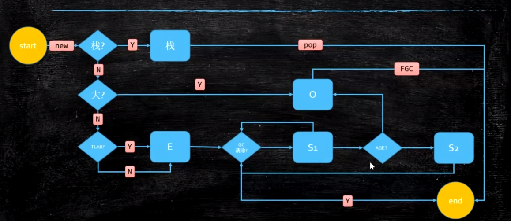
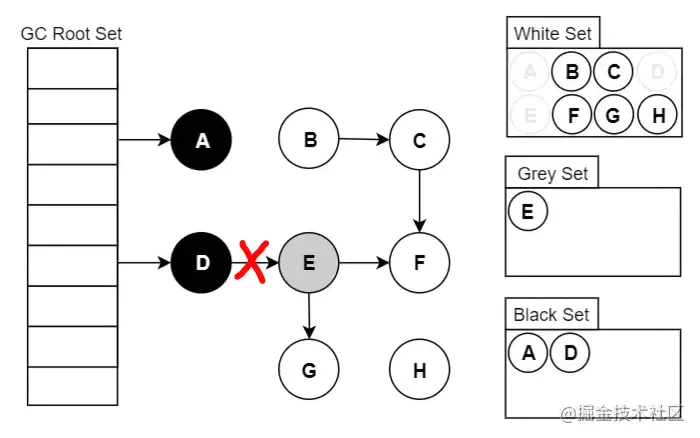
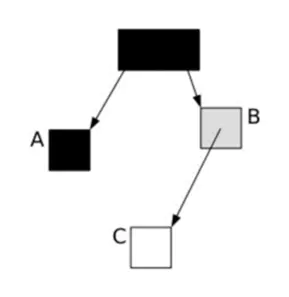
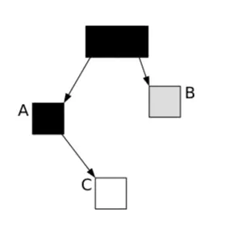
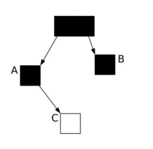
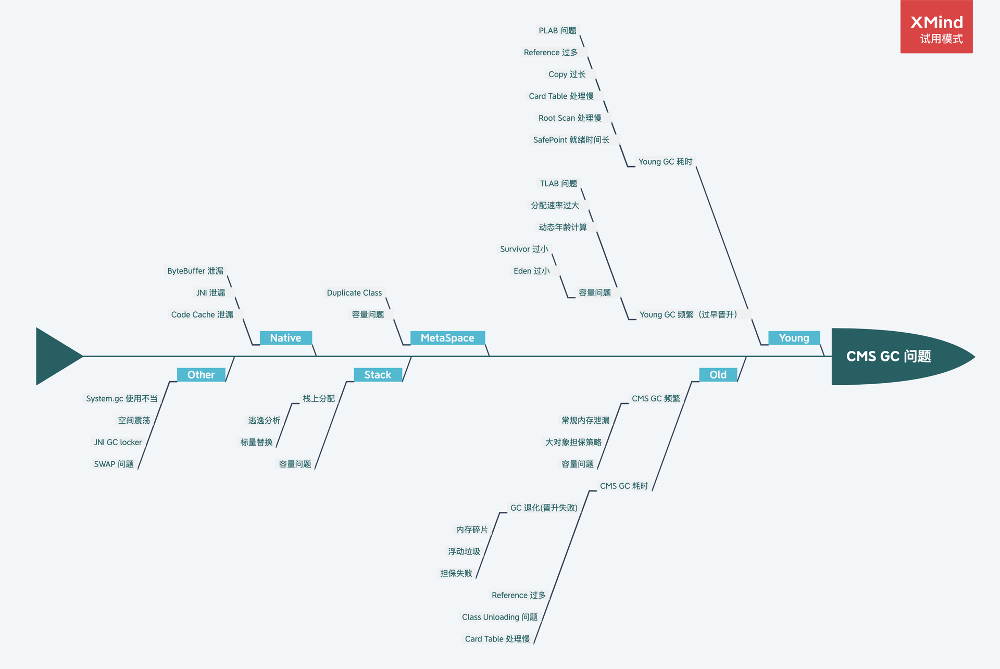

### 一、JVM基础知识

#### 1.详解JVM内存结构

>- 程序计数器：当前线程所执行的字节码的行号指示器，用于记录正在执行的虚拟机字节指令地址，线程私有；
>- Java虚拟栈：存放基本数据类型、对象的引用、方法出口等，线程私有；
>- 本地方法栈：和虚拟栈相似，只不过它服务于Native方法，线程私有；
>- Java堆：java内存最大的一块，所有对象实例、数组都存放在java堆，GC回收的地方，线程共享；
>- 方法区：存放已被加载的类信息、常量、静态变量、即时编译器编译后的代码数据等。（即永久带），回收目标主要是常量池的回收和类型的卸载，各线程共享；
>- 直接内存：这部分内存不是Java虚拟机规范中定义的内存区域。不受Java堆大小的限制，但是也可能导致OOM的产生；（可以不用说）

#### 2.谈一谈Java的内存模型（JMM）

Java的内存模型就是一种符合内存模型规范的，屏蔽各种硬件和操作系统的访问差异的，保证了Java程序在各种平台下对内存的访问都能保证效果一致的机制及规范。

Java内存模型规定了所有的变量都存储在主内存中，每条线程拥有自己独立的工作内存，线程的工作内存中保存了该线程中使用到的变量的主内存副本拷贝，线程对变量的所有操作都必须在工作内存中进行，而不能直接读写主内存。不同的线程之间也无法直接访问对方工作内存中的变量，线程间变量的传递均需要自己的工作内存和主存之间进行数据同步。

关于主内存与工作内存之间具体的交互协议，即一个变量如果从主内存拷贝到工作内存、如何从工作内存同步回主内存之类的实现细节，Java内存模型中定义了以下8种操作来完成，虚拟机实现时必须保证下面提及的每一种操作都是原子的、不可在分的。（double和long在32位机器上是例外）

>- lock(锁定):作用于主内存的变量，一个变量在同一时间只能一个线程锁定，该操作表示这条线成独占这个变量；
>- unlock(解锁):作用于主内存的变量，表示这个变量的状态由处于锁定状态被释放，这样其他线程才能对该变量进行锁定；
>- read(读取):作用于主内存变量，表示把一个主内存变量的值传输到线程的工作内存，以便随后的load操作使用；
>- load(载入):作用于线程的工作内存的变量，表示把read操作从主内存中读取的变量的值放到工作内存的变量副本中(副本是相对于主内存的变量而言的)；
>- use(使用):作用于线程的工作内存中的变量，表示把工作内存中的一个变量的值传递给执行引擎，每当虚拟机遇到一个需要使用变量的值的字节码指令时就会执行该操作；
>- assign(赋值):作用于线程的工作内存的变量，表示把执行引擎返回的结果赋值给工作内存中的变量，每当虚拟机遇到一个给变量赋值的字节码指令时就会执行该操作；
>- store(存储):作用于线程的工作内存中的变量，把工作内存中的一个变量的值传递给主内存，以便随后的write操作使用；
>- write(写入):作用于主内存的变量，把store操作从工作内存中得到的变量的值放入主内存的变量中；

作用于主内存的操作有：lock、unlock、read、write。

作用于工作内存的操作有：load、use、assign、store。

对于这8中操作，虚拟机也规定了一系列规则，在执行这8中操作的时候必须遵循如下的规则：
>- ***不允许read和load、store和write操作之一单独出现***，也就是不允许从主内存读取了变量的值但是工作内存不接收的情况，或者不允许从工作内存将变量的值回写到主内存但是主内存不接收的情况；
>- ***不允许一个线程丢弃最近的assign操作***，也就是不允许线程在自己的工作线程中修改了变量的值却不同步/回写到主内存；
>- ***不允许一个线程回写没有修改的变量到主内存***，也就是如果线程工作内存中变量没有发生过任何assign操作，是不允许将该变量的值回写到主内存；
>- ***变量只能在主内存中产生***，不允许在工作内存中直接使用一个未被初始化的变量，也就是没有执行load或者assign操作。也就是说在执行use、store之前必须对相同的变量执行了load、assign操作；
>- ***一个变量在同一时刻只能被一个线程对其进行lock操作***，也就是说一个线程一旦对一个变量加锁后，在该线程没有释放掉锁之前，其他线程是不能对其加锁的，但是同一个线程对一个变量加锁后，可以继续加锁，同时在释放锁的时候释放锁次数必须和加锁次数相同；
>- ***对变量执行lock操作，就会清空工作空间该变量的值***，执行引擎使用这个变量之前，需要重新load或者assign操作初始化变量的值；
>- ***不允许对没有lock的变量执行unlock操作***，如果一个变量没有被lock操作，那也不能对其执行unlock操作，当然一个线程也不能对被其他线程lock的变量执行unlock操作；
>- ***对一个变量执行unlock之前，必须先把变量同步回主内存中***，也就是执行store和write操作；

对volatile修饰的变量的特殊规则：

>- 线程使用use动作必须跟read、load动作相关联，用于保证线程能看得见其他线程对变量的最新修改后的值；
>- 线程使用assign动作必须跟store、write动作相关联，用于保证线程对变量的修改能立刻被其他线程看到；
>- 线程A对变量X实施use动作，线程B对变量Y实施use动作，如果线程A动作先于B，那么线程A的read动作肯定也先于线程B的read动作。同一个线程内部，被volatile修饰的变量不会被指令重排序，保证代码的执行顺序和程序的顺序相同；

#### 3.Java内存堆和栈区别

>- 栈内存用来存储基本类型的变量和对象的引用变量，堆内存用来存储Java中的对象，无论是成员变量，局部变量，还是类变量，它们指向的对象都存储在堆内存中；
>- 栈内存归属于单个线程，每个线程都会有一个栈内存，其存储的变量只能在其所属线程中可见，即栈内存可以理解成线程的私有内存，堆内存中的对象对所有线程可见。堆内存中的对象可以被所有线程访问；
>- 如果栈内存没有可用的空间存储方法调用和局部变量，JVM会抛出java.lang.StackOverFlowError，如果是堆内存没有可用的空间存储生成的对象，JVM会抛出java.lang.OutOfMemoryError；
>- 栈的内存要远远小于堆内存，如果你使用递归的话，那么你的栈很快就会充满，-Xss选项设置栈内存的大小。-Xms选项可以设置堆的开始时的大小；

#### 4.强引用、软引用、弱引用、虚引用的区别？

>- 强引用（StrongReference）强引用是使用最普遍的引用（默认Java的赋值变量基本都是强引用了）。如果一个对象具有强引用，那垃圾回收器绝不会回收它。当内存空间不足，Java虚拟机宁愿抛出OutOfMemoryError错误，使程序异常终止，也不会靠随意回收具有强引用的对象来解决内存不足的问题；
>- 软引用（SoftReference）如果内存空间不足了，就会回收这些对象的内存。只要垃圾回收器没有回收它，软引用可以和一个引用队列（ReferenceQueue）联合使用，如果软引用所引用的对象被垃圾回收器回收，Java虚拟机就会把这个软引用加入到与之关联的引用队列中；
>- 弱引用（WeakReference）在垃圾回收器线程扫描它所管辖的内存区域的过程中，一旦发现了只具有弱引用的对象，不管当前内存空间足够与否，都会回收它的内存。弱引用可以和一个引用队列（ReferenceQueue）联合使用，如果弱引用所引用的对象被垃圾回收，Java虚拟机就会把这个弱引用加入到与之关联的引用队列中；
>- 虚引用（PhantomReference）虚引用不会被垃圾收集主动解除`referent`引用关系，会导致`OOM`，要么引用无法被访问，要么手动进行`clear`。主要用来跟踪对象被垃圾回收器回收的活动，被回收时会收到一个系统通知。虚引用与软引用和弱引用的一个区别在于：虚引用必须和引用队列 （ReferenceQueue）联合使用。当垃圾回收器准备回收一个对象时，如果发现它还有虚引用，就会在回收对象的内存之前，把这个虚引用加入到与之关联的引用队列中。

#### 5.请说一说运行时栈帧的结构？

栈帧是用于支持虚拟机进行方法调用和方法执行的数据结构，它是虚拟机运行时数据区中的虚拟机栈的栈元素。

栈帧存储了方法的局部变量表、操作数栈、动态连接、方法返回地址和一些额外的附加信息。

每一个方法从调用开始至执行完成的过程，都对应着一个栈帧在虚拟机栈里面从入栈到出栈的过程。

#### 6.说说GC ROOT的对象有哪几种？

>- 虚拟机栈（栈帧中的本地变量表）中的引用的对象；
>- 方法区中的类静态属性引用的对象；
>- 方法区中的常量引用的对象；
>- 本地方法栈中JNI(即一般说的Native方法)的引用的对象；

#### 7.类的生命周期

类的生命周期包括这几部分，加载、连接（验证、准备、解析）、初始化、使用和卸载。

加载阶段主要完成以下3件事情：通过一个类的全限定名来获取定义此类的二进制字节流；将这个字节流所代表的静态存储结构转化为方法区的运行时数据结构；在内存中生成一个代表这个类的java.lang.Class对象，作为方法区这个类的各种数据的访问入口；加载阶段和连接阶段可能会交替进行。

验证是连接阶段的第一步，这一阶段主要是为了确保Class文件的字节流中包含的信息符合当前虚拟机的要求并且不会危害虚拟机自身的安全。验证阶段大致完成下面4个阶段的检验动作：文件格式验证、元数据验证、字节码验证、符号引用验证。

准备阶段是正式为类变量分配内存并设置类变量初始值的阶段，这边变量的所使用的内存都将在方法区中进行分配。这个阶段的内存分配仅仅包括类变量（被static修饰的变量），而不包括实例变量，实例变量将会在对象实例化的时随着对象一起分配在Java堆中。其次，这里所说的初始化“通常情况”下是数据类型的零值，除非变量是final类型修饰的基本变量。

解析阶段是虚拟机将常量池内的符号引用替换为直接引用的过程。

初始化阶段是类加载过程的最后一步，前面的类加载过程中，除了在加载阶段用户应用程序可以通过自定义类加载器参与之外，其他动作完全由虚拟机主导和控制。到了初始化，才真正开始执行类中定义的Java程序代码。初始化阶段是执行类构造器<clinit>方法执行过程。

使用阶段就是在咱们实例化对象、工具方法调用等等，不介绍了。

卸载阶段中对无用的类回收，以释放一部分方法区的空间。但是要满足“无用的类”条件比较苛刻：该类所有的实例都已经被回收；加载该类的ClassLoader也被回收；该类的Class对象也没有任何地方被引用，并且无法在任何地方可以通过反射来访问该类的方法；满足上面的3个条件，就有可能会回收。

#### 8.<clinit>方法介绍

当类中包含静态块和静态变量（不包含static final的基本类型），java编译器会自动生成<clinit>方法，主要是用于在初始化阶段来初始化静态成员变量和静态逻辑。

<clinit>方法与类的构造方法冉，它不需要显示的调用父类构造器，虚拟机会保证在子类的<clinit>方法执行之前，父类的<clinit>方法已经执行完毕。因此在虚拟机中第一个被执行的<clinit>方法的类肯定是Object类了。

接口中不能使用静态语句块，但仍然有变量初始化的赋值操作，因此接口与类一样都会生成<clinit>方法。但接口与类不同的是，执行接口的<clinit>方法不需要先执行父接口的<clinit>方法。只有当父接口中定义的变量使用时，父接口才会初始化。另外，接口的实现类在初始化时也一样不会执行接口的<clinit>方法。

虚拟机会保证一个类<clinit>方法在多线程环境中被正确加锁、同步，如果多个线程同时去初始化一个类，那么只会有一个线程去执行这个类的<clinit>方法。

#### 9.类加载器双亲委派模型

检查类是否被加载：
自定义类加载器（User ClassLoader） -> 启动程序类加载器（Application ClassLoader） -> 扩展类加载器（Extension ClassLoader） -> 启动类加载器（Bootstrap ClassLoader） 

尝试加载类：
启动类加载器（Bootstrap ClassLoader） -> 扩展类加载器（Extension ClassLoader） -> 启动程序类加载器（Application ClassLoader） -> 自定义类加载器（User ClassLoader）

#### 10.双亲委派模式的弊端？

上层的ClassLoader无法访问底层的ClassLoader所加载的类。JDK提供了一个方法： Thread.setContextClassLoader()可以解决这个问题。

#### 11.双亲委派机制的好处是什么？

采用双亲委派模式的是好处是Java类随着它的类加载器一起具备了一种带有优先级的层次关系，通过这种层级关可以避免类的重复加载，当父亲已经加载了该类时，就没有必要子ClassLoader再加载一次。其次是考虑到安全因素，java核心api中定义类型不会被随意替换，假设通过网络传递一个名为java.lang.Integer的类，通过双亲委托模式传递到启动类加载器，而启动类加载器在核心Java API发现这个名字的类，发现该类已被加载，并不会重新加载网络传递的过来的java.lang.Integer，而直接返回已加载过的`Integer.class`，这样便可以防止核心API库被随意篡改。

双亲委派机制的作用总结为：
- 防止重复加载同一个`Class`。通过委托去向上面问一问，加载过了，就不用再加载一遍。保证数据安全。
- 保证核心`Class`不能被篡改。通过委托方式，不会去篡改核心`Class`，即使篡改也不会去加载，即使加载也不会是同一个`Class`对象了。不同的加载器加载同一个`Class`也不是同一个`Class`对象。这样保证了`Class`执行安全。

#### 12.ClassLoader类加载器重要的4个方法介绍一下。

1.public Class<?> loadClass(String name) throws ClassNotFoundException

给定一个类名，加载一个类，返回代表这个类的Class实例，如果找不到类，则返回ClassNotFoundException。

2.protected final Class<?> defineClass(byte[] b, int off, int len)

根据给定的字节码流定义一个类，off和len参数表示实际Class信息在byte数组中的位置和长度，其中byte数组是ClassLoader从外部获取的。这是个受保护的方法，只有在自定义ClassLoader子类中可以使用。

3.protected final Class<?> findLoadedClass(String name)

这也是一个受保护的方法，它会去寻找已经加载的类。这个方法是final方法，无法被修改。

4.protected Class<?> findClass(String name) throws ClassNotFoundException

查找一个类，这是一个受保护的方法，也是重载ClassLoader时，重要的系统扩展点。这个方法会在loadClass()时被调用，用于自定义查找类的逻辑。如果不需要修改类加载默认机制，只是想改变类加载的形式，就可以重载该方法。

#### 13.JVM内存为什么要分成新生代，老年代，持久代（元空间）？

分代主要是根据每一块内存区间的特点，使用不同的回收算法，以提高垃圾回收的效率。

在虚拟机中，大部分新建对象都放入到年轻代的内存区域，年轻代的特点就是对象朝生夕灭，至少90%的新建对象都会很快被回收，因此年轻代就选择效率较高的复制算法。

当对象回收多次依然存活，就被存放到老年代，如果老年代依然使用复制算法，那么将需要复制大量的对象，回收的性价比太低了，肯定这种做法是不可取的，。根据分代的思想，可以对老年代的回收使用与新生代不同的标记-压缩/清除算法，以提高垃圾回收效率。

#### 14.新生代中为什么要分为Eden和Survivor？为什么要设置两个Survivor区？

>- 如果没有Survivor，Eden区每进行一次Minor GC，存活的对象就会被送到老年代。老年代很快被填满，触发Major GC老年代的内存空间远大于新生代，进行一次Full GC消耗的时间比Minor GC长得多,所以需要分为Eden和Survivor。
>- Survivor的存在意义，就是减少被送到老年代的对象，进而减少Full GC的发生，Survivor的预筛选保证，只有经历15次(此值是极端情况下，不准确)Minor GC还能在新生代中存活的对象，才会被送到老年代。
>- 设置两个Survivor区最大的好处就是解决了碎片化，刚刚新建的对象在Eden中，经历一次Minor GC，Eden中的存活对象就会被移动到第一块survivor space S0，Eden被清空；等Eden区再满了，就再触发一次Minor GC，Eden和S0中的存活对象又会被复制送入第二块survivor space S1（这个过程非常重要，因为这种复制算法保证了S1中来自S0和Eden两部分的存活对象占用连续的内存空间，避免了碎片化的发生）。

#### 15.引起类加载操作的五个行为？

>- 1.遇到new、getstatic、putstatic、或invokestatic这4条字节码指令时；
>- 2.使用java.lang.reflect包的方法对类进行反射调用的时候；
>- 3.当初始化一个类的时候，如果发现其父类还没有进行过初始化，则需要先触发其父类的初始化；
>- 4.当虚拟机启动的时候，用户需要指定一个要执行的主类，虚拟机会先初始化这个主类；
>- 5.当使用`invokedynamic`指令的时候，如果一个MethodHandle实例最后的解析结果`REF_getStatic`、`REF_putStatic`、`REF_invokeStatic`的方法句柄，并且这个方法句柄所对应的类没有进行初始化，则需要先触发其初始化；

#### 16.Java对象创建时机？

>- 1.使用new关键字创建对象；
>- 2.使用Class类的newInstance方法(反射机制)；
>- 3.使用Constructor类的newInstance方法(反射机制)；
>- 4.使用Clone方法创建对象；
>- 5.使用(反)序列化机制创建对象；

#### 17.说说你知道的几种主要的JVM参数？

1) 堆栈配置相关

```
java -Xmx3550m -Xms3550m -Xmn2g -Xss128k -XX:MaxMetaspace=16m -XX:NewRatio=4 -XX:SurvivorRatio=4 -XX:MaxTenuringThreshold=0
```

- `-Xmx3550m`： 最大堆大小为3550m。
- `-Xms3550m`： 设置初始堆大小为3550m。
- `-Xmn2g`： 设置年轻代大小为2g。
- `-Xss128k`： 每个线程的堆栈大小为128k。
- `-XX:MaxPermSize`： 设置持久代大小为16m。
- `-XX:NewRatio=4`: 设置年轻代（包括Eden和两个Survivor区）与年老代的比值（除去持久代）。
- `-XX:SurvivorRatio=4`： 设置年轻代中Eden区与Survivor区的大小比值。设置为4，则两个Survivor区与一个Eden区的比值为2:4，一个Survivor区占整个年轻代的1/6。
- `-XX:MaxTenuringThreshold=0`： 设置垃圾最大年龄。如果设置为0的话，则年轻代对象不经过Survivor区，直接进入年老代。

2) 垃圾收集配置相关

```
-XX:+UseSerialGC -XX:+UseParallelGC -XX:ParallelGCThreads=20 -XX:+UseConcMarkSweepGC -XX:CMSFullGCsBeforeCompaction=5 -XX:+UseCMSCompactAtFullCollection
```

- `-XX:+UseSerialGC`：选择单线程垃圾收集器。
- `-XX:+UseParallelGC`： 选择垃圾收集器为并行收集器。
- `-XX:ParallelGCThreads=20`： 配置并行收集器的线程数。
- `-XX:+UseConcMarkSweepGC`： 设置年老代为并发收集。
- `-XX:CMSFullGCsBeforeCompaction`：由于并发收集器不对内存空间进行压缩、整理，所以运行一段时间以后会产生“碎片”，使得运行效率降低。此值设置运行多少次GC以后对内存空间进行压缩、整理。
- `-XX:+UseCMSCompactAtFullCollection`： 打开对年老代的压缩。可能会影响性能，但是可以消除碎片。

3) 辅助信息相关

- `-XX:+PrintGC`：打印GC信息(建议配置)。
- `-XX:+PrintGCDetails`：打印GC详细信息（比上面多打印用户、系统在GC中的耗时，每个的回收前后的值等，建议配置）
- `-XX:+PrintGCDateStamps`：GC日志按照年月日打印，否则打印的是进程启动后的时间，不利于定位问题(建议配置)。
- `-XX:+PrintHeapAtGC`：打印GC发生前的堆栈内存空间信息(建议配置)。
- `-XX:+HeapDumpOnOutOfMemoryError`：在OOM后将内存堆栈导出(建议配置)。
- `-XX:HeapDumpPath=filePath`：OOM后的内存堆栈信息导出到指定的位置(建议配置)。
- `-XX:ErrorFile`：如果发生JVM错误(进程级错误)，将错误数据会保存到指定的位置。不配置则默认是./hs_err_pid%p.log(建议配置)。
- `-Xloggc`：配置GC日志保存的文件路径，开启滚动可以在文件名中加%t参数(建议配置)。
- `-XX:+UseGCLogFileRotation`：打开GC日志滚动记录功能，默认关闭(建议配置)。
- `-XX:NumberOfGCLogFiles`：设置滚动日志文件的个数，必须大于等于1(建议配置)。
- `-XX:GCLogFileSize`：设置滚动日志文件的大小，必须大于8K，默认也是8K(建议配置)。
- `-XX:+PrintGCCause`：打印GC发生的原因，默认打开(建议配置)。
- `-XX:+PrintFLSStatistics`：GC日志中输出`free list方式分配内存`后内存统计情况和碎片情况(建议配置)。
- `-XX:+PrintPromotionFailure`：打印新生代对象晋升老生代失败的附加信息(建议配置)。
- `-XX:+PrintJNIGCStalls`：打印进入临界区的线程信息。
- `-XX:+PrintReferenceGC`：打印各种引用的处理时间(建议配置)。

打印相关的GC日志等信息或输出OOM内存堆信息

#### 18.请说说对象头的组成？

对象在内存中存储的布局可以分为三块区域：对象头（Header）、实例数据（Instance Data）和对齐填充（Padding）；

我们以32位虚拟机来说明，对象头分成两部分，一个是`Mark Word`（4字节32位），一个是元数据指针(4字节32位)，一共8字节（如果在64位虚拟机中，不开启指针压缩，则一共16字节；开启指针压缩，则元数据为4字节，一共12字节）。

<table>
	<tr>
		<td rowspan="2">锁状态</td>
		<td colspan="2">25bit</td>
		<td rowspan="2">4bit</td>
		<td>1bit</td>
		<td>2bit</td>
	</tr>
	<tr>
		<td>23bit</td>
		<td>2bit</td>
		<td>是否偏向锁</td>
		<td>锁标志位</td>
	</tr>
	<tr>
		<td>无锁状态</td>
		<td colspan="2">对象的hashcode</td>
		<td>分代年龄</td>
		<td>0</td>
		<td>01</td>
	</tr>
	<tr>
		<td>偏向锁</td>
		<td>线程ID</td>
		<td>Epoch</td>
		<td>分代年龄</td>
		<td>1</td>
		<td>01</td>
	</tr>
	<tr>
		<td>轻量级锁</td>
		<td colspan="4">指向栈中锁记录的指针</td>
		<td>00</td>
	</tr>
	<tr>
		<td>重量级锁</td>
		<td colspan="4">指向互斥量(重量级锁)的指针</td>
		<td>10</td>
	</tr>
	<tr>
		<td>GC标记</td>
		<td colspan="4">空</td>
		<td>11</td>
	</tr>
</table>

上面展示了对象头在32位虚拟机中的一个数据结构。

<table>
	<tr>
		<td rowspan="2">锁状态</td>
		<td colspan="3">56bit</td>
		<td>1bit</td>
		<td rowspan="2">4bit</td>
		<td>1bit</td>
		<td>2bit</td>
	</tr>
	<tr>
		<td>25bit</td>
		<td>29bit</td>
		<td>2bit</td>
		<td>空</td>
		<td>是否偏向锁</td>
		<td>锁标志位</td>
	</tr>
	<tr>
		<td>无锁</td>
		<td>空</td>
		<td colspan="2">31bit hashcode</td>
		<td>空</td>
		<td>分代年龄</td>
		<td>0</td>
		<td>01</td>
	</tr>
	<tr>
		<td>偏向锁</td>
		<td colspan="2">线程ID</td>
		<td>epoch</td>
		<td>空</td>
		<td>分代年龄</td>
		<td>1</td>
		<td>01</td>
	</tr>
	<tr>
		<td>轻量级锁</td>
		<td colspan="6">指向栈中所记录的指针</td>
		<td>00</td>
	</tr>
	<tr>
		<td>重量级锁</td>
		<td colspan="6">指向互斥量(重量级锁)的指针</td>
		<td>10</td>
	</tr>
	<tr>
		<td>GC标记</td>
		<td colspan="6">空</td>
		<td>11</td>
	</tr>
</table>

上面展示了对象头在64位虚拟机中的一个数据结构。

#### 19.对象的分配规则？

>- 1.首选判断是否支持栈上分配，支持则直接将对象属性打散并分配到栈上（需要开启`-XX:+DoEscapeAnalysis`、`-XX:+EliminateAllocations`）。
>- 2.其次判断是否是大对象，超过JVM配置`-XX:PretenureSizeThreshold=N`的值，则直接分配到老年代。
>- 3.再判断是否只是TLAB`-XX:+UseTLAB`，如果支持则直接分配到线程的TLAB区，否则需要走指针碰撞分配到eden区。



#### 20.对象如何晋升到老年代？

>- 1.对象年龄到期晋升，根据参数`-XX:MaxTenuringThreshold`设置的年龄来晋升到老年代，此值默认是15，对象头是有4bit记录的对象的年轻（4bit最大也就是15）。
>- 2.如果一个对象占用超过`-XX:PretenureSizeThreshold`值的时候会直接分配到老年代，默认是0也就是不指定大小。此参数只能跟`-XX:+UseSerialGC`和`-XX:+UseParNewGC`配合使用。
>- 3.如果新生代空间不足，则触发Minor GC，GC后原来的Eden+Survivor未被回收的对象无法存放到另一个Survivor区，则将被放到老年代。
>- 4.对象各个年龄段的对象累计大小在Survivor区占比超过`-XX:TargetSurvivorRatio`的设置的百分比（默认50%），则超过此值大小年龄之后的所有的对象全部晋升到老年代。
>- 5.分配的对象大于Eden区，则直接进入老年代。
>- 6.Eden剩余空间不足分配且分配的对象大小大于Eden区的一半，并且垃圾收集器使用的是`-XX:+UseParallelGC`、`-XX:+UseParallelOldGC`、`-XX:+UseG1GC`这三种，则对象分配到老年代，不触发Minor GC。
>- 7.还有一种我暂时也没搞懂，如果新生代选择`ParallelGC`且启动类型为`Xcomp`或者`-Xmixed`，并且`ParallelGCThreads=1`，在前几次年轻代GC的时候，会有十来KB大小的对象晋升到老年代。感觉是跟`Codecache`和`PLAB`相关（待解惑）

#### 21.到底多大的对象会被直接扔到老年代？

参考上题的5,6项。

#### 22.Object obj = new Object()在内存中占用多少字节？

在32位虚拟机，markword(4字节)+元数据指针(4字节) + obj这个指针(4字节) = 12字节。

在64位虚拟机（开启指针压缩），markword(8字节) + 元数据指针(4字节) + 4字节填充 + obj这个指针(8字节) = 24字节

在64位虚拟机（关闭指针压缩），markword(8字节) + 元数据指针(8字节) + obj这个指针(8字节) = 24字节

指针压缩技术对Class对象指针，本地变量，堆栈元素，入参，返回值，NULL指针不会被压缩，并且堆大小不能***超过32G***。

#### 23.Java对象在内存中的存储布局（64位开启指针压缩）

| 普通对象 | 数组对象 |
| --- | --- |
| markword 64bit | markword 64bit |
| 元数据指针 32bit | 元数据指针 32bit |
| 实例数据 | 数组长度 32bit |
| 对齐填充 | 实例数据 |
| | 对齐填充 |

#### 24.Class对象默认情况下是存在Heap里面还是Perm中（JDK8一律分配在Heap中）？

Class对象默认分配在Heap中，JDK8之前如果我们设置了`-XX:+UnlockDiagnosticVMOptions`，`-XX:+JavaObjectsInPerm`这两个参数，那将分配在Perm里。其实也没啥用，主要是为了分析查找问题等。

#### 25.volatile的实现原理？

1.Java源码

Java源码很简单，只需要在字段修饰中添加volatile就可以了。

2.byteCode字节码

字节码层面也非常的简答， 在access_flag中会标记为0x0040即可。

3.JVM虚拟机规范

JVM虚拟机规范要求在对volatile字段进行操作的时候，需要添加内存屏障。在对volatile变量进行写的时候，前面加StoreStore屏障，后面加StoreLoad屏障。在对volatile变量读的时候，前面加LoadLoad屏障，后面加LoadStore屏障。

4.CPU级别

MESI(多CPU缓存的一致性和可见性，其实就是缓存过期策略通知)或者总线锁来实现[JVM底层实际是使用总线锁来实现的，因为大部分CPU都有Lock指令]。hsdis可以看Java的反汇编指令。

通过一些测试代码，再加上`java -XX:+UnlockDiagnosticVMOptions -XX:+PrintAssembly`打印JVM编译的汇编码。可以看到volatile和synchronized等都是使用底层CPU的Lock指令。

#### 26.你知道Java虚拟机的TLAB吗？跟我讲一讲？

TLAB全程叫Thread Local Allocation Buffer，也即线程本地分配缓冲。这部分Buffer是从堆中划分出来的，但是是本地线程独享的。可以被其他线程读取，但是不能被其他线程写入。

TLAB主要是为了解决多线程分配内存的时候，为了解决这个并发问题，对象的内存分配过程就必须进行同步控制。但是我们都知道，无论是使用哪种同步方案（实际上虚拟机使用的可能是CAS），都会影响内存的分配效率。

TLAB是虚拟机在堆内存的eden划分出来的一块专用空间，是线程专属的。在虚拟机的TLAB功能启动的情况下，在线程初始化时，虚拟机会为每个线程分配一块TLAB空间，只给当前线程使用，这样每个线程都单独拥有一个空间，如果需要分配内存，就在自己的空间上分配，这样就不存在竞争的情况，可以大大提升分配效率。

***TLAB的问题：***

如一个线程的TLAB空间有100KB，其中已经使用了80KB，当需要再分配一个30KB的对象时，就无法直接在TLAB中分配，遇到这种情况时，有两种处理方案：
>- 如果一个对象需要的空间大小超过TLAB中剩余的空间大小，则直接在堆内存中对该对象进行内存分配。
>- 如果一个对象需要的空间大小超过TLAB中剩余的空间大小，则废弃当前TLAB，重新申请TLAB空间再次进行内存分配。

如果采用方案1，那么就可能存在着一种极端情况，就是TLAB只剩下1KB，就会导致后续需要分配的大多数对象都需要在堆内存直接分配。<br>
如果采用方案2，也有可能存在频繁废弃TLAB，频繁申请TLAB的情况，而我们知道，虽然在TLAB上分配内存是线程独享的，但是TLAB内存自己从堆中划分出来的过程确实可能存在冲突的，所以，TLAB的分配过程其实也是需要并发控制的。而频繁的TLAB分配就失去了使用TLAB的意义。

为了解决这两个方案存在的问题，虚拟机定义了一个`refill_waste`的值，这个值可以翻译为“最大浪费空间”。<br>
当请求分配的内存大于`refill_waste`的时候，会选择在堆内存中分配。若小于`refill_waste`值，则会废弃当前TLAB，重新创建TLAB进行对象内存分配。<br>
前面的例子中，TLAB总空间100KB，使用了80KB，剩余20KB，如果设置的`refill_waste`的值为25KB，那么如果新对象的内存大于25KB，则直接堆内存分配，如果小于25KB，则会废弃掉之前的那个TLAB，重新分配一个TLAB空间，给新对象分配内存。

***TLAB相关的参数：***<br>
`-XX:+UseTLAB`选择表示是否开启TLAB，默认是开启；<br>
`-XX:TLABWasteTargetPercent`选项为设置TLAB空间所占用Eden空间的百分比大小。默认是eden区的1%；<br>
`-XX:+ResizeTLAB`选项是指TLAB的空间会在运行时不断调整，使系统达到最佳的运行状态。如果需要禁用自动调整TLAB的大小，可以使用`-XX:-ResizeTLAB`来禁用，并且使用`-XX:TLABSize`来手工指定TLAB的大小。默认是打开状态；<br>
`-XX:TLABRefillWasteFraction`选项是TLAB的refill_waste，默认值为64，即表示使用约为1/64空间大小作为refill_waste；<br>
`-XX:TLABSize`选项为指定TLAB的大小，这个选项一般不需要设置，会自动根据`-XX:TLABWasteTargetPercent`来赋予初始值，并且会自动调整TLAB的大小；<br>
`-XX:MinTLABSize`选项是指最小TLAB的值，默认为2048；<br>

#### 27.你知道栈上分配吗？说说什么情况下会影响栈上分配？

JVM对于这种情况可以通过开启逃逸分析参数(`-XX:+DoEscapeAnalysis`)来优化对象内存分配位置，使其通过标量替换优先分配在栈上。通过逃逸分析确定该对象不会被外部访问，并且对象可以被进一步分解时，JVM不会创建该对象，而是将该对象成员变量分解若干个被这个方法使用的成员变量所代替，这些代替的成员变量在栈帧或寄存器上分配空间，这样就不会因为没有一大块连续空间导致对象内存不够分配。开启标量替换参数(`-XX:+EliminateAllocations`)。

标量即不可被进一步分解的量，而JAVA的基本数据类型就是标量（如：int，long等基本数据类型以及reference类型等），标量的对立就是可以被进一步分解的量，而这种量称之为聚合量。而在JAVA中对象就是可以被进一步分解的聚合量。

有哪些因素会影响栈上分配呢？
- 1) 栈上分配依赖于逃逸分析(`-XX:+DoEscapeAnalysis`)和标量替换(`-XX:+EliminateAllocations`)；
- 2) 永远不会分配给任何静态或对象字段，只分配给局部变量；
- 3) 包含的引用必须是JIT能够确定的，不依赖于任何不可预测的条件控制流；
- 4) 如果对象是数组，则必须让JIT知道其大小，且数组大小不能超过`-XX:EliminateAllocationArraySizeLimit=64`的配置，默认为64；
- 5) `XX:MaxInlineSize=35`和`-XX:FreqInlineSize=325`两个参数也会影响。第一个参数表示JVM字节码大小低于35byte的方法始终内联，第二个参数表示如果是热点方法，则大小低于325的方法将被内联； Larger methods are never inlined。
- 6) 其他相关的内联参数和标量参数，可以通过命令获取`java -XX:+PrintFlagsFinal -version |grep 'Eliminate\|inline' -i`。

#### 28.什么情况下会发生栈内存溢出？

- 1) 栈是线程私有的，栈的生命周期和线程一样，每个方法在执行的时候就会创建一个栈帧，它包含局部变量表、操作数栈、动态链接、方法出口等信息，局部变量表又包括基本数据类型和对象的引用；
- 2) 当线程请求的栈深度超过了虚拟机允许的最大深度时，会抛出StackOverFlowError异常，方法递归调用肯可能会出现该问题；
- 3) 调整参数-xss去调整jvm栈的大小。

#### 29.JVM中的指针压缩原理？

指针压缩主要涉及到三个JVM参数：
>- CompressedClassSpaceSize：使用压缩的类指针时，Metaspace中的类区域的最大大小，默认1G(最大不能超过3G)。查看真正占用大小可以使用命令`jcmd pid GC.heap_info`。
>- UseCompressedOops：是否开启普通对象指针压缩，默认开启。
>- UseCompressedClassPointers：是否开启类指针压缩，默认开启，如果关闭UseCompressedOops，则JVM会报错。

哪些信息会被压缩：
>- 对象的全局静态变量(即类属性)；
>- 对象头信息：64位平台下，原生对象头大小为16字节，压缩后为12字节；
>- 对象的引用类型：64位平台下，引用类型本身大小为8字节，压缩后为4字节；
>- 对象数组类型：64位平台下，数组类型本身大小为24字节，压缩后16字节；

哪些不会被压缩：
指向非堆的Class对象指针，本地变量，堆栈元素，入参，返回值，NULL指针不会被压缩等。

***CompressedOops的原理：***
32位内最多可以表示4GB，64位地址分为堆的基地址+偏移量，当堆内存<32GB时候，在压缩过程中，把偏移量/8后保存到32位地址。在解压再把32位地址放大8倍（这就解释了为什么JVM的对象占用内存必须是8的倍数），所以启用CompressedOops的条件是堆内存要在4GB*8=32GB以内。所以压缩指针之所以能改善性能，是因为它通过对齐（Alignment），还有偏移量（Offset）将64位指针压缩成32位。换言之，性能提高是因为使用了更小更节省空间的压缩指针而不是完整长度的64位指针，CPU缓存使用率得到改善，应用程序也能执行得更快。

***零基压缩优化(Zero Based Compressd Oops)：***
零基压缩是针对压解压动作的进一步优化。 它通过改变正常指针的随机地址分配特性，强制堆地址从零开始分配（需要OS支持），进一步提高了压解压效率。要启用零基压缩，你分配给JVM的内存大小必须控制在4G以上，32G以下。如果GC堆大小在4G以下，直接砍掉高32位，避免了编码解码过程 如果GC堆大小在4G以上32G以下，则启用UseCompressedOop 如果GC堆大小大于32G，压指失效，使用原来的64位（所以说服务器内存太大不好......）。

#### 30.请说一下JVM虚拟机的分层编译，包括哪几层？每一层的优化作用？

JVM即时编译器编译本地代码需要占用程序运行时间，通常需编译出优化程序越高的代码，所花费的时间便会越长；而且想要编译出优化程序更高的代码，解释器可能还要替编译器收集性能监控信息，这对解释执行阶段的速度也有所影响。为了程序启动响应速度与运行效率之间达到最佳平衡，Hotspot虚拟机在编译子系统中加入了分层编译的功能。

- 第0层，程序纯解释执行，并且解释器不开启性能监控功能。
- 第1层，使用客户端编译器将字节码编译为本地代码来运行，进行简单可靠的稳定优化，不开启性能监控功能。
- 第2层，仍然使用客户端编译器执行，仅开启方法及回边次数统计等有限的性能监控功能。
- 第3层，仍然使用客户端编译器执行，开启全部性能监控，除了第2层的统计信息外，还会收集如分支跳转、虚方法调用版本等全部的统计信息。
- 第4层，使用服务端编译器将字节码编译为本地代码，相比起客户端编译器，服务端编译器会启动更多编译耗时更长的优化，还会根据性能监控信息进行一些不可靠的激进优化。

实时分层编译后，解释器、客户端编译器和服务端编译器就会同时工作，热点代码都可能会被编译多次，用客户端编译器获取更高的编译速度，用服务端编译器获取更好的编译质量。

与分层编译相关的JVM参数有：
| 名称 | 默认值 | 作用 |
| --- | --- | --- |
| TieredCompilation | true | 开启分层编译 |
| UseCompiler | true | 开启JIT编译 |
| PrintCompilation | false | 打印编译信息 |
| PrintAssembly | false | 打印机器码信息，需要与UnlockDiagnosticVMOptions同时开启 |
| CompileCommand | 空 | 编译的时候可以指定方法的编译信息 |
| CompileCommandFile | 空 | 输出到指定文件 |

### 二、垃圾回收

#### 1.垃圾收集算法有哪些？

垃圾收集算法有复制算法、分代收集算法、标记-整理算法、标记-清除算法、分区算法。

>- 标记 -清除算法，“标记-清除”（Mark-Sweep）算法，如它的名字一样，算法分为“标记”和“清除”两个阶段：首先标记出所有需要回收的对象，在标记完成后统一回收掉所有被标记的对象。
>- 复制算法，“复制”（Copying）的收集算法，它将可用内存按容量划分为大小相等的两块，每次只使用其中的一块。当这一块的内存用完了，就将还存活着的对象复制到另外一块上面，然后再把已使用过的内存空间一次清理掉。
>- 标记-压缩算法，标记过程仍然与“标记-清除”算法一样，但后续步骤不是直接对可回收对象进行清理，而是让所有存活的对象都向一端移动，然后直接清理掉端边界以外的内存。
>- 分代收集算法，“分代收集”（Generational Collection）算法，把Java堆分为新生代和老年代，这样就可以根据各个年代的特点采用最适当的收集算法。
>- 分区算法，分区算法将整个堆划分成连续的不同小区间。每一个小区间都独立使用，独立回收。这种算法的好处就是可以控制一次回收多少个区间。整体是基于“标记-整理”算法，局部使用“复制”算法实现的。

#### 2.请问吞吐量的优化和响应优先的垃圾收集器是如何选择的呢？

吞吐量优先首先看你使用新生代还是老年代，新生代采用的是Parallel Scavenge，然后老年代采用的是parallel Old的，最后配置多个线程进行回收的。还有就是我们可以设置参数进行调整最大垃圾收集停顿时间以及吞吐量的大小。

响应时间优先的话，我们可以这样这是老年代的收集器是一个CMS，新生代用parNew。如果堆非常大的话，建议使用G1垃圾收集器。

#### 3.请介绍一下MinorGC和FullGC。

>- Minor GC通常发生在新生代的Eden区，在这个区的对象生存期短，往往发生GC的频率较高，回收速度比较快，一般采用复制-回收算法；
>- Full GC/Major GC 发生在老年代，一般情况下，触发老年代GC的时候不会触发Minor GC，所采用的是标记-清除/整理算法；

#### 4.JVM的永久代/元空间中会发生垃圾回收么？

一般情况JVM是不会回收永久代的垃圾，但是如果永久代满了或者超过配置的临界值，则会触发FullGC。

CMS在默认情况下也不会回收永久代，但是可以通过参数`CMSClassUnloadingEnabled`且自上次卸载类之后发生gc的次数大于`-XX:CMSClassUnloadingMaxInterval=0`(默认0)或老年代内存使用率大于`-XX:CMSIsTooFullPercentage=98`(默认98)来开启，JDK6-7默认为关闭状态，JDK8为开启状态。
```
// hotspot/src/share/vm/gc_implementation/concurrentMarkSweep.concurrentMarkSweepGeneration.cpp
void CMSCollector::update_should_unload_classes() {
  _should_unload_classes = false;
  // Condition 1 above
  if (_full_gc_requested && ExplicitGCInvokesConcurrentAndUnloadsClasses) {
    _should_unload_classes = true;
  } else if (CMSClassUnloadingEnabled) { // Condition 2.a above
    // Disjuncts 2.b.(i,ii,iii) above
    _should_unload_classes = (concurrent_cycles_since_last_unload() >=
                              CMSClassUnloadingMaxInterval)
                           || _cmsGen->is_too_full();
  }
}

bool ConcurrentMarkSweepGeneration::is_too_full() const {
  bool res = should_concurrent_collect();
  res = res && (occupancy() > (double)CMSIsTooFullPercentage/100.0);
  return res;
}
```

`System.gc()`并开启了`-XX:+ExplicitGCInvokesConcurrentAndUnloadsClasses`也会执行类信息回收。

#### 5.请讲一讲你知道Java有几种垃圾收集器？

Java分新生代收集器和老年代收集器，全堆收集器等三种。

***新生代收集器***
>- Serial收集器，串行收集器是最古老，最稳定以及效率高的收集器，可能会产生较长的停顿，只使用一个线程去回收。
>- ParNew收集器，ParNew收集器其实就是Serial收集器的多线程版本，一般跟CMS收集器配合。
>- Parallel Scavenge收集器，Parallel Scavenge收集器类似ParNew收集器，Parallel收集器更关注系统的吞吐量。

***老年代收集器***
>- Serial Old收集器是Serial收集器的老年代版本，它同样是一个单线程收集器，使用“标记-整理”算法。
>- Parallel Old收集器是Parallel Scavenge收集器的老年代版本，使用多线程和“标记-整理”算法。
>- CMS收集器是一种以获取最短回收停顿时间为目标的收集器，关注系统的停顿时间，使用“标记-清除”算法。

***全堆收集器***
>- G1收集器属于分代垃圾回收器，虽然也分了新生代，老年代等，但是实际上已经不要求各个代在空间上连续。关注系统的停顿时间，整理基于“标记-整理”算法，局部使用“复制”算法。
>- Shenandoah收集器基本跟G1差不多，但是最重要的区别是支持并发的整理算法。
>- ZGC收集器跟上面两个都是采用基于Region的堆内存布局，但是最重要的区别的ZGC的Region具有动态性--动态创建和销毁，以及动态的区域容量大小。

***其他***
>- Epsilon收集器主要是以不能够进行垃圾收集为“卖点”的垃圾收集器。（比如测试调式的时候想看垃圾产生的一个锅程或者自己的项目不需要GC参与可以使用这个）

按照类型和内存支撑可以区分如下几种：
>- Serial算法，大概支持1G内存以下比较好。
>- Parallel算法，几个G内存的支持。
>- CMS 十来个G内存的支持。
>- G1 上百G内存支持。
>- ZGC和Shenandoah T级别的支持。

#### 6.CMS收集器和G1收集器的区别？

> 适用堆范围不一样

- CMS收集器是老年代的收集器，可以配合新生代的Serial和ParNew收集器一起使用；
- G1收集器收集范围是老年代和新生代，不需要结合其他收集器使用；

> 收集的目标时间不一样

- CMS收集器以最小的停顿时间为目标的收集器；
- G1收集器可预测垃圾回收的停顿时间；

> 垃圾碎片

- CMS收集器是使用“标记-清除”算法进行的垃圾回收，容易产生内存碎片；所以需要配合参数`-XX:+UseCMSCompactAtFullCollection`和`-XX:CMSFullGCsBeforeCompaction=0`来开启“标记-清除-整理”（JDK8默认情况下是开启的）。
- G1收集器使用的是“标记-整理”算法，进行了空间整合，降低了内存空间碎片；

> 垃圾回收的过程不一样

- CMS垃圾收集器的过程是：初始标记->并发标记->并发预处理(可无此过程，参考16小节并发预处理和并发可中断预处理)->重新标记->并发清理->并发重置
- G1垃圾收集的四个阶段：年轻代GC、并发标记周期、混合收集、Full GC。并发标记周期过程：初始标记->根区间扫描->并发标记->最终标记->清除阶段。

#### 7.请讲一讲CMS收集器的工作过程。

CMS收集器的工作过程比其他收集器（除了G1、ZGC、Shenandoah）略显复杂。主要步骤有：

初始标记 -> 并发标记 -> 重新标记 -> 并发清除 -> 并发重置

其中初始标记和重新标记是独占系统资源的，而预清理、并发标记、并发清除和并发重置是可以和用户线程一起执行的。

初始标记：暂停应用程序线程，遍历GC ROOTS直接可达的对象并将其压入标记栈(mark-stack)。标记完之后恢复应用程序线程。

并发标记：这个阶段虚拟机会分出若干线程(GC 线程)去进行并发标记。标记哪些对象呢，标记那些GC ROOTS最终可达的对象。

重新标记：重新标记可以理解成一个同步刷新对象间引用的操作，整个过程是STW。在并发标记其间，应用程序不断变更对象引用，此时的GC ROOTS有可能会发生变化，这个时候需要同步更新这个增量变化。如果重新标记阶段很慢，可以启动一次YGC，来减少并发标记的工作量减少其停顿时间（默认是启动的`-XX:+CMSPrecleaningEnabled`）。

并发清除：重新标记结束后，应用程序继续运行，此时分出一个处理器去进行垃圾回收工作。

并发重置：重新调整堆的大小，并为下一次GC做好数据结构支持，比如重置卡表的标位。

**`CMS`的瓶颈就在于`重新标记阶段`，需要较长花费时间来进行重新扫描。**

#### 8.GC Roots对象包含哪里？

>- 1.在虚拟机栈(栈帧中的本地变量表)中引用的对象，譬如各个线程被调用的方法堆栈中使用到的参数、局部变量、临时变量等；
>- 2.在方法区中类静态属性引用的对象，譬如Java类的引用类型静态变量；
>- 3.在方法区中常量引用的对象，譬如字符串常量池里的引用；
>- 4.在本地方法栈中JNI引用的对象；
>- 5.Java虚拟机内部的引用，如基本类型对应的Class对象，一些常驻的异常对象等，还有系统类加载器；
>- 6.所有被同步锁(synchronized关键字)持有的对象；
>- 7.反应Java虚拟机内部情况的JMXBean、JVMTI中注册的回调、本地代码缓存等；

#### 9.CMS收集器中的卡表(Card Table)的作用？

基于卡表（`Card Table`）的设计，通常将堆空间划分为一系列2次幂大小的卡页（Card Page）。卡表（Card Table），用于标记卡页的状态，每个卡表项对应一个卡页。HotSpot JVM的卡页（Card Page）大小为512字节，卡表（Card Table）被实现为一个简单的字节数组，即卡表的每个标记项为1个字节。当对一个对象引用进行写操作时（对象引用改变），写屏障逻辑将会标记对象所在的卡页为dirty。

CMS在并发标记阶段，应用线程和GC线程是并发执行的，因此可能产生新的对象或对象关系发生变化，例如：
>- 新生代的对象晋升到老年代；
>- 直接在老年代分配对象；
>- 老年代对象的引用关系发生变更；

对于这些对象，需要重新标记以防止被遗漏。为了提高重新标记的效率，并发标记阶段会把这些发生变化的对象所在的Card标识为Dirty，这样后续阶段就只需要扫描这些Dirty Card的对象，从而避免扫描整个老年代。

#### 10.CMS写屏障又是维护卡表，又得维护增量更新？

卡表其实只有一份，又得用来支持`YGC`又得支持`CMS`并发时的增量更新肯定是不够的。每次`YGC`都会扫描重置卡表，这样增量更新的记录就被清理了。所以还搞了个`mod-union table`，在并发标记时，如果发生`YGC`需要重置卡表的记录时，就会更新`mod-union table`对应的位置。这样`CMS重新标记阶段`就能结合`当时的卡表`和`mod-union table`来处理增量更新，防止**漏标对象**了。

#### 11.CMS中minor gc和major gc是顺序发生的吗？

不是的，可以交叉发生，即在并发周期执行过程中，是可以发生Minor gc的，这个找个gc日志就可以观察到。

#### 12.CMS的并发收集周期何时触发？

>- 阈值检查机制：老年代的使用空间达到某个阈值，JVM的默认值是92%（jdk1.5之前是68%，jdk1.6之后是92%），或者可以通过`-XX:+CMSInitiatingOccupancyFraction`和`-XX:+UseCMSInitiatingOccupancyOnly`两个参数来设置；这个参数的设置需要看应用场景，设置得太小，会导致CMS频繁发生，设置得太大，会导致过多的并发模式失败。
>- 动态检查机制：JVM会根据最近的回收历史，估算下一次老年代被耗尽的时间，快到这个时间的时候就启动一个并发周期。设置`-XX:+UseCMSInitiatingOccupancyOnly`这个参数可以将这个特性关闭。

#### 13.concurrent mode failure和promotion failed触发的Full GC有啥不同？

`concurrent mode failure`触发的是`foreground模式`，会暂停整个应用，会将一些并行的阶段省掉**做一次老年代收集**，行为跟`Serial Old`的一样，至于在这个过程中是否需要压缩，则需要看三个条件：
>- 我们设置了`-XX:+UseCMSCompactAtFullCollection`和`-XX:CMSFullGCsBeforeCompaction=N`，前者设置为true，后者默认是0，前者表示是在Full GC的时候执行压缩，后者表示是每隔多少次不压缩的`Full GC`之后执行一次带压缩的`Full GC`，默认是0的话就是每次`Full GC`都压缩；
>- 用户调用了`System.gc()`，而且`-XX:+DisableExplicitGC`没有开启；
>- `young gen`报告接下来如果做增量收集会失败。

`promotion failed`触发的是我们常说的的`Full GC`，**对年轻代和老年代都会回收，并进行整理**。

#### 14.promotion failed和concurrent mode failure的触发原因有啥不同？

>- `promotion failed`是说，担保机制确定老年代是否有足够的空间容纳新来的对象，如果担保机制说有，但是真正分配的时候发现由于碎片导致找不到连续的空间而失败；
>- `concurrent mode failure`是指并发周期还没执行完，用户线程就来请求比预留空间更大的空间了，即后台线程的收集没有赶上应用线程的分配速度。

#### 15.CMS有哪两种GC实现方式？它们的区别是什么？触发条件是什么？

`CMS GC`在实现上分成`foreground collector`和`background collector`。

*** foreground collector ***

`foreground collector`触发条件比较简单，**一般是遇到对象分配但空间不够，就会直接触发GC**，来立即进行空间回收。采用的算法是`mark sweep`，不压缩（13小节有说明）。会暂停整个应用，做一次老年代收集，行为跟`Serial Old`一样。由于它会暂停应用并且进行，所以不需要再次执行`FinalRemark`阶段。

*** background collector ***

`background collector`的流程，它是通过`CMS`后台线程不断的去扫描，过程中主要是判断是否符合`background collector`的触发条件，一旦有符合的情况，就会进行一次`background`的`collect`。

每次扫描过程中，先等`CMSWaitDuration`时间，然后再去进行一次`shouldConcurrentCollect`判断，看是否满足`CMS background collector`的触发条件。`CMSWaitDuration`默认时间是`2s`（经常会有业务遇到频繁的`CMS GC`，注意看每次`CMS GC`之间的时间间隔，如果是`2s`，那基本就可以断定是`CMS`的`background collector`）。

其触发条件常见的有六种：
>- 1.`GC cause`是`gclocker`且配置了`GCLockerInvokesConcurrent`参数, 或者`GC cause`是`javalangsystemgc`（就是`System.gc()`调用）且配置了`ExplicitGCInvokesConcurrent`参数；
>- 2.未配置`UseCMSInitiatingOccupancyOnly`时，会根据统计数据动态判断是否需要进行一次`CMS GC`。预测`CMS GC`完成所需要的时间大于预计的老年代将要填满的时间，则进行`GC`。 这些判断是需要基于历史的`CMS GC`统计指标，然而，第一次`CMS GC`时，统计数据还没有形成，是无效的，这时会跟据`Old Gen`的使用占比来判断是否要进行`GC`。那占多少比率，开始回收呢？（也就是`CMSBootstrapOccupancy`的值是多少呢？）答案是`50%`；
>- 3.当`Old Gen`超过了`CMSInitiatingOccupancyFraction`配置的大小时，当`CMSInitiatingOccupancyFraction`参数配置值小于0时（注意，默认是 -1），是 “((100 - MinHeapFreeRatio) + (double)(tr * MinHeapFreeRatio) / 100.0) / 100.0”，不配置公式中的影响参数的情况下，默认是92%；
>- 4.如果未超过上面的阈值条件，并且未设置`UseCMSInitiatingOccupancyOnly`，当`Old Gen`刚因为对象分配空间而进行扩容，且成功分配空间，这时会考虑进行一次`CMS GC`或者根据是否使用自适应`空闲chunk`链表并且分配失败来触发；
>- 5.根据增量`GC`是否可能会失败，通过判断当前`Old Gen`剩余的空间大小是否足够容纳`Young GC`晋升的对象大小。`Young GC`到底要晋升多少是无法提前知道的，因此，这里通过统计平均每次`Young GC`晋升的大小和当前`Young GC`可能晋升的最大大小来进行比较；
>- 6.根据`metaspace`情况判断，如果配置了`CMSClassUnloadingEnabled`参数，如果`metaspace`申请空间失败触发；

#### 16.什么情况下才选择使用CMS收集器呢？

>- 堆太小，如果不是对延迟有特别高的需求，不建议使用CMS，主要是由于CMS的几个缺点导致的：（1）并发周期的触发比例不好设置；（2）抢占CPU时间；（3）担保判断导致YGC变慢；（4）碎片问题。
>- 除了看吞吐量和延时，还需要看具体的应用，比方说ES，Lucene和G1是不兼容的，因此默认的收集器就是CMS。

#### 17.听说过CMS的并发预处理和并发可中断预处理吗？

CMS在并发标记和重新标记中间会有另外两个动作，一个是`并发预处理`即`concurrent-preclean`，一个是`并发中断预处理`即`concurrent-abortable-preclean`。

***并发预处理做了什么？***<br>
cms回收器在老年代GC的时候，会使用到`Card Table`，目的不是找到跨带引用（年轻代到老年代的跨代引用是通过从 gc root 遍历对象标记的），而是找到前面`concurrent-marking`阶段被应用线程并发修改的对象引用。`concurrent-preclean`阶段是对这些`card marking`产生的`dirty card`进行`clean`，`cms gc`线程会扫描`dirty card`对应的内存区域，更新之前记录的过时的引用信息，并且去掉`dirty card`标记。<br>

***并发中断预处理做了什么？***<br>
`concurrent-abortable-preclean`阶段目的是减轻`final remark`阶段（会暂停应用线程）的负担，这个阶段同样会对`dirty card`的扫描和清理，和`concurrent-preclean`的区别在于，`concurrent-abortable-preclean`会重复地以迭代的方式执行，直到满足退出条件。但是`concurrent-preclean`已经处理过`dirty card`，为什么JVM还需要再执行一个类似的阶段呢？<br>
如果`final-remark`阶段开始时刚好进行了`young gc`（比如`ParNew`）,应用程序刚因为`young gc`暂停，然后又会因为`final-remark`暂停，造成连续的长暂停。除此之外，因为`young gc`线程修改了存活对象的引用地址，会产生很多需要重新扫描的对象，增加了`final-remark`的工作量。所以`concurrent-abortable-preclean`除了`clean card`的作用，还有调度`final-remark`开始时机的作用参考。`cms`回收器认为`final-remark`最理想的执行时机就是年轻代占用在`50%`时，这时刚好处于上次`young gc`完成（0%）和下次`young gc`开始（100%）的中间节点。<br>

***相关的配置***<br>
>- `abortable-preclean`的*中断条件*，配置参数是`-XX:CMSScheduleRemarkEdenPenetration=50`，表示当`eden`区内存占用到达50%时，中断`abortable-preclean`，开始执行`final-remark`。
>- `abortable-preclean`的*触发条件*，配置参数是`-XX:CMSScheduleRemarkEdenSizeThreshold=2m`，表示当`eden`区内存占用超过`2M`时才会执行`abortable-preclean`，否则没有执行的必要。
>- `abortable-preclean`的*主动退出条件*，配置参数是`-XX:CMSMaxAbortablePrecleanTime=5000`，表示当`abortable-preclean`执行时间到了5秒，不管有没有到`-XX:+CMSScheduleRemardEdenPenetration`都会中止此阶段，进入`final-remark`。还有一个参数是`-XX:CMSMaxAbortablePrecleanLoops=0`，表示`abortable-preclean`的执行次数超过了这个值（默认为0，表示不限制次数）也会进入到`final-remark`。主要因为如果年轻代内存占用增长缓慢，那么`abortable-preclean`要长时间执行，可能因为`preclean`赶不上应用线程创造`dirty card`的速度导致`dirty card`越来越多，此时还不如执行一个`final-remark`。

当然如果能在进入`final-remark`阶段之前，能够进行一次`Minor GC`的话，可以减少`final-remark`阶段的停顿时间，可以通过`-XX:+CMSScavengeBeforeRemark`参数来控制。但凡事都有利弊，`Minor GC`后紧跟着一个`remark pause`，如此一来，停顿时间也比较久。

***相同GC日志参数***<br>
`-XX:+PrintCMSStatistics`可以查看GC日志中`cms`回收器在`preclean`阶段执行的操作<br>
`-XX:+PrintGCCause`查看GC原因<br>
`-XX:+PrintGCTimeStamps`打印GC发生时候相对于应用启动的时间点<br>
`-XX:+PrintGCDetails`查看GC详情<br>

#### 18.Old区频繁的做CMS收集可能的原因？

基本都是一次`Young GC`完成后，负责处理`CMS GC`的一个后台线程`concurrentMarkSweepThread`会不断地轮询，使用`shouldConcurrentCollect()`方法做一次检测，判断是否达到了回收条件。如果达到条件，使用`collect_in_background()`启动一次`Background模式GC`。轮询的判断是使用`sleepBeforeNextCycle()`方法，间隔周期为`-XX:CMSWaitDuration`决定，默认为`2s`。

具体的代码：`src/hotspot/share/gc/cms/concurrentMarkSweepThread.cpp`中的`sleepBeforeNextCycle`方法。
```
void ConcurrentMarkSweepThread::sleepBeforeNextCycle() {
  while (!should_terminate()) {
    if(CMSWaitDuration >= 0) {
      // Wait until the next synchronous GC, a concurrent full gc
      // request or a timeout, whichever is earlier.
      wait_on_cms_lock_for_scavenge(CMSWaitDuration);
    } else {
      // Wait until any cms_lock event or check interval not to call shouldConcurrentCollect permanently
      wait_on_cms_lock(CMSCheckInterval);
    }
    // Check if we should start a CMS collection cycle
    if (_collector->shouldConcurrentCollect()) {
      return;
    }
    // .. collection criterion not yet met, let's go back
    // and wait some more
  }
}
```

判断是否进行回收的代码在：`src/hotspot/share/gc/cms/concurrentMarkSweepGeneration.cpp`中的`shouldConcurrentCollect`方法。

可能与内存泄漏有关系，一般触发CMS回收的相关的参数有`-XX:CMSInitiatingOccupancyFraction`，此值可能调整的比较小。还有就是如果之前的`Young GC`失败过，或者下次`Young区`执行`Young GC`可能失败，这两种情况下都需要触发`CMS GC`。

#### 19.单次CMS收集耗时太长的原因有哪些？

CMS回收的两个STW阶段，主要在`Init Mark`和`Final Remark`阶段，也是导致`CMS Old GC`最多的原因，另外有些情况就是在`STW`前等待`Mutator`的线程到达`SafePoint`也会导致时间过长。

由于`Init Mark`整个过程比较简单，从`GC Root`出发标记`Old`中的对象，处理完成后借助`BitMap`处理下`Young`区对`Old`区的引用，整个过程基本都比较快，很少会有较大的停顿。

`Final Remark`阶段是引起`CMS`耗时比较大的主要阶段。

- 会对`SoftReference`、`WeakReference`、`FinalReference`几种引用进行处理。如果我们在实现`finalize`方法的时候，内部进行了比较耗时的操作，则会增加这一块的处理时间。我们可以增加`-XX:+ParallelRefProcEnabled`参数来开启并行处理，或者检查代码看哪些`finalize`方法进行了比较耗时的操作。
- 如果开启了`-XX:+CMSClassUnloadingEnabled`会对类元信息进行回收处理，此处也是造成耗时的一大原因。如果我们没有大量动态类生成，可以将此参数关闭掉或者配置`-XX:CMSClassUnloadingMaxInterval=N`来指定发生N次`CMS`回收后进行一次类卸载。
- 如果在`Concurrent Mark`阶段会将并发标记期间因用户程序继续运作而导致标记变动的那一部分对象的标记记录，会把上述对象所在的`Card`标识为`Dirty`，后续只需扫描这些`Dirty Card`的对象，避免扫描整个老年代，在最终标记阶段会重新扫描这些对象，造成耗时加长。

#### 20.CMS回收的GC日志特征？

***CMS Background GC (到达触发阈值，只回收老年代，并发GC，不进行内存整理)***
```
2022-10-14T14:18:03.134+0800: [GC (CMS Initial Mark) [1 CMS-initial-mark: 9747K(10240K)] 9747K(27328K), 0.0005460 secs] [Times: user=0.00 sys=0.00, real=0.00 secs] 
2022-10-14T14:18:03.134+0800: [CMS-concurrent-mark-start]
2022-10-14T14:18:03.135+0800: [CMS-concurrent-mark: 0.001/0.001 secs] [Times: user=0.00 sys=0.00, real=0.00 secs] 
2022-10-14T14:18:03.135+0800: [CMS-concurrent-preclean-start]
2022-10-14T14:18:03.141+0800: [CMS-concurrent-preclean: 0.006/0.006 secs] [Times: user=0.00 sys=0.00, real=0.01 secs] 
2022-10-14T14:18:03.142+0800: [GC (CMS Final Remark) [YG occupancy: 0 K (17088 K)]2022-10-14T14:18:03.142+0800: [Rescan (parallel) , 0.0004897 secs]2022-10-14T14:18:03.142+0800: [weak refs processing, 0.0047440 secs]2022-10-14T14:18:03.146+0800: [class unloading, 0.0003178 secs]2022-10-14T14:18:03.147+0800: [scrub symbol table, 0.0003008 secs]2022-10-14T14:18:03.147+0800: [scrub string table, 0.0002952 secs][1 CMS-remark: 9747K(10240K)] 9747K(27328K), 0.0065877 secs] [Times: user=0.00 sys=0.00, real=0.01 secs] 
2022-10-14T14:18:03.148+0800: [CMS-concurrent-sweep-start]
2022-10-14T14:18:03.148+0800: [CMS-concurrent-sweep: 0.000/0.000 secs] [Times: user=0.00 sys=0.00, real=0.00 secs] 
2022-10-14T14:18:03.148+0800: [CMS-concurrent-reset-start]
2022-10-14T14:18:03.148+0800: [CMS-concurrent-reset: 0.000/0.000 secs] [Times: user=0.00 sys=0.00, real=0.00 secs] 
```

***CMS Foreground GC (Old区内存分配的时候，内存不足导致GC，只回收老年代，STW，不进行内存整理)***
```
{Heap before GC invocations=0 (full 0):
 par new generation   total 17088K, used 8468K [0x00000000fe200000, 0x00000000ff600000, 0x00000000ff600000)
  eden space 13696K,  61% used [0x00000000fe200000, 0x00000000fea45148, 0x00000000fef60000)
  from space 3392K,   0% used [0x00000000fef60000, 0x00000000fef60000, 0x00000000ff2b0000)
  to   space 3392K,   0% used [0x00000000ff2b0000, 0x00000000ff2b0000, 0x00000000ff600000)
 concurrent mark-sweep generation total 10240K, used 8192K [0x00000000ff600000, 0x0000000100000000, 0x0000000100000000)
 Metaspace       used 3931K, capacity 4572K, committed 4864K, reserved 1056768K
  class space    used 429K, capacity 460K, committed 512K, reserved 1048576K
2022-10-14T14:18:03.124+0800: [GC (Allocation Failure) 2022-10-14T14:18:03.124+0800: [CMS[YG occupancy: 8468 K (17088 K)]2022-10-14T14:18:03.125+0800: [weak refs processing, 0.0030331 secs]2022-10-14T14:18:03.128+0800: [class unloading, 0.0002865 secs]2022-10-14T14:18:03.129+0800: [scrub symbol table, 0.0003037 secs]2022-10-14T14:18:03.129+0800: [scrub string table, 0.0002663 secs]: 8192K->6144K(10240K), 0.0055622 secs] 16660K->14612K(27328K), [Metaspace: 3931K->3931K(1056768K)], 0.0056602 secs] [Times: user=0.00 sys=0.00, real=0.00 secs] 
Heap after GC invocations=1 (full 1):
 par new generation   total 17088K, used 8468K [0x00000000fe200000, 0x00000000ff600000, 0x00000000ff600000)
  eden space 13696K,  61% used [0x00000000fe200000, 0x00000000fea45148, 0x00000000fef60000)
  from space 3392K,   0% used [0x00000000fef60000, 0x00000000fef60000, 0x00000000ff2b0000)
  to   space 3392K,   0% used [0x00000000ff2b0000, 0x00000000ff2b0000, 0x00000000ff600000)
 concurrent mark-sweep generation total 10240K, used 6144K [0x00000000ff600000, 0x0000000100000000, 0x0000000100000000)
 Metaspace       used 3931K, capacity 4572K, committed 4864K, reserved 1056768K
  class space    used 429K, capacity 460K, committed 512K, reserved 1048576K
}
```

***CMS Serial GC (Old区内存分配的时候，内存充足，但是内存碎片导致GC，回收全堆，STW，进行内存整理)***
```
{Heap before GC invocations=1 (full 1):
 par new generation   total 17088K, used 8468K [0x00000000fe200000, 0x00000000ff600000, 0x00000000ff600000)
  eden space 13696K,  61% used [0x00000000fe200000, 0x00000000fea45148, 0x00000000fef60000)
  from space 3392K,   0% used [0x00000000fef60000, 0x00000000fef60000, 0x00000000ff2b0000)
  to   space 3392K,   0% used [0x00000000ff2b0000, 0x00000000ff2b0000, 0x00000000ff600000)
 concurrent mark-sweep generation total 10240K, used 6144K [0x00000000ff600000, 0x0000000100000000, 0x0000000100000000)
 Metaspace       used 3931K, capacity 4572K, committed 4864K, reserved 1056768K
  class space    used 429K, capacity 460K, committed 512K, reserved 1048576K
2022-10-14T14:18:03.130+0800: [Full GC (Allocation Failure) 2022-10-14T14:18:03.130+0800: [CMS: 6144K->7699K(10240K), 0.0032597 secs] 14612K->7699K(27328K), [Metaspace: 3931K->3931K(1056768K)], 0.0032847 secs] [Times: user=0.00 sys=0.00, real=0.00 secs] 
Heap after GC invocations=2 (full 2):
 par new generation   total 17088K, used 0K [0x00000000fe200000, 0x00000000ff600000, 0x00000000ff600000)
  eden space 13696K,   0% used [0x00000000fe200000, 0x00000000fe200000, 0x00000000fef60000)
  from space 3392K,   0% used [0x00000000fef60000, 0x00000000fef60000, 0x00000000ff2b0000)
  to   space 3392K,   0% used [0x00000000ff2b0000, 0x00000000ff2b0000, 0x00000000ff600000)
 concurrent mark-sweep generation total 10240K, used 7699K [0x00000000ff600000, 0x0000000100000000, 0x0000000100000000)
 Metaspace       used 3931K, capacity 4572K, committed 4864K, reserved 1056768K
  class space    used 429K, capacity 460K, committed 512K, reserved 1048576K
}
```

#### 21.请讲一讲G1的垃圾收集过程是怎样的？

G1收集器的过程涵盖4个阶段，即`年轻代GC`、`并发标记周期`、`混合收集`、`Full GC`。

***年轻代GC***依然是由`Eden区`和`Survivor`两个区间组成，当`Eden`区间分配内存失败时，就触发了年轻代GC。在每一次年轻代回收暂停期间，`G1 GC`计算当前年轻代大小需要扩展或压缩的总量，例如增加或删除空闲空间、统计RSet大小、当前最大可用年轻代、当前最小可用年轻代、设置停顿目标等。因为，我们可以认为这个过程在回收停顿结束后是一个重新调整年轻代的过程。

***并发标记周期***的最终目标是在整个Java堆达到满载之前完成标记动作，同时为了确保Java应用线程可以并行运行，并行标记循环的内部标记任务被划分成了很多任务，这样可以做到并行执行。

***混合收集***是成功完成并发标记周期后, `g1 gc`从执行年轻代回收切换到执行混合回收。在混合回收中, `g1 gc`可选择将一些老年代区域添加到将回收的`Eden`和`Survivor`区域集。添加的老年区域的确切数量由几个flag控制。g1 gc 回收足够数量的老年代区域 (通过多次混合回收) 后，`g1`将恢复到执行年轻代回收, 直到下一个并发标记周期完成。

***Full GC***如果在年轻代区间或者老年代区间执行拷贝存活对象操作的时候，找不到一个空闲的区间，就会在GC日志中看到诸如“to-space exhausted”这样的错误日志，则`G1 GC`会尝试去扩展可用的Java堆内存大小。如果扩展失败，`G1 GC`会触发它的失败保护机制并且启动单线程的`Full GC`动作。这个阶段，单线程会针对整个堆内存里的所有区间进行标记、清除、压缩等工作。

#### 22.请讲一讲G1的并发标记周期的过程？

>- 初始标记：这个阶段是独占式的，它会停止所有的Java线程，然后开始标记根节点可及的所有对象。这个阶段可以和年轻代回收同时执行，这样的设计方式主要是为了加快独占阶段的执行速度。
>- 根区间扫描：这个阶段是并发的，可以和Java应用程序线程同时运行。在年轻代回收的初始标记阶段拷贝到幸存者区间的对象需要被扫描并被当作标记根元素。任何从幸存者区间过来的引用都会被标记，基于这个原理，幸存者区间也被称为根区间。根区间扫描阶段必须在下一个垃圾回收暂停之前完成，这是因为所有从幸存者区间来的引用需要在整个堆区间扫描之前完成标记工作。
>- 并发标记：在整个堆中查找可访问的（存活的）对象，并行标记线程一次只扫描一个区间，扫描完毕后会通过标记位方式标记该区间已经扫描完毕。该阶段与应用程序同时运行，可以被 STW 年轻代垃圾回收中断。
>- 最终标记：是整个标记阶段的最后一环。这个阶段是一个独占式阶段，在整个独占式过程中，G1 GC完全处理 遗留的STAB日志缓存、更新。这个阶段主要的目标是统计存活对象的数量，同时也对引用对象进行处理。如果你的应用程序使用了大量的引用对象，那么这个阶段耗时会有所增加。
>- 清除阶段：在统计期间，G1 GC会识别完全空的区域和可供进行混合垃圾回收的区域。清理阶段在将空白区域重置并添加到空闲列表时为部分并发。完全空的Region不会被加到CSet中，都在这个阶段直接回收了。此阶段与应用程序是并发执行的。

#### 23.请讲一讲G1的混合回收？

G1 GC通过初始化一个并行标记周期循环帮助标记对象的根节点，最终确认所有的存活对象和每一个区间的存活对象比例。当老年代的占有率达到了`-XX:InitiatingHeapOccupancyPercent=45`，一个并行标记循环被初始化并启动了。在最后阶段，G1计算每个老年代区间的存活对象数量，并且在清理阶段会对每个老年代区间进行打分。这个阶段完成之后，G1开始一次混合回收。

混合回收就是把老年代的一些区域加在将要回收的Eden和survivor的后面，这些所有将要回收的区域叫做Collection Set（CSet），最后用年轻代回收算法一起回收。

一次混合回收循环内部的混合回收次数可以被每一次混合回收暂停阶段执行的最小老年代区间集合数量以及堆空间空闲百分比所控制。

`-XX:G1MixedGCCountTarget=8`参数为标记循环完成之后开始的混合回收数目从物理上被限制在了8个(默认值)。每一次混合回收暂停的最小老年代区间数目的计算公式为：

每一次混合回收暂停的最小老年代区间数据 = 混合收集循环确认的候选老年代区间总数/G1MixedGCCountTarget。

`-XX:G1HeapWastePercent=5`，这个选项对于控制一次混合回收循环回收的老年代区间数量有很大的影响作用。对于每一次混合回收暂停，在每次YGC之后和再次发生Mixed GC之前，会检查垃圾占比是否达到此参数，只有达到了，下次才会发生Mixed GC。

#### 24.请跟我讲讲跟G1收集器相关的JVM参数有哪些？

-XX:+UseG1GC：打开G1收集器开关<br>
-XX:MaxGCPauseMillis：指定最大停顿时间<br>
-XX:ParallelGCThreads：设置并行回收时GC工作线程数量<br>
-XX:InitiatingHeapOccupancyPercent：当整个堆使用率达到多少触发并发标记周期的执行，默认值45。<br>
-XX:G1HeapRegionSize：每个Region的大小，最小1M，最大32M，默认是堆内存的 1/2000。<br>

#### 25.为什么G1不维护年轻代到老年代的记忆集？

`G1`分了`young GC`和`mixed gc`。`young gc`会选取`所有年轻代的region`进行收集。`midex gc`会选取`所有年轻代的region`和一些`收集收益高的老年代region`进行收集。所以`年轻代的region`都在收集范围内，所以不需要额外记录年轻代到老年代的跨代引用。

#### 26.CMS和G1为了维持并发的正确性分别用了什么手段？

`CMS`和`G1`算法都涉及对可达对象的并发标记。并发标记的主要问题是垃圾收集器在标记对象的过程中`Mutator线程`可能正在改变对象引用关系图，从而造成漏标和多标。**多标不会影响程序的正确性，只是造成所谓的浮动垃圾。但漏标则会导致可达对象被当做垃圾收集掉，从而影响程序的正确性。**

多标-浮动垃圾，在这个时候，E/F/G理论上是可以被回收的。但是由于E已经变为了灰色了，那么它就会继续执行下去。最终的结果就是不会将他们标记为垃圾对象，在本轮标记中存活。



并发执行漏标的两个充分必要条件是：
- 将新对象插入已扫描完毕的对象中，即插入黑色对象到白色对象的引用。`(CMS)`
- 删除了灰色对象到白色对象的引用。`(G1)`

并发标记开始的时候：


当指针发生变更的时候：


最后可能形成的标记：


`CMS`和`G1`分别通过`增量更新`和`SATB`来打破这两个充分必要条件，维持了`GC`线程与应用线程并发的正确性。

`CMS`用了`增量更新（Incremental update）`，打破了第一个条件，通过写屏障将插入的白色对象标记成灰色，即加入到标记栈中，在`remark`阶段再扫描，`防止漏标情况`。

`G1`用了`SATB（snapshot-at-the-beginning）`，打破了第二个条件，会通过写屏障把旧的引用关系记下来，之后再把旧引用关系再扫描过。说白了就是在`GC`开始时候如果对象是存活的就认为其存活，等于拍了个快照。而且`GC`过程中`新分配的对象也都认为是活的`。每个`region`会维持`TAMS（top at mark start）指针`，分别是`prevTAMS`和`nextTAMS`分别`标记两次并发标记`开始时候`Top指针的位置`。`Top指针`就是`region`中`最新分配对象的位置`，所以`nextTAMS`和`Top`之间区域的对象都是新分配的对象都认为其是存活的即可。**原始快照方式不会产生浮动垃圾。**

而利用增量更新的`CMS`在`remark阶段`需要重新扫描所有线程栈和整个年轻代，因为等于之前的根有新增，所以需要重新扫描过，如果年轻代的对象很多的话会比较耗时。要注意这阶段是`STW`的，很关键，所以`CMS`也提供了一个`-XX:+CMSScavengeBeforeRemark`参数，来强制`remark`阶段之前来一次`YGC`。

**浮动垃圾的产生：**
因为增量更新不记录删除的引用关系，当某个引用关系被标记后，用户线程将该引用关系断开，这个断开操作不会被记录，所以断开的对象就不会被清除，产生了浮动垃圾。

#### 27.Metaspace相关的知识

>- 1.我们在指定`-XX:MetaspaceSize`的时候，虚拟机在启动的时候不会默认就申请`-XX:MetaspaceSize`指定的内存，一般初始容量是21807104（约20.8m）。
>- 2.Metaspace由于使用不断扩容到-XX:MetaspaceSize参数指定的量，就会发生FGC；且之后每次Metaspace扩容都会发生FGC；
>- 3.如果Old区配置CMS垃圾回收，那么第2点的FGC也会使用CMS算法进行回收；
>- 4.Meta区容量范围为[20.8m, MaxMetaspaceSize)；
>- 5.如果MaxMetaspaceSize设置太小，可能会导致频繁FGC，甚至OOM；
>- 6.建议`-XX:MetaspaceSize`和`-XX:MaxMetaspaceSize`设置一样大。至于设置多大建议稳定运行一段时间后通过`jstat -gc pid`确认且这个值大一些，对于大部分项目256m即可；
>- 7.`-XX:CompressedClassSpaceSize`参数在JVM启动的时候会分配内存供Metaspace来使用，默认1G，分配会跟Heap紧挨着，这块内存专门来存类元数据的Klass部分；如果不开启`-XX:UseCompressedClassPointers`，则没有这一块内存。这样就会Klass部分和非Klass(Method等对象)会共享Metaspace空间；
>- 8.`-XX:InitialBootClassLoaderMetaspaceSize`主要指定BootClassLoader(默认JVM启动类加载器)的存储。非Klass部分数据第一个Metachunk大小在64位默认4M，32位下默认2200K，而存储Klass部分的第一个Metachunk的大小默认是384K。
>- 9.每个类加载器都会有Metachunk来关联并存储类相关的信息，如果类加载器很多的时候，最大的问题就是碎片化的问题。如很多的类加载器，每个里面只加载了1个类，但是Metachunk大小会是一定的，这就造成了空间浪费，并且Metaspace中的类回收还不能做空间整理。
>- 10.jstat我们看到Metaspace空间经常是占比90%，有时候不是说Metaspace空间不足，是因为已用空间/Committed的占比，真正的可用的空间应该是(Reserved-已用空间)。
>- 11.`-XX:MinMetaspaceFreeRatio`当进行过Metaspace GC之后，会计算当前Metaspace的空闲空间比，如果空闲比小于这个参数，那么虚拟机将增长Metaspace的大小。在本机该参数的默认值为40，也就是40%。设置该参数可以控制Metaspace的增长的速度，太小的值会导致Metaspace增长的缓慢，Metaspace的使用逐渐趋于饱和，可能会影响之后类的加载。而太大的值会导致Metaspace增长的过快，浪费内存；
>- 12.`-XX:MaxMetaspaceFreeRatio`当进行过Metaspace GC之后， 会计算当前Metaspace的空闲空间比，如果空闲比大于这个参数，那么虚拟机会释放Metaspace的部分空间。在本机该参数的默认值为70，也就是70%；

#### 28.线程大小相关的知识

>- 1.`-XX:ThreadStackSize`和`-Xss`两个是一个意思，都是设置Java线程栈大小，但是`-Xss`需要添加上单位信息，而`-XX:ThreadStackSize`默认单位是KB，可以不需要添加；
>- 2.`-XX:ThreadStackSize`在64位虚拟机中默认为1M，32位虚拟机为512K，需要4K对齐；
>- 3.`-XX:CompilerThreadStackSize`设置编译线程栈大小，64位默认大小为4M，32位默认大小为2M，比如C2 CompilerThread等线程；

#### 29.CodeCache Size相关参数

>- 1.`-XX:InitialCodeCacheSize`是CodeCache初始化的时候的大小，但是随着CodeCache的增长不会降下来，但是CodeCache里的block是可以复用的；
>- 2.`-XX:ReservedCodeCacheSize`是设置CodeCache最大值的内存值，默认值是48M，如果开启分层编译则是240M(默认JDK8是开启分层编译)，同时`-XX:ReservedCodeCacheSize`不能超过2G；
>- 3.`-XX:CodeCacheMinimumFreeSpace`表示当CodeCache的可用大小不足这个值的时候，就会进行Code Cache Full的处理（处理期间整个jit会暂停，并且有且仅有一次打印code_cache_full到控制台，进行空间回收等操作）；

#### 30.堆外内存相关参数

>- 1.`-XX:MaxDirectMemorySize`设置堆外内存的大小，默认值是Xms-S0大小。

在我们查看GC日志的时候，经常会到到Full GC，堆空间又没满，并且查看自己代码却没有主动调用`System.gc()`的地方，这个时候往往就是堆外内存满了造成的。

Java中在申请好的堆外内存是通过`DirectByteBuffer`类来关联，本身`DirectByteBuffer`这个对象占用的JVM空间很小，但是可能会关联一个非常大的堆外空间。如果JVM长时间不进行GC来回收掉`DirectByteBuffer`对象，则堆外空间将一直无法得到释放。所以在每次进行申请的时候，判断堆外空间不足的时候，会主动调用`System.gc()`来执行空间释放。

`DirectByteBuffer`对象如果从native层面创建是可以绕过堆外内存大小的检查，这个是非常危险的。

建议不要关闭`System.gc()`的执行，不要配置参数`-XX:+DisableExplicitGC`此参数。

#### 31.堆外内存OOM怎么办？

内存使用率不断上升，甚至开始使用`swap`内存，同时可能出现`GC`时间飙升，线程被`Block`等现象，通过`top`命令发现`Java`进程的`RES`甚至超过了`-Xmx`的大小。出现这些现象时，基本可以确定是出现了堆外内存泄漏。

JVM 的堆外内存泄漏，主要有两种的原因：
- 通过`UnSafe#allocateMemory`，`ByteBuffer#allocateDirect`主动申请了堆外内存而没有释放，常见于`NIO`、`Netty`等相关组件。
- 代码中有通过`JNI`调用`Native Code`申请的内存没有释放。

在项目中添加`-XX:NativeMemoryTracking=detail`JVM参数后重启项目（需要注意的是，打开`NMT`会带来`5%~10%的性能损耗`）。使用命令`jcmd pid VM.native_memory detail`查看内存分布。重点观察`total`中的`committed`，因为`jcmd`命令显示的内存包含堆内内存、Code 区域、通过`Unsafe.allocateMemory`和`DirectByteBuffer`申请的内存，但是不包含其他`Native Code`申请的堆外内存。

如果`total`中的`committed`和`top`中的`RES`相差不大，则应为主动申请的堆外内存未释放造成的，如果相差较大，则基本可以确定是`JNI`调用造成的。如果是`JNI`造成的，可以通过[gperftools](https://github.com/gperftools/gperftools) + `Btrace`等工具，帮助我们分析出问题的代码。

#### 32.GCLocker Initiated GC错误是什么？怎么解决？

在`GC日志`中，出现`GC Cause`为`GCLocker Initiated GC`：
```
2020-09-23T16:49:09.727+0800: 504426.742: [GC (GCLocker Initiated GC) 504426.742: [ParNew (promotion failed): 209716K->6042K(1887488K), 0.0843330 secs] 1449487K->1347626K(3984640K), 0.0848963 secs] [Times: user=0.19 sys=0.00, real=0.09 secs]
2020-09-23T16:49:09.812+0800: 504426.827: [Full GC (GCLocker Initiated GC) 504426.827: [CMS: 1341583K->419699K(2097152K), 1.8482275 secs] 1347626K->419699K(3984640K), [Metaspace: 297780K->297780K(1329152K)], 1.8490564 secs] [Times: user=1.62 sys=0.20, real=1.85 secs]
```

原因是`JNI`如果需要获取`JVM`中的`String`或者`数组`，直接使用了`JVM`堆区的指针，如果这时发生`GC`，就会导致数据错误。因此，在发生此类`JNI`调用时，禁止`GC`的发生，同时阻止其他线程进入`JNI`临界区，直到`最后一个线程退出临界区时触发一次GC`。

`GC Locker`可能导致的不良后果有：
- 如果此时是`年轻代`剩余空间不足，导致发生`GC`，由于无法进行`Young GC`，会将对象直接分配至`老年代`
- 如果`老年代`也没有空间了，则会等待锁释放，导致线程阻塞。
- 可能触发额外不必要的`Young GC`，`JDK`有一个`Bug`，有一定的几率，本来只该触发一次`GCLocker Initiated GC`的`Young GC`，实际发生了一次`Allocation Failure GC`又紧接着一次`GCLocker Initiated GC`。是因为`GCLocker Initiated GC`的属性被设为`full`，导致两次`GC`不能收敛。

解决办法：
- 添加`-XX+PrintJNIGCStalls`参数，可以打印出发生`JNI`调用时的线程，进一步分析，找到引发问题的`JNI`调用。
- `JNI`调用需要谨慎，不一定可以提升性能，反而可能造成`GC问题`。
- 升级版本到`JDK14`，避免[JDK-8048556](https://bugs.openjdk.java.net/browse/JDK-8048556)导致的`重复GC`。

### 三、JVM性能监控、故障处理工具介绍

#### 1.jstat:虚拟机统计信息监视工具

```
jstat [ option vmid [interval[s|ms] [ccount]] ]
```

| 选项 | 作用 |
| --- | --- |
| -class | 监视类加载、卸载数量、总空间以及类装载所耗费的时间 |
| -gc | 监视Java堆状况，包括Eden区、2个Survivor区、老年代、永久代等的容量，已用空间，垃圾收集时间合计等信息 |
| -gccapacity | 监视内容与-gc基本相同，但输出主要关注Java堆各个区域使用到的最大、最小空间 |
| -gcutil | 监视内容与-gc基本相同，但输出主要关注已使用空间占总空间的百分比 |
| -gccause | 与-gcutil功能一样，但是会额外输出导致上一次垃圾收集产生的原因 |
| -gcnew | 监视新生代垃圾收集状况 |
| -gcnewcapacity | 监视内容与-gcnew基本相同，输出主要关注使用到的最大、最小空间 |
| -gcold | 监视老年代垃圾收集状况 |
| -gcoldcapacity | 监视内容与-gcold基本相同，输出主要关注使用到的最大、最小空间 |
| -gcpermcapacity | 输出永久代使用到的最大、最小空间 |
| -compiler | 输出即时编译器编译过的方法、耗时等信息 |
| -printcompilation | 输出已经被即时编译的方法 |

#### 2.常用的命令

`java -XX:+PrintFlagsFinal -version` 打印JVM配置参数的默认值

`java -XX:+PrintCommandLineFlags -version` 打印JVM启动时的一些初始化参数，`PrintCommandLineFlags`必须放置在其他参数之后

`jinfo -flags pid` 打印JVM运行时的一些参数

#### 3.Java OOM一共有多少种？

- ***java.lang.OutMemoryError:Java heap space***

这个是最常见的OOM了，指堆空间大小已经达到了设置的最大内存值。这个时候应该使用`jmap`、`MAT`或者`VM`去定位是否是内存溢出。如果一切正常，则需要调整`-Xmx`的值。

- ***java.lang.StackOverflowError***

这个也是比较常见的，通常在递归调用造成栈空间不足的时候会报错。结合jstack检查运行时堆栈信息或者调整`-Xss`的大小。

- ***java.lang.OutMemoryError:GC overhead limit exceeded***

这个错误是由于JVM花费太长时间执行GC且只能回收很少的堆内存时抛出的。默认情况下，如果Java进程花费98%以上的时间执行GC，并且每次只有不到2%的堆被恢复，则JVM抛出此错误。换句话说，这意味着我们的应用程序几乎耗尽了所有可用内存，垃圾收集器花了太长时间试图清理它，并多次失败。这个问题还是堆内内存溢出或者空间太小造成的，解决办法还是排除内存泄露或者增大堆空间，或者干脆关闭掉此提示`-XX:-UseGCOverheadLimit`(治标不治本)。

- ***java.lang.OutMemoryError:unable to create new native thread***

这个意思是没有足够的内存空间给线程分配java栈，也许是忘记线程池`shutdown`或者是主机内存真的太小了。如果排查一切都正常，JVM方面可以通过指定`-Xss`来减少单个`thread stack`的大小。另外也可以在系统层面，可以通过修改`/etc/security/limits.conf`中的`nofile`和`nproc`来增大os对线程的限制。

- ***java.lang.OutOfMemoryError: Requested array size exceeds VM limit***

“请求的数组大小超出 VM 限制”表明应用程序试图分配大于堆大小的数组。例如，如果应用程序尝试分配 512MB 的数组，但最大堆大小为 256MB，则会抛出此错误。

- ***java.lang.OutOfMemoryError: Metaspace***

Java元空间大小超过了`-XX:MaxMetaSpaceSize`设置的大小会抛出此错误，可以尝试增加此配置。

- ***java.lang.OutOfMemoryError: request size bytes for reason. Out of swap space?***

当来自本机堆的分配失败并且本机堆可能接近耗尽时，Java HotSpot VM 代码会报告此明显异常。该消息指示失败的请求的大小（以字节为单位）以及内存请求的原因。当抛出此错误消息时，VM 调用致命错误处理机制（即，它生成一个致命错误日志文件，其中包含有关崩溃时线程、进程和系统的有用信息）。在本机堆耗尽的情况下，日志中的堆内存和内存映射信息可能很有用。

- ***java.lang.OutOfMemoryError: Compressed class space***

如果JVM参数配置`-XX:+UseCompressedOops`和`-XX:+UseCompressedClassPointers`后，默认`CompressedClassSpaceSize`配置为1G，如果`UseCompressedClassPointers`所需的空间超过`CompressedClassSpaceSize`则会报出此错误。可以尝试增加`CompressedClassSpaceSize`的大小。

- ***java.lang.OutOfMemoryError: reason stack_trace_with_native_method***

如果错误消息的详细部分是“reason stack_trace_with_native_method”，并且打印了堆栈跟踪，其中顶部帧是本机方法，那么这表明本机方法遇到了分配失败。分配失败是在 Java 本机接口 (JNI) 或本机方法中而不是在 JVM 代码中检测到的。

### 四、JVM故障诊断与性能优化

#### 1.Netty项目报java.lang.OutOfMemoryError:Direct buffer memory错误。

由于Netty大量使用了堆外内存来做数据缓冲，如果出现这个错误，一般都是因为堆外内存没有及时回收导致的。请查看JVM参数是否配置了`-XX:+DisableExplicitGC`来禁用显示GC，请关闭掉此选项。具体调用源码在：

```
//java.nio.Bits.reserveMemory

static void reserveMemory(long size, int cap) {
	//...
	while (jlra.tryHandlePendingReference()) {
	    if (tryReserveMemory(size, cap)) {
	        return;
	    }
	}
	
	// trigger VM's Reference processing
	System.gc();
	
	// a retry loop with exponential back-off delays
	// (this gives VM some time to do it's job)
	boolean interrupted = false;
	...
	
	throw new OutOfMemoryError("Direct buffer memory");
}
```

#### 2.让System.gc()使用并发回收

默认情况下，使用System.gc()，它会使用传统的Full GC方式回收整个堆。我们可以通过参数`-XX:+ExplicitGCInvokesConcurrent`来让System.gc()在CSM或G1收集器下使用并发回收策略。

#### 3.过多线程导致OOM

由于没一个线程的开启都要占用系统内存，因此当线程数量太多时，也有可能导致OOM。由于线程的栈空间也是在堆外分配的，因为和直接内存非常相似，如果想让系统支持更多的线程，那么应该使用一个较小的堆。可以通过`-Xss`或者`-XX:ThreadStackSize`来减少线程堆栈大小，默认为1M。

#### 4.CMS问题鱼骨图参考



### 四、JVM相关连环炮面试解析
