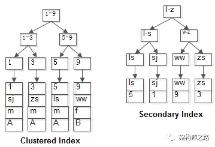
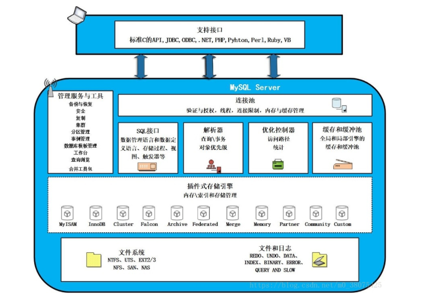

> 程序员的面试内容分为两部分，一部分与编程相关，另一部分则与数据库相关。而作为数据库中的主流，MySQL更是涉及面试中的诸多高频考点。对于后端人员来说，不需要像专业的DBA那样精通MySQL，但也需要掌握相关的基本内容。

## 一、存储引擎相关

#### 1.你知道哪些MySQL存储引擎？

>- InnoDB。MYSQL5.5.5以后的默认存储引擎，支持ACID；
>- Myisam。常用的非事务型存储引擎。MYSQL5.5.5以前的默认引擎；
>- Memory/Heap。内存引擎，不支持事务，不支持持久化，服务重启后数据即丢失；
>- BlackHole。黑洞，可以接受任何数据，但是不会存储任何数据；一般可以用于复制的中继服务；
>- CSV。以CSV格式存储的非事务型存储引擎；
>- Archive。只允许查询和新增而不允许修改的非事务型存储引擎；

#### 2.常见的存储引擎都适用于哪些场景？

使用哪一种引擎需要灵活选择，合适的存储引擎，能够提高整个数据库的性能。不同的存储引擎都有各自的特点，以适应不同的需求，如下表常用的引擎所示：
| 功能 | InnoDB | Myisam | Heap |
| ---  | --- | --- | --- |
| 存储限制 | 64TB | 256TB | RAM |
| 支持事务 | YES | NO | NO |
| 支持全文索引 | YES(5.7) | YES | NO |
| 支持普通索引 | YES | YES | No |
| 支持哈希索引 | NO(自适应HASH) | NO | YES |
| 支持数据缓存 | YES | NO | N/A |
| 支持外键 | YES | NO | NO |

Innodb支持事务，可以用于数据不允许丢失，要求一致性比较高的业务，如银行、保险、用户等管理系统；Myisam由于不支持事务，但是支持全文索引等特点，可以用于不重要的业务，如新闻系统、日志系统等；而Heap引擎的数据由于存储在内存中，可以用于数据的临时缓存等；

#### 3.InnoDB和MyISAM的区别有哪些？

我们可以通过如下表格来显示其区别：
| 功能 | InnoDB | Myisam |
| --- | --- | --- |
| 存储限制 | 64TB | 256TB |
| 支持事务 | YES | NO |
| 支持数据缓存 | YES | NO |
| 支持外键 | YES | NO |
| 热备份 | NO(需要第三方工具) | YES |
| count(*) | 速度慢 | 非常快 |
| 行锁 | YES | NO |
| 数据文件 | 支持共享/独立表空间 | 独立表空间 |
| 外键 | YES | NO |

关于两个存储引擎在索引上的区别如下：
>- 1.InnoDB的数据文件本身就是索引文件。而MyISAM的索引和数据是分开的；
>- 2.InnoDB的辅助索引data域存储相应记录主键的值而不是地址。而MyISAM的辅助索引和主索引没有多大区别；

(额外补充：Myisam主键索引和辅助索引的区别在，主键索引要求key是唯一的，而辅助索引的key可以重复)

#### 4.InnoDB和MyISAM，select count(*)哪个更快，为什么？

Myisam更快，是因为Myisam引擎单独记录了精确的表的数据行数。InnoDB为什么没有记录是因为支持事务，在统计count的时候是对当前事务而言做的统计，所以不能直接读取维护的总行数，也就没有必要维护数据行数了。InnoDB会尝试遍历一个尽可能小的索引除非优化器提示使用别的索引。如果二级索引不存在，InnoDB还会尝试去遍历其他聚簇索引。

#### 5.MyISAM Static和MyISAM Dynamic有什么区别？

在MyISAM Static上的所有字段有固定宽度。只要在数据表里没有VARCHAR、XXXTEXT或xxxBLOB字段，自动选择此类型。MyISAM Static在受损情况下更容易恢复，数据存取效率高。MyISAM Dynamic优点是数据表的空间需求量小很多，对于字符串和二进制对象所需要的字节数仅仅是它们的实际长度（外加几个字节）。

## 二、表数据类型相关

#### 1.char和varchar的区别是什么？

>- char是定长存储，varchar是变长存储;
>- char范围1-255之间，varchar范围1-N(65535-总列数字段长度)；
>- char存储的时候，数据长度小于定义长度，则末尾会被空格填充。如果本身数据存储有空格，则char查询出来不包含空格，varchar会包含空格；

#### 2.varchar(10)和int(10)分别有什么含义？

varchar(10)表示最多存储10个字符的值。int(10)与int(11)存储的数据没有任何区别，如果在创建字段的时候指定了unsigned zerofill，则显示的时候不足10位以0填充展示。

#### 3.MySQL的binlog有几种录入格式，它们之间有什么区别？

Statement类型
- 优点：日志记录小，方便查看原始SQL，出现最早，兼容性好；
- 缺点：主从可能会不一致，特别是使用了一些跟系统环境有关的函数。

ROW类型
- 优点：比Statement复制更安全，减少表锁情况，一些情况下复制会比较快，特殊函数也可以安全的进行复制；
- 缺点：日志记录会比较大，特别是一些无条件全表更新的语句会造成大量的binlog，造成复制延迟。无法从binlog看见用户执行的SQL语句（5.6中增加binlog_rows_query_log_events记录用户的query）

Mixed类型
- 优点：混合使用row和statement格式，对于DDL记录Statement,对于table里的行操作记录为row格式。
- 缺点：当使用系统函数、2个及以上auto_increment字段的表被更新时、任何insert delayed语句时进行操作是会转换为ROW模式。

#### 4.如何在Unix和MySQL时间戳之间进行转换？

FROM_UNIXTIME(unix_timestamp,format)函数可以将unix时间戳转换为datetime类型。<br>
UNIX_TIMESTAMP(datetime)函数可以将Mysql时间转换为unix时间戳。

#### 5.怎样才能找出最后一次插入时分配了哪个自动增量？

select LAST_INSERT_ID();

#### 6.列设置为AUTO INCREMENT时，如果在表中达到最大值，会发生什么情况？

Myisam引擎会报`Out of range value for column 'id' at row 1`错误。<br>
InnoDB引擎会报`Duplicate entry '2147483647' for key 'PRIMARY'`错误。

#### 7.MySQL中，如果一个表有一列定义为TIMESTAMP，则会发生什么？

插入新记录的时候默认会为当前的日期。修改记录的时候也会自动修改为当前的日期。

#### 8.如果要存储用户的密码散列，应该使用什么字段进行存储？

密码散列,盐,用户身份证号等固定长度的字符串应该使用char而不是varchar来存储,这样可以节省空间且提高检索效率.

#### 9.什么是临时表，临时表什么时候删除？

临时表只在当前连接中可见，当关闭连接时，Mysql会自动删除临时表并释放空间。因此在不同的连接中可以创建同名的临时表，并且操作属于本连接的临时表。<br>
临时表分主动创建和被动创建：

***主动创建***

创建临时表的语法与创建表语法类似，不同之处是增加关键字TEMPORARY，如：
```
CREATE TEMPORARY TABLE tmp_table (
	NAME VARCHAR (10) NOT NULL,
	time date NOT NULL
);

select * from tmp_table;
```

***被动创建***

当在执行SQL语句时，由于没有走索引，并且有连接、排序、子查询等等情况下可能会造成创建临时表。可以通过Explain查看`extra`中有`Using temporary`字样。<br>
如果出现的话，则Mysql会根据`tmp_table_size`来判断在磁盘上创建临时表还是在内存中创建临时表。一般`Created_tmp_disk_tables`/`Created_tmp_tables` < '5%'以下为好。

## 三、索引相关

#### 1.什么是索引？

索引是一种数据结构,可以帮助我们快速的进行数据的查找.

#### 2.索引有什么优缺点？

优点：检索数据快速，只需要扫描更少的数据空间来定位到要查询的数据；<br>
缺点：需要额外的存储空间来存储索引数据，插入/修改/更新都会额外的消耗性能来维护索引；

#### 3.索引的数据结构和什么有关？

索引的数据结构和具体存储引擎的实现有关, 在MySQL中使用较多的索引有Hash索引,B+树索引等,而我们经常使用的InnoDB存储引擎的默认索引实现为:B+树索引.

#### 4.MySQL主要的索引类型有哪些？

FULLTEXT，HASH，BTREE，RTREE。

>- FULLTEXT即为全文索引，目前只有MyISAM/InnoDB引擎支持。
>- HASH索引可以一次定位，不需要像树形索引那样逐层查找,因此具有极高的效率。但是，这种高效是有条件的，即只在“=”和“in”条件下高效，对于范围查询、排序及组合索引仍然效率不高。
>- BTREE索引就是一种将索引值按一定的算法，存入一个树形的数据结构中（二叉树），每次查询都是从树的入口root开始，依次遍历node，获取leaf。这是MySQL里默认和最常用的索引类型。
>- RTREE在MySQL很少使用，仅支持geometry数据类型，支持该类型的存储引擎只有MyISAM、BDb、InnoDb、NDb、Archive几种。

#### 5.在建立索引的时候，需要考虑哪些因素？

>- 值分布很稀少的字段不适合建索引，例如“性别”这种只有两三个值的字段；
>- 索引并不是越多越好，要根据查询，有针对性的创建，考虑在WHERE和ORDER BY命令上涉及的列建立索引，可根据EXPLAIN来查看是使用了索引还是全表扫描；
>- 使用多列索引时注意顺序和查询条件保持一致，同时删除不必要的单列索引；
>- 表记录少的没必要创建索引；

#### 6.Hash索引和B+树索引有什么区别？

>- hash索引进行等值查询更快(一般情况下),但是却无法进行范围查询。
>- hash索引不支持使用索引进行排序,原理同上；
>- hash索引不支持模糊查询以及多列索引的最左前缀匹配.原理也是因为hash函数的不可预测.AAAA和AAAAB的索引没有相关性；
>- hash索引任何时候都避免不了回表查询数据,而B+树在符合某些条件(聚簇索引,覆盖索引等)的时候可以只通过索引完成查询；
>- hash索引虽然在等值查询上较快,但是不稳定.性能不可预测,当某个键值存在大量重复的时候,发生hash碰撞,此时效率可能极差.而B+树的查询效率比较稳定,对于所有的查询都是从根节点到叶子节点,且树的高度较低；

在大多数情况下,直接选择B+树索引可以获得稳定且较好的查询速度.而不需要使用hash索引；

#### 7.非聚簇索引一定会回表查询吗？

不一定,这涉及到查询语句所要求的字段是否全部命中了索引,如果全部命中了索引,那么就不必再进行回表查询。
举个简单的例子,假设我们在员工表的年龄上建立了索引,那么当进行select age from employee where age < 20的查询时,在索引的叶子节点上,已经包含了age信息,不会再次进行回表查询。

#### 8.什么是联合索引?为什么需要注意联合索引中的顺序？

MySQL可以使用多个字段同时建立一个索引,叫做联合索引。在联合索引中,如果想要命中索引,需要按照建立索引时的字段顺序挨个使用,否则无法命中索引。

具体原因为:<br>
MySQL使用索引时需要索引有序,假设现在建立了"name,age,school"的联合索引,那么索引的排序为: 先按照name排序,如果name相同,则按照age排序,如果age的值也相等,则按照school进行排序。<br>
当进行查询时,此时索引仅仅按照name严格有序,因此必须首先使用name字段进行等值查询,之后对于匹配到的列而言,其按照age字段严格有序,此时可以使用age字段用做索引查找,以此类推.因此在建立联合索引的时候应该注意索引列的顺序,一般情况下,将查询需求频繁或者字段选择性高的列放在前面.此外可以根据特例的查询或者表结构进行单独的调整。

#### 9.怎样知道语句运行很慢的原因？

可以使用Explain来查看语句分析结果，其中`type`列显示扫描的类型，`key`列显示使用的是哪个索引，`key_len`列显示使用索引的数据长度（可以通过计算得出联合索引使用了几个字段）<br>
也可以通过开启`SET profiling = 1;`后直接运行SQL语句后，通过`show profiles;`以及`show PROFILE for query ID;`来查看SQL在哪个节点上耗时异常。

#### 10.为何会发生针对该列创建了索引但是在查询的时候并没有使用的问题？

>- 使用了not in或!=等；
>- 查询左侧列使用函数；
>- 在字符串like时左边是通配符，类似'%aaa'；
>- 当mysql分析全表扫描比使用索引快的时候不使用索引（比如某字段大部分数据都是0，在查询0的时候，将不走索引）；
>- 当使用联合索引,前面一个条件为范围查询,后面的即使符合最左前缀原则,也无法使用索引；

#### 11.SQL查询语句确定创建哪种类型的索引，如何优化查询？

主要在where子句中出现的列，在join子句中出现的列以及select中出现的列都可以考虑来创建索引。
优化的方向主要考虑如下几点：

>- 考虑列中值的分布，索引的列的基数越大，索引的效果越好；
>- 使用短索引，如果对字符串列进行索引，应该指定一个前缀长度，可节省大量索引空间，提升查询速度；
>- 利用最左前缀,顾名思义，就是最左优先，在多列索引；
>- 不要过度建索引，只保持所需的索引。每个额外的索引都要占用额外的磁盘空间，并降低写操作的性能；
>- 在修改表的内容时，索引必须进行更新，有时可能需要重构，因此，索引越多，所花的时间越长：
>- MySQL只对一些操作符才使用索引：<,<=,=,>,>=,between,in,exists以及某些时候的like(不以通配符%或_开头的情形)。

#### 12.聚集索引和非聚集索引区别？

聚集索引和非聚集索引的根本区别是表记录的排列顺序和与索引的排列顺序是否一致。

聚集索引表记录的排列顺序和索引的排列顺序一致，所以查询效率快，只要找到第一个索引值记录，其余就连续性的记录在物理也一样连续存放。聚集索引对应的缺点就是修改慢，因为为了保证表中记录的物理和索引顺序一致，在记录插入的时候，会对数据页重新排序。<br>
非聚集索引指定了表中记录的逻辑顺序，但是记录的物理和索引不一定一致，两种索引都采用B+树结构，非聚集索引的叶子层并不和实际数据页相重叠，而采用叶子层包含一个指向表中的记录在数据页中的指针方式。非聚集索引层次多，不会造成数据重排。<br>

#### 13.为什么Mysql使用B+树而不是用跳表来做索引？

B+树与跳表其实比较像，但是跳表从有序链表扩展而来，B+树是由平衡二叉树扩展而来。

因为B+树的原理是 叶子节点存储数据，非叶子节点存储索引，B+树的每个节点可以存储多个关键字，它将节点大小设置为磁盘页的大小，充分利用了磁盘预读的功能。每次读取磁盘页时就会读取一整个节点,每个叶子节点还有指向前后节点的指针，为的是最大限度的降低磁盘的IO;因为数据在内存中读取耗费的时间是从磁盘的IO读取的百万分之一。<br>
而Redis是内存中读取数据，不涉及IO，因此使用了跳表；

跳表由于是从链表拓展而来，我们知道链表的结构不能保证数据的紧凑型，在数据量太大的时候会产生大量跨页IO，查询时候磁盘磁头无法对链表进行预读,会产生大量的随机IO,对磁盘的缓存不友好，无法实现聚集索引。

#### 14.为啥索引常用 B+ 树作为底层的数据结构？

平衡二叉树/红黑树：
平衡二叉树/红黑树等层级太高，在检索，范围查询等都非常麻烦。然后由于在逻辑结构上相近的节点在物理结构上可能会差很远。因此，每次读取的磁盘页的数据中有许多是用不上的。因此，查找过程中要进行许多次的磁盘读取操作。

B树：
B树的每个节点可以存储多个关键字，它将节点大小设置为磁盘页的大小，充分利用了磁盘预读的功能。每次读取磁盘页时就会读取一整个节点。也正因每个节点存储着非常多个关键字，树的深度就会非常的小。进而要执行的磁盘读取操作次数就会非常少，更多的是在内存中对读取进来的数据进行查找。虽然B树查询的次数不比平衡二叉树的次数少，但是相比起磁盘IO速度，内存中比较的耗时就可以忽略不计了。因此，B树更适合作为索引。

B+树：
它是B树的变种，因此是基于B树来改进的。为什么B+树会比B树更加优秀呢？B+树的关键字全部存放在叶子节点中，非叶子节点用来做索引，而叶子节点中有一个指针指向一下个叶子节点。做这个优化的目的是为了提高区间访问的性能。而正是这个特性决定了B+树更适合用来存储外部数据。<br>
数据库索引采用B+树的主要原因是B树在提高了磁盘IO性能的同时并没有解决元素遍历的效率低下的问题。正是为了解决这个问题，B+树应运而生。<br>
B+树只要遍历叶子节点就可以实现整棵树的遍历。而且在数据库中基于范围的查询是非常频繁的，而B树不支持这样的操作（或者说效率太低）。<br>

跳表：
跳表由于是从链表拓展而来，我们知道链表的结构不能保证数据的紧凑型，在数据量太大的时候会产生大量跨页IO，查询时候磁盘磁头无法对链表进行预读,会产生大量的随机IO,对磁盘的缓存不友好，无法实现聚集索引。

#### 15.Mysql中B+树和B树的区别是什么？

>- 1.B树的查询效率与键在B树中的位置有关，最大时间复杂度与B+树相同，最小时间复杂度为1；而B+树必须查找到叶子节点；
>- 2.对于范围查找来说，B+树只需遍历叶子节点链表即可，b树却需要重复地中序遍历；
>- 3.B树中的同一键不会出现多次，它可能出现在叶子节点，也可能出现在非叶子节点；而B+树的键一定会出现在叶子节点，同时也有可能在非叶子节点中重复出现；
>- 4.B树的每一个节点都存储了真实的数据，会导致每一个节点存储的数据量变小，所以整个B树相对B+树来说会高。当数据量变大之后，维护代价也会变大，搜索和修改的性能就会越低；B+树的中间节点不保存数据，所以磁盘页能容纳更多节点元素，比B树更“矮胖”；
>- 5.B树所有的数据都只存储一份；而B+树中，除了存储了所有数据的叶子节点外，还有只存储键的非叶子节点。所以在占用空间上，B+树比B树会多占用一些空间。

总结起来就是B+树比B树优势有三个：1.IO次数更少；2.查询性能更稳定；3.范围查询简便。

#### 16.Mysql中为什么建议数据表在超过千万的时候要进行分表？

我们知道Mysql中索引默认使用B+树的数据结构。同时一页数据页是16K，我们假设平均每行记录为1KB大小。

首先假设树高为2，那么根节点存储的指针对应每个叶子节点。也就是说，最大的话，有多少个指针就有多少个叶子节点。

***总行数=根节点指针树*每个叶子节点的行记录树***

那根节点能存储多少个指针呢？我们假设主键ID为bigint类型，长度为8字节，而指针大小在InnoDB源码中设置为6字节，这样一共14字节，那么一页的总指针树为`16k/(8+6) = 1170`。

每个指针对应1页，假设每行记录为1k（实际上现在很多互联网业务数据记录大小通常就是1K左右），那么一页大概能存16条行记录。所以这棵B+树总行数为：`1170*16 = 18720`。

三层的话，总指针数为`1170*1170`，故总行数为`1170*1170*16=21902400`。

***所以当单表数据超过千万级别后，就得考虑分表了，否则B+树的层级可能会超过3级，造成查询效率下降。***

#### 17.什么是页分裂，页合并？

页分裂：
由于Mysql一个索引页的大小是固定的，Mysql为了维护索引的有序性，每插入或更新一条记录的时候，会对索引进行更新。如果我们的数据是随机性的，必然造成大量的随机结点中的插入，进而造成大量的页分裂，进而造成性能的急剧下降。这就是为什么推荐以自增ID作为主键的原因。

页合并：
可以通过在表的COMMENT中设置'MERGE_THRESHOLD=50'来配置索引页的合并阈值，当delete与update缩短了行长度时，索引页的“page-full”百分比低于MERGE_THRESHOLD值，InnoDB会尝试将索引页与相邻索引页合并。 默认的MERGE_THRESHOLD值为50。 MERGE_THRESHOLD的最小值为1，最大值为50。<br>
可以通过来查看索引页面合并的影响：
```
SELECT t.NAME,
       t.SUBSYSTEM,
       t.STATUS,
       t.COMMENT
FROM INFORMATION_SCHEMA.INNODB_METRICS t
WHERE t.NAME LIKE '%index_page_merge%';
```

#### 18.Mysql一行可以存储多大的数据？

我们知道Mysql一页16K，一页至少存储两条数据，也就是8K。通过实验可以知道，mysql最多可以创建1017个字段(包含主键)。
当我们插入数据的时候，会碰到错误信息`Row size too large (8126)`，也就是说一行最多只能存储8126个字节的数据。
经过实验，我们可以插入1013个bigint和3个tinyint类型的字段，再多一个字段也是不行的。算出可以显示能看到的存储大小为8107字节数据，那8126-8107=19，那多余的19字节的字段是什么呢？实际是MVCC的隐式字段：
| 字段名 | 大小 | 说明 |
| --- | --- | --- |
| DB_TRX_ID | 6byte | 记录创建这条记录/最后一次修改该记录的事务ID |
| DB_ROLL_PTR | 7byte | 回滚指针，指向这条记录的上一个版本（存储于rollback segment里） |
| DB_ROW_ID | 6byte | 隐含的自增ID（隐藏主键），如果数据表没有主键，InnoDB会自动以DB_ROW_ID产生一个聚簇索引 |

通过上面的表格可以知道多余的19个字节是给MVCC隐式字段的空间。

当然8126个字节的行大小是要区分是基本类型还是varchar、text等类型的，一般varchar最多可以在行内存储768个字节(实际需要788个字节，因为需要20个字节的指针指向overflow pages的位置)的数据，超出部分会记录到数据页外存储。但是最多也只允许（除text等大字段外）65535字节的最大限制。

## 四、锁相关

#### 1.你对MySQL锁是怎么理解的？

就是数据库为了保证数据的一致性，而使各种共享资源在被并发访问变得有序所设计的一种规则。对于任何一种数据库来说都需要有相应的锁定机制，所以MySQL自然也不能例外。MySQL数据库由于其自身架构的特点，存在多种数据存储引擎，每种存储引擎所针对的应用场景特点都不太一样，为了满足各自特定应用场景的需求，每种存储引擎的锁定机制都是为各自所面对的特定场景而优化设计，所以各存储引擎的锁定机制也有较大区别。

#### 2.加锁有什么好处？

保证数据的原子性，完整性，一致性。只有加锁者释放了锁，别人才能改变数据。

#### 3.mysql中有哪几种锁？

按照类型分：
>- 读锁(共享锁)，当A事物对一张表加上该锁则意味着该事物只能对其进行读操作，不能写，同时不能对其他表进行操作，但是并不会阻塞其他事物对该表的读请求。
>- 写锁(排他锁)，当A事物对一张表加上该锁则意味着该事物只能对其进行操作(既可以读也可以写)，不能对其它表进行操作，但是会阻塞其他事物对该表的读写请求。

按照影响范围分：
>- 表级锁：在MySQL中执行引擎MYISAM是为表级锁不支持事物，所以在是使用MYISAM执行引擎对表进行读操作时就会默认为该表添加读锁，同理在写操作时会自动为表添加写锁。
>- 行级锁：在MySQL中执行引擎INNODB默认为行级锁，注意该锁是基于索引的，当索引失效时则会自动升级为表级锁，在使用INNODB作为执行引擎时在对一条数据写操作时会自动为其添加写锁(排他锁)，所以会阻塞其他事物对该行数据的读写操作，当事物提交或者回滚之后会将该写锁自动释放。
>- 页锁：一直没用到过。

#### 4.什么是死锁？锁等待？通过数据库哪些表可以监控？

死锁：两个事务都需要获得对方持有的排他锁才能继续完成任务，这种互相等待对方释放资源的情况就是死锁。

锁等待：是当申请锁的时候，另一个事务占用着锁，造成事务等待，等待时间由`innodb_lock_wait_timeout`来控制。

通过information_schema库的INNODB_LOCKS，INNODB_LOCK_WAITS，INNODB_TRX等表可以监控到。

#### 5.MySQL中InnoDB引擎的行锁是如何实现的？

InnoDB行锁是通过给索引上的索引项加锁来实现的。只有通过索引条件检索数据，InnoDB才使用行级锁，否则，InnoDB将使用表锁！

#### 6.你知道哪些优化锁的方法？

>- 不要在一个事务中实现过于复杂的查询或更新操作；
>- 减少数据库的并发访问量，将一些需要并发操作的业务通过消息队列或者业务层来操作；
>- 将一些表可以进行分库分表来提高访问并行度；
>- 降低事务的隔离级别，但是缺点就是可能会造成数据库不一致；
>- 尽量将原来的表锁改成行锁，如操作的时候字段没有索引，可以添加索引来达到使用行锁；
>- 注意不同事务间表的访问顺序，减少因为顺序不一致造成的死锁现象；
>- 数据库读写分离；
>- 将大事务分成多个小型事务；

#### 7.有哪些锁（乐观锁悲观锁），select 时怎么加排它锁？

悲观锁的特点是先获取锁，再进行业务操作。通常来讲在数据库上的悲观锁需要数据库本身提供支持。

乐观锁，也叫乐观并发控制，它假设多用户并发的事务在处理时不会彼此互相影响，各事务能够在不产生锁的情况下处理各自影响的那部分数据。在提交数据更新之前，每个事务会先检查在该事务读取数据后，有没有其他事务又修改了该数据。如果其他事务有更新的话，那么当前正在提交的事务会进行回滚。

select … for update。

#### 8.MYSQL都有什么锁，死锁判定原理和具体场景，死锁怎么解决？

MySQL有三种锁的级别：页级、表级、行级。
>- 表级锁：开销小，加锁快；不会出现死锁；锁定粒度大，发生锁冲突的概率最高,并发度最低。
>- 行级锁：开销大，加锁慢；会出现死锁；锁定粒度最小，发生锁冲突的概率最低,并发度也最高。
>- 页面锁：开销和加锁时间界于表锁和行锁之间；会出现死锁；锁定粒度界于表锁和行锁之间，并发度一般。

什么情况下会造成死锁：
>- 所谓死锁<DeadLock>: 是指两个或两个以上的进程在执行过程中。
>- 因争夺资源而造成的一种互相等待的现象,若无外力作用,它们都将无法推进下去。
>- 此时称系统处于死锁状态或系统产生了死锁,这些永远在互相等待的进程称为死锁进程。
>- 表级锁不会产生死锁.所以解决死锁主要还是针对于最常用的InnoDB。
>- 死锁的关键在于：两个(或以上)的Session加锁的顺序不一致。

死锁怎么解决：
>- 让不同的session/事务加锁有次序。
>- 查出死锁线程并杀死kill掉。
>- 设置并减小锁的超时时间(`innodb_lock_wait_timeout`)。

#### 9.两个INSERT也能发生死锁？

在插入之前，会先在插入记录所在的间隙加上一个插入意向gap锁，并发的事务可以对同一个gap加I锁。如果insert 的事务出现了duplicate-key error ，事务会对duplicate index record加共享锁。这个共享锁在并发的情况下是会产生死锁的，比如有两个并发的insert都要对同一条记录加共享锁，而此时这条记录又被其他事务加上了排它锁，排它锁的事务提交或者回滚后，两个并发的insert操作是会发生死锁的。  如下图：

| session1 | session2 | session3 |
| -------- | -------- | -------- |
| begin;<br>delete from d where i=1;<br>持有i=1的record lock(X) | | |
| | begin;<br>insert into d select 1;<br>需要判断唯一性，检测到冲突，请求i=1的next-key lock(S)被阻塞，等待ing | |
| | | begin;<br>insert into d select 1;<br>需要判断唯一性，检测到冲突，请求i=1的next-key lock(S)被阻塞，等待ing |
| commit;<br>提交，释放i=1上的锁 | | |
| | 成功获取i=1的next-key lock(S)；<br>请求i=1的record lock(X)锁；<br>但session3上已持有i=1的next-key(S)，被阻塞、等待中；<br><br>后面session3检测到死锁冲突后，session2才insert成功；<br><br>Query OK, 1 row affected (11.82 sec)<br>Records: 1 Duplicates: 0 Warnings: 0 | 成功获取i=1的next-key lock(S)；<br>请求i=1的record lock(X)锁；<br>触发死锁检测，失败、回滚；<br><br>ERROR 1213 (40001): Deadlock found when trying to get lock; try restarting transaction |


## 五、事务相关

#### 1.什么是事务？

事务是数据库操作的最小工作单元，是作为单个逻辑工作单元执行的一系列操作；这些操作作为一个整体一起向系统提交，要么都执行、要么都不执行；事务是一组不可再分割的操作集合。

#### 2.ACID是什么？

A=Atomicity 原子性<br>
事务是数据库的逻辑工作单位，事务中包含的各操作要么都做，要么都不做。

C=Consistency 一致性<br>
事务执行的结果必须是使数据库从一个一致性状态变到另一个一致性状态。因此当数据库只包含成功事务提交的结果时，就说数据库处于一致性状态。如果数据库系统运行中发生故障，有些事务尚未完成就被迫中断，这些未完成事务对数据库所做的修改有一部分已写入物理数据库，这时数据库就处于一种不正确的状态，或者说是不一致的状态。 

I=Isolation 隔离性<br>
一个事务的执行不能被其它事务干扰。即一个事务内部的操作及使用的数据对其它并发事务是隔离的，并发执行的各个事务之间不能互相干扰。

D=Durability 持久性<br>
指一个事务一旦提交，它对数据库中的数据的改变就应该是永久性的。接下来的其它操作或故障不应该对其执行结果有任何影响。 

#### 3.事务是如何通过日志来实现的？

InnoDB事务实现回滚，靠的是undo log，当事务对数据库进行修改时，InnoDB会生成对应的undo log；如果事务执行失败或调用了rollback，导致事务需要回滚，便可以利用undo log中的信息将数据回滚到修改之前的样子。

InnoDB事务的持久性，是靠redo log来保证的，当数据修改时，除了修改Buffer Pool中的数据，还会在redo log记录这次操作；当事务提交时，会调用fsync接口对redo log进行刷盘。如果MySQL宕机，重启时可以读取redo log中的数据，对数据库进行恢复。redo log采用的是WAL（Write-ahead logging，预写式日志），所有修改先写入日志，再更新到Buffer Pool，保证了数据不会因MySQL宕机而丢失，从而满足了持久性要求。

#### 4.同时有多个事务在进行会怎么样？

>- 脏读：A事务读取了B事务未提交的内容，而B事务后面进行了回滚；
>- 不可重复读：A事务读取了B事务提交的内容（这里指修改）。读取了修改数据；
>- 幻读：A事务读取了一个范围的内容，而同时事务B在此期间插入了一条新数据，造成了幻觉。读取了新增数据；
>- 死锁：事务执行的语句顺序不一致，也可能导致死锁的发生。

#### 5.MySQL的事务隔离级别有哪些？

这里先介绍几个概念：
>- 脏读：事务A读取了事务B更新的数据，然后B回滚操作，那么A读取到的数据是脏数据；
>- 不可重复读：事务 A 多次读取同一数据，事务 B 在事务A多次读取的过程中，对数据作了更新并提交，导致事务A多次读取同一数据时，结果 不一致；
>- 幻读：先获取数据库中的数据，然后在业务中判断该条件是否符合自己的业务逻辑，如果是的话，那么就可以插入一部分数据。但是这个时候可能也有别的数据插入进来了，产生了冲突，导致当前的数据插入不成功。形成怪异的现象。

| 级别 | symbol | 脏读 | 不可重复读 | 幻读 | 描述 |
| --- | --- | --- | --- | --- | --- |
| 读未提交 | read-uncommitted | 是 | 是 | 是 | 存在脏读、不可重复读、幻读的问题 |
| 不可重复读 | read-committed | 否 | 是 | 是 | 解决脏读的问题，存在不可重复读、幻读的问题 |
| 可重复读 | repeatable-read | 否 | 否 | 是(Mysql否) | mysql 默认级别，解决脏读、不可重复读的问题，存在幻读的问题。使用 MMVC机制 实现可重复读 |
| 串行化 | serializable | 否 | 否 | 否 | 解决脏读、不可重复读、幻读，可保证事务安全，但完全串行执行，性能最低 |

#### 6.InnoDB使用的是哪种隔离级别？

InnoDB默认使用的是可重复读的隔离级别。

#### 7.REPEATABLE READ隔离级别下 MVCC 如何工作？

InnoDB的MVCC，是通过在每行记录后面保存两个隐藏的列来实现的。这两个列，一个保存了行的创建时间，一个保存了行的过期时间（或删除时间），当然存储的并不是实际的时间值，而是系统版本号。每开始一个新的事务，系统版本号都会自动递增。事务开始时刻的系统版本号会作为事务的版本号，用来和查询到的每行记录的版本号进行比较。在REPEATABLE READ隔离级别下，MVCC具体的操作如下：

***SELECT***

>- InnoDB只查找版本早于当前事务版本的数据行，即，行的系统版本号小于或等于事务的系统版本号，这样可以确保事务读取的行，要么是在事务开始前已经存在的，要么是事务自身插入或者修改过的。
>- 行的删除版本，要么未定义，要么大于当前事务版本号。这样可以确保事务读取到的行，在事务开始之前未被删除。

只有符合上述两个条件的记录，才能作为查询结果返回。

***INSERT***

InnoDB为插入的每一行保存当前系统版本号作为行版本号。

***DELETE***

InnoDB为删除的每一行保存当前系统版本号作为行删除标识。

***UPDATE***

InnoDB为插入一行新记录，保存当前系统版本号作为行版本号，同时，保存当前系统版本号到原来的行作为行删除标识。

>- 优点：保存这两个额外系统版本号，使大多数读操作都可以不用加锁。这样设计使得读数据操作很简单，性能很好。
>- 缺点：每行记录都需要额外的存储空间，需要做更多的行检查工作，以及一些额外的维护工作。

#### 8.InnoDB 如何开启手动提交事务？

autocommit=0 或者 begin

#### 9.在 InnoDB 中设置了 autocommit=0，添加一条信息之后没有手动执行提交操作，请问这条信息可以被查到吗？

在当前事务中可以被查询到，其他事务是无法查询到的。因为InnoDB默认的隔离级别是RR。

#### 10.mysql的RR级别是如何实现的？

RR级别是事务在两次读取时读取到的数据的状态是一致的。

InnoDB存储引擎默认隔离级别REPEATABLE READ，通过多版本并发控制（`MVCC`，`Multiversion Concurrency Control`）解决了幻读的问题。

事务日志可以帮助提高事务的效率。使用事务日志，存储引擎在修改表的数据时只需要修改其内存拷贝，再把该修改行为记录到持久在硬盘上的事务日志中，而不用每次都将修改的数据本身持久到磁盘。事务日志采用的是追加的方式，因此写日志的操作是磁盘上一小块区域内的顺序I/O，而不像随机I/O需要在磁盘的多个地方移动磁头，所以采用事务日志的方式相对来说要快得多。事务日志持久以后，内存中被修改的数据在后台可以慢慢地刷回到磁盘。目前大多数存储引擎都是这样实现的，我们通常称之为预写式日志（Write-Ahead Logging），修改数据需要写两次磁盘。

MySQL Innodb中跟数据持久性、一致性有关的日志，有以下几种：

- Bin Log:是mysql服务层产生的日志，常用来进行数据恢复、数据库复制，常见的mysql主从架构，就是采用slave同步master的binlog实现的；
- Redo Log:记录了数据操作在物理层面的修改，mysql中使用了大量缓存，修改操作时会直接修改内存，而不是立刻修改磁盘，事务进行中时会不断的产生`redo log`，在事务提交时进行一次flush操作，保存到磁盘中。当数据库或主机失效重启时，会根据`redo log`进行数据的恢复，如果`redo log`中有事务提交，则进行事务提交修改数据；
- Undo Log:除了记录`redo log`外，当进行数据修改时还会记录`undo log`，`undo log`用于数据的撤回操作，它记录了修改的反向操作，比如，插入对应删除，修改对应修改为原来的数据，通过`undo log`可以实现事务回滚，并且可以根据`undo log`回溯到某个特定的版本的数据，实现`MVCC`；

`MVCC`是通过在每行记录后面保存两个隐藏的列来实现的。这两个列，一个保存了行的创建时间，一个保存行的过期时间（或删除时间）。当然存储的并不是实际的时间值，而是系统版本号（`system version number`)。每开始一个新的事务，系统版本号都会自动递增。事务开始时刻的系统版本号会作为事务的版本号，用来和查询到的每行记录的版本号进行比较。保存这两个额外系统版本号，使大多数读操作都可以不用加锁。这样设计使得读数据操作很简单，性能很好，并且也能保证只会读取到符合标准的行，不足之处是每行记录都需要额外的存储空间，需要做更多的行检查工作，以及一些额外的维护工作。

下面看一下在REPEATABLE READ隔离级别下，MVCC具体是如何操作的。

> SELECT

InnoDB会根据以下两个条件检查每行记录：
- 1、InnoDB只查找版本早于当前事务版本的数据行（也就是，行的系统版本号小于或等于事务的系统版本号），这样可以确保事务读取的行，要么是在事务开始前已经存在的，要么是事务自身插入或者修改过的。
- 2、行的删除版本要么未定义，要么大于当前事务版本号。这可以确保事务读取到的行，在事务开始之前未被删除。
只有符合上述两个条件的记录，才能返回作为查询结果。

> INSERT

InnoDB为新插入的每一行保存当前系统版本号作为行版本号。

> DELETE

InnoDB为删除的每一行保存当前系统版本号作为行删除标识。

> UPDATE

InnoDB为插入一行新记录，保存当前系统版本号作为行版本号，同时保存当前系统版本号到原来的行作为行删除标识。

#### 11.innodb的事务刷新有几种配置值，有什么区别？

`innodb_flush_log_at_trx_commit`参数用于控制基于`Page Cache`的`Redo Log Buffer`的数据落盘机制。此参数用于控制以下两个特性之间的平衡：
- 严格的事务管理机制；
- 事务提交操作执行时的高性能；

`innodb_flush_log_at_trx_commit`有三种可选配置值：
- 1(默认值)：每次事务提交时日志必须刷新到磁盘上，提供了最可靠的事务性保证；
- 0：提交事务的时候，不立即把`Redo Log Buffer`里的数据刷入磁盘文件的，而是依靠`InnoDB`的主线程每秒执行一次刷新到磁盘。此时可能你提交事务了，结果机器宕机了，然后此时内存里的数据全部丢失；
- 2：提交事务的时候，把`Redo Log Buffer`写入磁盘文件对应的`Page Cache`缓存里去，而不是直接进入磁盘文件，可能`1`秒后才会把`Page Cache`里的数据写入到磁盘文件里去；

注意：配置`0`和`2`并不能保证100%每间隔`1秒`刷新到磁盘一次，这是因为`DDL`的修改以及`InnoDB`活动可能会导致日志刷新更频繁。另一方面，由于事务调度问题，刷新频率甚至会降低；

`0`和`2`的区别是：
- 0：mysql或操作系统宕机则会导致1秒内的事务丢失；
- 2：当操作系统宕机或断电会导致1秒内的事务丢失；

**对于性能而言：0>2>1**

**对于安全性而言：1>2>0**

刷新频率默认为`1`秒，由参数`innodb_flush_log_at_timeout`进行配置。

## 六、SQL语句执行相关

#### 1.查询语句不同元素（where、join、limit、group by、having等等）执行先后顺序？

>- 首先执行from选择表；
>- 再执行通过join连接表；
>- 通过where筛选结果，返回结果视图A；
>- 对结果视图A进行group by分组，返回结果视图B；
>- 对结果视图B执行having查询，返回结果视图C；
>- 对结果视图执行select，返回结果视图D；
>- 执行order by语句对结果排序；
>- 执行Limit返回真正需要的数据结果，其他数据抛弃；

顺序如下：
```
from -> join -> where -> group by -> having -> select -> order by -> limit
```

#### 2.delete 和 truncate 删除数据的区别？

delete会执行事务并清空数据表数据（可以理解为循环执行delete from table where id=?），但不释放数据空间。

truncate直接清空数据表数据并释放数据空间（可以理解为直接删除数据文件），同时会将自增值从0开始计数。表数据越大，性能比delete性能就越快。

#### 3. join内部执行过程与索引

在单表查询中，我们通常会强调两点：
- `WHERE`后的字段是否可以走索引，如果不行，那么将直接走簇集索引，进行全表扫描，效率很差；
- `SELECT`后的字段是否可以走覆盖索引，如果不行，那么则需要回表到簇集索引；

但在`join`多表问题中，索引不仅仅需要考虑上述两个问题。

`MySQL`中的`join`操作并不会在内存中构造临时表，`join`具体如何执行取决于查询优化器的选择。

`MySQL`支持如下三种`join`操作（以两张表`join`为例）：
- `nested loop join`：利用嵌套for循环对两张表中的每一行数据进行两两比较。需要遍历第一张表n行，每一行都需要进行时间复杂度为O(n)的非索引查询，因此总的比较的时间复杂度为O(n^2^)；
- `block nested loop join`：对`nested loop join`的优化，利用对第一张表的行进行查询缓存，这样内层for循环中第二张表的每一条行数据一次性与第一张表的多条行数据进行比较，减少了对内表的比较次数。需要遍历第一张表n行，每k行都需要进行时间复杂度为O(n)的非索引查询，因此总的比较的时间复杂度为O(n^2^/k)，k为常数；
- `index nested loop join`：从第一张表读一行，然后在第二张表的索引中查找这个数据，索引是`B+`树索引。需要遍历第一张表n行，每一行都需要进行时间复杂度为O(logn)的非索引查询，因此总的比较的时间复杂度为O(nlogn)；
- `batched key access join`：其也是利用对外循环表的字段进行缓存，减少对内循环表的访问次数。比较次数得到一定减少，但是比较的时间复杂度还是为O(nlogn/k)，k为常数。

可见，join 操作的性能非常取决于第二张表是否基于索引进行查询。不过，为什么不要求第一张表也使用索引？

实际上，第一张表被称为驱动表，亦可称之为基表，MySQL 总是要遍历该表的所有行，每一行都去第二张表中进行匹配查询。遍历可以不建立索引，走簇集索引即可，而查询操作则需要依赖于二级索引。

`MySQL`选择驱动表的原则是：在对最终结果集没影响的前提下，优先选择结果集最少的那张表作为驱动表。原因在于驱动表的行数决定了在非驱动表中进行查询的次数，驱动表行数越少，进行查询的次数越少。

如果是`left join`，那么基表通常是`left join`左侧表，`right join`的基表通常为`right join`右侧表。因此，我们要非常注意非驱动表的索引，在`ON`以及`WHERE`后的字段都应该被索引覆盖。

#### 4.假如要查 A in () AND B in (), 怎么建索引?

只给选择性高的一列建索引，这里因为两个都是范围查询所以另一个是走不到索引的。如果能确定A/B的区分度非常高，可以尝试使用`union`来分别查询A索引和B索引（强制索引模式）在组合结果。

#### 5.查 A in () AND B in () 时, MySQL 是怎么利用索引的?

先走一个非聚簇索引，查询出行数据后再用另一列回表做筛选。

#### 6.假如查询 A in (), MySQL 是如何进行估算的并确定是否走索引的？

简单来说就是根据`eq_range_index_dive_limit`参数设置的阀值来按照不同算法预估影响行数，对于IN或OR条件中的每个范围段视为一个元组，对于元组数低于`eq_range_index_dive_limit`参数阀值时使用`index dive`，高于阀值时使用`index statistics`。
- **index dive**：针对每个元组dive到index中使用索引完成元组数的估算，类似于使用索引进行实际查询得到影响行数。该方式优点是相对准确，但不适合对大量值进行快速预估。
- **index statistics**：即根据索引的统计数值进行估算，例如索引统计信息计算出每个等值影响100条数据，那么IN条件中包含5个等值则影响5*100条记录。该方式优点是计算预估值的方式简单，可以快速获得预估数据，但相对偏差较大。

在MySQL 5.6版本中引入`eq_range_index_dive_limit`参数，默认值为`10`，通常业务在使用IN时会超过`10`个值，因此在MySQL 5.7版本中将默认阀值设为`200`。

#### 7.下面SQL语句有加了limit 1性能反而差了？

表语句如下：
```
CREATE TABLE `order_info` (
  `id` bigint(20) unsigned NOT NULL AUTO_INCREMENT,
  `uid` int(11) unsigned,
  `order_status` tinyint(3) DEFAULT NULL,
  ... 省略其它字段和索引
  PRIMARY KEY (`id`),
  KEY `idx_uid_stat` (`uid`,`order_status`),
) ENGINE=InnoDB DEFAULT CHARSET=utf8;

//SQL查询语句
select * from order_info where uid = 5837661 order by id asc limit 1;
```

我们通过`Explain`可以看到走了`Primary`索引，而不是`idx_uid_stat`索引。通过查看优化器执行计划：
```
SET optimizer_trace="enabled=on";        // 打开 optimizer_trace
SELECT * FROM order_info where uid = 5837661 order by id asc limit 1
SELECT * FROM information_schema.OPTIMIZER_TRACE;    // 查看执行计划表
SET optimizer_trace="enabled=off"; // 关闭 optimizer_trace
```

可以看到先选择了`idx_uid_stat`最后又选择了`Primary`：
```
{
  "rows_estimation": [
  {
  "table": "`rebate_order_info`",
  "range_analysis": {
    "table_scan": {
      "rows": 21155996,
      "cost": 4.45e6    // 全表扫描成本
    }
  },
  ...
  "analyzing_range_alternatives": {
      "range_scan_alternatives": [
      {
        "index": "idx_uid_stat",
        "ranges": [
        "5837661 <= uid <= 5837661"
        ],
        "index_dives_for_eq_ranges": true,
        "rowid_ordered": false,
        "using_mrr": false,
        "index_only": false,
        "rows": 255918,
        "cost": 307103,            // 使用idx_uid_stat索引的成本
        "chosen": true
        }
      ],
   "chosen_range_access_summary": {    // 经过上面的各个成本比较后选择的最终结果
     "range_access_plan": {
         "type": "range_scan",
         "index": "idx_uid_stat",  // 可以看到最终选择了idx_uid_stat这个索引来执行
         "rows": 255918,
         "ranges": [
         "58376617 <= uid <= 58376617"
         ]
     },
     "rows_for_plan": 255918,
     "cost_for_plan": 307103,
     "chosen": true
     }
} 
...
```

主要原因是由于我们使用了`order by id asc`这种基于`id`的排序写法，优化器认为排序是个昂贵的操作，所以为了避免排序，并且它认为`limit n`的`n`如果很小的话即使使用全表扫描也能很快执行完，所以它**选择了全表扫描**，也就避免了`id`的排序。

解决办法有两个：

- 1.使用`force index`来强制使用指定的索引，如下：
```
select * from order_info force index(idx_uid_stat) where uid = 5837661 order by id asc limit 1
```

这种写法虽然可以，但不够优雅，如果这个索引被废弃了咋办？于是有了第二种比较优雅的方案。

- 2.使用 order by (id+0) 方案，如下：
```
select * from order_info where uid = 5837661 order by (id+0) asc limit 1
```

这种方案也可以让优化器选择正确的索引，更推荐！因为虽然是按`id`排序的，但在`id`上作了加法这样耗时的操作(虽然只是加个无用的0，但足以骗过优化器)，优化器认为此时基于全表扫描会更耗性能，于是会选择基于成本大小的方式来选择索引。

## 七、复制与恢复相关

#### 1.复制基本原理流程

>- 主：binlog线程——记录下所有改变了数据库数据的语句，放进master上的binlog中；
>- 从：io线程——在使用start slave 之后，负责从master上拉取 binlog 内容，放进 自己的relay log中；
>- 从：sql执行线程——执行relay log中的语句；

#### 2.MySQL复制的线程有几个及之间的关联

>- Master 上面的 binlog dump 线程，该线程负责将 master 的 binlog event 传到slave；
>- Slave 上面的 IO 线程，该线程负责接收 Master 传过来的 binlog，并写入 relay log；
>- Slave 上面的 SQL 线程，该线程负责读取 relay log 并执行；

#### 3.MySQL复制相关的参数介绍

| 名称 | 介绍 |
| --- | --- |
| server-id | 服务ID，复制之间的ID不能重复 |
| gtid_mode | 开启gtid复制模式 |
| sync_binlog | 每100个binlog同步到磁盘，最安全是1，但是性能也会较低 |
| binlog_format | binlog记录类型，row,statement,mixed |
| log-bin | binlog日志存储地址 |
| binlog_cache_size |  为每个session 分配的内存，在事务过程中用来存储二进制日志的缓存 |
| max_binlog_cache_size | 表示的是binlog 能够使用的最大cache 内存大小，当我们执行多语句事务的时候 所有session的使用的内存超过max_binlog_cache_size的值时 |
| slave_pending_jobs_size_max | 在多线程复制时，在队列中Pending的事件所占用的最大内存，默认为16M，如果内存富余，或者延迟较大时，可以适当调大;注意这个值要比主库的max_allowed_packet大 |
| slave-parallel-workers | 多线程复制的线程数 |
| binlog-ignore-db | 忽略对指定db操作写入到binlog |
| expire_logs_days | binglog保存的有效期 |
| log_slave_updates | 是否在复制的时候同时写入到复制主机的binlog日志中 |
| master-info-repository | master信息记录方式 |
| relay_log | 延迟日志记录位置 |
| relay-log-info-repository | 延迟日志信息记录方式 |
| binlog-rows-query-log_events | row模式下binglog中记录SQL执行的信息 |
| slave-sql-verify-checksum | 该参数用来判断从库SQL Thread从relay log中读出的事件是否正常，默认设置为1 |
| sync_relay_log | 每读取多少次复制信息写入一次到延迟日志中 |
| sync_master_info | 每N个复制事件执行一次刷盘操作 |

#### 4.如果从库跟不上主库，请问你如何进行问题查找并解决？

如果从库跟不上主库，先查看从库的IO，如果IO不大，那可能是网络传输binlog日志速度慢，可以通过提升带宽，修改主库为Mixed记录防止等来减少binlog日志大小，或提高复制带宽。也可能是由于事件太多，SQL线程执行缓慢，可以配置`slave-parallel-workers`多线程复制来加快复制SQL的执行速度。<br>
如果查看到IO很大，可能是从库的硬盘性能太差，可以尝试更换SSD硬盘，或者想办法减小IO压力，如设置`sync_relay_log`和`sync_binlog`尽量大点的值，减少数据刷盘，但是这样也不利于复制的安全性，需要自己来衡量。也可以修改`innodb_flush_log_at_trx_commit`值的策略等来减少IO。

#### 5.Mysql如何认为的设置延迟复制？为什么要使用延迟复制？

```
stop slave;
change master to master_delay=10;#单位是秒
start slave;
```

使用延迟复制主要考虑的是主库在产生错误操作的时候，有一个反应时间，来快速的恢复数据。如果没有延迟库，则需要从最近的一个备份点恢复数据，并从备份点开始的binlog日志进行重放，可能需要很长的时间来恢复数据。如果有1小时延迟库，我们通过延迟库恢复数据后，只需要重放最近1小时的binlog日志就可以了。

#### 6.如何在线正确清理 MySQL binlog？

自动清理：
配置`expire_logs_days=天`的值让mysql自动清除。

手动清理：
先执行`FLUSH LOGS`刷新binlog日志来生成新的log。在执行`purge binary logs before datetime`来清除指定日期前的所有文件，或者`purge binary logs to 'filename'`清除给定文件前的所有文件。（清除前请注意从库是否已经同步了，否则将造成从库复制出错，需要重做从库）

#### 7.误操作执行了一个 drop 库 SQL 语句，如何完整恢复？

>- 1.停止数据库服务；
>- 2.找到最近的一份备份点，并找到此备份点之后所有的binlog日志；
>- 3.先将数据库恢复为最近备份点的数据；
>- 4.重放binlog日志直至drop语句之前的pos位置（pos位置可以通过mysqlbinlog工具查看）；

#### 8.mysqldump 备份使用了-A或-B 参数，如何实现恢复单表？

mysqldump -A是表示备份所有数据库，并在备份文件中生成创建库的语句及use语句。-B是表示备份指定库，同-A参数，生成创建库的语句及use语句。

>- 1. echo "use db;" > config.sql
>- 2. mysql -u root -p  sed '/CREATE TABLE `t_sys_config`/,/ENGINE=InnoDB/!d' 111.sql >> config.sql
>- 3. grep -i 'INSERT INTO `t_sys_config`' 111.sql >> config.sql
>- 4. mysql -u root -p < config.sql

#### 9.MySQL 如何实现双主复制，并说明应用场景？

双主复制其实跟主从没有太大的区别，两台机器都得开启binlog日志功能以及relay log日志。如果Mysql支持gtid的话不用考虑步长问题，如果不支持则需要配置`auto_increment_offset`需要设置为不同的步长，否则会主键冲突。

主要的应用场景就是为了解决复制故障，快速切换。也可以用于解决多点写入（一般不建议）。

#### 10.MySQL 如何实现级联同步，并说明应用场景？

跟主从配置没有太大需求，需要注意的是从库需要开启`log_slave_updates`，否则在重放主库sql的时候不会记录到从库自己的binlog日志，造成级联复制中断。
应用场景是为了减少一主多从造成主库的IO压力，带宽压力。

#### 11.MySQL 主从复制故障如何解决？

主从复制故障一般为数据上的冲突，如果数据不重要可以执行跳过操作，如果重要需要执行恢复操作。

由于在这个GTID必须是连续的，正常情况同一个服务器产生的GTID是不会存在空缺的。所以不能简单的skip掉一个事务，只能通过注入空事物的方法替换掉一个实际操作事务。跳过操作如下：
1. 通过show slave status查看复制信息，并找到当前复制到的事务点。
2. stop slave;
3. SET @@SESSION.GTID_NEXT= '出错事务点';
4. begin;commmit;
5. set gtid_next='AUTOMAIC';
6. start slave;

恢复操作可以参考上面的第7条。或者手动执行恢复操作。

其他错误可能有server-id设置相同了，max_allowed_packet从库设置比主库大产生错误，主库binlog日志丢失，max_binlog_cache_size设置不一致产生的问题等等。

#### 12.如何监控主从复制是否故障？

主要是通过在从库执行show slave status来查看`Slave_IO_Running`、`Slave_SQL_Running`是否显示为Yes。

#### 13.生产一主多从从库宕机，如何手工恢复？

>- 1.找出从库离主库最近的从库；
>- 2.将此从库提升为master；
>- 3.将其他从库全部通过change master更改到新的master上；

## 八、表结构设计相关

#### 1.为什么要尽量设定一个主键？

主键是数据库确保数据行在整张表唯一性的保障，及时业务上本张表没有主键，也建议添加一个自增长的ID列作为主键。设定了主键后，在后续的删改查的时候可能更加快速以及确保操作数据范围安全。
如果不设置主键，InnoDB默认会以unique key作为主键。如果表中没有一个合适的的唯一索引，则会自动增加一个6字节（48位）的整数列，被叫做行ID。

#### 2.主键使用自增ID还是UUID？

推荐使用自增ID来作为主键。

> - 因为UUID占用的空间很大，造成二级索引空间剧增，影响索引性能；
>- UIID会造成更多的随机IO，影响插入/查询等性能；
>- UUID会造成索引页分裂，产生数据/内存碎片，需要不定期的进行Optimize Table；

#### 3.字段为什么要求定义为not null？

>- 查询语句中包含允许null字段的那些查询，mysql难以优化，而且它会使索引、索引统计和值更加复杂。
>- 可空列需要更多的存储空间，还需要mysql内部进行特殊处理；
>- 造成业务逻辑代码需要更多的null指针判断。

## 九、优化相关

#### 1.explain出来的各种item的意义是什么？

| 名称 | 描述 |
| --- | --- |
| ID | 每个被独立执行的操作的标志，表示对象被操作的顺序。一般来说， id 值大，先被执行；如果 id 值相同，则顺序从上到下 |
| select_type | 查询中每个 select 子句的类型 |
| table | 被操作的对象名称，通常的表名(或者别名)，但是也有其他格式 |
| partitions | 匹配的分区信息 |
| type | 在表中找到所需行的方式 |
| possible_keys | 可能使用哪些索引来进行查询 |
| key | 实际使用的索引，若没有使用索引，则显示为NULL |
| key_len | 索引中使用的字节数，可通过该列计算查询中使用的索引的长度 |
| ref | 表示本行被操作的对象的参照对象，可能是一个常量用 const 表示，也可能是其他表的key 指向的对象，比如说驱动表的连接列 |
| rows | 根据统计信息与索引选用的情况，估算需要扫描的行数 |
| filtered | rows*filtered/100 表示该步骤最后得到的行数(估计值) |
| Extra | 重要的补充信息 |

#### 2.profile的意义以及使用场景有哪些？

profile 用来分析 sql 性能的消耗分布情况。当用 explain 无法解决慢 SQL 的时候，需要用profile 来对 sql 进行更细致的分析，找出 sql 所花的时间大部分消耗在哪个部分，确认 sql的性能瓶颈。

```
set profiling = 1;			//打开分析
select * from tttt;			//执行SQL
show profiles;				//查看sql语句分析的ID信息
show profile for query 19;		//查看sql的具体分析
show profile ALL for query 19;		//查看sql相关的所有分析【主要看i/o与cpu,下边分析中有各项意义介绍】
```

#### 3.统计过慢查询吗？对慢查询都怎么优化过？

慢查询的优化首先要搞明白慢的原因是什么？是查询条件没有命中索引?是load了不需要的数据列？还是数据量太大？

***没有命中索引***
通过分析语句查看其是否走了索引，之后修改语句或者修改索引，使得语句可以尽可能的命中索引，并且尽可能的走覆盖索引。

***load了额外的数据***
加载了一些不需要的列，或者进行了一些排序操作，但是只获取前10行记录，都会造成mysql大量的扫描数据。可以对SQL语句进行分析以及重写。

***数据量太大***
查询的数据量太大，造成mysql需要扫描更多的数据页，并且占用大量的网络带宽来传递数据。可以考虑业务上的调整，或者是否是数据库查询的时候条件写错等原因。

#### 4.mysql的慢sql排查，主要关注哪些字段？

通过`Explain`语句来查看mysql执行计划。`Explain`最后输出字段请参看9.1小节。

主要关注的字段有`type`、`key`、`key_len`、`rows`、`Extra`。其中`type`列显示扫描的类型，`key`列显示使用的是哪个索引，`key_len`列显示使用索引的数据长度（可以通过计算得出联合索引使用了几个字段）。`Extra`字段中会显示是否使用到临时表，是否使用文件排序等。

#### 5.说一说你能想到的sql语句优化，至少五种？

>- 避免select *，将需要查找的字段列出来；
>- 使用连接（join）来代替子查询；
>- 拆分大的delete或insert语句；
>- 使用limit对查询结果的记录进行限定；
>- 用Where子句替换HAVING 子句 因为HAVING 只会在检索出所有记录之后才对结果集进行过滤；
>- 不要在 where 子句中的“=”左边进行函数、算术运算或其他表达式运算，否则系统将可能无法正确使用索引;
>- 尽量避免在 where 子句中使用!=或<>操作符，否则将引擎放弃使用索引而进行全表扫描；
>- 尽量使用常量来查询数据，减少多表连接；
>- 可以使用union代替or查询；

#### 6.说一说你能想到的表结构优化，至少五种？

>- 尽可能使用not null定义字段(给空字段设置默认值)；
>- 尽量少用text、blob等类型;
>- 给频繁使用和查询的字段建立合适的索引；
>- 身份证、手机号码等定长字符尽量使用char来存储；
>- 使用可存下数据的最小的数据类型，整型 < date,time < char,varchar < blob；
>- 使用合理的字段属性长度，固定长度的表会更快；
>- 选择合适的表存储引擎；
>- 使用Enum类型来代替一些字符串等；
>- 把IP地址由varchar改成UNSIGNED INT类型；

#### 7.什么时候是回表查询？回表的机制是什么？

InnoDB有两大类索引，`聚集索引(clustered index)`和`普通索引(secondary index)`。InnoDB聚集索引的叶子节点存储行记录。InnoDB普通索引的叶子节点存储索引字段和主键值。

如下图构造的索引：



执行如下SQL语句：
```
select * from t where name='lisi';　
```


如粉红色路径，需要扫码两遍索引树。这就是所谓的回表查询，先定位主键值，再定位行记录，它的性能较扫一遍索引树更低。

解决也很简单：如果索引的列在`select`所需获得的列中或者根据一次索引查询就能获得记录就不需要回表。所以在建立索引的时候，考虑将需要查询的字段尽量建立在二级索引中，或者是查询的时候指定查询的字段，不要使用`select *`这种形式。

## 十、配置参数相关

#### 1.sort_buffer_size参数作用？如何在线修改生效？

`sort_buffer_size`是Mysql执行排序使用的缓冲大小。如果想要增加ORDER BY的速度，首先看是否可以让MySQL使用索引而不是额外的排序阶段。如果不能，可以尝试增加`sort_buffer_size`变量的大小。  
`sort_buffer_size`是一个Connection级参数，在每个Connection第一次需要使用这个Buffer的时候，一次性分配设置的内存大小。此值不是越大越好，过大的设置+高并发可能会耗尽系统内存资源。

通过代码 set [global] sort_buffer_size=n 在线设置。

## 十一、应用

#### 1.一写多读的场景，多写多读的场景？

一写多读就是一主多从的模式，作用于写少读多的场景。如新闻、个人博客等。也可能用于多冗余备份，提高数据的安全性；
多写多读可能是主主模式，或者分库分表模式。作用于写多读少、读写均衡场景。如日志收集等。主主模式也有考虑的是系统的健壮性，防止因为宕机造成业务中断。分库分表是为了减少因为单表数据量太大，造成维护和读写性能差的问题。

#### 2.Mysql高并发环境解决方案。

MySQL 高并发环境解决方案：分库 分表 读写分离 分布式 增加缓存。

## 十二、Mysql架构

#### 1.mysql的底层架构



#### 2.mysql使用了哪些零拷贝技术？

未完待续

## 十三、其他

#### 1.数据三大范式是什么？

>- 第一范式：数据库表中的字段都是单一属性的，不可再分(保持数据的原子性)；
>- 第二范式：第二范式必须符合第一范式，非主属性必须完全依赖于主键。
>- 第三范式：在满足第二范式的基础上，在实体中不存在其他实体中的非主键属性，传递函数依赖于主键属性，确保数据表中的每一列数据都和主键直接相关，而不能间接相关(表中字段[非主键]不存在对主键的传递依赖)

#### 2.超大分页如何处理？

***数据库层面***
减少数据的加载，像下面的查询可以进行优化：
```
select * from table where age > 20 limit 1000000,10
```

这条语句需要load1000000数据然后基本上全部丢弃,只取10条当然比较慢。把查询所有修改为查询主键，之后根据主键id去查询行数据，这样一次查询的数据量就会小很多：
```
select * from table where id in (select id from table where age > 20 limit 1000000,10)
```

这样虽然也load了一百万的数据,但是由于索引覆盖,要查询的所有字段都在索引中,所以速度会很快。
如果ID连续的好，那么我们还可以使用如下语句查询：记录最大的id，效率很好:
```
select * from table where id > 1000000 limit 10
```

***需求层面***
可以分页需求限制最大的分页数，防止超大分页的问题产生。

***缓存***
可以将一些确实需要超大分页的数据预先存放到缓存中，通过缓存来提高分页性能。

#### 3.MySQL数据库cpu飙升到500%的话，该如何处理？

当 cpu 飙升到 500%时，先用操作系统命令 top 命令观察是不是 mysqld 占用导致的，如果不是，找出占用高的进程，并进行相关处理。
如果是 mysqld 造成的， show processlist，看看里面跑的 session 情况，是不是有消耗资源的 sql 在运行。找出消耗高的 sql，看看执行计划是否准确， index 是否缺失，或者实在是数据量太大造成。
一般来说，肯定要 kill 掉这些线程(同时观察 cpu 使用率是否下降)，等进行相应的调整(比如说加索引、改 sql、改内存参数)之后，再重新跑这些 SQL。
也有可能是每个 sql 消耗资源并不多，但是突然之间，有大量的 session 连进来导致 cpu 飙升，这种情况就需要跟应用一起来分析为何连接数会激增，再做出相应的调整，比如说限制连接数等。

#### 4.什么是存储过程？

存储过程是一个预编译的SQL 语句，优点是允许模块化的设计，就是说只需创建一次，以后在该程序中就可以调用多次。如果某次操作需要执行多次SQL，使用存储过程比单纯SQL语句执行要快。可以用一个命令对象来调用存储过程。

#### 5.非关系型数据库和关系型数据库区别，优势比较？

非关系型数据库的优势：
>- 性能：NOSQL是基于键值对的，可以想象成表中的主键和值的对应关系，而且不需要经过SQL层的解析，所以性能非常高。
>- 可扩展性：同样也是因为基于键值对，数据之间没有耦合性，所以非常容易水平扩展。

关系型数据库的优势：
>- 复杂查询：可以用SQL语句方便的在一个表以及多个表之间做非常复杂的数据查询。
>- 事务支持：使得对于安全性能很高的数据访问要求得以实现。

#### 6.数据库崩溃时事务的恢复机制（REDO日志和UNDO日志）？

在InnoDB存储引擎中是依靠redo log来保证数据的完整性。当数据库异常崩溃后，数据库重新启动时会根据redo log进行数据恢复，保证数据库恢复到崩溃前的状态。

执行已提交的事务：
InnoDB是采用2个checkpoint了轮流写的方式来保证checkpoint写操作的安全（并不是一次写2份checkpoint, 而是轮流写）。 由于redo log是幂等的，应用一次和与应用两次都是一样的(在实际的应用redo log时，如果当前这一条log记录的lsn大于当前page的lsn，说明这一条log还没有被应用到当前的page中去)。所以，即使某次checkpoint block写失败了，那么崩溃恢复的时候从上一次记录的checkpoint点开始恢复也能正确的恢复数据库事务。

回滚未完成的无效事务：

执行恢复操作时会检测前滚阶段产生的事务是否已经提交，如果已经提交，那么清除这个事务可能存在的undo log。如果这个事务未提交，那么就对其进行回滚(trx_rollback_active)。这里面的清除和回滚需要用到undo log。

#### 7.如何加强 MySQL 安全，请给出可行的具体措施？

>- 数据库实例不要暴露在公网；
>- 将数据库默认端口3306更改掉，并不允许外网访问；
>- 禁止root账户远程连接；
>- 禁止将管理员权限赋予除root帐号外的任何帐号；
>- 不超额分配帐号权限；
>- 初始安装后移除匿名和空密码帐号，并清除mysql日志信息；
>- 业务层保证防止SQL注入；

#### 8.MySQL Sleep 线程过多如何解决？

造成Sleep线程过多的原因为：
>- 使用太多持久连接；
>- 程序中没有及时关闭MySQL连接；
>- 连接池设计比实际业务需要的要大；

解决办法：
>- 减少连接池的大小；
>- 检查业务是否没有正确释放数据库连接；
>- 减少MySQL的睡眠连接秒数`wait_timeout`的数值，Mysql默认是8小时。


