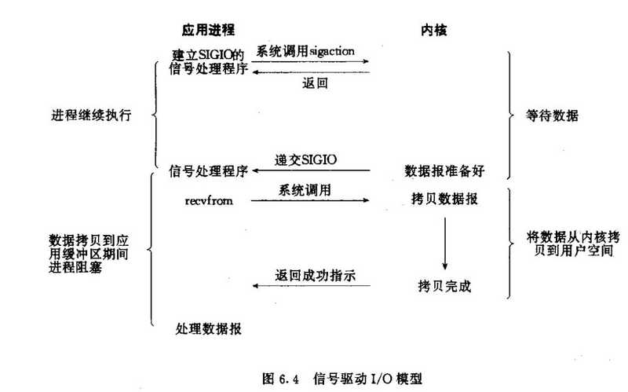

## 一、Netty基础

#### 1.Netty的特点？

>- 一个高性能、异步事件驱动的NIO框架，它提供了对TCP、UDP和文件传输的支持；
>- 使用更高效的socket底层，对epoll空轮询引起的cpu占用飙升在内部进行了处理，避免了直接使用NIO的陷阱，简化了NIO的处理方式；
>- 采用多种decoder/encoder 支持，对TCP粘包/分包进行自动化处理；
>- 可使用接受/处理线程池，提高连接效率，对重连、心跳检测的简单支持；
>- 可配置IO线程数、TCP参数， TCP接收和发送缓冲区使用直接内存代替堆内存，通过内存池的方式循环利用ByteBuf；
>- 通过引用计数器及时申请释放不再引用的对象，降低了GC频率；
>- 使用单线程串行化的方式，高效的Reactor线程模型；
>- 大量使用了volitale、使用了CAS和原子类、线程安全类的使用、读写锁的使用；

#### 2.IO模式？

>- 同步阻塞：丢衣服->等洗衣机洗完->再去晾衣服；
>- 同步非阻塞：丢衣服->去做其他事情，定时去看衣服是否洗完->洗完后自己去晾衣服；
>- 异步阻塞：丢衣服->去做其他时间->等待洗衣机铃声->自己去晾衣服；
>- 异步非阻塞：丢衣服-> 去做其他事情不管了，衣服洗好会自动晾好，并且通知你晾好了。

| 名称 | 描述 |
| --- | --- |
| 同步阻塞 | 在此种方式下，用户进程在发起一个IO操作以后，必须等待IO操作的完成，只有当真正完成了IO操作以后，用户进程才能运行。 |
| 同步非阻塞 | 在此种方式下，用户进程发起一个IO操作以后边可返回做其它事情，但是用户进程需要时不时的询问IO操作是否就绪，这就要求用户进程不停的去询问，从而引入不必要的CPU资源浪费。|
| 异步阻塞 | 此种方式下是指应用发起一个IO操作以后，不等待内核IO操作的完成，等内核完成IO操作以后会通知应用程序，这其实就是同步和异步最关键的区别，同步必须等待或者主动的去询问IO是否完成，那么为什么说是阻塞的呢？因为此时（通知）是通过select系统调用来完成的，而select函数本身的实现方式是阻塞的，而采用select函数有个好处就是它可以同时监听多个文件句柄（就绪的没有就绪的都有监听，epoll是select的替代方式，只监听就绪的文件句柄），从而提高系统的并发性！ |
| 异步非阻塞 | 在此种模式下，用户进程只需要发起一个IO操作然后立即返回，等IO操作真正的完成以后，应用程序会得到IO操作完成的通知，此时用户进程只需要对数据进行处理就好了，不需要进行实际的IO读写操作，因为真正的IO读取或者写入操作已经由内核完成了。 |

#### 3.一共有几种 I/O 模型？

五种 I/O 模型：阻塞 IO、非阻塞 IO、多路复用 IO、信号驱动 IO、异步 IO，前 4 种是同步 IO，在内核数据 copy 到用户空间时是阻塞的。

阻塞 IO


非阻塞 IO


多路复用 IO


>- 核心：可以同时处理多个 connection，调用系统 select 和 recvfrom函数；
>- 每一个socket 设置为 non-blocking 阻塞是被 select 这个函数 block 而不是 socket阻塞；
>- 缺点：连接数不高的情况下，性能不一定比 多线程 + 阻塞 IO 好（多调用一个select 函数）；

信号驱动 IO



异步 IO


>- 发起 IO 请求，等待数据准备；
>- 实际的 IO 操作，将数据从内核拷贝到进程中；

阻塞/异步等特点：

>- 阻塞 IO、非阻塞 IO 区别在于发起 IO 请求是否被阻塞；
>- 同步 IO、异步 IO 在于实际的 IO 读写是否阻塞请求进程；
>- 阻塞非阻塞是线程的状态；
>- 同步和异步是消息的通知机制；
>- 同步需要主动读写数据，异步不需要主动读写数据；
>- 同步 IO 和异步 IO 是针对用户应用程序和内核的交互；

#### 4.BIO、NIO和AIO的区别？

BIO：一个连接一个线程，客户端有连接请求时服务器端就需要启动一个线程进行处理。线程开销大。

NIO：一个请求一个线程，但客户端发送的连接请求都会注册到多路复用器上，多路复用器轮询到连接有I/O请求时才启动一个线程进行处理。

AIO：一个有效请求一个线程，客户端的I/O请求都是由OS先完成了再通知服务器应用去启动线程进行处理。

BIO是面向流的，NIO是面向缓冲区的；BIO的各种流是阻塞的。而NIO是非阻塞的；BIO的Stream是单向的，而NIO的channel是双向的。

NIO的特点：事件驱动模型、单线程处理多任务、非阻塞I/O，I/O读写不再阻塞，而是返回0、基于block的传输比基于流的传输更高效、更高级的IO函数zero-copy、IO多路复用大大提高了Java网络应用的可伸缩性和实用性。基于Reactor线程模型。

在Reactor模式中，事件分发器等待某个事件或者可应用或个操作的状态发生，事件分发器就把这个事件传给事先注册的事件处理函数或者回调函数，由后者来做实际的读写操作。如在Reactor中实现读：注册读就绪事件和相应的事件处理器、事件分发器等待事件、事件到来，激活分发器，分发器调用事件对应的处理器、事件处理器完成实际的读操作，处理读到的数据，注册新的事件，然后返还控制权。

#### 5.Netty的线程模型？

Netty通过Reactor模型基于多路复用器接收并处理用户请求，内部实现了两个线程池，boss线程池和work线程池，其中boss线程池的线程负责处理请求的accept事件，当接收到accept事件的请求时，把对应的socket封装到一个NioSocketChannel中，并交给work线程池，其中work线程池负责请求的read和write事件，由对应的Handler处理。

>- 单线程模型：所有I/O操作都由一个线程完成，即多路复用、事件分发和处理都是在一个Reactor线程上完成的。既要接收客户端的连接请求,向服务端发起连接，又要发送/读取请求或应答/响应消息。一个NIO 线程同时处理成百上千的链路，性能上无法支撑，速度慢，若线程进入死循环，整个程序不可用，对于高负载、大并发的应用场景不合适。
>- 多线程模型：有一个NIO 线程（Acceptor） 只负责监听服务端，接收客户端的TCP 连接请求；NIO 线程池负责网络IO 的操作，即消息的读取、解码、编码和发送；1 个NIO 线程可以同时处理N 条链路，但是1 个链路只对应1 个NIO 线程，这是为了防止发生并发操作问题。但在并发百万客户端连接或需要安全认证时，一个Acceptor 线程可能会存在性能不足问题。
>- 主从多线程模型：Acceptor 线程用于绑定监听端口，接收客户端连接，将SocketChannel 从主线程池的Reactor 线程的多路复用器上移除，重新注册到Sub 线程池的线程上，用于处理I/O 的读写等操作，从而保证MainReactor只负责接入认证、握手等操作；

#### 6.请讲讲什么是 Reactor 模式？

Reactor模式（反应器设计模式），是一种基于事件驱动的设计模式，在事件驱动的应用中，将一个或者多个客户的请求进行分离和调度。使Netty可以同步地，有序地处理接受多个服务请求。属于同步非阻塞 IO。

***优点：***
>- 响应快，不会因为单个同步而阻塞，虽然 Reactor本身是同步的；
>- 编程相对简单，最大程度避免复杂的多线程以及同步问题，避免了多线程、进程切换开销；
>- 可扩展性，可以方便的通过 Reactor实例个数充分利用 CPU 资源；

***缺点：***
>- 相对复杂，不易于调试；
>- Reactor模式需要系统底层的支持。比如java中的selector支持，操作系统select系统调用支持。

#### 7.多路复用的实现有多种方式：select、poll、epoll，请说说他们的优缺点。

select的基本原理：
>- 监视文件3类描述符： writefds、readfds、和exceptfds；
>- 调用后select函数会阻塞住，等有数据 可读、可写、出异常 或者 超时 就会返回；
>- select函数正常返回后，通过遍历fdset整个数组才能发现哪些句柄发生了事件，来找到就绪的描述符fd，然后进行对应的IO操作；
>- 几乎在所有的平台上支持，跨平台支持性好；

poll的基本流程：
>- select() 和 poll() 系统调用的大体一样，处理多个描述符也是使用轮询的方式，根据描述符的状态进行处理；
>- 一样需要把 fd 集合从用户态拷贝到内核态，并进行遍历；
>- 最大区别是: poll没有最大文件描述符限制（使用链表的方式存储fd）；

epoll基本原理：
>- 在2.6内核中提出的，对比select和poll，epoll更加灵活，没有描述符限制，用户态拷贝到内核态只需要一次使用事件通知，通过epoll_ctl注册fd，一旦该fd就绪，内核就会采用callback的回调机制来激活对应的fd；

select/poll缺点：
>- select/poll采用轮询的方式扫描文件描述符，全部扫描，随着文件描述符FD数量增多而性能下降（每次都要检查所有的fd）；
>- 每次调用 select()，需要把 fd 集合从用户态拷贝到内核态，并进行遍历(消息传递都是从内核到用户空间)；
>- 最大的缺陷就是单个进程打开的FD有限制，默认是1024   （可修改宏定义，但是效率仍然慢）；

epoll优点：
>- 没fd这个限制，所支持的FD上限是操作系统的最大文件句柄数，1G内存大概支持10万个句柄；
>- 有连接接入时，会插入到epoll对象中，epoll对象里实际是一个红黑树+双向链表，fd插入到红黑树中，通过红黑树查找到是否重复；
>- 一旦fd就绪，会触发回调把fd的插入到就绪链表中，并唤醒等待队列中的线程；
>- 效率提高，使用回调通知而不是轮询的方式，不会随着FD数目的增加效率下降；
>- 通过callback机制通知，内核和用户空间mmap同一块内存实现；

epoll缺点：
>- 编程模型比select/poll 复杂；

#### 8.Netty使用的是select还是epoll？

NioEventLoop底层会根据系统选择select或者epoll。

如果是windows系统，则底层使用WindowsSelectorProvider（select）实现多路复用；如果是linux，则使用epoll。

当为select模式，在NioEventLoop对应的Selector中会维护着newKeys，updateKeys，cancelledKeys，分别是新增的fd，更新fd的感兴趣状态，取消fd监听。每当连接接入，或者断连，都会调用NioEventLoop的注册/解除注册方法，更新这几个集合。

#### 9.TCP 粘包/拆包的原因及解决方法？

TCP是以流的方式来处理数据，一个完整的包可能会被TCP拆分成多个包进行发送，也可能把小的封装成一个大的数据包发送。

TCP粘包/分包的原因：
>- 应用程序写入的字节大小大于套接字发送缓冲区的大小，会发生拆包现象，而应用程序写入数据小于套接字缓冲区大小，网卡将应用多次写入的数据发送到网络上，这将会发生粘包现象；
>- 进行MSS大小的TCP分段，当TCP报文长度-TCP头部长度>MSS的时候将发生拆包；
>- 以太网帧的payload（净荷）大于MTU（1500字节）进行ip分片。

解决方法：
>- 消息定长：FixedLengthFrameDecoder类；
>- 包尾增加特殊字符分割：行分隔符类：LineBasedFrameDecoder或自定义分隔符类 ：DelimiterBasedFrameDecoder；
>- 将消息分为消息头和消息体：LengthFieldBasedFrameDecoder类。分为有头部的拆包与粘包、长度字段在前且有头部的拆包与粘包、多扩展头部的拆包与粘包。

#### 10.了解哪几种序列化协议？

序列化（编码）是将对象序列化为二进制形式（字节数组），主要用于网络传输、数据持久化等；而反序列化（解码）则是将从网络、磁盘等读取的字节数组还原成原始对象，主要用于网络传输对象的解码，以便完成远程调用；

影响序列化性能的关键因素：序列化后的码流大小（网络带宽的占用）、序列化的性能（CPU资源占用）；是否支持跨语言（异构系统的对接和开发语言切换）；

>- Java默认提供的序列化：无法跨语言、序列化后的码流太大、序列化的性能差；
>- XML，优点：人机可读性好，可指定元素或特性的名称。缺点：序列化数据只包含数据本身以及类的结构，不包括类型标识和程序集信息；只能序列化公共属性和字段；不能序列化方法；文件庞大，文件格式复杂，传输占带宽。适用场景：当做配置文件存储数据，实时数据转换；
>- JSON，是一种轻量级的数据交换格式，优点：兼容性高、数据格式比较简单，易于读写、序列化后数据较小，可扩展性好，兼容性好、与XML相比，其协议比较简单，解析速度比较快。缺点：数据的描述性比XML差、不适合性能要求为ms级别的情况、额外空间开销比较大。适用场景（可替代ＸＭＬ）：跨防火墙访问、可调式性要求高、基于Web browser的Ajax请求、传输数据量相对小，实时性要求相对低（例如秒级别）的服务；
>- Thrift，不仅是序列化协议，还是一个RPC框架。优点：序列化后的体积小, 速度快、支持多种语言和丰富的数据类型、对于数据字段的增删具有较强的兼容性、支持二进制压缩编码。缺点：使用者较少、跨防火墙访问时，不安全、不具有可读性，调试代码时相对困难、不能与其他传输层协议共同使用（例如HTTP）、无法支持向持久层直接读写数据，即不适合做数据持久化序列化协议。适用场景：分布式系统的RPC解决方案；
>- Avro，Hadoop的一个子项目，解决了JSON的冗长和没有IDL的问题。优点：支持丰富的数据类型、简单的动态语言结合功能、具有自我描述属性、提高了数据解析速度、快速可压缩的二进制数据形式、可以实现远程过程调用RPC、支持跨编程语言实现。缺点：对于习惯于静态类型语言的用户不直观。适用场景：在Hadoop中做Hive、Pig和MapReduce的持久化数据格式；
>- Protobuf，将数据结构以.proto文件进行描述，通过代码生成工具可以生成对应数据结构的POJO对象和Protobuf相关的方法和属性。优点：序列化后码流小，性能高、结构化数据存储格式（XML JSON等）、通过标识字段的顺序，可以实现协议的前向兼容、结构化的文档更容易管理和维护。缺点：需要依赖于工具生成代码、支持的语言相对较少，官方只支持Java 、C++ 、python。适用场景：对性能要求高的RPC调用、具有良好的跨防火墙的访问属性、适合应用层对象的持久化。
>- Hessian，hessian比protobuf使用起来要简单的多，hessian序列化后的对象比Protobuf要小，传输带宽方面占有优势。

#### 11.Netty的零拷贝实现？

>- Netty的接收和发送ByteBuffer采用DIRECT BUFFERS，使用堆外直接内存进行Socket读写，不需要进行字节缓冲区的二次拷贝。堆内存多了一次内存拷贝，JVM会将堆内存Buffer拷贝一份到直接内存中，然后才写入Socket中。ByteBuffer由ChannelConfig分配，而ChannelConfig创建ByteBufAllocator默认使用Direct Buffer；
>- 通过 wrap方法, 我们可以将 byte[] 数组、ByteBuf、ByteBuffer等包装成一个 Netty ByteBuf 对象, 进而避免了拷贝操作；
>- 通过 FileRegion 包装的FileChannel.tranferTo方法 实现文件传输, 可以直接将文件缓冲区的数据发送到目标 Channel，避免了传统通过循环write方式导致的内存拷贝问题；

#### 12.为什么Netty的服务端要分Boss线程池和IO线程池？

Boss线程池用于接收客户端的 TCP 连接，IO线程池用于处理 I/O 相关的读写操作，或者执行系统 Task、定时任务 Task 等。

>- 1.bossGroup是用来处理TCP连接请求的，workGroup是来处理IO事件的。利于故障隔离和问题定位；
>- 2.两个线程池分隔开，有利于代码维护；
>- 3.可以防止IO操作阻塞请求链路建议；

#### 13.为什么建议 Netty 的 I/O 线程与业务线程分离？

>- 1.充分利用多核的并行处理能力：I/O线程和业务线程分离，双方可以并行的处理网络I/O和业务逻辑，充分利用多核的并行计算能力，提升性能。
>- 2.故障隔离：后端的业务线程池处理各种类型的业务消息，有些是I/O密集型、有些是CPU密集型、有些是纯内存计算型，不同的业务处理时延，以及发生故障的概率都是不同的。
>- 3.可维护性：I/O线程和业务线程分离之后，双方职责单一，有利于代码维护和问题定位。如果合设在一起，当RPC调用时延增大之后，到底是网络问题、还是I/O线程问题、还是业务逻辑问题导致的时延大，纠缠在一起，问题定位难度非常大。例如业务线程中访问缓存或者数据库偶尔时延增大，就会导致I/O线程被阻塞，时延出现毛刺，这些时延毛刺的定位，难度非常大。
>- 4.资源代价：NioEventLoopGroup的创建并不是廉价的，它会聚合Selector，Selector本身就会消耗句柄资源。
>- 5.线程切换的代价：如果不是追求极致的性能，线程切换只要不过于频繁，它的代价还是可以接受的。

#### 14.Netty的多线程编程最佳实践

>- 1.创建两个 NioEventLoopGroup,用于逻辑隔离 NIO Acceptor和 NIO I/O线程；
>- 2.尽量不要在 ChannelHandler中启动用户线程(解码后用于将POJO消息派发到后端业务线程的除外)；
>- 3.解码要放在NIO线程调用的解码 Handler中进行,不要切换到用户线程中完成消息的解码；
>- 4.如果业务逻辑操作非常简单,没有复杂的业务逻辑计算,没有可能会导致线程被阻塞的磁盘操作、数据库操作、网路操作等,可以直接在NIO线程上完成业务逻辑编排,不需要切换到用户线程；
>- 5.如果业务逻辑处理复杂,不要在NIO线程上完成,建议将解码后的POJO消息封装成Task,派发到业务线程池中由业务线程执行,以保证NIO线程尽快被释放,处理其他的IO操作；

#### 15.Netty应该设置的线程数

默认情况下，NioEventLoopGroup默认创建CPU*2或者指定Java启动参数io.netty.eventLoopThreads=n的线程数。那如何计算实际需要的线程数呢？

推荐的线程数量计算公式有以下两种：
>- 公式一:线程数量=(线程总时间/瓶颈资源时间)×瓶颈资源的线程并行数
>- 公式二:QPS=1000/线程总时间×线程数

由于用户场景的不同,对于一些复杂的系统,实际上很难计算出最优线程配置,只能是根据测试数据和用户场景,结合公式给出一个相对合理的范围,然后对范围内的数据进行性能测试,选择相对最优值。

#### 16.Netty 中有哪几种重要组件？

>- Channel：Netty 网络操作抽象类，它除了包括基本的 I/O 操作，如 bind、connect、read、write 等；
>- EventLoop：主要是配合 Channel 处理 I/O 操作，用来处理连接的生命周期中所发生的事情；
>- ChannelFuture：Netty 框架中所有的 I/O 操作都为异步的，因此我们需要 ChannelFuture 的 addListener()注册一个 ChannelFutureListener 监听事件，当操作执行成功或者失败时，监听就会自动触发返回结果；
>- ChannelHandler：充当了所有处理入站和出站数据的逻辑容器。ChannelHandler 主要用来处理各种事件，这里的事件很广泛，比如可以是连接、数据接收、异常、数据转换等；
>- ChannelPipeline：为 ChannelHandler 链提供了容器，当 channel 创建时，就会被自动分配到它专属的 ChannelPipeline，这个关联是永久性的；

#### 17.Channel与ChannelHandlerContext执行write方法的区别？

在Netty中，有两种发送消息的方式。你可以直接写在Channel中，也可以写到和ChannelHandler相关联的ChannelHandlerContext对象中。前一种方式将会导致消息从ChannelPipeline的尾端开始流动，而后者将导致消息从ChannelPipline中的下一个ChannelHanlder开始流动。

这个是社么意思呢？举例说明：

```
public class InitialierHandler extends ChannelInitializer<SocketChannel> {
    @Override
    protected void initChannel(SocketChannel socketChannel) throws Exception {
        socketChannel.pipeline().addLast(new RequestChannelHandler1());
        socketChannel.pipeline().addLast(new ResponseChannelHandler1());
        socketChannel.pipeline().addLast(new RequestChannelHandler2());
        socketChannel.pipeline().addLast(new ResponseChannelHandler2());
    }
}
```

添加顺序分别为  in1 -> out1 -> in2 -> out2。

我们使用Channel的write从in2中输出，则消息会从in2 -> out2 -> out1流转；

我们使用ChannelHandlerContext的write从in2中输出，则消息会从 in2 -> out1 流转；

#### 18.Netty中的write和writeAndFlush的区别是什么？

前者只是进行了写,(写到了ByteBuf) 却没有将内容刷新到ByteBuffer,没有刷新到缓存中,就没办法进一步把它写入jdk原生的ByteBuffer中, 而writeAndFlush()就比较方便,先把msg写入ByteBuf,然后直接刷进socket,发送出去。

#### 19.什么是写队列 ? 作用是啥?

当我们使用write来写入消息的时候，传递到Handler的最开始的位置，怎么办? unsafe也无法把它写给客户端, 难道丢弃不成？

于是写队列就解决了这个问题，它以链表当做数据结构，新传播过来的ByteBuf就会被他封装成一个一个的节点(entry)进行维护。如果Buffer容量超过了WriteBufferHighWaterMark（默认64字节），会将Channel标记为不可写状态，并会自动触发一个发送消息任务。

## 二、源码相关

#### 1.JDK的ByteBuffer和Netty的ByteBuf对比

Netty的ByteBuf的特点如下：
>- 1.Netty的ByteBuf采用读写索引分离的策略（readerIndex与writerIndex），一个初始化（里面尚未有任何数据）的ByteBuf的readerIndex与writerIndex都为0；
>- 2.当读索引与写索引处于同一个位置时，如果我们继续读取，就会抛出IndexOutofBoundsException；
>- 3.对于ByteBuf的任何读写操作都会分别单独维护读索引与写索引。maxCapacity最大容量默认的限制就是Integer.MAX_VALUE。

JDK的ByteBuffer的缺点：
>- 1.ByteBuffer长度固定，一旦分配完成，它的容量不能动态扩展和收缩，当需要编码的POJO对象大于ByteBuffer的容量时，会发生索引越界异常。解决办法就是每次put的时候检查剩余空间不足的时候重新创建一个新的ByteBuffer对象，并将之前的ByteBuffer复制到新创建的ByteBuffer中，最后释放老的ByteBuffer；
>- 2.ByteBuffer只使用一个position指针来标识位置信息，在进行读写切换时就需要调用flip()或是rewind()方法，使用起来很不方便。

Netty的ByteBuf的优点：
>- 1.存储字节的数组是动态，其最大值默认是Integer.MAX_VALUE。这里的动态性体现在write方法中，write方法在执行时会判断buffer容量，如果不足则自动扩容。
>- 2.ByteBuf的读写索引是完全分开的，使用起来方便。

#### 2.Netty的ByteBuf分类

从内存分配的角度：

1.堆内存(HeapByteBuf)字节缓冲区：特点是内存的分配和回收速度快，而已被 JVM自动回收；缺点就是如果进行Socket的I/O读写，需要额外做一次内存复制，将堆内存对应的缓冲区复制到内核Channel中，性能会有一定程度的下降。

2.直接内存(DirectByteBuf)字节缓冲区：非堆内存，它在堆外进行内存分配，相比于堆内存，它的分配和回收速度会慢一些，但是将它写入或者从Socket Channel中读取时，由于少了一次内存复制，速度比堆内存要快；

从内存回收角度：

1.基于对象池的ByteBuf，基于对象池的ByteBuf而已重用ByteBuf对象，它维护了一个内存池，可以循环利用创建的ByteBuf，提升内存的使用效率，降低由于高负载导致的频繁GC。但是内存池的管理和维护更加复杂。

2.普通ByteBuf，使用简单，不需要维护。

#### 3.ByteBuf扩容逻辑

我们通过`io.netty.buffer.AbstractByteBuf`的中`ensureWritable0`方法，其中有一段`calculateNewCapacity`调用中，会传入当前需要的扩容到的容量和最大容量大小。

代码中，首先判断如果需要的容量超过4M，并且不超过最大容量限制，则直接扩容指定的容量，否则只扩容最大容量。

如果需要的容量小于4M，则从64字节开始进行倍增，直到倍增后的结果大于或等于需要的容量值。

采用倍增或步进算法的原因：如果以minNewCapacity作为目标容量，则本地扩容后如果还需要再写入，则需要再次扩容，频繁的内存复制会导致性能下降；

采用先倍增后步进的原因：当内存比较小的情况下，倍增操作并不会带来太多的内存浪费，例如64字节->128字节->256字节。但是当内存增长到一定阈值后，再进行倍增可能会带来大量的内存浪费，如10MB倍增后为20MB，但是系统可能只需要12MB。因此，达到4M阈值后就需要以步进的方式对内存进行平滑的扩张。

## 三、性能与优化

## 四、常见的问题

#### 1.消息处理使用ChannelInboundHandlerAdapter造成内存泄露的问题？

如下代码：
```
public class RouterServerHandler extends ChannelInboundHandlerAdapter {
	
	static ExecutorService executorService = Executors.newSingleThreadExecutor();

	@Override
	public void channelRead(ChannelHandlerContext ctx, Object msg) throws Exception {
		ByteBuf reqMsg = (ByteBuf)msg;
		byte[] body = new byte[reqMsg.readableBytes()];
		
		executorService.execute(() -> {
			//其他业务代码
		});
	}

}
```
在经过一段时间的运行后，会出现内存不断飙升，最终OOM。

我们通过代码io.netty.channel.nio.AbstractNioByteChannel.NioByteUnsafe.read()方法
```
public final void read() {
    final ChannelConfig config = config();
    final ChannelPipeline pipeline = pipeline();
    final ByteBufAllocator allocator = config.getAllocator();
    final RecvByteBufAllocator.Handle allocHandle = recvBufAllocHandle();
    allocHandle.reset(config);

    ByteBuf byteBuf = null;
    boolean close = false;
    try {
        do {
            byteBuf = allocHandle.allocate(allocator);//最终调用的是PooledByteBufAllocator的内存池ByteBuf分配
            allocHandle.lastBytesRead(doReadBytes(byteBuf));
            if (allocHandle.lastBytesRead() <= 0) {
                // nothing was read. release the buffer.
                byteBuf.release();
                byteBuf = null;
                close = allocHandle.lastBytesRead() < 0;
                break;
            }

            allocHandle.incMessagesRead(1);
            readPending = false;
            pipeline.fireChannelRead(byteBuf);//此处调用的是ChannelHandler的channelRead方法
            byteBuf = null;
        } while (allocHandle.continueReading());

        allocHandle.readComplete();
        pipeline.fireChannelReadComplete();

        if (close) {
            closeOnRead(pipeline);
        }
    } catch (Throwable t) {
        handleReadException(pipeline, byteBuf, t, close, allocHandle);
    } finally {
        ...
    }
}
```

意味着我们在RouterServerHandler类中获取到的ByteBuf对象是内存池分配的，但是我们重写了channelRead方法却没有主动释放ByteBuf，则造成了读数据的内存池泄露。

修改办法很简单：

***1.代码中主动释放***
```
public void channelRead(ChannelHandlerContext ctx, Object msg) throws Exception {
	ByteBuf reqMsg = (ByteBuf)msg;
	byte[] body = new byte[reqMsg.readableBytes()];
	//此处为新增的代码
	ReferenceCountUtil.release(reqMsg);
	
	executorService.execute(() -> {
		//其他业务代码
	});
}
```

***2.将RouterServerHandler继承SimpleChannelInboundHandler类
```
public class RouterServerHandler extends SimpleChannelInboundHandler<ByteBuf> {
	
	static ExecutorService executorService = Executors.newSingleThreadExecutor();

	@Override
	protected void channelRead0(ChannelHandlerContext ctx, ByteBuf msg) throws Exception {
		ByteBuf reqMsg = (ByteBuf)msg;
		byte[] body = new byte[reqMsg.readableBytes()];
		
		executorService.execute(() -> {
			//其他业务代码
		});
	}

}
```

我们查看SimpleChannelInboundHandler类的源码：
```
public void channelRead(ChannelHandlerContext ctx, Object msg) throws Exception {
    boolean release = true;
    try {
        if (acceptInboundMessage(msg)) {
            @SuppressWarnings("unchecked")
            I imsg = (I) msg;
            channelRead0(ctx, imsg);
        } else {
            release = false;
            ctx.fireChannelRead(msg);
        }
    } finally {
        if (autoRelease && release) {
            ReferenceCountUtil.release(msg);//此处主动释放了内存池对象
        }
    }
}
```


## 五、其它


