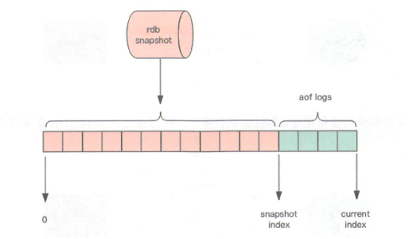
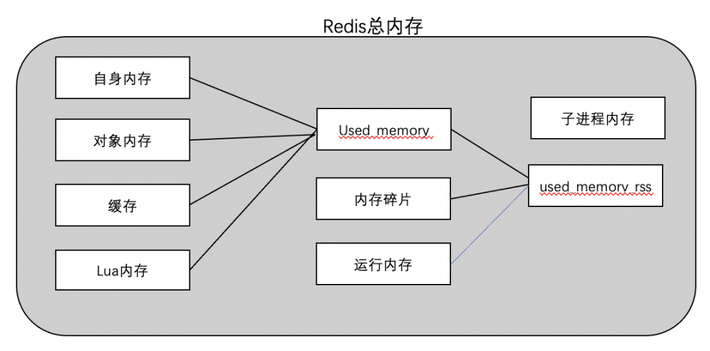
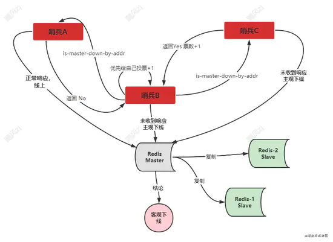

### 一、Redis基础知识

#### 1.Redis是什么

Redis是一个基于BSD开源的项目，是一个把结构化的数据放在内存中的一个存储系统，你可以把它作为数据库，缓存和消息中间件来使用。同时支持strings，lists，hashes，sets，sorted sets，bitmaps，hyperloglogs和geospatial indexes等数据类型。

它还内建了复制，lua脚本，LRU（Least Recently Used，最近最少使用），事务等功能，通过redis sentinel（即哨兵）实现高可用，通过redis cluster实现了自动分片。以及事务，发布/订阅，自动故障转移等等。

Redis作为一个内存数据库有以下优势：

>- 性能优秀，数据在内存中，读写速度非常快；
>- 单进程单线程，是线程安全的，采用IO多路复用机制；(在新版本的Redis中已经不是单线程了)
>- 丰富的数据类型，支持字符串（strings）、散列（hashes）、列表（lists）、集合（sets）、有序集合（sorted sets）等；
>- 支持数据持久化。可以将内存中数据保存在磁盘中，重启时加载；
>- 主从复制，哨兵，高可用；
>- 可以用作分布式锁；
>- 可以作为消息中间件使用，支持发布订阅。

#### 2.Redis是单线程的，为什么还能这么快吗？

- Redis完全基于内存，绝大部分请求是纯粹的内存操作，非常迅速，数据存在内存中，类似于HashMap，HashMap的优势就是查找的操作的时间复杂度是O(1)；
- 数据结构简单，对数据操作也简单；
- 采用单线程，避免了不必要的上下文切换和竞争条件，不存在多线程导致的CPU切换，不用去考虑各种锁的问题，不存在加锁释放锁操作，没有死锁问题导致的性能消耗；
- 使用多路复用非阻塞IO模型。

#### 3.Redis和Memcached的区别？

1. 存储方式上：memcache会把数据全部存在内存之中，断电后会挂掉，数据不能超过内存大小。redis有部分数据存在硬盘上，这样能保证数据的持久性。
2. 数据支持类型上：memcache对数据类型的支持简单，只支持简单的key-value，，而redis支持五种数据类型。
3. 使用底层模型不同：它们之间底层实现方式以及与客户端之间通信的应用协议不一样。redis直接自己构建了VM机制，因为一般的系统调用系统函数的话，会浪费一定的时间去移动和请求。
4. value的支持大小：redis可以达到512M，而memcache只有1MB(page)。
5. 内存分配上：redis使用多大内存就分配多大内存，而memcache在启动的时候会给每个page再切分成chunk，来一个数据占用一个chunk，会造成一些内存浪费。

#### 4.Redis的内存淘汰策略

内存淘汰之前redis有个内存过期策略。Redis使用的是定期删除+惰性删除策略。

定期删除，redis默认每秒执行频率10次，是否有过期的key,有过期key则删除。

需要说明的是，redis不是将所有的key检查一次，而是随机z抽取N个设置了过期键的key(默认20，通过参数`active-expire-effort`配置，默认值为`1`，公式相当于是`20+20/4*(active-expire-effort-1)`)进行检查(如果每隔100ms,全部key进行检查，redis岂不是卡死)，选中的键中有超过25%的键已经过期且被删除，那么会再次随机选取重复这个过程。因此，如果只采用定期删除策略，会导致很多key到时间没有删除。


惰性删除：就是说在你获取某个key的时候，redis会检查一下，这个key如果设置了过期时间那么是否过期了？如果过期了此时就会删除。

采用定期删除+惰性删除就没其他问题了么？

不是的，如果定期删除没删除key。然后你也没即时去请求key，也就是说惰性删除也没生效。这样，redis的内存会越来越高。那么就应该采用内存淘汰机制。

#### 5.Redis定期删除会有什么问题吗？如何优化？

Redis在进行过期扫描的时候，为了防止出现循环过度，导致线程卡死的现象。算法还增加了扫描时间上限，默认不会超过25ms。

毫无疑问，Redis会持续扫描过期字典（循环多次），直到过期的key变得很少了，才会停止。这就会导致线上读写请求出现明显的卡顿现象。导致这种卡顿的另外一个原因是内存管理器需要频繁回收内存页，这也会产生一定的CPU消耗。

当客户端请求到来时，服务器如果正好进入过期扫描状态，客户端的请求将会等待至少25ms后才会进行处理，如果客户端将超时时间设置得特别小，比如10ms，就会出现大量的链接因为超时关闭。

这就是为什么很多人说Redis对key设置时间的时候，最好加上一定范围的随机时间，而不能全部在同一时间过期的原因之一。

#### 6.Redis有几种键淘汰策略？

Redis有六种淘汰策略

| 策略 | 描述 |
| --- | --- |
| volatile-lru | 从已设置过期时间的KV集中优先对最近最少使用(less recently used)的数据淘汰 |
| volatile-lfu | 从已设置过期时间的KV集中优先对最近最少访问频率(least frequency use)的数据淘汰(4.0新增) |
| volitile-ttl | 从已设置过期时间的KV集中优先对剩余时间短(time to live)的数据淘汰 |
| volitile-random | 从已设置过期时间的KV集中随机选择数据淘汰 |
| allkeys-lru | 从所有KV集中优先对最近最少使用(less recently used)的数据淘汰 |
| allkeys-lfu | 从所有KV集中优先对最近最少访问频率(least frequency use)的数据淘汰(4.0新增) |
| allKeys-random | 从所有KV集中随机选择数据淘汰 |
| noeviction | 不淘汰策略，若超过最大内存，返回错误信息(默认的) |

#### 7.Redis数据持久化

redis为了保证效率，数据缓存在了内存中，但是会周期性的把更新的数据写入磁盘或者把修改操作写入追加的记录文件中，以保证数据的持久化。

Redis的持久化策略有两种：
- RDB：快照形式会在指定的时间间隔能对你的数据进行快照存储。
- AOF：把所有的对Redis的服务器进行修改的命令都存到一个文件里，命令的集合。

Redis默认是快照RDB的持久化方式。当Redis重启的时候，它会优先使用AOF文件来还原数据集，因为AOF文件保存的数据集通常比RDB文件所保存的数据集更完整。

持久化策略可以禁用，两种策略也可以共存。

#### 8.RDB是怎么工作的？

默认Redis是会以快照"RDB"的形式将数据持久化到磁盘的一个二进制文件dump.rdb。工作原理简单说一下：当Redis需要做持久化时，Redis会fork一个子进程，子进程将数据写到磁盘上一个临时RDB文件中。当子进程完成写临时文件后，将原来的RDB替换掉，这样的好处是可以copy-on-write。

RDB的优点是：这种文件非常适合用于备份：比如，你可以在最近的24小时内，每小时备份一次，并且在每个月的每一天也备份一个RDB文件。这样的话，即使遇上问题，也可以随时将数据集还原到不同的版本。RDB非常适合灾难恢复。
RDB的缺点是：RDB容易造成数据的丢失。如果你需要尽量避免在服务器故障时丢失数据，那么RDB不合适你。如果数据量比较大的话还有可能导致redis停止服务几毫秒。

所以Redis4.0提供了混合持久化，提供了RDB+AOF的混合模式，在RDF备份的时候，会将这段时间发生的操作记录到AOF日志中。在恢复重启的时候，先加载RDB快照，然后再重放增量的AOF日志，重启效率因为得到大幅提升。

#### 9.AOF日志的知识点

使用AOF做持久化，每一个写命令都通过write函数追加到`appendonly.aof`中。

AOF可以做到全程持久化，只需要在配置中开启`appendonly yes`。这样redis每执行一个修改数据的命令，都会把它添加到AOF文件中，当redis重启时，将会读取AOF文件进行重放，恢复到redis关闭前的最后时刻。

使用AOF的优点是会让redis变得非常耐久。可以设置不同的fsync策略：
- `always`：`fsync`会和客户端的指令同步执行，因此最可能造成延时问题，但备份及时性最好。
- `everysec`：每秒钟异步执行一次`fsync`，此时`redis`的性能表现会更好，但是`fsync`依然可能阻塞`write`，算是一个折中选择。
- `no`：`redis`不主动发出`fsync`（并不是永远不`fsync`），而由操作系统决定何时`fsync`。

aof的默认策略是每秒钟fsync一次，在这种配置下，就算发生故障停机，也最多丢失一秒钟的数据。缺点是对于相同的数据集来说，AOF的文件体积通常要大于RDB文件的体积。根据所使用的fsync策略，AOF的速度可能会慢于RDB。而在禁止fsync的情况下速度可以达到RDB的水平。

#### 10.AOF重写

Redis在长期运行的过程中，AOF的日志会越来越大。如果实例重启，重放整个AOF日志会非常的耗时，导致Redis长时间无法对外提供服务，所以需要对AOF日志瘦身。

Redis提供了`bgrewriteaof`指令用于对AOF日志进行瘦身，其原理就是开辟一个子进程对内存进行遍历，转换成一系列Redis的操作指令，序列化到一个新的AOF日志文件中。序列化完毕后再将操作期间发生的增量AOF追加到这个新的日志文件中，追加完毕后就立即替代旧的AOF日志文件，完成瘦身工作。

#### 11.混合持久化

重启Redis时，我们很少使用RDB来恢复，因为会丢失大量数据。通常我们是利用AOF日志重放，但是重放AOF日志相对于使用RDB来说要慢很多，这样Redis实例很大的时候，启动需要花费很长的时间。

Redis4.0为了解决这个问题，带来了一个新的持久化选项--`混合持久化`，将RDB文件的内容和增量的AOF日志文件存在一起。这类的AOF日志不再是全量的日志，而是自持久化开始到结束这段时间发生的增量AOF日志，通常这部分AOF日志很小。



在Redis重启的时候，可以先加载RDB的内容，然后再重放增量AOF日志，就可以完全替代之前的AOF全量文件重放，重启效率因为得到大幅提升。

#### 12.Redis整数对象共享池

redis在启动的时候，创建了一个10000个0到9999的整数值对象（整数对象池），用于共享，当redis需要使用0到9999的值对象时，直接从池中拿来使用，拿来使用的对象只是引用计数加1，而不用创建，从而有效的节省内存，这就是整数对象共享池。

```
192.168.91.128:6379> set k1 1000
OK
192.168.91.128:6379> object refcount k1
(integer) 2
192.168.91.128:6379> set k11 1000
OK
192.168.91.128:6379> object refcount k11
(integer) 3
```

当set k1为1000时，引用计数为2，直接使用了整数对象共享池，当再set k11 为1000时，引用计数为3。

整数对象共享池与`maxmemory`和`maxmemory-policy`设置冲突，原因是：
- LRU算法需要获取对象最后被访问时间，以便淘汰最长未访问数据，每个对象最后访问时间存储在`redisObject`对象的lru字段。对象共享意味着多个引用共享同一个redisObject，这时lru字段也会被共享，导致无法获取每个对象的最后访问时间；
- 如果没有设置`maxmemory`，那么服务器内存耗尽时都不会驱逐键，一般会报oom的错误，所以对象共享池能正常工作；

所以：**当设置了`maxmemory`+`maxmemory-policy`（如`volatile-lru`，`allkeys-lru`），对象共享池是禁用的。**

#### 13.为什么Redis要缓存系统时间戳？

因为每次获取系统时间戳都是一次系统调用，系统调用相对来说是比较费时间的，作为单线程的Redis承受不起，所以在`server.c`中定义了全局变量来缓存系统时间戳。

默认Redis的时间戳每`1`毫秒更新一次，在定时任务`serverCron`里主动设置。

```
void initServer(void) {
    //...
    /* Create the timer callback, this is our way to process many background
     * operations incrementally, like clients timeout, eviction of unaccessed
     * expired keys and so forth. */
    // 这里可以看到创建了一个定时器，每1毫秒执行一次
    if (aeCreateTimeEvent(server.el, 1, serverCron, NULL, NULL) == AE_ERR) {
        serverPanic("Can't create event loop timers.");
        exit(1);
    }
    //...
}

int serverCron(struct aeEventLoop *eventLoop, long long id, void *clientData) {
    //...
    /* Update the time cache. */
    updateCachedTime();
    //...
}

void updateCachedTime(void) {
    time_t unixtime = time(NULL);
    atomicSet(server.unixtime,unixtime);
    server.mstime = mstime();
}
```

#### 14.介绍一下Redis的内存结构



- `used_memory`：Redis内存占用中最主要的部分，Redis分配器分配的内存总量（单位是KB）(在编译时指定编译器，默认是jemalloc)，主要包含自身内存(字典、元数据)、对象内存、缓存，lua内存。
- `自身内存`：自身维护的一些数据字典及元数据，一般占用内存很低。
- `对象内存`：所有对象都是Key-Value型，Key对象都是字符串，Value对象则包括5种类（String，List，Hash，Set，Zset），5.0还支持stream类型。
- `缓存`：客户端缓冲区(普通 + 主从复制 + pubsub)以及aof缓冲区。
- `Lua内存`：主要是存储加载的 Lua 脚本，内存使用量和加载的 Lua 脚本数量有关。
- `used_memory_rss`：Redis 主进程占据操作系统的内存（单位是KB），是从操作系统角度得到的值，如top、ps等命令。
- `内存碎片`：如果对数据的更改频繁，可能导致redis释放的空间在物理内存中并没有释放，但redis又无法有效利用，这就形成了内存碎片。
- `运行内存`：运行时消耗的内存，一般占用内存较低，在10M内。
- `子进程内存`：主要是在持久化的时候，aof rewrite或者rdb产生的子进程消耗的内存，一般也是比较小。

程序出现内存碎片是个很常见的问题，Redis的默认分配器是`jemalloc`，它的策略是按照一系列固定的大小划分内存空间，例如`8字节`、`16字节`、`32字节`、…,`4KB`、`8KB`等。当程序申请的内存最接近某个固定值时，`jemalloc`会给它分配比它大一点的固定大小的空间，所以会产生一些碎片，另外在删除数据的时候，释放的内存不会立刻返回给操作系统，但redis自己又无法有效利用，就形成碎片。内存碎片不会被统计在`used_memory`中，内存碎片比率在`redis info`里面记录了一个动态值`mem_fragmentation_ratio`，该值是`used_memory_rss/used_memory`的比值， `mem_fragmentation_ratio`越接近1，碎片率越低，正常值在1~1.5内，超过了说明碎片很多。

### 二、Redis数据类型

#### 1.Redis的五种数据类型

Redis内部使用一个redisObject对象来表示所有的key和value，其中属性type表示一个value对象具体是何种数据类型，encoding是不同数据类型在Redis内部的存储方式。比如type=string表示value存储的是一个普通字符串，那么encoding可以是raw或者int。

下面是5种数据类型的介绍：

- string: redis最基本的类型，value不仅是string，也可以是数字。string类型是二进制安全的，意思是redis的string类型可以包含任何数据，比如jpg图片或者序列化的对象。string类型的值最大能存储512M；
- hash: 是一个键值（key-value）的集合。redis的hash是一个string的key和value的映射表，Hash特别适合存储对象。常用命令：hget,hset,hgetall等。应用场景如用户的属性信息等；
- list：列表类型，可以理解成是可变长数据，按照插入顺序排序。可以添加一个元素到列表的头部（左边）或者尾部（右边） 常用命令：lpush、rpush、lpop、rpop、lrange(获取列表片段)等。应用场景非常多，如粉丝列表，关注列表等；redis list的是实现是一个双向链表，支持反向查找和遍历，更方便操作，不过带来了额外的内存开销。
- set：string类型的无序集合。集合是通过hashtable实现的。set中的元素是没有顺序的，而且是没有重复的。redis set对外提供的功能和list一样是一个列表，特殊之处在于set是自动去重的，而且set提供了判断某个成员是否在一个set集合中；
- zset：set一样是string类型元素的集合，且不允许重复的元素，支持排序功能；通过用户额外提供一个优先级（score）的参数来为成员排序，并且是插入有序的，即自动排序。当你需要一个有序的并且不重复的集合列表，那么可以选择sorted set结构。和set相比，sorted set关联了一个double类型权重的参数score，使得集合中的元素能够按照score进行有序排列，redis正是通过分数来为集合中的成员进行从小到大的排序。内部使用HashMap和跳跃表(skipList)来保证数据的存储和有序，HashMap里放的是成员到score的映射，而跳跃表里存放的是所有的成员，排序依据是HashMap里存的score，使用跳跃表的结构可以获得比较高的查找效率，并且在实现上比较简单。

#### 2.Redis的五种数据类型对应哪些编码方式？

<table>
	<tr>
		<td>类型</td>
		<td>编码方式</td>
		<td>数据结构描述</td>
		<td>变更规则</td>
	</tr>
	<tr>
	    <td rowspan="3">string</td>
	    <td>raw</td>
	    <td>动态字符串编码</td>
	    <td>字符长度超过44字节，从embstr转成raw</td>
	</tr>
	<tr>
	    <td>embstr</td>
	    <td>优化内存分配的字符串编码</td>
	    <td>字符类型默认</td>
	</tr>
	<tr>
	    <td>int</td>
	    <td>整数编码</td>
	    <td>8字节长整形，超过则适用44字节规则</td>
	</tr>
	<tr>
	    <td rowspan="2">hash</td>
	    <td>hashtable</td>
	    <td>散列表编码</td>
	    <td>当ziplist无法满足的时候使用此编码</td>
	</tr>
	<tr>
	    <td>ziplist</td>
	    <td>压缩列表编码</td>
	    <td>当元素小于`hash-max-ziplist-entries`（默认`512`）、同时所有值都小于`hash-max-ziplist-value`配置（默认`64字节`）使用此编码</td>
	</tr>
	<tr>
	    <td rowspan="3">list</td>
	    <td>linkedlist</td>
	    <td>双向列表编码</td>
	    <td>当ziplist无法满足的时候使用此编码</td>
	</tr>
	<tr>
	    <td>ziplist</td>
	    <td>压缩列表编码</td>
	    <td>当列表的元素个数小于`list-max-ziplist-entries`（默认`512`个）、同时列表中每个元素的值都小于`list-max-ziplist-value`（默认`64字节`），使用此编码，减少内存的使用</td>
	</tr>
	<tr>
	    <td>quicklist</td>
	    <td>3.2版本新的列表编码</td>
	    <td>3.2之后，由于考虑到内存碎片，连续空间等问题，`quickList`是`zipList`和`linkedList`的混合体，它将`linkedList`按段切分，每一段使用`zipList`来紧凑存储，多个`zipList`之间使用双向指针串接起来。默认`list-max-ziplist-size=-2`（每个`quicklsit`节点上的`ziplist`大小不能超过`8kb`），`list-compress-depth=0`表示两端所有节点均不压缩。</td>
	</tr>
	<tr>
	    <td rowspan="2">set</td>
	    <td>hashtable</td>
	    <td>散列表编码</td>
	    <td>无法满足intset则使用此编码</td>
	</tr>
	<tr>
	    <td>intset</td>
	    <td>整数集合编码</td>
	    <td>当集合中的元素都是整数且元素个数小于`set-max-intset-entries`（默认`512`个）</td>
	</tr>
	<tr>
	    <td rowspan="2">zset</td>
	    <td>skiplist</td>
	    <td>跳跃表编码</td>
	    <td>当ziplist无法满足的时候使用此编码</td>
	</tr>
	<tr>
	    <td>ziplist</td>
	    <td>压缩列表编码</td>
	    <td>当有序集合的元素个数小于`zset-max-ziplist-entries`（默认128个）、同时每个元素的值都小于`zset-max-ziplist-value`（默认`64字节`）使用此编码</td>
	</tr>
</table>

#### 3.String类型的字符是如何在Redis中存储的？

> 编码方式

字符串类型的内部编码有三种：
- `int`：8字节的长整型；
- `embstr`：小于等于44个字节的字符串；
- `raw`：大于44个字节的字符串。

> 编码转换

- 当`int`数据不再是整数，变为`raw`；
- 当`int`数据大小超过了`long`的范围(2^63-1)，变为`embstr`；
- `embstr`数据长度超过`44`字节，变为`raw`；
- 对`embstr`数据执行`append`命令，而非`set`重新赋值，变为`raw`。

可以通过命令`Object encoding key`来查看内部的编码。<font color="blue">注：在3.2版本之后，则变成了44字节为分界，之前的是39字节。原因就是`sdshdr`的优化。</font>

Redis内部字符串其底层实现是简单动态字符串`sds`(`simple dynamic string`)，是可以修改的字符串。它类似于Java中的ArrayList，它采用预分配冗余空间的方式来减少内存的频繁分配。

当字符串长度小于`1M`时，扩容都是加倍现有的空间，如果超过`1M`，扩容时一次只会多扩`1M`的空间。(字符串最大长度为`512M`)

`sds`本质上就是`char *`，因为有了表头`sdshdr`结构的存在，所以`sds`比传统C字符串在某些方面更加优秀，并且能够兼容传统C字符串。

Redis自身实现的字符串结构有如下特点：
- O(1)时间复杂度获取：字符串长度、已使用长度、未使用长度；
- 可用于保存字节数组，支持安全的二进制数据存储；
- 内部实现空间预分配机制，降低内存再分配次数；
- 惰性删除机制：字符串缩减后的空间不释放，作为预分配空间保留。

**总结下sds的特点是：可动态扩展内存、二进制安全、快速遍历字符串 和与传统的C语言字符串类型兼容。**

绍SDS的具体结构如下：
```
struct __attribute__ ((__packed__)) sdshdr5 {
    unsigned char flags; /* 3 lsb of type, and 5 msb of string length */
    char buf[];
};

struct __attribute__ ((__packed__)) sdshdr8 {
    uint8_t len; /* 已使用空间大小 */
    uint8_t alloc; /* 总共可用的字符空间大小，应该是实际buf的大小减1(因为c字符串末尾必须是\0,不计算在内) */
    unsigned char flags; /* 标志位，主要是识别这是sdshdr几，目前只用了3位，还有5位空余 */
    char buf[]; /* 真正存储字符串的地方 */
};

struct __attribute__ ((__packed__)) sdshdr16 {
    uint16_t len; /* used */
    uint16_t alloc; /* excluding the header and null terminator */
    unsigned char flags; /* 3 lsb of type, 5 unused bits */
    char buf[];
};

struct __attribute__ ((__packed__)) sdshdr32 {
    uint32_t len; /* used */
    uint32_t alloc; /* excluding the header and null terminator */
    unsigned char flags; /* 3 lsb of type, 5 unused bits */
    char buf[];
};

struct __attribute__ ((__packed__)) sdshdr64 {
    uint64_t len; /* used */
    uint64_t alloc; /* excluding the header and null terminator */
    unsigned char flags; /* 3 lsb of type, 5 unused bits */
    char buf[];
};
```

其中`sdshdr5`比较特殊外，其它的也只是`unsigned int`的位数不一样。

由于`sds`的header共有`五种`，要想得到`sds`的header属性，就必须先知道header的类型，`flags`字段存储了header的类型。假如我们定义了`sds* s`（`s`变量指向`buf`属性），那么获取flags字段仅仅需要将s向前移动一个字节，即`unsigned char flags = s[-1]`。

#### 4.为什么字符串要超过44字节使用raw编码呢？

我们知道Redis中的所有的数据类型都是使用`RedisObject结构体`：
```
struct RedisObject { 
    int4 type; // 4bits  类型
    int4 encoding; // 4bits 存储格式
    int24 lru; // 24bits 记录LRU信息
    int32 refcount; // 4bytes 
    void *ptr; // 8bytes，64-bit system 
} robj;
```

不同的对象具有不同的类型`type(4bit)`，同一个类型的`type`会有不同的存储形式`encoding(4bit)`。为了记录对象的`LRU`信息，使用了`24bit`的`lru`来记录`LRU`信息。每个对象都有个引用计数`refcount`，当引用计数为零时，对象就会被销毁，内存被回收。`ptr`指针将指向`对象内容(body)`的具体存储位置。所以一个`RedisObject`对象头共需要占据`16`字节的存储空间。

在RedisObject中，SDS的两种存储形式：
```
> set aaa abcdefghijklmnopqrstuvwxyz012345678912345678
OK
> debug object aaa
Value at:0x7fec2de00370 refcount:1 encoding:embstr serializedlength:45 lru:5958906 lru_seconds_idle:1
> set aaa abcdefghijklmnopqrstuvwxyz0123456789123456789
OK
> debug object aaa
Value at:0x7fec2dd0b750 refcount:1 encoding:raw serializedlength:46 lru:5958911 lru_seconds_idle:1...
```

一个字符的差别，存储形式`encoding`就发生了变化。当长度小于`44`字节时使用`embstr`，超过`44`字节使用`raw`。


`embstr`存储形式是这样一种存储形式，它将`RedisObject`对象头和`SDS`对象连续存在一起，使用`malloc`方法一次分配。而`raw`存储形式不一样，它需要两次`malloc`，两个对象头在内存地址上一般是不连续的。

在字符串比较小时，`SDS`对象头的大小是`capacity+3`——`SDS结构体的内存大小至少是3`。意味着分配一个字符串的最小空间占用为`19`字节`(16+3)`。

如果总体超出了`64`字节，Redis认为它是一个大字符串，不再使用`embstr`形式存储，而改用`raw`形式。而`64-19-结尾的\0`，所以`embstr`只能容纳`44`字节。

> Redis内存分配器

Redis默认内存分配器采用`jemalloc`，可选的分配器还有：`libc`、`tcmalloc`。

简单地说jemalloc将内存空间划分为三个部分：Small class、Large class、Huge class，每个部分又划分为很多小的内存块单位：
- Small class: [8byte], [16byte, 32byte, … 128byte], [192byte, 256byte, … 512byte], [768byte, 1024byte, … 3840byte]
- Large class: [4kb, 8kb, 12kb, … 4072kb]
- Huge class: [4mb, 8mb, 12mb …]

如果要给这个最小`19`字节分配内存，至少要分配一个`32`字节的内存。当然如果字符串长一点，再往下就可以分配到64字节的内存。以上这种形式被叫做：`embstr`，这种形式使得RedisObject和SDS内存地址是连续的。

那么一旦大于`64`字节，形式就变成了`raw`，这种形式使得内存不连续，因为SDS已经变大，取得大的连续内存得不偿失。这就是为什么redis的`embstr`形式可以存储最大字符串长度是`44`字节的原因。

#### 5.为什么从sc->scscadd简单的追加操作内部类型会从embstr->raw，如何解释？

对`embstr`数据执行`append`命令，而非`set`重新赋值，则编码变为`raw`。因为如果`embstr`编码的value长度增加，`RedisObject`、`SDS`都需要`重新分配内存空间`。

#### 6.hash结构在什么条件下进行扩容和缩容？

扩容：当存储的元素个数大于等于一维数组的大小的时候，会触发扩容。扩容的新数组容量是原来的`2倍`大小。不过如果正在做`bgsave`，为了减少内存页的过多分离，Redis尽量不去扩容，但是如果hash表到达了一维数组长度的`5倍`，这个时候会强制扩容。

缩容：当元素的个数小于一维数组的`10%`，并且大于`4`，则会触发缩容。缩容不会考虑`bgsave`。

#### 7.hash结构在缩容的时候为什么不用考虑bgsave？

扩容时考虑`bgsave`是因为，扩容需要申请额外的很多内存，且会重新链接链表（如果会冲突的话）, 这样会造成很多内存碎片，也会占用更多的内存，造成系统的压力；而缩容过程中，由于申请的内存比较小，同时会释放掉一些已经使用的内存，不会增大系统的压力，因此不用考虑是否在进行`bgsave`操作。

### 三、Redis故障处理与工具介绍

#### 1.Redis运维命令info

可以使用info命令返回Redis服务器的总体统计信息，主要关注以下几个点：

- `total_connections_received`：服务器接受的总接连数。如果这个指标在短时间内快速增长，那么Redis服务器可能会遇到CPU使用率过高的问题。
- `instantaneous_ops_per_sec`：每秒处理的命令数。
- `rejected_connections`：由于`maxclients`的限制而被拒绝的连接数。如果这个指标的值镇江国家，那么我们应该特别注意Redis的内存使用情况。
- `sync_full`：从实例与该主实例完全同步的次数。
- `sync_partial_pk`：完成部分同步的次数。
- `sync_partial_err`：部分同步未完成的次数。
- `evicted_keys`：由于`maxmemory`的限制而被淘汰的键的数量。
- `keyspace_missed`：查找键失败的次数。如果这个指标太高，那么我们应该考虑优化应用程序来降低未能命中键的查询的数量。
- `latest_fork_usec`：上一次fork操作耗费的时间(以微秒为单位)
- `client_longest_output_list`：当前客户端连接中最长的输出列表。当这个指标的值超过10W时，我们需要警惕。
- `client_biggest_input_buf`：当前客户端连接中最大的输入缓冲区。当最大的输入缓冲区大小超过10M，我们需要小心。
- `blocked_clients`：被一个阻塞调用（blpop、brpop或brpoplpush）挂起的客户端数量。
- `rdb_last_cow_size`：最后一次BGSAVE操作使用的写时复制缓冲区的大小。
- `aof_last_cow_size`：最后一次bgrewriteaof操作使用的写时复制缓冲区的大小。

#### 2.Redis运维命令slowlog

当Redis中存在性能问题时，我们可能需要检查为什么Redis不能及时地完成查询请求。一个可能的原因就是查询或操作花费了很长的时间才完成。

我们可以通过slowlog来读取所有的慢日志：

>- slowlog get [N]：查询慢日志。
>- slowlog len：慢日志数量。
>- slowlog reset：清除所有记录。

Redis慢日志用于记录执行时间超过`slowlog-log-slower-than`所指定阈值（以微秒为单位）的查询或操作，默认值是10000（10毫秒）。当这个选项为负数时表示禁用慢日志，为0时表示记录所有的查询。

被记录的慢查询或慢操作被压入一个先进先出的队列中，其最大大小可以由`slowlog-max-len`指定（默认128）

慢日志记录列表只在内存中，并且不会持久化到磁盘上，因为慢日志机制的速度很快。如果想要记录下来，则需要通过程序来定期查询并记录到文件中，以便后期的分析和定位。

#### 3.内存问题的故障诊断

1.首先，注意`used_memory_human`是否大于`maxmemory_human`如果超出了，则Redis会使用指定的策略释放空间。

2.通过向Redis实例写入简单的键值信息来定期地验证实例是否在正常工作。

3.注意`evicted_keys`指标增长情况，即由于`maxmemory`的限制而被淘汰的键的数量。

4.检查redis-server的系统内存和交换空间使用情况。

通过`used_memory_rss_human`获取Redis进程占用的物理内存总量，再通过进程号获取swap的信息：awk '/VmSwap/{print $2 " " $3}' /proc/进程号/status

5.检查bigkeys的情况

使用redis-cli的--bigkeys选项搜索Redis实例中的巨大键，或者通过scan和debug object命令遍历。

#### 4.info指令包括哪些模块？

`info`指令包括9大块：
| 序号 | 名称 | 说明 |
| --- | --- | --- |
| 1 | Server | 服务器运行的环境参数 |
| 2 | Clients | 客户端相关信息 |
| 3 | Memory | 服务器运行内存统计数据 |
| 4 | Persistence | 持久化信息 |
| 5 | Stats | 通用统计数据 |
| 6 | Replication | 主从复制相关信息 |
| 7 | CPU | CPU使用情况 |
| 8 | Cluster | 集群信息 |
| 9 | KeySpace | 键值对统计数据信息 |

#### 5.如何知道当前Redis连接了多少个客户端？

可以通过`redis-cli info clients`命令来查看。

```
[aaa@vis ~]$ redis-cli info clients
# Clients
connected_clients:2186 # 这个就是正在连接的客户端数量
client_longest_output_list:0
client_biggest_input_buf:0
blocked_clients:0
```

#### 6.Redis有哪些点会存在性能问题？

1) 网络方面

如果`Redis`于服务部署在同一个主机上，可以使用`Unix进程间通讯`来请求`Redis`服务，速度会比`LocalHost`更快点。

`Redis`客户端发送请求后需要等待`Redis`返回结果再发送下一个指令。可以使用`multi-key`的方式来减少网络请求，比如两个`GET key`可以用`MGET key1 key2`合并。这样在实际通讯中，请求数也减少了，延时自然得到好转。

如果不能用`multi-key`指令来合并，可以使用`MULTI/EXEC`，前者是`Redis`事务的方法，但确实可以合并多个指令为一个`request`，它到通讯过程如下。`EXEC`则是使用脚本，最好利用缓存脚本的`sha1 hash key`来调起脚本，这样通讯量更小。也可以使用`pipeline`，减少使用事务的性能损耗。

2) 命令方面

在大数据量的情况下，有些操作的执行时间会相对长，比如`KEYS *`，`LRANGE mylist 0 -1`，以及其他算法复杂度为`O(n)`的指令。因为`Redis只用一个线程`来做数据查询，如果这些指令耗时很长，就会造成阻塞，造成大量延时。可以使用`scan`命令来代替`keys`。

如果想查看慢查询可以参见`Redis运维命令slowlog`这一小节。

另外如果某个key占用的内存空间非常大，在使用`DEL`指令的时候，回收相应的内存可能会需要很长时间（甚至几秒）。所以，建议用`DEL`的异步版本：`UNLINK`。后者会启动一个新的`thread`来删除目标key，而不阻塞原来的线程。

还有过期key的时候，尽量不要在同一时间过期，可以加一个随机值。具体的过期策略可以参见`Redis的内存淘汰策略`小节。也可以把`keys`的过期删除操作变为异步的，在配置文件中设置`lazyfree-lazy-expire yes`。

3) 操作系统

Linux操作系统会存在当一些内存`page`被存储在交换空间文件上，而`Redis`又要请求那些数据，那么操作系统会阻塞`Redis`进程，然后把想要的`page`，从交换空间中拿出来，放进内存。这其中涉及整个进程的阻塞，所以可能会造成延时问题，一个解决方法是禁止使用交换空间`(SWAP)`。
1
使用`大内存page`会使`bgsave`时，`fork的速度变慢`；如果`fork`之后，这些内存`page`在原进程中被修改了，他们就需要被复制（即`copy on write`），这样的复制会消耗大量的内存。所以，请禁止掉操作系统中的`transparent huge pages`功能。

4) IO

`RDB 全量持久化`过程的是原进程`fork出来一个子进程`，而fork这个系统调用是需要时间的，在`fork`的这段时间，`redis`是无法处理请求的。**所以要使用合理的 RDB 持久化的时间间隔，不要太频繁**

`AOF 增量持久化`也是一个性能损耗的地方，详细查看`AOF日志的知识点`这一节。

5) Redis配置

`active rehashing(keys主表的再哈希)`：设置成`yes`后`redis`将`每100毫秒使用1毫秒CPU时间`来对`redis`的`hash表重新hash`，可`降低内存的使用`,当使用场景有较为严格的实时性需求,**不能接受Redis时不时的对请求有2毫秒的延迟的话，把这项配置为`no`**,如果没有这么严格的**实时性要求,可以设置为yes,以便能够尽可能快的释放内存**。

#### 7.used_memory为什么会比memory_rss的值还大呢？

这里首先得搞清楚一下`used_memory`和`memory_rss`是什么意思。

`used_memory`是Redis内存占用中最主要的部分，Redis分配器分配的内存总量（单位是KB）(在编译时指定编译器，默认是`jemalloc`)，主要包含自身内存(字典、元数据)、对象内存、缓存，lua内存。

`memory_rss`是Redis主进程占据操作系统的内存（单位是KB），是从操作系统角度得到的值，如`top`、`ps`等命令。

这是因为`jemalloc`内存分配一开始其实分配的是虚拟内存，只有往分配的`page`页里面写数据的时候才会真正分配内存，`memory_rss`是实际内存占用，`used_memory`其实是一个计数器，在Redis做内存的`malloc/free`的时候，对这个`used_memory`做加减法。

关于`used_memory`大于`memory_rss`的问题，redis作者也做了回答：[https://github.com/redis/redis/issues/946#issuecomment-13599772](https://github.com/redis/redis/issues/946#issuecomment-13599772)

#### 8.为什么Redis不建议使用大内存页？

在`linux`操作系统中，为了让`translation lookaside buffer`，即`TLB`，能够管理更多内存空间（TLB只能缓存有限个page），操作系统把一些`memory page`变得更大，比如`2MB`或者`1GB`，而不是通常的`4096字节`，这些大的内存页叫做`huge pages`。

同时，为了方便程序员使用这些大的内存`page`，操作系统中实现了一个`transparent huge pages（THP）机制`，使得大内存页对他们来说是透明的，可以像使用正常的内存`page`一样使用他们。

但这种机制并不是数据库所需要的，可能是因为`THP`会把内存空间变得紧凑而连续吧，就像`mongodb`的文档中明确说的，数据库需要的是稀疏的内存空间，所以请禁掉`THP`功能。

`Redis`也不例外，但`Redis`官方博客上给出的理由是：使用大内存page会使`bgsave`时，fork的速度变慢；如果`fork`之后，这些内存`page`在原进程中被修改了，他们就需要被复制（即`copy on write`），这样的复制会消耗大量的内存（毕竟，人家是`huge pages`，复制一份消耗成本很大）。所以，请禁止掉操作系统中的`transparent huge pages`功能。

这个与第6点讲的差不多。

### 四、Redis集群相关问题

#### 1.主节点挂掉，从节点能继续提供缓存功能，你能说说redis主从复制的过程和原理吗？

主从配置结合哨兵模式能解决单点故障问题，提高redis可用性。从节点仅提供读操作，主节点提供写操作。对于读多写少的状况，可给主节点配置多个从节点，从而提高响应效率。

关于复制过程，是这样的：

- 从节点执行slaveof[masterIP][masterPort]，保存主节点信息；
- 从节点中的定时任务发现主节点信息，建立和主节点的socket连接；
- 从节点发送Ping信号，主节点返回Pong，两边能互相通信；
- 如果从节点中设置了`master auth`选项，则从节点需要向主节点进行身份验证；没有设置该选项，则不需要验证；
- 连接建立后，主节点将所有数据发送给从节点（数据同步）；
- 主节点把当前的数据同步给从节点后，便完成了复制的建立过程。接下来，主节点就会持续的把写命令发送给从节点，保证主从数据一致性。

需要注意的是，slaveof是异步命令，从节点完成主节点ip和port的保存后，向发送slaveof命令的客户端直接返回OK，实际的复制操作在这之后才开始进行。

具体的执行流程：

主节点会将那些对自己的状态产生修改性影响的指令记录在一个本地内存buffer中，然后异步将buffer中的指令同步到从节点，从节点一边执行同步的指令流来达到和主节点一样的状态，一边向主节点反馈自己同步到哪里了（偏移量）

Redis主节点的指令流buffer是一个定长的环形数组，如果数组满了，就会从头开始覆盖前面的内容，如果从节点在短时间内无法和主节点进行同步，buffer可能已经被后续的指令覆盖掉了，从节点将无法直接通过指令流来进行同步，这个时候就需要用到更加复杂的同步机制-快照同步。

快照同步就是首先在主节点上执行bgsave，将当前内存的数据全部快照到磁盘，然后再将快照文件的内容全部传送给从节点。从节点将快照文件接收完毕，立即执行依次全量加载，加载之前会将本地数据全部清空，加载完毕后通知主节点继续进行增量同步。

在同步过程中，主节点的复制buffer还在不停的往前移动，如果快照同步的时间过程或者复制buffer太小，都会导致同步期间的增量指令在复制buffer中被覆盖，这样就会导致快照同步完成后无法进行增量复制，然后会再次发起快照同步，如此极可能陷入快照同步的死循环。

***所以务必配置一个合适的复制buffer大小参数，避免快照复制的死循环***

主从复制的作用主要包括：
- ***数据冗余***：主从复制实现了数据的热备份，是持久化之外的一种数据冗余方式。
- ***故障恢复***：当主节点出现问题时，可以由从节点提供服务，实现快速的故障恢复；实际上是一种服务的冗余。
- ***负载均衡***：在主从复制的基础上，配合读写分离，可以由主节点提供写服务，由从节点提供读服务（即写Redis数据时应用连接主节点，读Redis数据时应用连接从节点），分担服务器负载；尤其是在写少读多的场景下，通过多个从节点分担读负载，可以大大提高Redis服务器的并发量。
- ***高可用基石***：除了上述作用以外，主从复制还是哨兵和集群能够实施的基础，因此说主从复制是Redis高可用的基础。

#### 2.具体说下全量复制和部分复制的过程吗？

全量复制的流程。主要有以下几步：

- 1.从节点发送psync ? -1命令（因为第一次发送，不知道主节点的runId，所以为?，因为是第一次复制，所以offset=-1）。
- 2.主节点发现从节点是第一次复制，返回FULLRESYNC {runId} {offset}，runId是主节点的runId，offset是主节点目前的offset。
- 3.从节点接收主节点信息后，保存到info中。
- 4.主节点在发送FULLRESYNC后，启动bgsave命令，生成RDB文件（数据持久化）。
- 5.主节点发送RDB文件给从节点。到从节点加载数据完成这段期间主节点的写命令放入缓冲区。
- 6.从节点清理自己的数据库数据。
- 7.从节点加载RDB文件，将数据保存到自己的数据库中。
- 8.如果从节点开启了AOF，从节点会异步重写AOF文件。

部分复制有以下几点说明：

- 1.部分复制主要是Redis针对全量复制的过高开销做出的一种优化措施，使用psync[runId][offset]命令实现。当从节点正在复制主节点时，如果出现网络闪断或者命令丢失等异常情况时，从节点会向主节点要求补发丢失的命令数据，主节点的复制积压缓冲区将这部分数据直接发送给从节点，这样就可以保持主从节点复制的一致性。补发的这部分数据一般远远小于全量数据。
- 2.主从连接中断期间主节点依然响应命令，但因复制连接中断命令无法发送给从节点，不过主节点内的复制积压缓冲区依然可以保存最近一段时间的写命令数据。
- 3.当主从连接恢复后，由于从节点之前保存了自身已复制的偏移量和主节点的运行ID。因此会把它们当做psync参数发送给主节点，要求进行部分复制。
- 4.主节点接收到psync命令后首先核对参数runId是否与自身一致，如果一致，说明之前复制的是当前主节点；之后根据参数offset在复制积压缓冲区中查找，如果offset之后的数据存在，则对从节点发送+COUTINUE命令，表示可以进行部分复制。因为缓冲区大小固定，若发生缓冲溢出，则进行全量复制。
- 5.主节点根据偏移量把复制积压缓冲区里的数据发送给从节点，保证主从复制进入正常状态。

#### 3.主从复制会存在哪些问题呢？

- 1.一旦主节点宕机，从节点晋升为主节点，同时需要修改应用方的主节点地址，还需要命令所有从节点去复制新的主节点，整个过程需要人工干预。
- 2.主节点的写能力受到单机的限制。
- 3.主节点的存储能力受到单机的限制。
- 4.原生复制的弊端在早期的版本中也会比较突出，比如：redis复制中断后，从节点会发起psync。此时如果同步不成功，则会进行全量同步，主库执行全量备份的同时，可能会造成毫秒或秒级的卡顿。
- 5.主节点在大量的进行快照传送的时候，也会受到网络带宽的影响。

#### 4.比较主流的解决方案是什么呢？

>- 解决可用性主要使用Redis哨兵（Sentinel）。
>- 解决复制传送的带宽问题以及主节点的压力问题，可以使用从从复制。

#### 5.为什么从节点有时候占用的内存会比主节点要多很多？

主节点在通过RBD传递复制数据给从节点，从节点加载rdb存放数据是按照内存容量是最小的来申请内存的。如果主节点在此后进行一些需要扩容的命令，如`append`，`add`等操作的时候，可能主节点不需要进行内存扩容，因为本身就有空闲的内存空间来存在新的数据。但是从节点由于是按照最小内存存放数据的，则这些命令都会进行一次扩容操作，一般至少是1倍扩容，所以会造成从节点最后占用的内存会比主节点大。

#### 6.说下哨兵有哪些功能？

Redis Sentinel（哨兵）主要功能包括主节点存活检测、主从运行情况检测、自动故障转移、主从切换。

Redis Sentinel最小配置是一主一从。Redis的Sentinel系统可以用来管理多个Redis服务器，该系统可以执行以下四个任务：

- ***监控***：不断检查主服务器和从服务器是否正常运行。
- ***通知***：当被监控的某个redis服务器出现问题，Sentinel通过API脚本向管理员或者其他应用程序发出通知。
- ***自动故障转移***：当主节点不能正常工作时，Sentinel会开始一次自动的故障转移操作，它会将与失效主节点是主从关系的其中一个从节点升级为新的主节点，并且将其他的从节点指向新的主节点，这样人工干预就可以免了。
- ***配置中心***：在`Redis Sentinel`模式下，客户端应用在初始化时连接的是Sentinel节点集合，从中获取主节点的信息。

#### 7.能说下哨兵的工作原理吗？

- 1.每个Sentinel节点都需要定期执行以下任务：哨兵默认每隔`十秒`向监听的节点发送info，获取主从服务器的信息，及时更新哨兵下的服务器实例；每个Sentinel以`每秒一次的频率`，向它所知的主服务器、从服务器以及其他的Sentinel实例发送一个`PING命令`。
- 2.如果一个实例距离最后一次有效回复PING命令的时间超过down-after-milliseconds所指定的值，那么这个实例会被Sentinel标记为主观下线。
- 3.如果一个主服务器被标记为主观下线，那么正在监视这个服务器的所有Sentinel节点，要以每秒一次的频率确认主服务器的确进入了主观下线状态。
- 4.如果一个主服务器被标记为主观下线，并且有足够数量的Sentinel（至少要达到配置文件指定的数量）在指定的时间范围内同意这一判断，那么这个主服务器被标记为客观下线。
- 5.一般情况下，每个Sentinel会以每10秒一次的频率向它已知的所有主服务器和从服务器发送INFO命令，当一个主服务器被标记为客观下线时，Sentinel向下线主服务器的所有从服务器发送INFO命令的频率，会从10秒一次改为每秒一次。
- 6.Sentinel和其他Sentinel协商客观下线的主节点的状态，如果处于SDOWN状态，则投票自动选出新的主节点，将剩余从节点指向新的主节点进行数据复制。
- 7.当没有足够数量的Sentinel同意主服务器下线时，主服务器的客观下线状态就会被移除。当主服务器重新向Sentinel的PING命令返回有效回复时，主服务器的主观下线状态就会被移除。

#### 8.说一说哨兵模式的优缺点。

优点：
- 哨兵模式是基于主从模式的，解决主从模式中`master`故障不可以自动切换故障的问题。

缺点：
- 是一种中心化的集群实现方案：始终只有一个`Redis`主机来接收和处理写请求，写操作受单机瓶颈影响；
- 集群里所有节点保存的都是全量数据，浪费内存空间，没有真正实现分布式存储。数据量过大时，主从同步严重影响`master`的性能；
- `Redis`主机宕机后，哨兵模式正在投票选举的情况之外，因为投票选举结束之前，谁也不知道主机和从机是谁，此时`Redis`也会开启保护机制，禁止写操作，直到选举出了新的`Redis`主机；
- 主从模式或哨兵模式每个节点存储的数据都是全量的数据，数据量过大时，就需要对存储的数据进行分片后存储到多个`Redis`实例上，此时就要用到`Redis Sharding`技术。

#### 9.哨兵是如何怎么判断主库下线的呢？

其实`redis采用哨兵集群`的方式，让哨兵集群中的`每个哨兵都和主库进行通信`，如果多数都没有在设定的时间内响应给哨兵，因为多个哨兵都出现网络不稳定的情况概率就大大降低了，那么此时这个主库就认为是下线了，同时引入哨兵集群也解决了哨兵单点的问题。

**主库的下线判断**

这个过程分为主观下线和客观下线：
- 主观下线：指的是一个哨兵在设定的时间内，没有收到主库的响应，那么此时是这个哨兵主观的认为主库下线了，并不能认为真正的下线。
- 客观下线：指的是，当多数哨兵在设定的时间内，都没有收到主库的响应，那么此时就可以认为主库真的下线，称为客观事实了。

#### 10.说一下哨兵是如何在主库下线的时候判断提升哪个从库为主节点的？

- 1.哨兵在进行打分之前，先会在从库进行筛选，把**不合格的从库筛选掉**，会把标记为下线的从库和主从之间网络不顺畅的从库筛选掉(在主从模式下，如果主从之间网络断开的次数和超时时间超过`down-after-milliseconds`的设置，那么就会认为该从库网络不健康了，不稳定了)；
- 2.**比较从库的优先级**，你可以手动设置从库的优先级，通过`slave-priority`进行设置，数字越小，级别越高。如果这个层次，有优先级级别最高的出现，那么就选此`从库做为Master`，选举就结束了，如果优先级相同，那么进入下一轮打分。
- 3.**与主库的同步进度越接近**，从库会记录自己同步主库的进度，这个参数为`slave_repl_offset`, 是累加的，也就是这个值越大，那么它们谁同步的数据就是最新的，得分就是最高的，选举就结束了，如果复制进度相同，那么还需要进入下一轮，比较ID。
- 4.**ID号越小，得分越高**，比较自己的ID(`redis在启动的时候，会给自己分配一个ID`)，ID越小，自己得分就越高。

最多经历三轮打分，主库就会被重新选出，那么哨兵就会通知其他从库执行`replicaof`指向新的主库，进行主从切换，这里有一个细节，需要注意，不知道你没有想到，就是由哪个哨兵来执行主从切换呢？

#### 11.哨兵在主从切换的时候由哪个哨兵进行切换动作？

判断主库是否下线是需要进行主观下线和客观下线两个过程，自己先标记为主观下线，当多数都标记为主观下线的时候，那么就认为客观下线了，那么这个多数应该是多少呢，其实是通过`quorum`配置项配置的。

如果我们有三个哨兵，`quorum`配置为2，那么除了自己判断主观下线，还需要一个哨兵也需要判断为主观下线，那么此时才会进入客观下线了，这个判断的过程，其实就是一个投票的过程，包括自己给自己投一票，还包括向其他实例发送`is-master-down-by-addr`命令，询问其他实例，自己判断的这个主库是不是下下了，如果得到对方的响应，那么自己的票数就累加，哨兵投过票了，就不会给其他哨兵再次投票了。



leader要满足的最终条件为两个：
- 得到的票数要达到配置的`quorum`阀值。
- 获得哨兵半数以上的票数。

在`Master关掉到主从切换完成`，通知完客户端，这个期间，**所有的写请求是不能处理的**，因为`Master`已经挂掉了，如果**采用的是读写分离，所有的读请求就是可以正常处理的**，读请求会被分到从库上去。如果此时想让业务感知不到异常，可以采取相应的降级策略，可以让写请求先写入到mq中，等待恢复之后，再写入到新的`Master`就可以了。

如果有5个哨兵，`quorum`配置为2，那么要想成为`Leader`，那么获得票数**必须要达到2才能判断一个主库为客观下线**，同时获得**票数也要大于等于(n/2) + 1 的票数**，也就是获得3以上才可以。如果此时有3个哨兵故障了，即使你获得了2票，能判断为客观下线，那么**由于没有过半的哨兵数量，也是无法选举出Leader**，也就无法进行下面的过程了，此时集群就玩完了。

#### 12.哨兵如何通知客户端更换了Master？

哨兵`Leader`主持主从切换，还会通知其他从库执行`replicaof到新的Master`，主从切换完成之后，还会通知连接redis的客户端，告诉它们新的Master的地址和端口。

当完成主从切换后，哨兵就发送主从切换事件的结果，那么订阅了这个事件的redis客户端都会收到通知，此时redis客户端就可以更新到新的Master的地址了。

如果出现网络断开或者抖动，没有收到订阅事件的通知，那么其实还可以调用哨兵提供的接口，进行重新拉取。

#### 13.Redis有哪几种集群方式，以及其优缺点。

`Redis`有两种集群方式：
- 1.客户端分片；
- 2.`Redis Cluster`；

客户端分片的优缺点：

优点：
- 客户端sharding技术使用hash一致性算法分片的好处是所有的逻辑都是可控的，不依赖于第三方分布式中间件。服务端的Redis实例彼此独立，相互无关联，每个Redis实例像单服务器一样运行，非常容易线性扩展，系统的灵活性很强。开发人员清楚怎么实现分片、路由的规则，不用担心踩坑。

缺点：
- 这是一种静态的分片方案，需要增加或者减少Redis实例的数量，需要手工调整分片的程序。
- 运维成本比较高，集群的数据出了任何问题都需要运维人员和开发人员一起合作，减缓了解决问题的速度，增加了跨部门沟通的成本。
- 在不同的客户端程序中，维护相同的路由分片逻辑成本巨大。
- 客户端分片有一个最大的问题就是，服务端Redis实例群拓扑结构有变化时，每个客户端都需要更新调整。所以需要借助代理来更好的作为客户端和Redis服务端连接的桥梁；

`Redis Cluster`的优缺点：

优点：
- 集群完全去中心化，采用多主多从；
- 所有的redis节点彼此互联(PING-PONG机制)，内部使用二进制协议优化传输速度和带宽；
- 客户端与 Redis 节点直连，不需要中间代理层。客户端不需要连接集群所有节点，连接集群中任何一个可用节点即可；
- 每一个分区都是由一个Redis主机和多个从机组成，分片和分片之间是相互平行的；
- 每一个master节点负责维护一部分槽，以及槽所映射的键值数据；集群中每个节点都有全量的槽信息，通过槽每个node都知道具体数据存储到哪个node上。

缺点：
- 数据通过异步复制，不保证数据的强一致性；
- `slave`在集群中充当“冷备”，不能缓解读压力；
- `key`批量操作限制，事务操作支持有限，不可以将一个很大的键值对象如`hash`、`list`等映射到不同的节点；
- 不支持多数据库空间；

#### 14.讲一下Redis Cluster实现原理

`Redis Cluster`将所有数据划分为`16384`个槽位，每个节点负责其中一部分槽位，槽位的信息存储于每个节点中。

当`Redis Cluster`的客户端来连接集群时，也会得到一份集群的配置信息。这样当客户端要查找某个key时，可以直接定位到目标节点。

由于客户端缓存了槽位相关信息，可能会存在客户端与服务器存在槽位信息不一致的情况。当客户端向一个错误的节点发出指令后，该节点会发现指令的key所在的槽位并不归自己管理，则它会向客户端发送一个特殊的跳转指令(`MOVED`)携带目标操作的节点地址。客户端在收到`MOVED`指令后，会纠正自己错误的映射关系。

`Redis Cluster`可以为每个主节点设置多个从节点，当主节点发生故障时，集群会自动将其中某个从节点设置为主节点。如果某个主节点没有从节点，那么当它发生故障时，集群将完全处于不可用状态。不过`Redis`也提供了一个参数`cluster-require-full-coverage`可以允许部分节点发生故障，其它节点哎可以继续提供对访问。

槽位计算代码：
```
unsigned int keyHashSlot(char *key, int keylen) {
    int s, e;
    for (s = 0; s < keylen; s++)
        if (key[s] == '{') break;
    if (s == keylen) return crc16(key,keylen) & 0x3FFF;
    for (e = s+1; e < keylen; e++)
        if (key[e] == '}') break;
    if (e == keylen || e == s+1) return crc16(key,keylen) & 0x3FFF;
    return crc16(key+s+1,e-s-1) & 0x3FFF;
}
```
### 五、Redis相关连环炮面试解析

`1.面试官：你先来说下redis是什么吧`

* [参考1.1节](#1.Redis是什么)

`2.面试官：那你能简单说下这五种数据类型吗？`

* [参考1.2节](#2.Redis的五种数据类型)

`3.面试官：那Redis缓存你一定用过的吧，用的过程中遇到过什么问题吗？雪崩了解吗？`

缓存和数据库数据一致性问题：分布式环境下非常容易出现缓存和数据库间数据一致性问题，针对这一点，如果项目对缓存的要求是强一致性的，那么最好不要使用缓存。我们只能采取合适的策略来降低缓存和数据库间数据不一致的概率，而无法保证两者间的强一致性。合适的策略包括合适的缓存更新策略，更新数据库后及时更新缓存、缓存失败时增加重试机制。

***缓存雪崩***

是指在我们设置缓存时采用了相同的过期时间，导致缓存在某一时刻同时失效，请求全部转发到DB，DB瞬时压力过重雪崩。

举个栗子：如果某电商网站首页所有Key的失效时间都是12小时，中午12点刷新的，我零点有个大促活动大量用户涌入，假设每秒6000个请求，本来缓存可以抗住每秒5000个请求，但是缓存中所有Key都失效了。此时6000个/秒的请求全部落在了数据库上，数据库必然扛不住，真实情况可能DBA都没反应过来直接挂了，此时，如果没什么特别的方案来处理，DBA很着急，重启数据库，但是数据库立马又被新流量给打死了。这就是我理解的缓存雪崩。

同一时间大面积失效，瞬间Redis跟没有一样，那这个数量级别的请求直接打到数据库几乎是灾难性的，你想想如果挂的是一个用户服务的库，那其他依赖他的库所有接口几乎都会报错，如果没做熔断等策略基本上就是瞬间挂一片的节奏，你怎么重启用户都会把你打挂，等你重启好的时候，用户早睡觉去了。

***解决方案***

缓存失效时的雪崩效应对底层系统的冲击非常可怕。有一个简单方案就是将缓存失效时间分散开，比如我们可以在原有的失效时间基础上增加一个随机值，比如1-5分钟随机，这样每一个缓存的过期时间的重复率就会降低，就很难引发集体失效的事件。

如果Redis是集群部署，将热点数据均匀分布在不同的Redis库中也能避免全部失效。

或者设置热点数据永不过期，有更新操作就更新缓存就好了（比如更新了首页商品，那你刷下缓存就好了，不要设置过期时间），电商首页的数据也可以用这个操作，保险。

`4.面试官：那你了解缓存穿透和击穿么，可以说说他们跟雪崩的区别吗？`

`缓存穿透`是指查询一个一定不存在的数据，由于缓存是不命中时被动写的，并且出于容错考虑，如果从存储层查不到数据则不写入缓存，这将导致这个不存在的数据每次请求都要到存储层去查询，失去了缓存的意义。而用户（黑客）不断发起请求，这就是漏洞。

举个栗子：我们数据库的id都是从1自增的，如果发起id=-1的数据或者id特别大不存在的数据，这样的不断攻击导致数据库压力很大，严重会击垮数据库。

`缓存击穿`这个跟缓存雪崩有点像，但是又有一点不一样，缓存雪崩是因为大面积的缓存失效，打崩了DB，而缓存击穿不同的是缓存击穿是指一个Key非常热点，在不停地扛着大量的请求，大并发集中对这一个点进行访问，当这个Key在失效的瞬间，持续的大并发直接落到了数据库上，就在这个Key的点上击穿了缓存。并发的请求可能会瞬间把后端DB压垮。

`5.面试官：那他们分别怎么解决？`

`缓存穿透`我会在接口层增加校验，比如用户鉴权，参数做校验，不合法的校验直接return，比如id做基础校验，id<=0直接拦截。

从缓存取不到的数据，在数据库中也没有取到，这时也可以将key-value对写为key-null，缓存有效时间可以设置短点，如30秒（设置太长会导致正常情况也没法使用）。这样可以防止攻击用户反复用同一个id暴力攻击。

Redis里还有一个高级用法`布隆过滤器（Bloom Filter）`这个也能很好的预防缓存穿透的发生，他的原理也很简单，就是利用高效的数据结构和算法快速判断出你这个Key是否在数据库中存在，不存在你return就好了，存在你就去查DB刷新KV再return。但布隆过滤器有一定的误判性。

`缓存击穿`的话，主要有三种解决方法：
- 使用互斥锁(mutex key):这种解决方案思路比较简单，就是只让一个线程构建缓存，其他线程等待构建缓存的线程执行完，重新从缓存获取数据就可以了。(不可取)
- "提前"使用互斥锁(mutex key)：在value内部设置1个超时值(timeout1), timeout1比实际的缓存失效时间timeout(timeout2)小。当从cache读取到timeout1发现它已经过期时候，马上获取新的数据到cache并延长timeout1并重新设置到cache。(不可取)
- “永远不过期”：然后通过定时job去刷新缓存。 


****

未完待续

