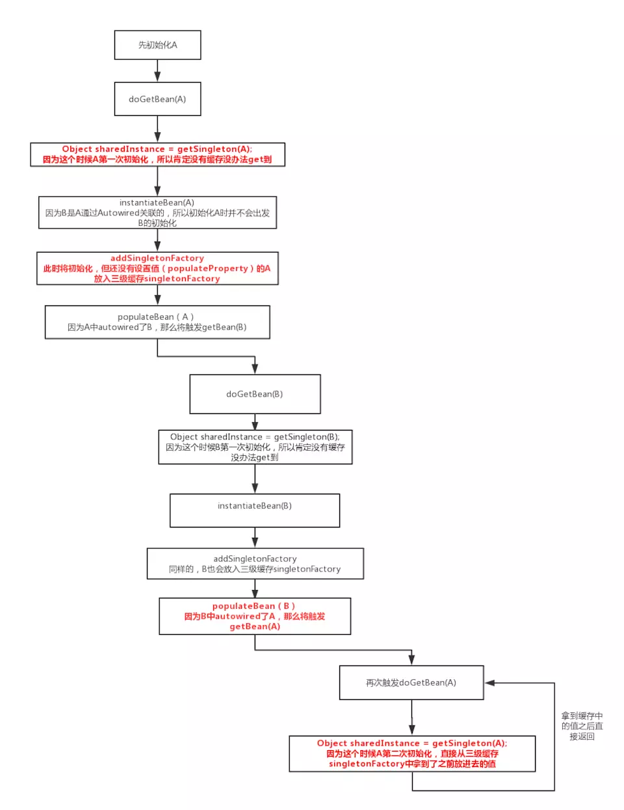
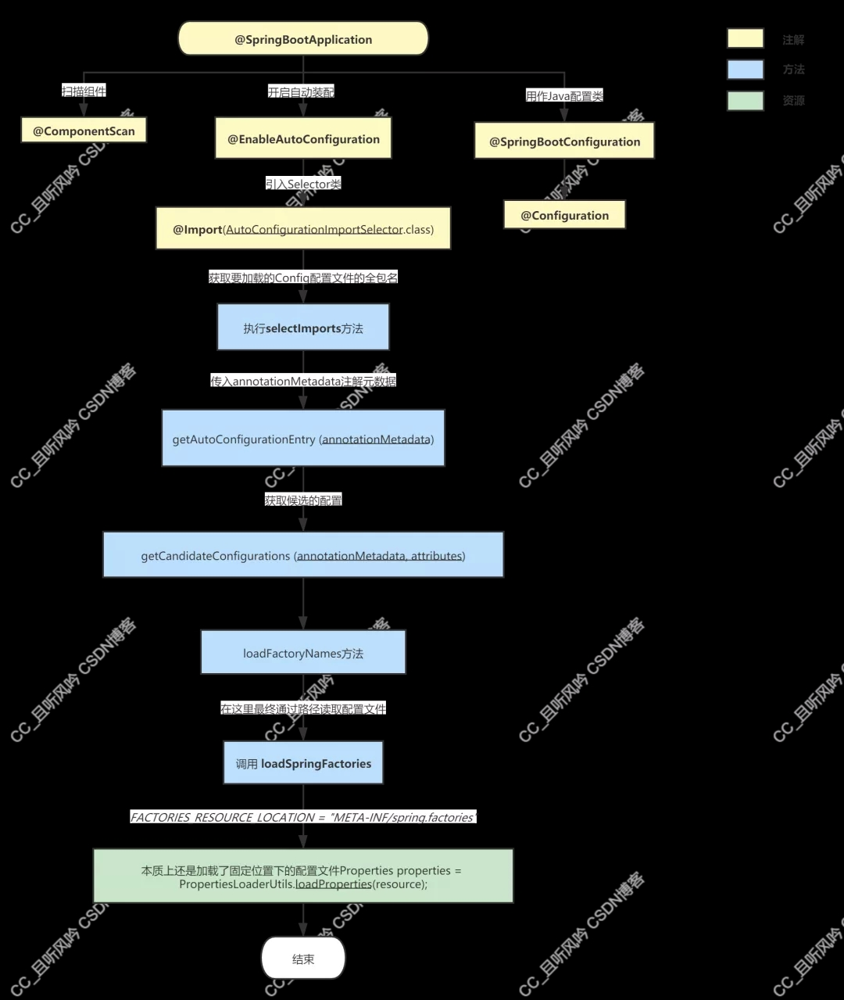

#### 1.spring 如何解决循环依赖？

>- https://zhuanlan.zhihu.com/p/84267654
>- https://www.jianshu.com/p/8bb67ca11831


下面是循环依赖的代码流程图片



#### 2.spring 事务是怎么实现的？

>- https://www.jianshu.com/p/2449cd914e3c
>- https://www.cnblogs.com/zengweiming/p/8853144.html

#### 3.spring 依赖使用到三级缓存分别是做什么用？

一级缓存`singletonObjects`存储的对象是完全创建好，可以正常使用的bean。

二级缓存`earlySingletonObjects`缓存的是从三级缓存中获取到的bean，这些bean是仅执行了通过构造方法实例化，并没有填充属性和初始化。

三级缓存`singletonFactories`，缓存一个objectFactory工厂。

#### 4.spring 为什么要使用第三级缓存解决循环依赖？

**为了解决代理对象（如aop）循环依赖的问题**

例： a依赖b,b依赖a，同时a,b都被aop增强。

首先明确aop的实现是通过 postBeanProcess后置处理器，在初始化之后做代理操作的。

为什么使用三级缓存原因：

> 1.只使用二级缓存，且二级缓存缓存的是一个不完整的bean

如果只使用二级缓存，且二级缓存缓存的是一个不完整的bean，这个时候a在设置属性的过程中去获取b（这个时候a还没有被aop的后置处理器增强），创建b的过程中，b依赖a，b去缓存中拿a拿到的是没有经过代理的a。就有问题。

> 2.使用二级缓存，且二级缓存是一个工厂方法的缓存

a依赖b，b依赖a，c。c又依赖a。a,b，c均aop增强。

加载开始： a实例化，放入工厂缓存，设置b，b实例化，设置属性，拿到a,此时从工厂缓存中拿到代理后的a。由于a没加载完毕，不会放入一级缓存。这个时候b开始设置c,c实例化，设置属性a,又去工厂缓存中拿对象a。这个时候拿到的a和b从工厂缓存不是一个对象。出现问题。

> 3.使用二级缓存，二级缓存缓存的是增强后的bean

这个与spring加载流程不符合。spring加载流程是：实例化，设置属性，初始化，增强。在有循环引用的时候，之前的bean并不会增强后放入到二级缓存。

***综上1，2，3 可知二级缓存解决不了有aop的循环依赖。spring采用了三级缓存。***

如果使用三级缓存为工厂缓存的话：

场景：a依赖b，b依赖a和c，c依赖a。并且a，b，c都aop增强。

a实例化，放入三级工厂缓存，设置属性b，b实例化放入三级缓存。b设置属性a，从三级工厂缓存中获取代理后的对象a，同时，代理后的a放入二级缓存，然后设置属性c，c实例化放入三级缓存，设置属性a,此时从二级缓存中获取到的代理后的a跟b中的a是一个对象，属性a设置成功。c初始化，然后执行后置处理器。进行aop的增强。增强后将代理的c放入到一级缓存，同时删除三级缓存中的c。c加载完成，b得到c，b设置c成功。b初始化，然后执行后置处理器，进行aop增强，将增强后的代理对象b放入到一级缓存。删除三级缓存中的b。此时 a拿到b，设置属性b成功，开始初始化，初始化后执行后置处理器。

```
protected Object getSingleton(String beanName, boolean allowEarlyReference) {
    // 从一级缓存中获取
    Object singletonObject = this.singletonObjects.get(beanName);
    if (singletonObject == null && isSingletonCurrentlyInCreation(beanName)) {
        synchronized (this.singletonObjects) {
            // 从二级缓存中获取未初始化完全的实体
            singletonObject = this.earlySingletonObjects.get(beanName);
            if (singletonObject == null && allowEarlyReference) {
                // 从三级缓存中获取工厂类，进行类初始化，成功后设置到二级缓存中，并从三级缓存中删除掉
                ObjectFactory<?> singletonFactory = this.singletonFactories.get(beanName);
                if (singletonFactory != null) {
                    singletonObject = singletonFactory.getObject();
                    this.earlySingletonObjects.put(beanName, singletonObject);
                    this.singletonFactories.remove(beanName);
                }
            }
        }
    }
    return (singletonObject != NULL_OBJECT ? singletonObject : null);
}
```

#### 5.说一说springboot自动装配原理



`Spring`中的`SPI`主要是利用`META-INF/spring.factories`文件来实现的，文件内容由多个`k = list(v)`的格式组成，比如：
```
org.springframework.boot.autoconfigure.EnableAutoConfiguration=\
  com.dtp.starter.adapter.dubbo.autoconfigure.ApacheDubboTpAutoConfiguration,\
  com.dtp.starter.adapter.dubbo.autoconfigure.AlibabaDubboTpAutoConfiguration

org.springframework.boot.env.EnvironmentPostProcessor=\
  com.dtp.starter.zookeeper.autoconfigure.ZkConfigEnvironmentProcessor
```

这些`spring.factories`文件可能是位于多个`jar`包中，`Spring`容器启动时会通过`ClassLoader.getResources()`获取这些`spring.factories`文件的全路径。然后遍历路径以字节流的形式读取所有的`k = list(v)`封装到到一个`Map`中，`key`为接口全限定类名，`value`为所有实现类的全限定类名列表。

- `springboot`自动装配的本质就是通过`spring`去读取`META-INF/spring.factories`中保存的配置类文件然后加载`bean`定义的过程；
- 在启动类上`@SpringBootApplication`中通过`@EnableAutoConfiguration`注解来加载配置信息，通过`@Import(AutoConfigurationImportSelector.class)`注解，在类`AutoConfigurationImportSelector`中实现`selectImports`方法来加载`META-INF/spring.factories`配置；
- 如果是标了`@Configuration`注解，就是批量加载了里面的`bean`定义；
- 通过配置文件获取对应的批量配置类，然后通过配置类批量加载`bean`定义，只要有写好的配置文件`spring.factories`就实现了自动。

#### 6.spring的扩展点介绍

`Spring`提供了很多的扩展点，第三方框架整合`Spring`其实大多也都是基于这些扩展点来做的。

这些扩展包括但不限于以下接口：

- `BeanFactoryPostProcessor`：在`Bean`实例化之前对`BeanDefinition`进行修改；
- `BeanPostProcessor`：在`Bean`初始化前后对`Bean`进行一些修改包装增强，比如返回代理对象；
- `Aware`：一个标记接口，实现该接口及子接口的类会收到`Spring`的通知回调，赋予某种`Spring`框架的能力，比如`ApplicationContextAware`、`EnvironmentAware`等；
- `ApplicationContextInitializer`：在上下文准备阶段，容器刷新之前做一些初始化工作，比如我们常用的配置中心`client`基本都是继承该初始化器，在容器刷新前将配置从远程拉到本地，然后封装成`PropertySource`放到`Environment`中供使用；
- `ApplicationListener`：`Spring`事件机制，监听特定的应用事件（`ApplicationEvent`），观察者模式的一种实现；
- `FactoryBean`：用来自定义`Bean`的创建逻辑（`Mybatis`、`Feign`等等）；
- `ImportBeanDefinitionRegistrar`：定义`@EnableXXX`注解，在注解上`Import`了一个`ImportBeanDefinitionRegistrar`，实现注册`BeanDefinition`到容器中；
- `InitializingBean`：在`Bean`初始化时会调用执行一些初始化逻辑；
- `ApplicationRunner`/`CommandLineRunner`：容器启动后回调，执行一些初始化工作；
- `BeanDefinitionRegistryPostProcessor`：读取项目中的`beanDefinition`之后执行，提供一个补充的扩展点。你可以在这里动态注册自己的`beanDefinition`，可以加载`classpath`之外的`bean`。
- `InstantiationAwareBeanPostProcessor`：该接口继承了`BeanPostProcess`接口，`BeanPostProcess`接口只在`bean`的初始化阶段进行扩展（注入`spring`上下文前后），而此接口在此基础上增加了3个方法，把可扩展的范围增加了实例化阶段和属性注入阶段。
- `BeanFactoryAware`：这个类只有一个触发点，发生在`bean`的实例化之后，注入属性之前，也就是`Setter`之前；
- `ApplicationContextAwareProcessor`：该类本身并没有扩展点，但是该类内部却有6个扩展点可供实现 ，这些类触发的时机在`bean`实例化之后，初始化之前；
- `BeanNameAware`：用户可以扩展这个点，在初始化`bean`之前拿到`spring`容器中注册的的`beanName`，来自行修改这个`beanName`的值；
- `InitializingBean`：为`bean`提供了初始化方法的方式，它只包括`afterPropertiesSet`方法，凡是继承该接口的类，在初始化`bean`的时候都会执行该方法。这个扩展点的触发时机在`postProcessAfterInitialization`之前。用户实现此接口，来进行系统启动的时候一些业务指标的初始化工作；
- `SmartInitializingSingleton`：这个接口中只有一个方法`afterSingletonsInstantiated`，其作用是是在`spring`容器管理的所有单例对象（非懒加载对象）初始化完成之后调用的回调接口。其触发时机为`postProcessAfterInitialization`之后。用户可以扩展此接口在对所有单例对象初始化完毕后，做一些后置的业务处理；
- `DisposableBean`：这个扩展点也只有一个方法`destroy()`，当此对象销毁时，会自动执行这个方法；
