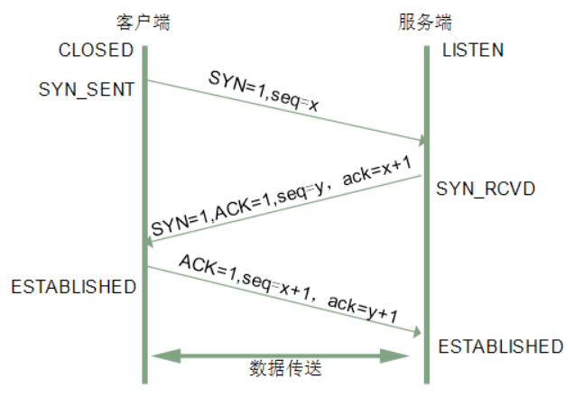
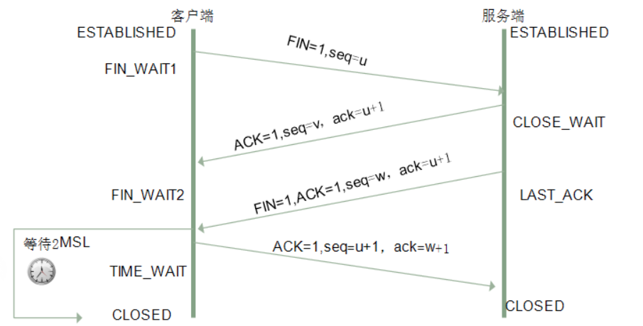

> 三次握手和四次挥手是各个公司常见的考点，也具有一定的水平区分度，也被一些面试官作为热身题。很多小伙伴说这个问题刚开始回答的挺好，但是后面越回答越冒冷汗，最后就歇菜了。

## 一、三次握手

#### 1.三次握手的作用是什么？

三次握手（Three-way Handshake）其实就是指建立一个TCP连接时，需要客户端和服务器总共发送3个包。进行三次握手的主要作用就是为了确认双方的接收能力和发送能力是否正常、指定自己的初始化序列号为后面的可靠性传送做准备。实质上其实就是连接服务器指定端口，建立TCP连接，并同步连接双方的序列号和确认号，交换TCP窗口大小等信息。

#### 2.三次握手的流程

刚开始客户端处于`Closed`的状态，服务端处于`Listen`状态。进行三次握手流程如下：

>- 第一次握手：客户端给服务端发一个`SYN`报文，并指明客户端的初始化序列号`ISN`。此时客户端处于`SYN_SENT`状态。首部的同步位`SYN=1`，初始序号`seq=x`，`SYN=1`的报文段不能携带数据，但要消耗掉一个序号。
>- 第二次握手：服务器收到客户端的`SYN`报文之后，会以自己的`SYN`报文作为应答，并且也是指定了自己的初始化序列号`ISN(s)`。同时会把客户端的`ISN + 1`作为`ack`的值，表示自己已经收到了客户端的`SYN`，此时服务器处于`SYN_RCVD`的状态。在确认报文段中`SYN=1`，`ACK=1`，确认号`ack=x+1`，初始序号`seq=y`。
>- 第三次握手：客户端收到服务端`SYN`报文之后，会发送一个`ACK`报文，当然，也是一样把服务器的`ISN + 1`作为`ack`的值，表示已经收到了服务端的`SYN`报文，此时客户端处于`ESTABLISHED`状态。服务器收到`ACK`报文之后，也处于`ESTABLISHED`状态，此时，双方已建立起了连接。确认报文段`ACK=1`，确认号`ack=y+1`，序号`seq=x+1`（初始为`seq=x`，第二个报文段所以要+1），`ACK`报文段可以携带数据，不携带数据则不消耗序号。

发送第一个SYN的一端将执行主动打开（`active open`），接收这个`SYN`并发回下一个SYN的另一端执行被动打开（`passive open`）。
在`socket`编程中，客户端执行`connect()`时，将触发三次握手。



下面展示客户端和服务端在三次握手的时候所处的状态：

| 握手 | 客户端 | 服务端 |
| --- | --- | --- |
| 握手前 | Closed | Listen |
| 第一次握手 | SYN_SENT | SYN_RCVD |
| 第二次握手 | ESTABLISHED | SYN_RCVD |
| 第三次握手 | ESTABLISHED | ESTABLISHED |

#### 3.为什么需要三次握手，两次不行吗？

>- 第一次握手：客户端发送网络包，服务端收到了。这样服务端就能得出结论：客户端的发送能力、服务端的接收能力是正常的。
>- 第二次握手：服务端发包，客户端收到了。这样客户端就能得出结论：服务端的接收、发送能力，客户端的接收、发送能力是正常的。不过此时服务器并不能确认客户端的接收能力是否正常。
>- 第三次握手：客户端发包，服务端收到了。这样服务端就能得出结论：客户端的接收、发送能力正常，服务器自己的发送、接收能力也正常。

因此，需要三次握手才能确认双方的接收与发送能力是否正常。试想如果是用两次握手，则会出现下面这种情况：

> 如客户端发出连接请求，但因连接请求报文丢失而未收到确认，于是客户端再重传一次连接请求。后来收到了确认，建立了连接。数据传输完毕后，就释放了连接，客户端共发出了两个连接请求报文段，其中第一个丢失，第二个到达了服务端，但是第一个丢失的报文段只是在某些网络结点长时间滞留了，延误到连接释放以后的某个时间才到达服务端，此时服务端误认为客户端又发出一次新的连接请求，于是就向客户端发出确认报文段，同意建立连接，不采用三次握手，只要服务端发出确认，就建立新的连接了，此时客户端忽略服务端发来的确认，也不发送数据，则服务端一致等待客户端发送数据，浪费资源。

#### 4.什么是半连接队列？

服务器第一次收到客户端的`SYN`之后，就会处于`SYN_RCVD`状态，此时双方还没有完全建立其连接，服务器会把此种状态下请求连接放在一个队列里，我们把这种队列称之为半连接队列。

当然还有一个全连接队列，就是已经完成三次握手，建立起连接的就会放在全连接队列中。如果队列满了就有可能会出现丢包现象。

服务器发送完`SYN-ACK`包，如果未收到客户确认包，服务器进行首次重传，等待一段时间仍未收到客户确认包，进行第二次重传。如果重传次数超过系统规定的最大重传次数，系统将该连接信息从半连接队列中删除。
注意，每次重传等待的时间不一定相同，一般会是指数增长，例如间隔时间为 1s，2s，4s，8s…

#### 5.ISN(Initial Sequence Number)是固定的吗？

当一端为建立连接而发送它的SYN时，它为连接选择一个初始序号。`ISN`随时间而变化，因此每个连接都将具有不同的`ISN`。`ISN`可以看作是一个32比特的计数器，每`4ms`加`1`。这样选择序号的目的在于防止在网络中被延迟的分组在以后又被传送，而导致某个连接的一方对它做错误的解释。

***三次握手的其中一个重要功能是客户端和服务端交换`ISN(Initial Sequence Number)`，以便让对方知道接下来接收数据的时候如何按序列号组装数据。如果`ISN`是固定的，攻击者很容易猜出后续的确认号，因此`ISN`是动态生成的。***

#### 6.三次握手过程中可以携带数据吗？

第三次握手的时候，是可以携带数据的。但是，第一次、第二次握手不可以携带数据。

为什么这样呢?大家可以想一个问题，假如第一次握手可以携带数据的话，如果有人要恶意攻击服务器，那他每次都在第一次握手中的`SYN`报文中放入大量的数据。因为攻击者根本就不理服务器的接收、发送能力是否正常，然后疯狂着重复发`SYN`报文的话，这会让服务器花费很多时间、内存空间来接收这些报文。

也就是说，第一次握手不可以放数据，其中一个简单的原因就是会让服务器更加容易受到攻击了。而对于第三次的话，此时客户端已经处于`ESTABLISHED`状态。对于客户端来说，他已经建立起连接了，并且也已经知道服务器的接收、发送能力是正常的了，所以能携带数据也没啥毛病。

#### 7.SYN攻击是什么？

服务器端的资源分配是在二次握手时分配的，而客户端的资源是在完成三次握手时分配的，所以服务器容易受到`SYN`攻击。`SYN`攻击就是Client在短时间内伪造大量不存在的IP地址，并向Server不断地发送`SYN`包，Server则回复确认包，并等待Client确认，由于源地址不存在，因此Server需要不断重发直至超时，这些伪造的`SYN`包将长时间占用未连接队列，导致正常的`SYN`请求因为队列满而被丢弃，从而引起网络拥塞甚至系统瘫痪。SYN 攻击是一种典型的 DoS/DDoS 攻击。

检测`SYN`攻击非常的方便，当你在服务器上看到大量的半连接状态时，特别是源IP地址是随机的，基本上可以断定这是一次`SYN`攻击。在`Linux/Unix`上可以使用系统自带的`netstat`命令来检测`SYN`攻击。

```
netstat -n -p | grep SYN_RECV
```

常见的防御 SYN 攻击的方法有如下几种：
>- 缩短超时（SYN Timeout）时间；
>- 增加最大半连接数；
>- 过滤网关防护；
>- SYN cookies技术；

## 二、四次挥手

#### 1.什么是四次挥手？

建立一个连接需要三次握手，而终止一个连接要经过四次挥手（也有将四次挥手叫做四次握手的）。这由TCP的半关闭（half-close）造成的。所谓的半关闭，其实就是TCP提供了连接的一端在结束它的发送后还能接收来自另一端数据的能力。

TCP 连接的关闭需要发送四个包，因此称为四次挥手(Four-way handshake)，客户端或服务端均可主动发起挥手动作。

#### 2.四次挥手的过程

刚开始双方都处于`ESTABLISHED`状态，假如是客户端先发起关闭请求。四次挥手的过程如下：

> 第一次挥手：客户端发送一个`FIN`报文，报文中会指定一个序列号。此时客户端处于`FIN_WAIT1`状态。
> 即发出连接释放报文段（`FIN=1`，序号`seq=u`），并停止再发送数据，主动关闭TCP连接，进入`FIN_WAIT1`（终止等待1）状态，等待服务端的确认。
>
>
> 第二次挥手：服务端收到`FIN`之后，会发送`ACK`报文，且把客户端的序列号值 +1 作为`ack`报文的序列号值，表明已经收到客户端的报文了，此时服务端处于`CLOSE_WAIT`状态。
> 即服务端收到连接释放报文段后即发出确认报文段（`ACK=1`，确认号`ack=u+1`，序号`seq=v`），服务端进入`CLOSE_WAIT`（关闭等待）状态，此时的TCP处于半关闭状态，客户端到服务端的连接释放。客户端收到服务端的确认后，进入`FIN_WAIT2`（终止等待2）状态，等待服务端发出的连接释放报文段。
>
>
> 第三次挥手：如果服务端也想断开连接了，和客户端的第一次挥手一样，发给`FIN`报文，且指定一个序列号。此时服务端处于`LAST_ACK`的状态。
> 即服务端没有要向客户端发出的数据，服务端发出连接释放报文段（`FIN=1`，`ACK=1`，序号`seq=w`，确认号`ack=u+1`），服务端进入`LAST_ACK`（最后确认）状态，等待客户端的确认。
>
>
> 第四次挥手：客户端收到`FIN`之后，一样发送一个`ACK`报文作为应答，且把服务端的序列号值+1作为自己`ACK`报文的序列号值，此时客户端处于`TIME_WAIT`状态。需要过一阵子以确保服务端收到自己的`ACK`报文之后才会进入`CLOSED`状态，服务端收到`ACK`报文之后，就处于关闭连接了，处于`CLOSED`状态。
> 即客户端收到服务端的连接释放报文段后，对此发出确认报文段（`ACK=1`，`seq=u+1`，`ack=w+1`），客户端进入`TIME_WAIT`（时间等待）状态。此时TCP未释放掉，需要经过时间等待计时器设置的时间`2MSL`后，客户端才进入`CLOSED`状态。

收到一个`FIN`只意味着在这一方向上没有数据流动。***客户端执行主动关闭并进入`TIME_WAIT`是正常的，服务端通常执行被动关闭，不会进入`TIME_WAIT`状态。***
在socket编程中，任何一方执行close()操作即可产生挥手操作。



下面展示客户端和服务端在四次挥手的时候所处的状态：

| 挥手 | 客户端 | 服务端 |
| --- | --- | --- |
| 挥手前 | ESTABLISHED | ESTABLISHED | 
| 第一次挥手 | FIN_WAIT1 | CLOSE_WAIT |
| 第二次挥手 | FIN_WAIT2 | CLOSE_WAIT |
| 第三次挥手 | TIME_WAIT | LAST_ACK |
| 第四次挥手 | TIME_WAIT -> 2MSL -> CLOSED | CLOSED |

#### 3.挥手为什么需要四次？

关闭连接时，当服务端收到客户端的`FIN`报文时，很可能并不会立即关闭SOCKET，所以只能先回复一个`ACK`报文，告诉客户端，“你发的`FIN`报文我收到了”。只有等到我服务端所有的报文都发送完了，我才能发送`FIN`报文，因此不能一起发送。故需要四次挥手。

#### 4.2MSL等待状态是什么？

`TIME_WAIT`状态也成为`2MSL`等待状态。每个具体TCP实现必须选择一个报文段最大生存时间`MSL（Maximum Segment Lifetime）`，它是任何报文段被丢弃前在网络内的最长时间。这个时间是有限的，因为TCP报文段以IP数据报在网络内传输，而IP数据报则有限制其生存时间的TTL字段。

对一个具体实现所给定的MSL值，处理的原则是：当TCP执行一个主动关闭，并发回最后一个`ACK`，该连接必须在`TIME_WAIT`状态停留的时间为`2`倍的`MSL`。这样可让TCP再次发送最后的`ACK`以防这个`ACK`丢失（另一端超时并重发最后的`FIN`）。

这种`2MSL`等待的另一个结果是这个TCP连接在`2MSL`等待期间，定义这个连接的插口（客户的IP地址和端口号，服务器的IP地址和端口号）不能再被使用。这个连接只能在`2MSL`结束后才能再被使用。

#### 5.四次挥手释放连接时，等待2MSL的意义?

> MSL是Maximum Segment Lifetime的英文缩写，可译为“最长报文段寿命”，它是任何报文在网络上存在的最长时间，超过这个时间报文将被丢弃。

***保证客户端发送的最后一个ACK报文段能够到达服务端。***

这个`ACK`报文段有可能丢失，使得处于`LAST-ACK`状态的服务端收不到对已发送的`FIN+ACK`报文段的确认，服务端超时重传`FIN+ACK`报文段，而客户端能在`2MSL`时间内收到这个重传的`FIN+ACK`报文段，接着客户端重传一次确认，重新启动`2MSL`计时器，最后客户端和服务端都进入到`CLOSED`状态，若客户端在`TIME-WAIT`状态不等待一段时间，而是发送完`ACK`报文段后立即释放连接，则无法收到服务端重传的`FIN+ACK`报文段，所以不会再发送一次确认报文段，则服务端无法正常进入到`CLOSED`状态。

***防止“已失效的连接请求报文段”出现在本连接中。***

客户端在发送完最后一个`ACK`报文段后，再经过`2MSL`，就可以使本连接持续的时间内所产生的所有报文段都从网络中消失，使下一个新的连接中不会出现这种旧的连接请求报文段。

#### 6.为什么TIME_WAIT状态需要经过2MSL才能返回到CLOSE状态？

理论上，四个报文都发送完毕，就可以直接进入`CLOSE`状态了，但是可能网络是不可靠的，有可能最后一个`ACK`丢失。***所以`TIME_WAIT`状态就是用来重发可能丢失的`ACK`报文。***

## 三、其它概念和问题

#### 1.什么是半关闭?

TCP连接只有一方发送了`FIN`，另一方没有发出`FIN`包，仍然可以在一个方向上正常发送数据。对应TCP四次挥手的`FIN_WAIT_2`状态和`CLOSE_WAIT`状态。

#### 2.什么是半打开？

如果一方异常关闭（断网，断电），而另一方并不知情。处于半打开的状态，如果双方不进行数据通信，是无法发现问题的。可以引入心跳机制，以检测半打开状态，检测到了发送RST重新建立连接。

#### 3.什么是半连接？

三次握手中，主动发起握手的一方不发最后一次`ACK`，使得服务器端阻塞在`SYN_RECV`状态。由此引申出一个概念就是半连接攻击（`SYN`攻击）：会耗尽服务器资源，使得真正的请求无法建立连接。

#### 4.如果已经建立了连接，但是客户端突然出现故障了怎么办？

TCP还设有一个保活计时器，显然，客户端如果出现故障，服务器不能一直等下去，白白浪费资源。服务器每收到一次客户端的请求后都会重新复位这个计时器，时间通常是设置为`2小时`，若两小时还没有收到客户端的任何数据，服务器就会发送一个探测报文段，以后每隔`75秒`发送一次。若一连发送`10个`探测报文仍然没反应，服务器就认为客户端出了故障，接着就关闭连接。
