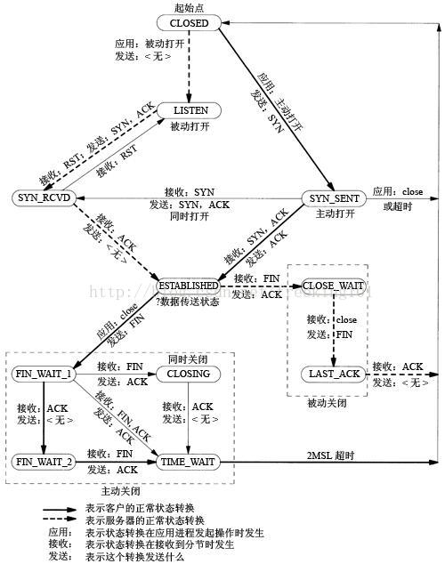
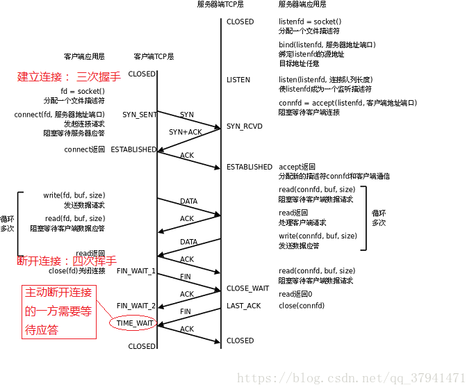
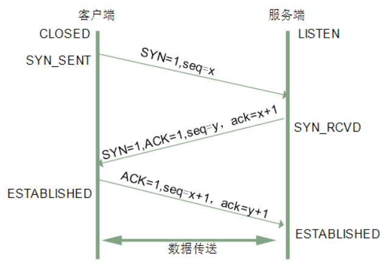
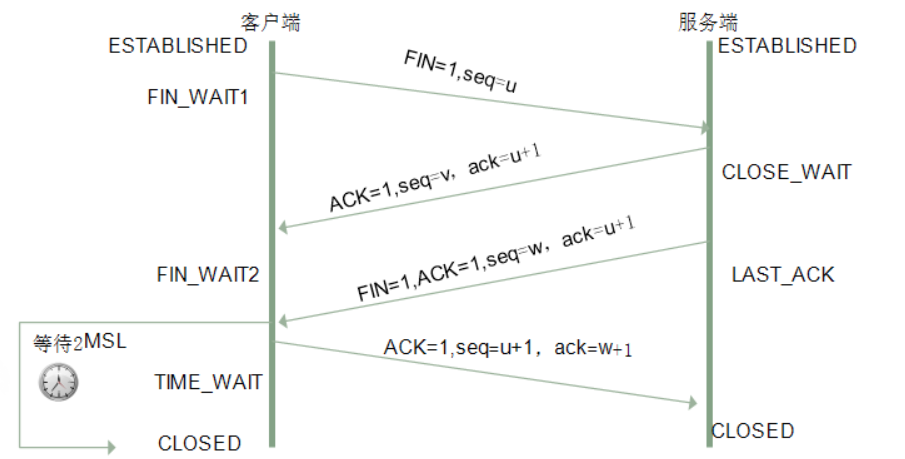

> 三次握手和四次挥手是各个公司常见的考点，也具有一定的水平区分度，也被一些面试官作为热身题。很多小伙伴说这个问题刚开始回答的挺好，但是后面越回答越冒冷汗，最后就歇菜了。

## 一、TCP基础知识

#### 1.TCP的是一种状态



各个状态的意义如下：

| 状态 | 描述 |
| --- | --- |
| LISTEN | 侦听来自远方TCP端口的连接请求 |
| SYN_SENT | 在发送连接请求后等待匹配的连接请求 |
| SYN_RCVD | 在收到和发送一个连接请求后等待对连接请求的确认 |
| ESTABLISHED | 代表一个打开的连接，数据可以传送给用户 |
| FIN_WAIT1 | 等待远程TCP的连接中断请求，或先前的连接中断请求的确认 |
| FIN_WAIT2 | 从远程TCP等待连接中断请求 |
| CLOSE_WAIT | 等待从本地用户发来的连接中断请求 |
| CLOSING | 等待远程TCP对连接中断的确认 |
| LAST_ACK | 等待原来发向远程TCP的连接中断请求的确认 |
| TIME_WAIT | 等待足够的时间以确保远程TCP接收到连接中断请求的确认 |
| CLOSED | 没有任何连接状态 |

客户端正常情况下TCP状态迁移：

CLOSED->SYN_SENT->ESTABLISHED->FIN_WAIT_1->FIN_WAIT_2->TIME_WAIT->CLOSED

服务器正常情况下TCP状态迁移：

CLOSED->LISTEN-> SYN_RCVD ->ESTABLISHED->CLOSE_WAIT->LAST_ACK->CLOSED


#### 2.TCP各个状态的详解



**LISTENING ：服务端侦听来自远方的TCP端口的连接请求**

```
首先服务端需要打开一个socket 进行监听，状态为LISTEN。
有提供某种服务才会处于LISTENING状态， TCP状态变化就是某个端口的状态变化，提供一个服务就打开一个端口，例如：提供www服务默认开的是80端口，提供ftp服务默认的端口为21，当提供的服务没有被连接时就处于LISTENING状态。FTP服务启动后首先处于侦听(LISTENING)状态。处于侦听LISTENING状态时，该端口是开放的，等待连接，但还没有被连接。就像你房子的门已经敞开的，但还没有人进来。
看LISTENING状态最主要的是看本机开了哪些端口，这些端口都是哪个程序开的，关闭不必要的端口是保证安全的一个非常重要的方面，服务端口都对应一个服务(应用程序)，停止该服务就关闭了该端口，例如要关闭21端口只要停止IIS服务中的FTP服务即可。关于这方面的知识请参阅其它文章。
如果你不幸中了服务端口的木马，木马也开个端口处于LISTENING状态。
```

**SYN_SENT： 客户端SYN_SENT状态**

```
在客户端发送连接请求后，等待匹配的连接请求:
客户端通过应用程序调用connect进行active open.于是客户端tcp发送一个SYN以请求建立一个连接.之后状态置为SYN_SENT. /*The socket is actively attempting to establish a connection. 在发送连接请求后等待匹配的连接请求 */

当请求连接时客户端首先要发送同步信号给要访问的机器，此时状态为SYN_SENT，如果连接成功了就变为ESTABLISHED，正常情况下SYN_SENT状态非常短暂。例如要访问网站http://www.baidu.com,如果是正常连接的话，用TCPView观察 IEXPLORE .EXE(IE)建立的连接会发现很快从SYN_SENT变为ESTABLISHED，表示连接成功。SYN_SENT状态快的也许看不到。

如果发现有很多SYN_SENT出现，那一般有这么几种情况，一是你要访问的网站不存在或线路不好，二是用扫描软件扫描一个网段的机器，也会出出现很多SYN_SENT，另外就是可能中了病毒了，例如中了"冲击波"，病毒发作时会扫描其它机器，这样会有很多SYN_SENT出现。
```

**SYN_RCVD：服务端状态SYN_RCVD**

```
在收到和发送一个连接请求后等待对方对连接请求的确认。当服务器收到客户端发送的同步信号时，将标志位ACK和SYN置1发送给客户端，此时服务器端处于SYN_RCVD状态，如果连接成功了就变为ESTABLISHED，正常情况下SYN_RCVD状态非常短暂。如果发现有很多SYN_RCVD状态，那你的机器有可能被SYN Flood的DoS(拒绝服务攻击)攻击了。
```

`SYN Flood`的攻击原理是：
```
在进行三次握手时，攻击软件向被攻击的服务器发送SYN连接请求(握手的第一步)，但是这个地址是伪造的，如攻击软件随机伪造了51.133.163.104、65.158.99.152等等地址。 服务器 在收到连接请求时将标志位 ACK和 SYN 置1发送给客户端(握手的第二步)，但是这些客户端的IP地址都是伪造的，服务器根本找不到客户机，也就是说握手的第三步不可能完成。
这种情况下服务器端一般会重试(再次发送SYN+ACK给客户端)并等待一段时间后丢弃这个未完成的连接，这段时间的长度我们称为SYN Timeout，一般来说这个时间是分钟的数量级(大约为30秒-2分钟);一个用户出现异常导致服务器的一个线程等待1分钟并不是什么很大的问题，但如果有一个恶意的攻击者大量模拟这种情况，服务器端将为了维护一个非常大的半连接列表而消耗非常多的资源----数以万计的半连接，即使是简单的保存并遍历也会消耗非常多的 CPU 时间和内存，何况还要不断对这个列表中的IP进行SYN+ACK的重试。此时从正常客户的角度看来，服务器失去响应，这种情况我们称做： 服务器端受到了SYN Flood攻击(SYN洪水攻击)
```

**ESTABLISHED：代表一个打开的连接(服务端/客户端)**
```
ESTABLISHED状态是表示两台机器正在传输数据，观察这个状态最主要的就是看哪个程序正在处于ESTABLISHED状态。
服务器出现很多 ESTABLISHED状态： netstat -nat |grep 9502或者使用lsof -i:9502可以检测到。
当客户端未主动close的时候就断开连接：即客户端发送的FIN丢失或未发送。
这时候若客户端断开的时候发送了FIN包，则服务端将会处于CLOSE_WAIT状态;
这时候若客户端断开的时候未发送FIN包，则服务端处还是显示ESTABLISHED状态;
结果客户端重新连接服务器。
而新连接上来的客户端(也就是刚才断掉的重新连上来了)在服务端肯定是ESTABLISHED; 如果客户端重复的上演这种情况，那么服务端将会出现大量的假的ESTABLISHED连接和CLOSE_WAIT连接。
最终结果就是新的其他客户端无法连接上来，但是利用netstat还是能看到一条连接已经建立，并显示ESTABLISHED，但始终无法进入程序代码。
```

**FIN_WAIT1：等待远程TCP连接中断请求，或先前的连接中断请求的确认(主动关闭端)**
```
主动关闭(active close)端应用程序调用close，于是其TCP发出FIN请求主动关闭连接，之后进入FIN_WAIT1状态./* The socket is closed, and the connection is shutting down. 等待远程TCP的连接中断请求，或先前的连接中断请求的确认 */
```

**FIN_WAIT2：从远程TCP等待连接中断请求(主动关闭端)**
```
主动关闭(active close)端接到ACK后，就进入了FIN-WAIT-2 ./* Connection is closed, and the socket is waiting for a shutdown from the remote end. 从远程TCP等待连接中断请求 */
这就是著名的半关闭的状态了，这是在关闭连接时，客户端和服务器两次握手之后的状态。在这个状态下，应用程序还有接受数据的能力，但是已经无法发送数据，但是也有一种可能是，客户端一直处于FIN_WAIT_2状态，而服务器则一直处于WAIT_CLOSE状态，而直到应用层来决定关闭这个状态。
```

**CLOSE_WAIT：等待从本地用户发来的连接中断请求(被动关闭端)**
```
被动关闭(passive close)端TCP接到FIN后，就发出ACK以回应FIN请求(它的接收也作为文件结束符传递给上层应用程序),并进入CLOSE_WAIT. /* The remote end has shut down, waiting for the socket to close. 等待从本地用户发来的连接中断请求 */
```

**CLOSING：等待远程TCP对连接中断的确认**
```
比较少见./* Both sockets are shut down but we still don't have all our data sent. 等待远程TCP对连接中断的确认 */
```

**LAST_ACK：等待原来的发向远程TCP的连接中断请求的确认(被动关闭端)**
```
被动关闭端一段时间后，接收到文件结束符的应用程序将调用CLOSE关闭连接。这导致它的TCP也发送一个 FIN,等待对方的ACK.就进入了LAST-ACK . /* The remote end has shut down, and the socket is closed. Waiting for acknowledgement. 等待原来发向远程TCP的连接中断请求的确认 */
```

**TIME_WAIT：等待足够的时间以确保远程TCP接收到连接中断请求的确认(主动关闭端)**
```
在主动关闭端接收到FIN后，TCP就发送ACK包，并进入TIME-WAIT状态。/* The socket is waiting after close to handle packets still in the network.等待足够的时间以确保远程TCP接收到连接中断请求的确认 */

TIME_WAIT等待状态，这个状态又叫做2MSL状态，说的是在TIME_WAIT2发送了最后一个ACK数据报以后，要进入TIME_WAIT状态，这个状态是防止最后一次握手的数据报没有传送到对方那里而准备的(注意这不是四次握手，这是第四次握手的保险状态)。这个状态在很大程度上保证了双方都可以正常结束，但是，问题也来了。

由于插口的2MSL状态(插口是IP和端口对的意思，socket)，使得应用程序在2MSL时间内是无法再次使用同一个插口的，对于客户程序还好一些，但是对于服务程序，例如httpd，它总是要使用同一个端口来进行服务，而在2MSL时间内，启动httpd就会出现错误(插口被使用)。为了避免这个错误，服务器给出了一个平静时间的概念，这是说在2MSL时间内，虽然可以重新启动服务器，但是这个服务器还是要平静的等待2MSL时间的过去才能进行下一次连接。
```

**CLOSED：没有任何连接状态(被动关闭端)**
```
被动关闭端在接受到ACK包后，就进入了closed的状态。连接结束./* The socket is not being used. 没有任何连接状态 */
```

## 二、三次握手

#### 1.三次握手的作用是什么？

三次握手（Three-way Handshake）其实就是指建立一个TCP连接时，需要客户端和服务器总共发送3个包。进行三次握手的主要作用就是为了确认双方的接收能力和发送能力是否正常、指定自己的初始化序列号为后面的可靠性传送做准备。实质上其实就是连接服务器指定端口，建立TCP连接，并同步连接双方的序列号和确认号，交换TCP窗口大小等信息。

#### 2.三次握手的流程

刚开始客户端处于`Closed`的状态，服务端处于`Listen`状态。进行三次握手流程如下：

>- 第一次握手：客户端给服务端发一个`SYN`报文，并指明客户端的初始化序列号`ISN`。此时客户端处于`SYN_SENT`状态。首部的同步位`SYN=1`，初始序号`seq=x`，`SYN=1`的报文段不能携带数据，但要消耗掉一个序号。
>- 第二次握手：服务器收到客户端的`SYN`报文之后，会以自己的`SYN`报文作为应答，并且也是指定了自己的初始化序列号`ISN(s)`。同时会把客户端的`ISN + 1`作为`ack`的值，表示自己已经收到了客户端的`SYN`，此时服务器处于`SYN_RCVD`的状态。在确认报文段中`SYN=1`，`ACK=1`，确认号`ack=x+1`，初始序号`seq=y`。
>- 第三次握手：客户端收到服务端`SYN`报文之后，会发送一个`ACK`报文，当然，也是一样把服务器的`ISN + 1`作为`ack`的值，表示已经收到了服务端的`SYN`报文，此时客户端处于`ESTABLISHED`状态。服务器收到`ACK`报文之后，也处于`ESTABLISHED`状态，此时，双方已建立起了连接。确认报文段`ACK=1`，确认号`ack=y+1`，序号`seq=x+1`（初始为`seq=x`，第二个报文段所以要+1），`ACK`报文段可以携带数据，不携带数据则不消耗序号。

发送第一个SYN的一端将执行主动打开（`active open`），接收这个`SYN`并发回下一个SYN的另一端执行被动打开（`passive open`）。
在`socket`编程中，客户端执行`connect()`时，将触发三次握手。



下面展示客户端和服务端在三次握手的时候所处的状态：

| 握手 | 客户端 | 服务端 |
| --- | --- | --- |
| 握手前 | Closed | Listen |
| 第一次握手 | SYN_SENT | SYN_RCVD |
| 第二次握手 | ESTABLISHED | SYN_RCVD |
| 第三次握手 | ESTABLISHED | ESTABLISHED |

#### 3.为什么需要三次握手，两次不行吗？

>- 第一次握手：客户端发送网络包，服务端收到了。这样服务端就能得出结论：客户端的发送能力、服务端的接收能力是正常的。
>- 第二次握手：服务端发包，客户端收到了。这样客户端就能得出结论：服务端的接收、发送能力，客户端的接收、发送能力是正常的。不过此时服务器并不能确认客户端的接收能力是否正常。
>- 第三次握手：客户端发包，服务端收到了。这样服务端就能得出结论：客户端的接收、发送能力正常，服务器自己的发送、接收能力也正常。

因此，需要三次握手才能确认双方的接收与发送能力是否正常。试想如果是用两次握手，则会出现下面这种情况：

> 如客户端发出连接请求，但因连接请求报文丢失而未收到确认，于是客户端再重传一次连接请求。后来收到了确认，建立了连接。数据传输完毕后，就释放了连接，客户端共发出了两个连接请求报文段，其中第一个丢失，第二个到达了服务端，但是第一个丢失的报文段只是在某些网络结点长时间滞留了，延误到连接释放以后的某个时间才到达服务端，此时服务端误认为客户端又发出一次新的连接请求，于是就向客户端发出确认报文段，同意建立连接，不采用三次握手，只要服务端发出确认，就建立新的连接了，此时客户端忽略服务端发来的确认，也不发送数据，则服务端一直等待客户端发送数据，浪费资源。

#### 4.什么是半连接队列？

服务器第一次收到客户端的`SYN`之后，就会处于`SYN_RCVD`状态，此时双方还没有完全建立其连接，服务器会把此种状态下请求连接放在一个队列里，我们把这种队列称之为半连接队列。

当然还有一个全连接队列，就是已经完成三次握手，建立起连接的就会放在全连接队列中。如果队列满了就有可能会出现丢包现象。

服务器发送完`SYN-ACK`包，如果未收到客户确认包，服务器进行首次重传，等待一段时间仍未收到客户确认包，进行第二次重传。如果重传次数超过系统规定的最大重传次数，系统将该连接信息从半连接队列中删除。
注意，每次重传等待的时间不一定相同，一般会是指数增长，例如间隔时间为 1s，2s，4s，8s…

#### 5.ISN(Initial Sequence Number)是固定的吗？

当一端为建立连接而发送它的SYN时，它为连接选择一个初始序号。`ISN`随时间而变化，因此每个连接都将具有不同的`ISN`。`ISN`可以看作是一个32比特的计数器，每`4ms`加`1`。这样选择序号的目的在于防止在网络中被延迟的分组在以后又被传送，而导致某个连接的一方对它做错误的解释。

***三次握手的其中一个重要功能是客户端和服务端交换`ISN(Initial Sequence Number)`，以便让对方知道接下来接收数据的时候如何按序列号组装数据。如果`ISN`是固定的，攻击者很容易猜出后续的确认号，因此`ISN`是动态生成的。***

#### 6.三次握手过程中可以携带数据吗？

第三次握手的时候，是可以携带数据的。但是，第一次、第二次握手不可以携带数据。

为什么这样呢?大家可以想一个问题，假如第一次握手可以携带数据的话，如果有人要恶意攻击服务器，那他每次都在第一次握手中的`SYN`报文中放入大量的数据。因为攻击者根本就不理服务器的接收、发送能力是否正常，然后疯狂着重复发`SYN`报文的话，这会让服务器花费很多时间、内存空间来接收这些报文。

也就是说，第一次握手不可以放数据，其中一个简单的原因就是会让服务器更加容易受到攻击了。而对于第三次的话，此时客户端已经处于`ESTABLISHED`状态。对于客户端来说，他已经建立起连接了，并且也已经知道服务器的接收、发送能力是正常的了，所以能携带数据也没啥毛病。

#### 7.SYN攻击是什么？

服务器端的资源分配是在二次握手时分配的，而客户端的资源是在完成三次握手时分配的，所以服务器容易受到`SYN`攻击。`SYN`攻击就是Client在短时间内伪造大量不存在的IP地址，并向Server不断地发送`SYN`包，Server则回复确认包，并等待Client确认，由于源地址不存在，因此Server需要不断重发直至超时，这些伪造的`SYN`包将长时间占用未连接队列，导致正常的`SYN`请求因为队列满而被丢弃，从而引起网络拥塞甚至系统瘫痪。SYN 攻击是一种典型的 DoS/DDoS 攻击。

检测`SYN`攻击非常的方便，当你在服务器上看到大量的半连接状态时，特别是源IP地址是随机的，基本上可以断定这是一次`SYN`攻击。在`Linux/Unix`上可以使用系统自带的`netstat`命令来检测`SYN`攻击。

```
netstat -n -p | grep SYN_RECV
```

常见的防御 SYN 攻击的方法有如下几种：
>- 缩短超时（SYN Timeout）时间；
>- 增加最大半连接数；
>- 过滤网关防护；
>- SYN cookies技术；

#### 8.三次握手时的异常丢包

**第一次握手丢包**：默认情况下，connect()是阻塞式的，如果请求无法发送到服务器，那么connect会进行一段很长时间的等待和重试（重传次数和时间间隔我们暂且不去深究），此时我们可以使用通过设置`SO_SNDTIMEO`来为connect设置超时以减少connect的等待时间。

**第二次握手丢包**：对于客户来说，依然是connect超时，所以处理方式和第一次握手丢包是一样的。对于服务器来说，由于收不到第三次握手请求，所以会进行等待重传，直到多次重传失败后，关闭半连接。

- 服务器会维护一个半连接队列，用于等待客户的第三次握手请求。当收到第三次握手请求或者多次重传失败后，服务器会将该半连接从队列中删除。
- 我们经常听说的DDos攻击，就可以这个环节实现，`syn flood`就是一种常见的DDos攻击方式。简单来说，`syn flood`就是只发送第一次握手请求后，就关闭连接，将服务器的半连接队列占满，从而让正常用户无法得到服务。

**第三次握手丢包**：由于客户在发送第三次握手包后，不再等待确认，就直接进入了`ESTABLISHED`状态，所以一旦第三次握手失败，客户和服务器的状态就不同步了。当然，此时服务器会进行多次重发，一旦客户再次收到`SYN`+`ACK`（第二次握手请求），会再次确认。不过，如果第三次握手一直失败，则会出现，客户已经建立连接，而服务器关闭连接的情况。随后，一旦客户向服务器发送数据，则会收到一条`RST`回应，告诉用户连接已经重置，需要重新进行三次握手。

- `RST`和`SIGPIPE`：有过网络编程经验的人都知道在写网络通信的时候，需要屏蔽`SIGPIPE`信号，否则的话，一旦收到`PIPE`信号会导致程序异常退出。其实这个`SIGPIPE`就是由于`write()`的时候，我们自己的状态是`ESTABLISHED`而对方的状态不是`ESTABLISHED`，那么对方就会给我们一个`RST`回应，收到这个回应之后，系统就会自动生成一个`PIPE`信号。

#### 9.SYN报文什么情况下会被丢弃？

这里首先要知道`SYC`报文什么时候发送的。`SYN`报文是客户端在三次握手的第一次的时候给服务端发送的，发送完毕后需要等待`SYN+ACK`报文。那也就是说`SYN`只可能被服务端丢弃，这里我们定位到关键点之后，就可以考虑什么情况下会被丢弃了。

##### 1) 开启`tcp_tw_recycle`参数，并且在`NAT`环境下，造成`SYN`报文被丢弃

`TCP`四次挥手过程中，主动断开连接方会有一个`TIME_WAIT`这个状态，这个状态会持续`2MSL`后才会转变为`CLOSED`状态。

在`Linux`操作系统下，`TIME_WAIT`状态的持续时间有`60秒`之久，这意味着这***60秒内，客户端一直会占用着这个端口***。`Linux操`作系统提供了两个可以系统参数来快速回收处于`TIME_WAIT`状态的连接，这两个参数都是默认关闭的：
- `net.ipv4.tcp_tw_reuse`，如果开启该选项的话，客户端（连接发起方）在调用`connect()`函数时，内核会随机找一个`time_wait`状态超过`1秒`的连接给新的连接复用，所以该选项只适用于连接发起方。
- `net.ipv4.tcp_tw_recycle`，如果开启该选项的话，允许处于`TIME_WAIT`状态的连接被快速回收；

要使得这两个选项生效，有一个前提条件，就是要打开`TCP`时间戳，即`net.ipv4.tcp_timestamps=1（默认即为 1）`。

但是，`tcp_tw_recycle`在使用了`NAT`的网络下是不安全的！对于服务器来说，如果同时开启了`recycle`和`timestamps`选项，则会开启一种称之为「 per-host 的 PAWS 机制」。`PAWS`要求连接双方维护最近一次收到的数据包的时间戳`（Recent TSval）`，每收到一个新数据包都会读取数据包中的时间戳值跟`Recent TSval`值做比较，如果发现收到的数据包中时间戳不是递增的，则表示该数据包是过期的，就会直接丢弃这个数据包。

当客户端A通过`NAT`网关和服务器建立`TCP`连接，然后服务器主动关闭并且快速回收`TIME-WAIT`状态的连接后，客户端B也通过`NAT`网关和服务器建立`TCP`连接，注意客户端A和客户端B因为经过`相同的NAT网关`，***所以是用相同的IP地址与服务端建立TCP连接，如果客户端B的timestamp比客户端A的timestamp小，那么由于服务端的per-host的PAWS机制的作用，服务端就会丢弃客户端主机B发来的SYN包***。

##### 2) `accpet`队列满了，造成`SYN`报文被丢弃

在 TCP 三次握手的时候，Linux 内核会维护两个队列，分别是：
- 半连接队列，也称 SYN 队列；
- 全连接队列，也称 accepet 队列；

服务端收到客户端发起的`SYN`请求后，***内核会把该连接存储到半连接队列***，并向客户端响应`SYN+ACK`接着客户端会返回`ACK`，服务端收到第三次握手的`ACK`后，***内核会把连接从半连接队列移除，然后创建新的完全的连接***，并将其添加到`accept队列`，等待进程调用accept`函数时把连接取出来。

在服务端并发处理大量请求时，如果 TCP accpet 队列过小，或者应用程序调用 accept() 不及时，就会造成 accpet 队列满了 ，这时后续的连接就会被丢弃，这样就会出现服务端请求数量上不去的现象。

我们可以通过`ss命令来看`accpet`队列大小，在「LISTEN 状态」时，`Recv-Q/Send-Q`表示的含义如下：
```
// -l 显示正在监听的socket
// -n 不解析服务名称
// -t 只显示tcp socket
[root@VM_0_14_centos ~]# ss -lnt
State      Recv-Q Send-Q        Local Address:Port      Peer Address:Port              
LISTEN     0      1024          172.17.0.14:9001        *:*                  
LISTEN     0      511           *:6379                  *:*                  
LISTEN     0      1024          127.0.0.1:9100          *:*                  
LISTEN     0      1024          127.0.0.1:9229          *:*       
```

- `Recv-Q`：当前`accpet`队列的大小，也就是当前已完成三次握手并等待服务端`accept()`的`TCP`连接个数；
- `Send-Q`：当前`accpet`最大队列长度，上面的输出结果说明监听9100端口的`TCP`服务进程，`accpet`队列的最大长度为1024；

如果`Recv-Q`的大小超过`Send-Q`，就说明发生了`accpet`队列满的情况。解决办法就是需要调大`accpet`队列的最大长度，调大的方式是通过调大`backlog`以及`somaxconn`参数。

##### 3) 短时间内大量并发建连，队列空间不足以存放收到的SYN包

#### 10.全连接队列溢出的场景？

- 短时间内大量连接完成三次握手，队列放不下；
- 业务层accept()速度较慢，全连接队列积压。

#### 11.如何判断当前服务是否存在半连接队列或全连接队列溢出？

`netstat -s |grep -E 'LISTEN|overflow'`命令可以查看：

```
8515 times the listen queue of a socket overflowed // 全连接队列溢出的累计次数
60916 SYNs to LISTEN sockets dropped               // 半连接队列溢出的累计次数
```

#### 12.如何减少半连接队列或全连接队列溢出的？

可以尝试增加半连接队列/全连接队列的大小。

半连接队列大小主要受两个参数的影响，`backlog`和`tcp_max_syn_backlog`。队列大小会取两者的最小值，同时必须大于等于8，并将得到的结果进行`roundup_pow_of_two`运算，该操作会找到当前数值的二进制最高位数n，然后以1循环右移n次作为结果集，简单理解就是按2的倍数向上取整。半连接队列大小 = `roundup_pow_of_two(min(backlog, tcp_max_syn_backlog))`

全连接队列大小受两个参数影响，`backlog`和`sysctl_somaxconn`。队列大小会设置为`backlog`和`somaxconn`中较小的值。全连接队列大小 = `min(somaxconn, backlog)`。

可以调整上面说的参数来调整队列的大小。

## 三、四次挥手

#### 1.什么是四次挥手？

建立一个连接需要三次握手，而终止一个连接要经过四次挥手（也有将四次挥手叫做四次握手的）。这由TCP的半关闭（half-close）造成的。所谓的半关闭，其实就是TCP提供了连接的一端在结束它的发送后还能接收来自另一端数据的能力。

TCP 连接的关闭需要发送四个包，因此称为四次挥手(Four-way handshake)，客户端或服务端均可主动发起挥手动作。

#### 2.四次挥手的过程

刚开始双方都处于`ESTABLISHED`状态，假如是客户端先发起关闭请求。四次挥手的过程如下：

> 第一次挥手：客户端发送一个`FIN`报文，报文中会指定一个序列号。此时客户端处于`FIN_WAIT1`状态。
> 即发出连接释放报文段（`FIN=1`，序号`seq=u`），并停止再发送数据，主动关闭TCP连接，进入`FIN_WAIT1`（终止等待1）状态，等待服务端的确认。
>
>
> 第二次挥手：服务端收到`FIN`之后，会发送`ACK`报文，且把客户端的序列号值 +1 作为`ack`报文的序列号值，表明已经收到客户端的报文了，此时服务端处于`CLOSE_WAIT`状态。
> 即服务端收到连接释放报文段后即发出确认报文段（`ACK=1`，确认号`ack=u+1`，序号`seq=v`），服务端进入`CLOSE_WAIT`（关闭等待）状态，此时的TCP处于半关闭状态，客户端到服务端的连接释放。客户端收到服务端的确认后，进入`FIN_WAIT2`（终止等待2）状态，等待服务端发出的连接释放报文段。
>
>
> 第三次挥手：如果服务端也想断开连接了，和客户端的第一次挥手一样，发给`FIN`报文，且指定一个序列号。此时服务端处于`LAST_ACK`的状态。
> 即服务端没有要向客户端发出的数据，服务端发出连接释放报文段（`FIN=1`，`ACK=1`，序号`seq=w`，确认号`ack=u+1`），服务端进入`LAST_ACK`（最后确认）状态，等待客户端的确认。
>
>
> 第四次挥手：客户端收到`FIN`之后，一样发送一个`ACK`报文作为应答，且把服务端的序列号值+1作为自己`ACK`报文的序列号值，此时客户端处于`TIME_WAIT`状态。需要过一阵子以确保服务端收到自己的`ACK`报文之后才会进入`CLOSED`状态，服务端收到`ACK`报文之后，就处于关闭连接了，处于`CLOSED`状态。
> 即客户端收到服务端的连接释放报文段后，对此发出确认报文段（`ACK=1`，`seq=u+1`，`ack=w+1`），客户端进入`TIME_WAIT`（时间等待）状态。此时TCP未释放掉，需要经过时间等待计时器设置的时间`2MSL`后，客户端才进入`CLOSED`状态。

收到一个`FIN`只意味着在这一方向上没有数据流动。***客户端执行主动关闭并进入`TIME_WAIT`是正常的，服务端通常执行被动关闭，不会进入`TIME_WAIT`状态。***
在socket编程中，任何一方执行close()操作即可产生挥手操作。



下面展示客户端和服务端在四次挥手的时候所处的状态：

| 挥手 | 客户端 | 服务端 |
| --- | --- | --- |
| 挥手前 | ESTABLISHED | ESTABLISHED | 
| 第一次挥手 | FIN_WAIT1 | CLOSE_WAIT |
| 第二次挥手 | FIN_WAIT2 | CLOSE_WAIT |
| 第三次挥手 | TIME_WAIT | LAST_ACK |
| 第四次挥手 | TIME_WAIT -> 2MSL -> CLOSED | CLOSED |

#### 3.挥手为什么需要四次？

这是因为服务端的`LISTEN`状态下的`SOCKET`当收到`SYN`报文的建连请求后，它可以把`ACK`和`SYN`（`ACK`起应答作用，而`SYN`起同步作用）放在一个报文里来发送。

但关闭连接时，当服务端收到客户端的`FIN`报文时，很可能并不会立即关闭`SOCKET`，所以只能先回复一个`ACK`报文，告诉客户端，“你发的`FIN`报文我收到了”。只有等到我服务端所有的报文都发送完了，我才能发送`FIN`报文，因此不能一起发送。故需要四次挥手。

#### 4.2MSL等待状态是什么？

`TIME_WAIT`状态也成为`2MSL`等待状态。每个具体TCP实现必须选择一个报文段最大生存时间`MSL（Maximum Segment Lifetime）`，它是任何报文段被丢弃前在网络内的最长时间。这个时间是有限的，因为TCP报文段以IP数据报在网络内传输，而IP数据报则有限制其生存时间的TTL字段。

对一个具体实现所给定的MSL值，处理的原则是：当TCP执行一个主动关闭，并发回最后一个`ACK`，该连接必须在`TIME_WAIT`状态停留的时间为`2`倍的`MSL`。这样可让TCP再次发送最后的`ACK`以防这个`ACK`丢失（另一端超时并重发最后的`FIN`）。

这种`2MSL`等待的另一个结果是这个TCP连接在`2MSL`等待期间，定义这个连接的插口（客户的IP地址和端口号，服务器的IP地址和端口号）不能再被使用。这个连接只能在`2MSL`结束后才能再被使用。

#### 5.四次挥手释放连接时，等待2MSL的意义?

> MSL是Maximum Segment Lifetime的英文缩写，可译为“最长报文段寿命”，它是任何报文在网络上存在的最长时间，超过这个时间报文将被丢弃。

***保证客户端发送的最后一个ACK报文段能够到达服务端。***

这个`ACK`报文段有可能丢失，使得处于`LAST-ACK`状态的服务端收不到对已发送的`FIN+ACK`报文段的确认，服务端超时重传`FIN+ACK`报文段，而客户端能在`2MSL`时间内收到这个重传的`FIN+ACK`报文段，接着客户端重传一次确认，重新启动`2MSL`计时器，最后客户端和服务端都进入到`CLOSED`状态，若客户端在`TIME-WAIT`状态不等待一段时间，而是发送完`ACK`报文段后立即释放连接，则无法收到服务端重传的`FIN+ACK`报文段，所以不会再发送一次确认报文段，则服务端无法正常进入到`CLOSED`状态。

***防止“已失效的连接请求报文段”出现在本连接中。***

客户端在发送完最后一个`ACK`报文段后，再经过`2MSL`，就可以使本连接持续的时间内所产生的所有报文段都从网络中消失，使下一个新的连接中不会出现这种旧的连接请求报文段。

#### 6.为什么TIME_WAIT状态需要经过2MSL才能返回到CLOSE状态？

理论上，四个报文都发送完毕，就可以直接进入`CLOSE`状态了，但是可能网络是不可靠的，有可能最后一个`ACK`丢失。***所以`TIME_WAIT`状态就是用来重发可能丢失的`ACK`报文。***

#### 7.四次挥手时的异常丢包

**第一次握手丢包**：`FIN_WAIT1`丢失会导致客户重传，如果多次重传失败，则客户超时关闭连接，而服务器依然保持`ESTABLISHED`状态。如果服务器主动发送数据，则会收到一个`RST`包，重置连接。设置`KeepAlive`道理相同，核心是要求服务器主动发数据。如果服务器永远不会主动发数据，那么就会一直保持这样一个“假连接”。

**第二次握手丢包**：由于服务器第二次握手不会重发，所以即使丢包也不管，直接向对方发送`FIN`，此时客户执行”同时关闭“的流程（这个流程后面再说），等待`TIME_WAIT`时间后关闭。在客户进入`TIME_WAIT`之后，自己由于`FIN`没有响应，会重发，如果被客户`TIME_WAIT`收到并发送`LAST-ACK`，则流程正常结束，如果反复重发没有响应，那么超时关闭。

**第三次握手丢包**：服务器会持续等待在`LAST_ACK`状态，而客户会持续等待在`FIN_WAIT2`状态，最后双方超时关闭。

**第四次握手丢包**：客户端进入`TIME_WAIT`状态，等待`2MSL`，服务器由于收不到`LAST_ACK`则进行重发，如果多次重发失败，则超时关闭。

## 四、其它概念和问题

#### 1.什么是半关闭?

TCP连接只有一方发送了`FIN`，另一方没有发出`FIN`包，仍然可以在一个方向上正常发送数据。对应TCP四次挥手的`FIN_WAIT_2`状态和`CLOSE_WAIT`状态。

#### 2.什么是半打开？

如果一方异常关闭（断网，断电），而另一方并不知情。处于半打开的状态，如果双方不进行数据通信，是无法发现问题的。可以引入心跳机制，以检测半打开状态，检测到了发送RST重新建立连接。

#### 3.什么是半连接？

三次握手中，主动发起握手的一方不发最后一次`ACK`，使得服务器端阻塞在`SYN_RECV`状态。由此引申出一个概念就是半连接攻击（`SYN`攻击）：会耗尽服务器资源，使得真正的请求无法建立连接。

#### 4.如果已经建立了连接，但是客户端突然出现故障了怎么办？

TCP还设有一个保活计时器，显然，客户端如果出现故障，服务器不能一直等下去，白白浪费资源。服务器每收到一次客户端的请求后都会重新复位这个计时器，时间通常是设置为`2小时`，若两小时还没有收到客户端的任何数据，服务器就会发送一个探测报文段，以后每隔`75秒`发送一次。若一连发送`10个`探测报文仍然没反应，服务器就认为客户端出了故障，接着就关闭连接。

#### 5.四次挥手—服务器先关闭，客户端不关闭，继续发送数据，会出现什么情况？

服务器：发出`FIN`,客户端回复`ACK`，最后进入`TIME_WAIT`状态
客户端：没有close(),处于`close_wait`状态，接着向服务器继续发送数据，会出现什么情况？

客户端：因为对方关闭（相当于管道中对方的读端关闭写端写满缓冲区就会触发SIGPIPE信号，操作系统会强制关闭写端），客户端继续写的话，会触发SIGPIPE信号，操作系统会强制关闭客户端。

#### 6.TCP通信中服务器处理客户端意外断开

如果意外断开，客户端(3g/4g的移动设备)并没有正常关闭socket。双方并未按照协议上的四次挥手去断开连接。那么这时候正在执行Recv或Send操作的一方就会因为没有任何连接中断的通知而一直等待下去，也就是会被长时间卡住。

**解决意外中断办法都是利用保活机制。而保活机制可以让底层实现也可自己实现。**

- 1.在自己的程序中加入一条线程，定时向对端发送数据包，查看是否有ACK，如果有则连接正常，没有的话则连接断开。一般由客户端发送心跳包，服务端并不回应心跳，只是定时轮询判断一下与上次的时间间隔是否超时(超时时间自己设定)。服务器并不主动发送是不想增添服务器的通信量，减少压力。
- 2.利用KeepAlive，其实keepalive的原理就是TCP内嵌的一个心跳包。

#### 7.请讲讲TCP_NODELAY的作用

TCP/IP协议中针对TCP默认开启了`Nagle`算法。`Nagle`算法通过减少需要传输的数据包，来优化网络。在内核实现中，数据包的发送和接受会先做缓存，分别对应于写缓存和读缓存。

启动`TCP_NODELAY`，就意味着禁用了`Nagle`算法，允许小包的发送。**对于延时敏感型，同时数据传输量比较小的应用，开启TCP_NODELAY选项无疑是一个正确的选择**。比如，对于SSH会话，用户在远程敲击键盘发出指令的速度相对于网络带宽能力来说，绝对不是在一个量级上的，所以数据传输非常少；而又要求用户的输入能够及时获得返回，有较低的延时。如果开启了Nagle算法，就很可能出现频繁的延时，导致用户体验极差。当然，你也可以选择在应用层进行buffer，比如使用java中的buffered stream，尽可能地将大包写入到内核的写缓存进行发送；

对于关闭`TCP_NODELAY`，则是应用了`Nagle`算法。数据只有在写缓存中累积到一定量之后，才会被发送出去，这样明显提高了网络利用率（实际传输数据payload与协议头的比例大大提高）。但是这又不可避免地增加了延时；与`TCP delayed ack`这个特性结合，这个问题会更加显著，延时基本在`40ms`左右。当然这个问题只有在连续进行两次写操作的时候，才会暴露出来。

`TCP/IP`协议中，无论发送多少数据，总是要在数据前面加上协议头，同时，对方接收到数据，也需要发送ACK表示确认。为了尽可能的利用网络带宽，TCP总是希望尽可能的发送足够大的数据。（一个连接会设置MSS参数，因此，TCP/IP希望每次都能够以MSS尺寸的数据块来发送数据）。

`Nagle`算法的基本定义是任意时刻，最多只能有一个未被确认的小段。 所谓“小段”，指的是小于MSS尺寸的数据块，所谓“未被确认”，是指一个数据块发送出去后，没有收到对方发送的ACK确认该数据已收到。

举个例子，一开始client端调用socket的write操作将一个int型数据(称为A块)写入到网络中，由于此时连接是空闲的（也就是说还没有未被确认的小段），因此这个int型数据会被马上发送到server端，接着，client端又调用write操作写入‘/r/n’（简称B块），这个时候，A块的ACK没有返回，所以可以认为已经存在了一个未被确认的小段，所以B块没有立即被发送，一直等待A块的ACK收到（大概`40ms`之后），B块才被发送。

这里还隐藏了一个问题，**就是A块数据的ACK为什么40ms之后才收到？** 这是因为`TCP/IP`中不仅仅有`Nagle`算法，还有一个ACK延迟机制。**当Server端收到数据之后，它并不会马上向client端发送ACK，而是会将ACK的发送延迟一段时间（假设为t），它希望在t时间内server端会向client端发送应答数据，这样ACK就能够和应答数据一起发送，就像是应答数据捎带着ACK过去。** t大概就是`40ms`。这就解释了为什么'/r/n'(B块)总是在A块之后`40ms`才发出。

觉着`Nagle`算法太捣乱了，那么可以通过设置`TCP_NODELAY`将其禁用。当然，**更合理的方案还是应该使用一次大数据的写操作，而不是多次小数据的写操作。**

#### 8.用户在初始化TCP连接的时候，backlog参数配置有什么用？

当服务端调用`listen`函数时，`TCP`的状态被从`CLOSE`状态变为`LISTEN`，于此同时内核创建了两个队列：
- `半连接队列（Incomplete connection queue）`，又称`SYN队列`；
- `全连接队列（Completed connection queue）`，又称`Accept队列`。

当客户端发起`SYN`到服务端，服务端收到以后会回`ACK`和自己的`SYN`。这时服务端这边的`TCP`从`listen`状态变为`SYN_RCVD (SYN Received)`，此时会将这个连接信息放入「半连接队列」，半连接队列也被称为`SYN Queue`。`backlog`可以决定「半连接队列」的大小。

半连接队列大小计算参数与以下三个相关：
- 用户层`listen`传入的`backlog`；
- 系统变量`net.ipv4.tcp_max_syn_backlog`，默认值为`128`；
- 系统变量`net.core.somaxconn`，默认值为`128`；

如果用户传入的`backlog`值大于系统变量`net.core.somaxconn`的值，用户设置的`backlog`不会生效，使用系统变量值，默认为`128`。

接下来会将上面步骤计算出来的值与`net.ipv4.tcp_max_syn_backlog`值进行比较，选取较小值，再与`8`取较大值，再将其`+1`向上取求`最接近的最大2的指数次幂`。以下是几个`somaxconn`、`max_syn_backlog`、`backlog`三者之间不同组合的最终半连接队列大小值。

| somaxconn | max_syn_backlog | backlog | 队列大小 |
| --- | --- | --- | --- |
| 128 | 128 | 5 | 16 |
| 128 | 128 | 10 | 16 |
| 128 | 128 | 50 | 64 |
| 128 | 128 | 128 | 256 |
| 128 | 128 | 5000 | 256 |
| 1024 | 128 | 128 | 256 |
| 1024 | 1024 | 128 | 256 |
| 4096 | 4096 | 128 | 256 |
| 4096 | 4096 | 4096 | 8192 |

所以盲目调大`listen`的`backlog`对最终半连接队列的大小不会有影响。在`listen`的`backlog`不变的情况下，盲目调大`somaxconn`和`max_syn_backlog`对最终半连接队列的大小不会有影响。

「全连接队列」包含了服务端所有完成了三次握手，但是还未被应用调用`accept`取走的连接队列。此时的`socket`处于`ESTABLISHED`状态。每次应用调用`accept()`函数会移除队列头的连接。如果队列为空，`accept()`通常会阻塞。全连接队列也被称为`Accept队列`。`backlog`也可以决定「全连接队列」的大小。如果全连接队列满，内核会舍弃掉`client`发过来的`ack`。

全连接队列的大小是`listen`传入的`backlog`和`somaxconn`中的较小值。真正全连接队列大小是`backlog + 1`（较小值）。当你指定`backlog`值为1时，能容纳的连接个数会是2。

如果的接口处理连接的速度要求非常高，或者在做压力测试，很有必要调高这个值。如果业务接口本身性能不好，`accept`取走已建连的速度较慢，那么把`backlog`调的再大也没有用，只会增加连接失败的可能性。`Nginx`和`Redis`默认的`backlog`值等于`511`，`Linux`默认的`backlog`为`128`，`Java`默认的`backlog`等于`50`。

默认情况下，全连接队列满以后，服务端会忽略客户端的`ACK`，随后会重传`SYN+ACK`，也可以修改这种行为，这个值由`/proc/sys/net/ipv4/tcp_abort_on_overflow`决定。`tcp_abort_on_overflow`为`0`表示三次握手最后一步全连接队列满以后`server`会丢掉`client`发过来的`ACK`，服务端随后会进行重传`SYN+ACK`。`tcp_abort_on_overflow`为`1`表示全连接队列满以后服务端直接发送`RST`给客户端。但是回给客户端`RST`包会带来另外一个问题，***客户端不知道服务端响应的`RST`包到底是因为「该端口没有进程监听」，还是「该端口有进程监听，只是它的队列满了」***。

