#### 1、知识点网址记录

>- wait-notify应用demo https://blog.csdn.net/jiangzhexi/article/details/81152617
>- Java并发编程之LockSupport、Unsafe详解 https://blog.csdn.net/qq_38293564/article/details/80512758
>- LockSupport解析与使用 https://blog.csdn.net/SecSF/article/details/78560013?depth_1-utm_source=distribute.pc_relevant.none-task-blog-BlogCommendFromBaidu-1&utm_source=distribute.pc_relevant.none-task-blog-BlogCommendFromBaidu-1
>- 线程池源码分析 https://www.cnblogs.com/huangjuncong/p/10031525.html
                https://blog.csdn.net/programmer_at/article/details/79799267

### ThreadLocal相关面试题

#### 1、ThreadLocal解析

>- 1、应用实例:
     https://blog.csdn.net/qq_27127145/article/details/83894400

#### 2.ThreadLocal有没有内存泄露问题？ThreadLocal为什么要使用弱指针？

***ThreadLocal有没有内存泄露问题？***

是有的。一共有两个地方可能有内存泄漏：

1) ThreadLocal本身对象泄漏

如果我们在使用的时候，会将其本身存储到`Thread`类的`ThreadLocal.ThreadLocalMap threadLocals`属性中。使用完`ThreadLocal`对象之后，手工设置对象为空null，通过GC是会被回收调的。这个是JDK本身来保证了。因为Map中元素使用了弱引用存储。

***ThreadLocal为什么要使用弱指针？***

```
static class Entry extends WeakReference<ThreadLocal<?>> {
    /** The value associated with this ThreadLocal. */
    Object value;

    Entry(ThreadLocal<?> k, Object v) {
        super(k);
        value = v;
    }
}
```

因为Thread实例中引用了`ThreadLocalMap`，`ThreadLocalMap`中又使用到了Entry，而Entry的key就是ThreadLocal对象。如果ThreadLocal被回收了，但是因为强引用关系，造成Entry的key一直指向ThreadLocal实例，造成内存泄露。

2) ThreadLocalMap中的Entry造成内存泄漏

如果只是简单的将Entry改成弱引用，还是会有Value值的内存泄露，因为ThreadLocalMap中还一直维护着一个Entry对象，需要在ThreadLocal=null的时候，**主动去remove，才能做到真正的全部回收**。

如果我们不主动的清理，则可能会内存常驻，也可能会被清理掉：
- ThreadLocal在get和set的时候会主动去清理一下ThreadLocalMap中key=null的Entry对象。
- 在get的时候，如果命中到则直接返回，如果没有命中到则调用`getEntryAfterMiss`进行内存清理工作并重新rehash。
- 在set的时候后，如果命令的元素key位空，则会主动的替换掉，也可能会调用`cleanSomeSlots`方法完成内存清理工作并重新rehash。

#### 3.Netty的FastThreadLocal为什么比JDK的ThreadLocal快？

在java线程中，每个线程都有一个`ThreadLocalMap`实例变量（如果不使用`ThreadLocal`，不会创建这个`Map`，一个线程第一次访问某个`ThreadLocal`变量时，才会创建）。

该Map是使用线性探测的方式解决hash冲突的问题，如果没有找到空闲的slot，就不断往后尝试，直到找到一个空闲的位置，插入entry，这种方式在经常遇到hash冲突时，影响效率。

当碰撞情况比较多的时候，`set`、`get`的速度是一个一个接着找，查找速度`O（n）`。


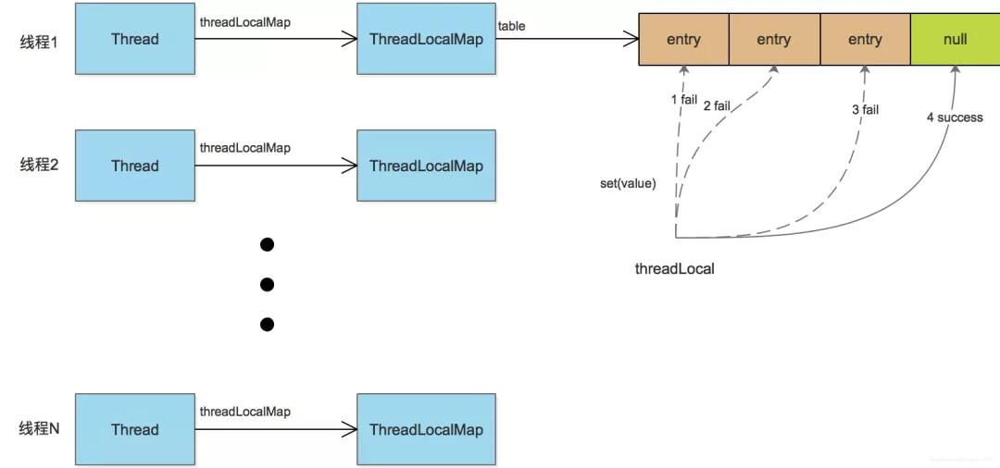

`FastThreadLocal`直接使用数组避免了hash冲突的发生，具体做法是：每一个`FastThreadLocal`实例创建时，分配一个下标index；分配index使用AtomicInteger实现，每个`FastThreadLocal`都能获取到一个不重复的下标。

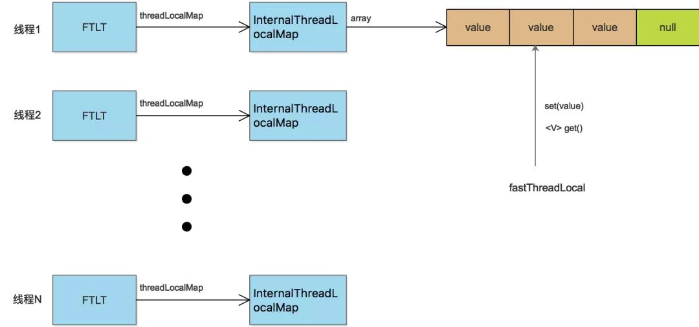

`FastThreadLocal`要结合`FastThreadLocalThread`才能最大地发挥其性能，如果是其他的普通线程，就会退化到jdk的ThreadLocal的情况，因为普通线程没有包含`InternalThreadLocalMap`这样的数据结构。

`FastThreadLocal`的速度优势主要集中在同一线程，操作**多个ThreadLocal**的时候。

### 线程相关面试题

#### 1.线程的状态又那些，状态是如何转换的？
>- 首先Thread类中的内部枚举类public enum State定义了六个状态。
    
>- NEW(新创建)：new Thread()还没有运行start()方法

>- RUNNABLE(可运行)：1、线程执行start方法后NEW进入RUNNABLE状态，
                    2、BLOCKED状态的线程获得monitor锁，BLOCKED进入到RUNNABLE状态
                    3、Object.notify()获得monitor锁、Object.notifyAll()方法获得monitor锁、join方法执行完毕、LockSupport.unpark()方法都会由WAITING/TIMEDWAITING进入RUNNABLE状态
               

>- BLOCKED(被阻塞)：1、线程进入synchronized保护的代码(代码块或者方法),没有抢到monitor锁，RUNNABLE进入到BLOCKED状态
                   2、Object.notify()未获得monitor锁、Object.notifyAll()方法未获得monitor锁、join方法执行完毕、LockSupport.unpark()方法都会由WAITING/TIMEDWAITING进入BLOCKED状态

>- WAITING(等待)：在调用Object.wait()方法、Thread.join()和LockSupport.park()方法,会使用线程由RUNNABLE进入WAITING状态

>- TIMED WAITING(等待)：在调用Object.wait(long timeout)方法、Thread.sleep(long millis)、Thread.join(long millis)、LockSupport.parkUntil(long deadline)和LockSupport.parkNanos(long nanos)方法,会使用线程由RUNNABLE进入TIMED WAITING状态

>- TERMINATED(终止)：RUNNABLE进入TERMINATED状态 1、run()方法执行完毕,线程正常退出 2、出现异常，终止run()方法


#### 2、Java线程模型

- 线程类型有哪些？

在Java中，我们平时所说的并发编程、多线程、共享资源等概念都是与线程相关的，这里所说的线程实际上应该叫作“用户线程”，而对应到操作系统，还有另外一种线程叫作“内核线程”。

用户线程位于内核之上，它的管理无需内核支持；而内核线程由操作系统来直接支持与管理。几乎所有的现代操作系统，包括 Windows、Linux、Mac OS X 和 Solaris，都支持内核线程。

- 线程模型有哪些？

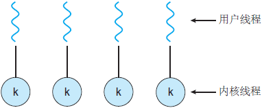

多对一线程模型，又叫作用户级线程模型，即多个用户线程对应到同一个内核线程上，线程的创建、调度、同步的所有细节全部由进程的用户空间线程库来处理。

优点：
- 用户线程的很多操作对内核来说都是透明的，不需要用户态和内核态的频繁切换，使线程的创建、调度、同步等非常快；

缺点：
- 由于多个用户线程对应到同一个内核线程，如果其中一个用户线程阻塞，那么该其他用户线程也无法执行；
- 内核并不知道用户态有哪些线程，无法像内核线程一样实现较完整的调度、优先级等；

许多语言实现的协程库基本上都属于这种方式，比如python的gevent。

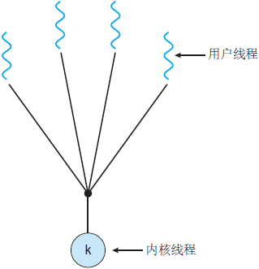

一对一模型，又叫作内核级线程模型，即一个用户线程对应一个内核线程，内核负责每个线程的调度，可以调度到其他处理器上面。

优点：
- 实现简单。

缺点：
- 对用户线程的大部分操作都会映射到内核线程上，引起用户态和内核态的频繁切换；
- 内核为每个线程都映射调度实体，如果系统出现大量线程，会对系统性能有影响；

Java使用的就是一对一线程模型，所以在Java中启一个线程要谨慎。

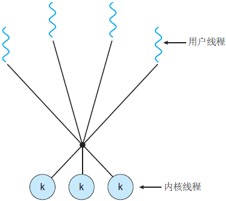

多对多模型，又叫作两级线程模型，它是博采众长之后的产物，充分吸收前两种线程模型的优点且尽量规避它们的缺点。

首先，区别于多对一模型，多对多模型中的一个进程可以与多个内核线程关联，于是进程内的多个用户线程可以绑定不同的内核线程，这点和一对一模型相似；

其次，又区别于一对一模型，它的进程里的所有用户线程并不与内核线程一一绑定，而是可以动态绑定内核线程， 当某个内核线程因为其绑定的用户线程的阻塞操作被内核调度让出CPU时，其关联的进程中其余用户线程可以重新与其他内核线程绑定运行。

多对多模型既不是多对一模型那种完全靠自己调度的也不是一对一模型完全靠操作系统调度的，而是中间态（自身调度与系统调度协同工作），因为这种模型的高度复杂性，操作系统内核开发者一般不会使用，所以更多时候是作为第三方库的形式出现。

优点：
- 兼具多对一模型的轻量；
- 由于对应了多个内核线程，则一个用户线程阻塞时，其他用户线程仍然可以执行；
- 由于对应了多个内核线程，则可以实现较完整的调度、优先级等；

缺点：
- 实现复杂。

Go语言中的goroutine调度器就是采用的这种实现方案，在Go语言中一个进程可以启动成千上万个goroutine。

### 线程池相关面试题

#### 1、为什么使用线程池,优势是什么?

线程池的工作主要是控制运行线程的数量，处理过程中将任务放入队列，然后在线程创建后启动这些任务，如果线程数量超过了最大数量，超出数量的线程排队等候，等其他线程执行完毕，再从队列中取出任务来执行。

特点：线程复用；控制最大并发数；管理线程。

优势：

> 第一：降低资源消耗。通过重复利用已创建的线程降低线程创建和销毁造成的消耗。
>
> 第二：提高响应速度。当任务到达时，任务可以不需要的等到线程创建就能立即执行。
>
> 第三：提高线程的可管理性。线程是稀缺资源，如果无限制的创建，不仅会消耗系统资源，还会降低系统的稳定性，使用线程池可以进行统一的分配，调优和监控。
>

#### 2、线程池的几个重要参数介绍?

***corePoolSize：*** 核心池的大小。在创建了线程池后，默认情况下，线程池中并没有任何线程，而是等待有任务到来才创建线程去执行任务，除非调用了prestartAllCoreThreads()或者prestartCoreThread()方法，从这2个方法的名字就可以看出，是预创建线程的意思，即在没有任务到来之前就创建corePoolSize个线程或者一个线程。默认情况下，在创建了线程池后，线程池中的线程数为0，当有任务来之后，就会创建一个线程去执行任务，当线程池中的线程数目达到corePoolSize后，就会把到达的任务放到缓存队列当中；

***maximumPoolSize：*** 线程池最大线程数。这个参数也是一个非常重要的参数，它表示在线程池中最大能维持的线程数；

***keepAliveTime：*** 表示线程没有任务执行时最多保持多久时间会终止。默认情况下，只有当线程池中的线程数大于corePoolSize时，keepAliveTime才会起作用，直到线程池中的线程数不大于corePoolSize，即当线程池中的线程数大于corePoolSize时，如果一个线程空闲的时间达到keepAliveTime，则会终止，直到线程池中的线程数不超过corePoolSize。但是如果调用了allowCoreThreadTimeOut(boolean)方法，在线程池中的线程数不大于corePoolSize时，keepAliveTime参数也会起作用，直到线程池中的线程数为0；

***unit：*** 参数keepAliveTime的时间单位，有7种取值，在TimeUnit类中有7种静态属性；

***workQueue：*** 一个阻塞队列，用来存储等待执行的任务，这个参数的选择也很重要，会对线程池的运行过程产生重大影响，一般来说，这里的阻塞队列有以下几种选择：ArrayBlockingQueue;　LinkedBlockingQueue;　SynchronousQueue;　PriorityBlockingQueue ArrayBlockingQueue和PriorityBlockingQueue使用较少，一般使用LinkedBlockingQueue和SynchronousQueue。线程池的排队策略与BlockingQueue有关；

***threadFactory：*** 线程工厂，主要用来创建线程；

***handler：*** 表示当拒绝处理任务时的策略。

#### 3、线程池默认有几种拒绝策略？

默认有四种：

| 名称 | 作用 |
| --- | --- |
| AbortPolicy | 丢弃任务并抛出RejectedExecutionException异常，默认策略 |
| DiscardPolicy | 也是丢弃任务，但是不抛出异常 |
| DiscardOldestPolicy | 丢弃队列最前面的任务，然后重新尝试执行任务（重复此过程） |
| CallerRunsPolicy | 由调用线程处理该任务 |

#### 4、JDK中默认线程池的创建有几种？

***newSingleThreadExecutor***

创建一个单线程化的Executor，即只创建唯一的工作者线程来执行任务，它只会用唯一的工作线程来执行任务，保证所有任务按照指定顺序(FIFO, LIFO,优先级)执行。如果这个线程异常结束，会有另一个取代它，保证顺序执行。单工作线程最大的特点是可保证顺序地执行各个任务，并且在任意给定的时间不会有多个线程是活动的。使用LinkedBlockingQueue阻塞队列。

***newFixedThreadPool***

创建一个定长线程池，可控制线程最大并发数，超出的线程会在队列中等待。使用LinkedBlockQueue队列。

***newCachedThreadPool***

创建一个可缓存线程池，如果线程池长度超过处理需要，可灵活回收空闲线程，若无可回收，则新建线程。线程默认存活1分钟，使用SynchronousQueue阻塞队列。

与其他Java线程池比较，当新任务到来时，线程池会创建一个线程。如果此任务没有执行完，又往线程池添加任务，线程池又会创建新的线程处理新加任务。如果有任务执行完毕，并且没超过1分钟，这时又有新任务进来，此时不会创建新线程，而是使用执行完测任务的线程进行对新任务进行处理。但是假如线程池中任务都没处理完，又有大批量的任务进来，系统会由于大量线程创建执行而瘫痪。

这种类型的线程池特点是：

- 工作线程的创建数量几乎没有限制(其实也有限制的,数目为Interger. MAX_VALUE), 这样可灵活的往线程池中添加线程。
- 如果长时间没有往线程池中提交任务，即如果工作线程空闲了指定的时间(默认为1分钟)，则该工作线程将自动终止。终止后，如果你又提交了新的任务，则线程池重新创建一个工作线程。
- 在使用CachedThreadPool时，一定要注意控制任务的数量，否则，由于大量线程同时运行，很有会造成系统瘫痪。

***newScheduledThreadPool***

创建一个定长的线程池，而且支持定时的以及周期性的任务执行，支持定时及周期性任务执行。使用DelayedWorkQueue队列。

***newSingleThreadScheduledExecutor***

创建只有一条线程的线程池，他可以在指定延迟后执行线程任务。

***newWorkStealingPool***

创建一个拥有多个任务队列（以便减少连接数）的工作窃取算法线程池。

#### 5、线程池的执行流程是什么？

- 首先检测线程池运行状态，如果不是RUNNING，则直接拒绝，线程池要保证在RUNNING的状态下执行任务。
- 如果workerCount < corePoolSize，则创建并启动一个线程来执行新提交的任务。
- 如果workerCount >= corePoolSize，且线程池内的阻塞队列未满，则将任务添加到该阻塞队列中。
- 如果workerCount >= corePoolSize && workerCount < maximumPoolSize，且线程池内的阻塞队列已满，则创建并启动一个线程来执行新提交的任务。
- 如果workerCount >= maximumPoolSize，并且线程池内的阻塞队列已满, 则根据拒绝策略来处理该任务, 默认的处理方式是直接抛异常。

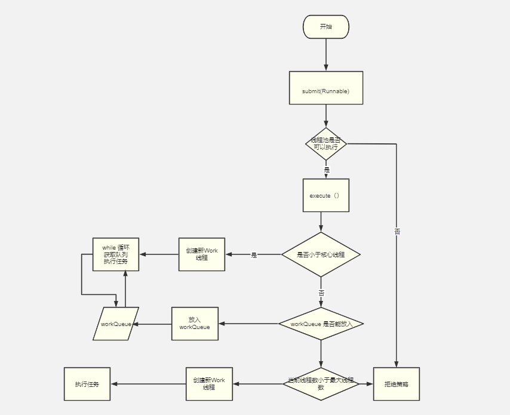

#### 6.线程池大小的设置有什么思考？

线程池需要设置合适的大小，假如设置的太大，线程上线文切换过于频繁，造成大量资源开销，反而会使性能降低。假如设置的太小，存在很多可用的处理器资源却未在工作，会造成资源的浪费和对吞吐量造成损失。

为了充分利用处理器资源，创建的线程数至少要等于处理器核心数。如果所有的任务都是计算密集型的，那么线程数等于可用的处理器核心数就可以了。不过，如果所有的任务都是IO密集型，那么处理器大部分时间是空闲的，所有要适当的增加线程数。线程等待时间所占比例越高，需要越多线程。线程运算时间所占比例越高，需要越少线程。于是可以使用下面的公式进行估算：

```
最佳线程数 = （1 + 线程等待时间/线程计算时间）* 目标CPU的使用率 * 处理器核心数
```

例如：平均每个线程计算运行时间为0.5s，而线程等待时间（非计算时间，比如IO）为1.5s，目标CPU的使用率是90%，CPU核心数为8，那么根据上面这个公式估算得到：(1 + 1.5/0.5) * 90% * 8 = 28.8。

#### 7.线程池的监控指标有哪些？

下面这些指标可以帮助我们解决大多数因为线程池而导致的问题排查。

- 线程池当前负载：当前线程数 / 最大线程数
- 线程池峰值负载：当前线程数 / 最大线程数，线程池运行期间最大的负载
- 核心线程数：线程池的核心线程数
- 最大线程数：线程池限制同时存在的线程数
- 当前线程数：当前线程池的线程数
- 活跃线程数：执行任务的线程的大致数目
- 最大出现线程数：线程池中运行以来同时存在的最大线程数
- 阻塞队列：线程池暂存任务的容器
- 队列容量：队列中允许元素的最大数量
- 队列元素：队列中已存放的元素数量
- 队列剩余容量：队列中还可以存放的元素数量
- 线程池任务完成总量：已完成执行的任务的大致总数
- 拒绝策略执行次数：运行时抛出的拒绝次数总数

当前线程数、活跃线程数、最大出现线程数、线程池任务完成总量的线程池API会先获取到`mainLock`，然后才开始计算。`mainLock`是线程池的主锁，线程执行、线程销毁和线程池停止等都会使用到这把锁。如果频繁获取这把锁，***会导致原有线程池任务执行性能受到影响***。

#### 8.如何实现线程池优先扩容最大线程数再存放队列？

默认情况是如果线程池达到核心线程数的时候，会将后面的任务存放到队列中，当队列满了之后再开启线程直至到达最大线程数。那我们看一下具体的方法：
```
int c = ctl.get();//线程池的状态控制变量
//如果当前线程小于核心线程数，则启动新线程
if (workerCountOf(c) < corePoolSize) {
    // 如果小于corePoolSize，则创建一个新的worker，创建成功返回true
    // 如果因为线程数量大于corePoolSize或者线程池即将被关闭则返回false
    if (addWorker(command, true))
        return;
    c = ctl.get();
}
// 如果线程数量大于corePoolSize
if (isRunning(c) && workQueue.offer(command)) {
    // 如果线程池正在运行且成功把任务加入到队列中
    int recheck = ctl.get();
    // 再次检查状态，如果状态不是正常运行，则将任务从队列中移除
    if (! isRunning(recheck) && remove(command))
        reject(command); // 拒绝任务
    // 如果状态是正常的，再次检查线程数，有可能之前创建的线程异常退出了
    else if (workerCountOf(recheck) == 0)
        addWorker(null, false); // 重新创建一个新Worker，线程数量不能大于maximumPoolSize
}
// 如果添加任务到队列失败，即队列满了，则尝试添加一个新的Worker
// 如果状态不是正常运行，addWorker会立即返回false
else if (!addWorker(command, false))
    // 拒绝这个任务
    reject(command);
```

由上面的代码可知，我们只需要让`workQueue.offer()`方法再未到达最大线程数的时候返回false就可以了，我们可以自己自定义一个队列继承如`LinkedBlockingQueue`类，重写`offe`方法：
```
public boolean offer(Runnable runnable) {
    if (executor == null) {
        throw new RejectedExecutionException("The task queue does not have executor!");
    }
    // 获取当前绑定的线程池当前池中的线程数
    int currentPoolThreadSize = executor.getPoolSize();
    // have free worker. put task into queue to let the worker deal with task.
    // 如果当前已提交或者正在执行的任务数量 小于 线程数 则直接将任务放入到队列中
    if (executor.getSubmittedTaskCount() < currentPoolThreadSize) {
        return super.offer(runnable);
    }
    // 如果线程数 小于 最大线程池大小（默认Integer.MAX_VALUE），则返回false，让线程池创建新的线程
    // return false to let executor create new worker.
    if (currentPoolThreadSize < executor.getMaximumPoolSize()) {
        return false;
    }
    // 如果超过了最大线程池大小，则直接丢入到队列中（默认最大线程池最大为Integer.MAX_VALUE）
    // currentPoolThreadSize >= max
    return super.offer(runnable);
}
```

典型的案例如`dubbo`中的`EagerThreadPool`线程池。

#### 9.请问线程池中一个线程处理完一个任务之后会发生上下文切换吗？

看情况，有可能会，有可能不会。

1) 线程池中的线程在处理完任务后，会从队列中获取下一个任务来处理，取任务是内存操作，这个时候没有做系统调用，所以理论上不会有上下文切换，除非正好操作系统给线程的时间片用完。

2) 发生上下文切换需要看是否发生了系统调用，比如发生IO操作或者竞争锁的时候没有竞争到，这个时候主动的park自己，都会发生发生上下文切换。比如在从队列中获取任务的时候，恰好另一个线程也在获取，导致锁竞争，那就会发生上下文切换了。

### 锁、CAS以及阻塞

#### 1.阻塞队列和非阻塞队列的区别?

阻塞队列与普通队列的区别在于，**当队列是空的时，从队列中获取元素的操作将会被阻塞，或者当队列是满时，往队列里添加元素的操作会被阻塞。试图从空的阻塞队列中获取元素的线程将会被阻塞，直到其他的线程往空的队列插入新的元素。同样，试图往已满的阻塞队列中添加新元素的线程同样也会被阻塞，直到其他的线程使队列重新变得空闲起来，如从队列中移除一个或者多个元素，或者完全清空队列。**
 
#### 2.JDK提供了哪些阻塞对了？

- ArrayBlockingQueue ：一个由数组结构组成的有界阻塞队列。
- LinkedBlockingQueue ：一个由链表结构组成的有界阻塞队列。
- PriorityBlockingQueue ：一个支持优先级排序的无界阻塞队列。
- DelayQueue：一个使用优先级队列实现的无界阻塞队列。
- SynchronousQueue：一个不存储元素的阻塞队列。
- LinkedTransferQueue：一个由链表结构组成的无界阻塞队列。
- LinkedBlockingDeque：一个由链表结构组成的双向阻塞队列。

#### 3.synchronized底层原理，wait和notify底层原理？

`synchronized`修饰的方法会给方法标做标记（修饰实例方法则锁是this，修饰静态方法则锁是当前的类对象），如果修饰的代码块则会插入字节码指令`monitorenter`和`monitorexit`，一般会生成两个`monitorenter`指令，因为有异常的情况也需要解锁，不然就死锁了。从生成的字节码我们也可以得知，为什么 synchronized 不需要手动解锁？是有人在替我们负重前行啊！编译器生成的字节码都帮咱们做好了，异常的情况也考虑到了。

`synchronized`深入到JVM层的话，与对象的对象头息息相关，这里将对象头再次展示一下。

<table>
	<tr>
		<td rowspan="2">锁状态</td>
		<td colspan="2">25bit</td>
		<td rowspan="2">4bit</td>
		<td>1bit</td>
		<td>2bit</td>
	</tr>
	<tr>
		<td>23bit</td>
		<td>2bit</td>
		<td>是否偏向锁</td>
		<td>锁标志位</td>
	</tr>
	<tr>
		<td>无锁状态</td>
		<td colspan="2">对象的hashcode</td>
		<td>分代年龄</td>
		<td>0</td>
		<td>01</td>
	</tr>
	<tr>
		<td>偏向锁</td>
		<td>线程ID</td>
		<td>Epoch</td>
		<td>分代年龄</td>
		<td>1</td>
		<td>01</td>
	</tr>
	<tr>
		<td>轻量级锁</td>
		<td colspan="4">指向栈中锁记录的指针</td>
		<td>00</td>
	</tr>
	<tr>
		<td>重量级锁</td>
		<td colspan="4">指向互斥量(重量级锁)的指针</td>
		<td>10</td>
	</tr>
	<tr>
		<td>GC标记</td>
		<td colspan="4">空</td>
		<td>11</td>
	</tr>
</table>

每一个锁都对应一个monitor对象，在HotSpot虚拟机中它是由ObjectMonitor实现的（C++实现）。每个对象都存在着一个monitor与之关联，对象与其monitor之间的关系有存在多种实现方式，如monitor可以与对象一起创建销毁或当线程试图获取对象锁时自动生成，但当一个monitor被某个线程持有后，它便处于锁定状态。

```
ObjectMonitor() {
    _header       = NULL;
    _count        = 0;  // 锁计数器
    _waiters      = 0,
    _recursions   = 0; // 记录重入次数
    _object       = NULL; // 存储锁对象，如synchroinzed(object) 这个object对象
    _owner        = NULL; // 标识当前拥有该锁的线程
    _WaitSet      = NULL; // 处于wait方法的线程，会被加入到_WaitSet
    _WaitSetLock  = 0 ;
    _Responsible  = NULL ;
    _succ         = NULL ;
    _cxq          = NULL ; // 多个线程争抢锁会先存在这个列表中
    FreeNext      = NULL ;
    _EntryList    = NULL ; // 处于等待锁block状态的线程，会被加入到该列表（它这里搞了_cxq和_EntryList两个队列）
    _SpinFreq     = 0 ;       // 注意：线程在任何时候只会出现在_cxq或者_EntryList一个队列中
    _SpinClock    = 0 ;
    OwnerIsThread = 0 ;
  }
```

这里发一下锁的状态变更图
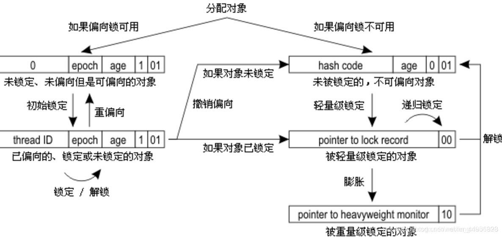

***1) 偏向锁***

> 为什么要有偏向锁？

轻量级锁优化轻微并发情况下共享数据的访问。但实际生产环境下，一段时间内同步方法只会被同一个线程多次访问，从总体看同步方法是在单线程环境中运行。如果使用轻量级锁，每次调用同步方法要通过一次CAS操作申请锁，执行完后同样通过一次CAS操作释放锁，这种CAS操作毕竟会占用CPU资源（这里说的CAS指的是轻量级锁使用CAS将`Mark Word`更新为指向锁记录的指针），所以对这种场景进行了优化，在线程A调用同步方法获取锁时，执行完成后不去释放，线程A再次进入时不需要再次获取锁，直接进入，只有当其它线程申请锁时才会释放。

原理也不难，如果当前锁对象支持偏向锁，那么就会通过`CAS`操作：将当前线程的地址记录到`markword`中，并且将标记字段的最后三位设置为`101`。之后有线程请求这把锁，只需要判断`markword`最后三位是否为`101`，是否指向的是当前线程的地址。同时还需要判断`epoch`值是否和锁对象的类中的`epoch`值相同。如果都满足，那么说明当前线程持有该偏向锁，就可以直接返回。

> 一个对象被认为已经偏向了某个线程必须满足两个条件：
> - `MarkWord`中`Thread Id`是线程T的Id；
> - `Mark Word`中的`epoch`必须是和类的`epoch`相等。

如果下一个线程要获取锁的时候，会检测对象头的`Mark Word`，如果对象是可偏向的，但是偏向线程的ID和当前要获取到偏向锁的线程ID不同，则证明这个偏向锁对象目前偏向于其他线程，需要撤销偏向锁模式。（Revoke Rebias）（注意这里是撤销，而不是解锁，因为现在需要将偏向锁的模式进行膨胀）

偏向锁的撤销是一个很特殊的操作，为了执行撤销操作，需要等待全局安全点（Safe Point），此时间点所有的工作线程都停止了字节码的执行。在进入到膨胀流程的时候，会有一个判断，判断持有这个偏向锁的线程是否正在执行同步代码块，如果持有偏向锁的线程已经执行完了，就应该将偏向锁对象的`Mark Word`置为无锁状态。但是，如果持有偏向锁的线程还没有执行完同步代码块，应该直接将这个偏向锁的膨胀为轻量锁。

后面的就是走轻量锁的逻辑了。

> 这里补充一下，为什么需要等待全局安全点（Safe Point）的时候才能进行膨胀？
> 首先这个此时间点所有的工作线程都停止了字节码的执行。
> 其次就是线程A在占用偏向锁执行同步代码块的时候，线程B也要抢占偏向锁，证明出存在多线程竞争，线程B就需要将这个偏向锁进行膨胀，这也就意味这个线程B需要操作线程A的线程栈，所以需要等待一个时间点，让线程B来操作，这个时间点就是`stop the world`的时候，没有字节码执行的时候。

> 偏向锁膨胀具体流程：

当线程A在通过CAS方式获取偏向锁对象的时候，会在线程A的栈帧中建立一个锁记录（`Lock Record`）。

如果线程B在进行抢占，所以需要撤销偏向锁模式，在全局安全点的时候，如果发现线程A持有偏向锁，但是还没有执行完同步代码块，线程B会遍历线程A里面的栈帧，查找到所有与当前偏向锁对象相关联的锁记录（Lock Record），修改这些锁记录（Lock Record）里的内容为轻量级锁的内容，然后把`最老的`（oldest、栈帧）一个锁记录（`Lock Record`）的指针写到锁对象的`Mark Word`里，就好像是原来从没有使用过偏向锁，使用的一直是轻量级锁一样。

至于为什么是最老的，因为A有可能重入了很多次，则栈帧中记录的是个null，所以需要把“最老的”锁记录的指针写到对象的`Mark Word`里。从而B线程完成了锁膨胀的流程。

> 前面提的`epoch`干啥用的？

这里涉及一个知识点，在每个类中元数据中会包含一个counter和时间戳，先简单理解一下，在这个类的对象，每次偏向锁的在执行一次撤销的时候，都会将counter增加，时间戳用来记录上次执行批量再偏向（`Bulk Rebias`）的时间。

也可以简单理解为是第几代偏向锁。偏向锁在有竞争的时候是要执行撤销操作的，其实就是要升级成轻量级锁。而当一类对象撤销的次数过多，次数到了一定阈值(`-XX:BiasedLockingBulkRebiasThreshold`，默认为`20`，如果每25s的撤销操作小于20，执行批量重偏向，如果超过`-XX:BiasedLockingBulkRevokeThreshold`默认值`40`，则废弃此类的偏向功能，也就是说这个类都无法偏向了)就会把这一代的偏向锁废弃，把类的`epoch`加一。

所以当类对象和锁对象的`epoch`值不等的时候，当前线程可以将该锁重偏向至自己，因为前一代偏向锁已经废弃了。

偏向模式不适合直接就膨胀为轻量锁的逻辑了。如果偏向模式适合，那么就需要重偏向，但是如果遍历堆的话，会非常慢且耗费性能，然后就引出了个`epoch`概念，更新类的`epoch`，和那些拿到偏向锁对象的线程的`epoch`，其余的线程再次要拿取偏向锁的时候发现类的`epoch`和偏向锁的`epoch`不同，说明是执行了批量重偏向的操作，这个时候就可以重偏向，将偏向锁的`Thread Id`置为当前线程的Id。

***2) 轻量级锁***

> 首先是为什么要引入轻量级锁？

JDK1.6之前，JVM是没有轻量级锁和偏向锁这一特征的。

1. 为了解决`synchronized`性能低效的问题，才引入了轻量级锁。其实轻量锁就是为了解决`synchronized`中`Monitor`那种模式下，每次进入`synchronized`都要创建一个`MonitorObject`对象，这在已经确定是多线程访问的条件下是没有什么问题的，但是在真实生产环境下，并不是一直处于多线程竞争的，而是处于低竞争的状态，所以就发明出了轻量锁这种机制，大多数情况下线程A会先访问同步代码块，线程A访问完毕后线程B才会访问同步代码块，他们之间的访问类似于交替访问，并没有竞争问题，如果有竞争也只是轻微的竞争，只是几个线程之间竞争进入同步代码块，这时如果使用`Monitor`机制会显得大材小用，浪费空间。

2. 重量级锁会涉及到有用户态切换到内核态进行线程的阻塞和唤醒操作，然后再切换到用户态，这些操作给系统的并发性能带来了很大的压力，有些时候锁定状态可能只会持续很短的一段时间，为了这段时间去挂起和恢复线程并不值得，在申请锁资源时通过一个CAS操作即可获取，释放锁资源时也是通过一个CAS操作即可完成，CAS是一种乐观锁的实现，其开销显然要比互斥开销小很多。

简单说一下就是：<font color="blue">**如果多个线程都是在不同的时间段来请求同一把锁，此时根本就用不需要阻塞线程，连`monitor`对象都不需要，所以就引入了轻量级锁这个概念，避免了系统调用，减少了开销。**</font>

> 轻量级锁加锁过程

- 1、首先在进入同步块的线程会在当前栈帧中创建一个锁记录（`Lock Record`）；
- 2、拷贝锁对象头中的`Mark Word`到当前栈帧中的锁记录（`Lock Record`）中；
- 3、将`Mark Word`拷贝到`Lock Record`中完成后，尝试使用`CAS`将`Mark Word`更新为指向锁记录的指针，并将`Lock record`里的`owner`指针指向`object mark word`，如果更新成功，当前线程就获得了锁，同时更新锁标志位为`00`，表示当前对象处于轻量级锁状态。
- 4、如果更新失败，说明这时有两个线程，线程A在进行拷贝并修改锁对象的`Mark Word`的指针的时候，有另外一个线程B也想修改`Mark Word`的指针为线程B的`Lock Record`，所以只会有一个成功的，另外一个就会失败，成功的就是获取到轻量锁的线程，失败的就是没有获取到锁的线程。失败的时候，jvm会先检查这个轻量锁的`Mark Word`的指针是否指向当前线程的某个锁记录，如果是则说明当前线程已经拥有了这个轻量锁，可以直接执行同步块，这是重入锁特性，不是则说明其有其它线程抢占了锁，存在竞争。
- 5、在存在竞争的条件下，轻量锁会立即膨胀（发现存在大量线程竞争，需要增加锁的强度，保证多线程同步）为重量锁，如果升级到重量级锁之后并不，会进行一段时间的自旋争抢到锁（JDK8，源码synchronizer.cpp中）通过自适应自旋（自旋的次数考虑上一次获取到所自旋的次数）如果还未获取到所，则线程入队并阻塞。

> 轻量级锁解锁过程

- 1、在没有竞争的情况下，当持有轻量锁的线程执行完同步方法后，会通过一次CAS操作将当前栈帧中的`Lock Record`重置，置回到之前的轻量锁的对象头的`Mark Word`中，如果重置成功，则释放锁完成。
- 2、但是如果有其他线程在竞争该轻量锁，而且其他竞争的线程在多次自旋后依然无法对象头的指针，那么就会将这个轻量锁膨胀为重量锁。竞争的线程会修改`Mark Word`的锁标识为重量锁的10，然后这个竞争线程就会被阻塞。
- 3、在持有这个轻量锁的线程执行完同步方法后，在通过CAS重置轻量锁的对象头的时候发现，自己的`Lock Record`和轻量锁的对象头不同，因为轻量锁的锁标识已经被其他线程的修改为重量锁标识，所以在释放锁的同时，会唤醒正在等待该轻量锁的而阻塞的线程。

***3) 重量级锁***

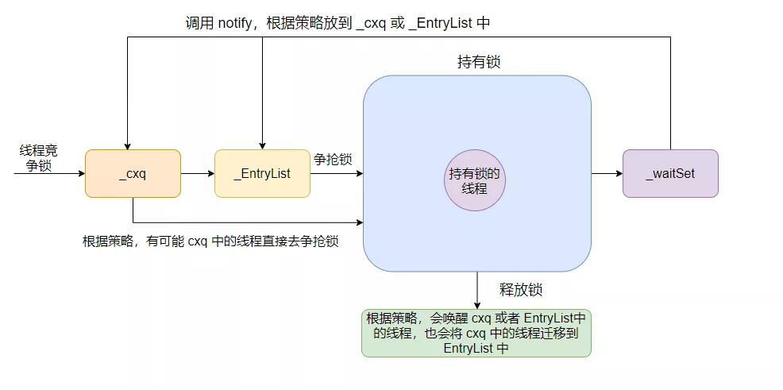
 
 先介绍`ObjectMonitor`中几个相关的属性：
 
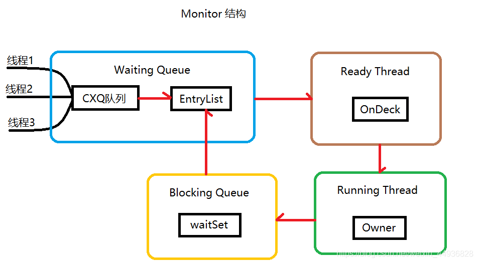
 
- CXQ队列（_cxq）：竞争队列，所有请求锁的线程首先会被放在这个队列中（单向链接）
- EntryList：CXQ队列中有资格成为候选资源的线程会被移动到该队列中
- OnDeck：任何时刻最多只能有一个线程正在竞争锁，该线程称为OnDeck
- Owner：获得锁的线程称为Owner。初始时为NULL，当有线程占有该monitor的锁的时候，Owner标记为该线程的唯一标识，当线程释放monitor时，Owner又恢复为NULL。
- WaitSet：如果Owner线程被wait方法阻塞，则转移到WaitSet队列

注：每个等待锁的线程都会被封装成`ObjectWaiter`对象，保存了Thread（当前线程）以及当前的状态ThreadState等数据。

> CXQ队列

这个CXQ队列是一个临界资源，并不是一个真正的Queue，只是一个虚拟队列，是由Node及其next指针逻辑构成，是一个后进先出（LIFO）的队列（栈），每次新加入Node时都会在队头进行，通过CAS改变第一个节点的的指针为新增节点（新线程），同时设置新增节点的next指向后续节点。通过这种方式减轻了队列取数据时的争用问题。而且该结构是个Lock-Free的队列无锁队列（实际上就是通过CAS不断的尝试来实现的）。

> EntryList

获得锁得到执行权力的Owner线程在释放锁时会从CXQ队列或EntryList中挑选一个线程唤醒，到底唤醒哪个取决于Monitor的策略（1.可以直接绕过EntryList直接将线程放到OnDeck中。2.将线程插入到EntryList尾部。3.将线程插入到EntryList头部），并会指定EntryList中的某个线程（一般为Head）为Ready（OnDeck）线程（被选中的线程叫做Heir presumptive即假定继承人）。但是并不会把锁传递给 OnDeck线程，只是把竞争锁的权利交给OnDeck（synchronized是非公平的，所以不一定能获得锁），OnDeck线程需要重新竞争锁。这样做虽然牺牲了一定的公平性，但极大的提高了整体吞吐量，在 Hotspot中把OnDeck的选择行为称之为“竞争切换”。这里存储的线程对应java线程状态的Blocked状态。

> Owner

OnDeck线程获得锁后即变为Owner线程，获得执行的权限，无法获得锁则会依然留在EntryList中，在EntryList中的位置不 发生变化。

> WaitSet

如果Owner线程被wait方法阻塞，则转移到WaitSet队列。当wait的线程在某个时刻被notify/notifyAll之后，会将对应的ObjectWaiter从WaitSet移动到EntryList或CXQ队列中（到底如何移动同样取决于Monitor的策略，1.可能将WaitSet队列中的对象头插入EntryList队列中，2.可能将WaitSet队列中的对象尾插入EntryList队列中，3.可能将WaitSet队列中的对象头插入CXQ队列中，4.可能将WaitSet队列中的对象尾插入cxq队列中）

WaitSet存放的是处于等待状态的线程，这些线程在等待某种特定的条件变成真，所以又称为条件队列。这个`Monitor`的`wait`/`notify`/`notifyAll`方法实际上是为上层提供的操作API。所以要调用这个条件队列的方法，必须先拿到这个`Monitor`，相应的，对于同步方法或者同步代码块中，就会有一个推论就是“wait/notify/notifyAll方法只能出现在相应的同步块或同步方法中”。如果不在同步方法或同步块中，运行时会报IllegalMonitorStateException。

> 重量级锁加锁过程

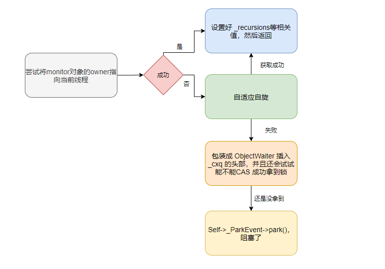

- 1、尝试将Monitor对象的`_owner`通过CAS操作指向当前线程，如果成功，则设置`_recursions`值为1，如果是重入锁，则将`_recursions++`；
- 2、如果CAS失败，则尝试通过自旋来获取锁；
- 3、如果自旋未获取到锁，则将当前获取锁的线程包装成ObjectWaiter对象，插入到`_cxq`队列的头部，并且还会试试能不能CAS成功获取到锁；
- 4、如果还是失败，则看看`_Responsible`指针是否为NULL，如果这个指针为 NULL，表示之前对象锁还没有等待线程，也就是说当前线程是第一个等待线程，这个时候通过`cas`操作将`_Responsible`指向`Self`。接下来会执行退避算法，进行一个短时间的阻塞等待。这个算法很简单，第一次等待`1 ms`，第二次等待`8 ms`，第三次等待`64 ms`，以此类推，直到达到等待时长的上限 `1000 ms`，也就是说在`synchronize`在一个对象锁上的线程，如果它是第一个等待线程的话，那么它会不停滴休眠、检查锁，休眠的时间由刚才的退避算法指定。如果当前线程不是第一个等待线程，那么只能执行无限期的休眠，一直等待对象锁的`exit`函数执行唤醒才行；
- 5、如果不是第一个等待线程，则调用`Self->_ParkEvent->park()`方法对当前获取锁的线程进行休眠。

> 重量级锁解锁过程

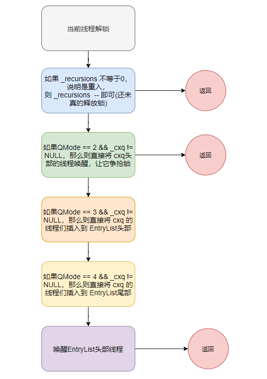

- 1、如果`_recursions`不等于0，说明是重入锁，则直接将`_recursions--`就行了；
- 2、根据`Knob_QMode`的值（默认值0）和`_cxq`是否为空执行不同策略。如果`_EntryList`不为NULL，则直接唤醒头节点。如果为NULL，首先将`_cxq`指针赋值给`_EntryList`，然后通过一个循环将原本单向链表的`_cxq`链表变成双向链表，再唤醒头节点。

> 重量级锁的缺点：

由于java的线程是映射到操作系统原生线程之上的，所以线程在放入队列里面的时候是需要阻塞的，在WaitSet里面的线程是需要唤醒的，这时阻塞/唤醒就会产生问题，因为阻塞/唤醒是需要调用Linux内核的命令，但是运行的线程是在jvm虚拟机上，这个时候就会存在操作系统用户态和内核态的转换。

当用户态程序在执行系统调用的时候会切换到内核态, 并跳到位于内存指定位置的指令（这些指令是操作系统的一部分, 他们具有内存保护, 不可被用户态程序访问），内核会执行程序请求的服务，系统调用完成后, 操作系统会返回系统调用的结果。

因为用户态与内核态都有各自专用的内存空间，专用的寄存器等，用户态切换至内核态需要传递许多变量、参数给内核，同时内核还需要保护好用户态在切换时的一些寄存器值、变量等，以备内核态切换回用户态继续工作。而转换状态是需要消耗很多时间的，有可能比用户执行代码的时间还要长。这就是说为什么synchronized未优化之前，效率低的原因。

> 重量级锁降级

大多数文章都说锁只能升级不能降级，其实重量级锁是可以降级的，重量级锁降级发生于STW阶段，如果这个时候没有任何竞争，就可以退回到不可偏向的无锁状态，然后在进行轻量锁的加锁和解锁过程。

虽然说重量锁可以降级为轻量锁的流程，但是如果频繁的升降级的话会对jvm造成性能影响（因为发生在STW阶段）。

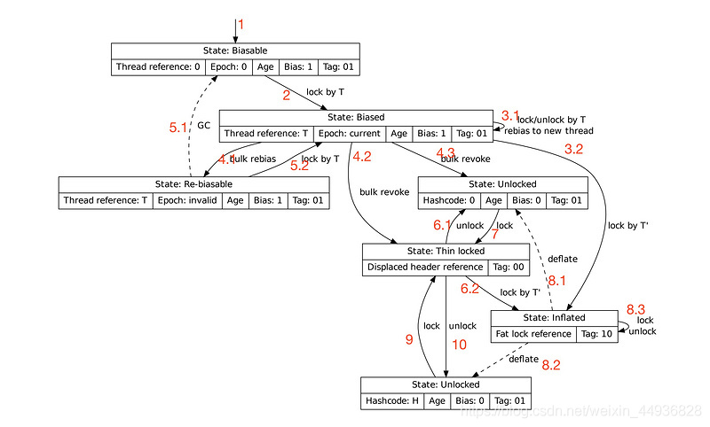

> 为什么会有_cxq 和 _EntryList 两个列表来放线程？

因为会有多个线程会同时竞争锁，所以搞了个`_cxq`这个单向链表基于CAS来hold住这些并发，然后另外搞一个`_EntryList`这个双向链表，来在每次唤醒的时候搬迁一些线程节点，降低`_cxq`的尾部竞争。

为什么会降低？因为根据默认策略，如果`_EntryList`中有等待线程的话，会优先唤醒此队列中的线程。这样子唤醒和锁竞争就不会同时在一个队列中竞争。

***4) wait底层原理***

如果线程获得锁后调用`Object#wait`方法，则会将线程加入到`_WaitSet`中。需要注意的是，当调用一个锁对象的`wait`或`notify`方法时，**如当前锁的状态是偏向锁或轻量级锁则会先膨胀成重量级锁**。

***5) notify底层原理***

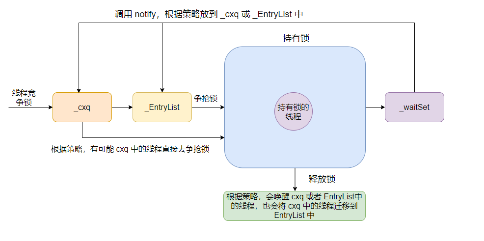

当被`Object#notify`唤醒后，会将线程从`_WaitSet`头部拿节点，根据策略移动到`_cxq`或`_EntryList`中去，然后再执行`ObjectMonitor::exit`方法来释放锁并唤醒等待的线程。

#### 4.阻塞队列是怎么实现阻塞的？

java的concurrent包下的常见的阻塞队列主要有`LinkedBlockingQueue`、`ArrayBlockingQueue`、`PriorityBlockingQueue`以及`DelayQueue`等，其底层主要通过`ReentrantLock`来实现。通过重入锁的`lock`和其条件等待对象`Condition`的`await`、`singal`等方法来实现阻塞和唤醒。

#### 5.ReentrantLock底层原理

ReentrantLock(可重入互斥锁)。可重入锁又名递归锁，是指在同一个线程在外层方法获取锁的时候，再进入该线程的内层方法会自动获取锁（前提锁对象得是同一个对象或者class），不会因为之前已经获取过还没释放而阻塞。

ReentrantLock主要利用CAS+AQS队列来实现。它支持公平锁和非公平锁（默认非公平锁），两者的实现类似。公平锁和非公平锁不同之处在于，公平锁在获取锁的时候，不会先去通过方法`compareAndSetState()`检查锁的状态，而是直接执行`acquire(1)`。

AQS使用一个FIFO的队列表示排队等待锁的线程，队列头节点称作“哨兵节点”或者“哑节点”，它不与任何线程关联。其他的节点与等待线程关联，每个节点维护一个等待状态waitStatus。

ReentrantLock的基本实现可以概括为：先通过CAS尝试获取锁。如果此时已经有线程占据了锁，那就加入AQS队列并且被挂起。当锁被释放之后，排在CLH队列队首的线程会被唤醒，然后CAS再次尝试获取锁。在这个时候，如果：
- 非公平锁：如果同时还有另一个线程进来尝试获取，那么有可能会让这个线程抢先获取；
- 公平锁：如果同时还有另一个线程进来尝试获取，当它发现自己不是在队首的话，就会排到队尾，由队首的线程获取到锁。

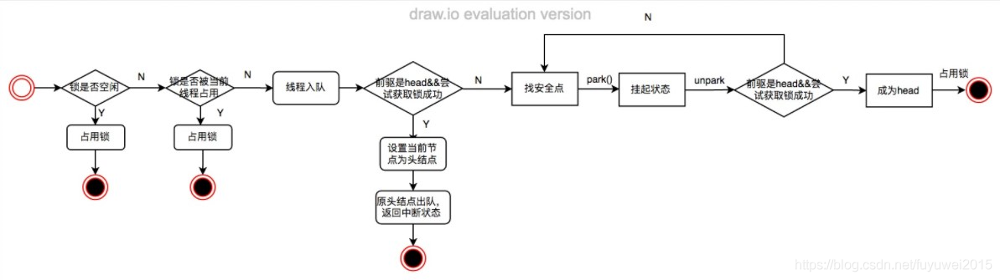

#### 6.ReentrantLock和Synchronized的区别？

- `Synchronized`是依赖于JVM实现的，而`ReentrantLock`是API实现的。
- 在`Synchronized`优化以前，`synchronized`的性能是比`ReentrantLock`差很多的，但是自从`Synchronized`引入了偏向锁，轻量级锁（自旋锁）后，两者性能就差不多了。
- `Synchronized`的使用比较方便简洁，它由编译器去保证锁的加锁和释放。而`ReentrantLock`需要手工声明来加锁和释放锁，最好在finally中声明释放锁。
- `ReentrantLock`可以指定是公平锁还是⾮公平锁。⽽`synchronized`只能是⾮公平锁。
- `ReentrantLock`可响应中断、可轮回，而`Synchronized`是不可以响应中断的。

#### 7.说说AQS的底层原理

> 什么是AQS

AQS即`AbstractQueuedSynchronizer`,是一个用于构建锁和同步器的框架。它能降低构建锁和同步器的工作量，还可以避免处理多个位置上发生的竞争问题。在基于AQS构建的同步器中，只可能在一个时刻发生阻塞，从而降低上下文切换的开销，并提高吞吐量。

AQS支持独占锁（exclusive）和共享锁(share)两种模式：
- 独占锁：只能被一个线程获取到(`ReentrantLock`)
- 共享锁：可以被多个线程同时获取(`CountDownLatch`,`ReentrantReadWriteLock`)

无论是独占锁还是共享锁，本质上都是对AQS内部的一个变量state的获取。state是一个原子的int变量，用来表示锁状态、资源数等。

> AQS内部的数据结构与原理

AQS内部实现了两个队列，一个同步队列（名字叫CLH队列），一个条件队列（`ConditionObject`对象）：

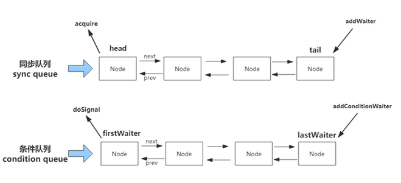

同步队列的作用：当线程获取资源失败之后，就进入同步队列的尾部保持自旋等待，不断判断自己是否是链表的头节点，如果是头节点，就不断尝试获取资源，获取成功后则退出同步队列。
条件队列的作用：为Lock实现的一个基础同步器，并且一个线程可能会有多个条件队列，只有在使用了Condition才会存在条件队列。

> AQS独占锁获取流程

- 1、基于AQS实现的子类实现`tryAcquire`方法，并尝试获取锁；
- 2、如果获取成功，则更改`state`状态并退出；
- 3、如果获取锁失败，则把当前节点通过`addWaiter`方法包装成node节点插入队列。如果尾节点为空或者CAS操作失败则调用`enq`方法保证成功插入到队列，若节点为空则初始化头节点；
- 4、`acquireQueued`方法，入队后的节点继续获取锁（此节点的前置节点是头节点）或者挂起；
- 5、如果是头节点，则通过`tryAcquire`方法尝试获取锁；
- 5、如果非头结点，通过`shouldParkAfterFailedAcquire`判断节点是否应该挂起，如果当前节点的前置节点是`signal`状态，则返回true,可以挂起。如果当前节点的前置节点是`cancelled`，则队列会从当前节点的前一个节点开始从后向前遍历跳过`cancelled`状态的节点，将当前节点和`非cancelled`状态的节点连接起来，返回false,不可以挂起。否则将前置节点等待状态设置为`SIGNAL`，返回false,不可以挂起。
- 6、如果是头结点，并且通过`tryAcquire`方法获取成功锁，则将其后继节点设置为头结点，并且返回true。
- 7、如果挂起的线程被唤醒，则继续从第五步开始。

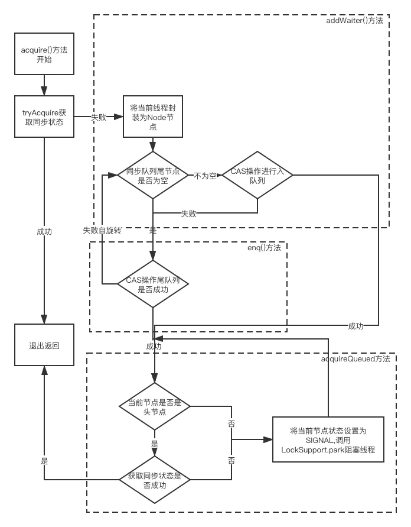

> AQS共享锁获取流程

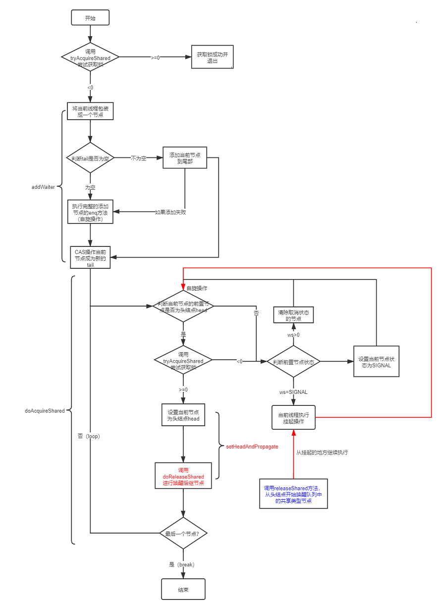

- 1、基于AQS实现的子类实现`tryAcquireShared`方法，并尝试获取锁；
- 2、如果获取锁成功，则更改`state`中共享锁部分+1，并直接退出；
- 3、如果获取失败，则把当前节点通过`addWaiter`方法包装成node节点插入队列。如果尾节点为空或者CAS操作失败则调用`enq`方法保证成功插入到队列，若节点为空则初始化头节点；
- 4、如果是头节点，则通过`tryAcquireShared`方法，尝试获取锁；
- 5、如果获取资源大于等于0，说明获取成功，则把把当前节点设置成head节点，并传播唤醒后面的节点，并返回；
- 6、如果小于0，则通过`shouldParkAfterFailedAcquire`方法判断节点是否应该挂起，如果当前节点的前置节点是`signal`状态，则返回true,可以挂起。如果当前节点的前置节点是`cancelled`，则队列会从当前节点的前一个节点开始从后向前遍历跳过`cancelled`状态的节点，将当前节点和`非cancelled`状态的节点连接起来，返回false,不可以挂起。否则将前置节点等待状态设置为`SIGNAL`，返回false,不可以挂起。
- 7、如果挂起的线程被唤醒，则继续从第四步开始。

#### 8.CAS的底层实现原理

我们在使用`AtomicInteger`的`compareAndSet(int expect, int update)`方法实际是调用的`Unsafe`类的`compareAndSwapInt(Object o, long offset, int expected, int x)`方法，此方法是`native`的方法。可以去`hotspot\src\share\vm\prims\unsafe.cpp`文件中查看：

```
UNSAFE_ENTRY(jboolean, Unsafe_CompareAndSwapInt(JNIEnv *env, jobject unsafe, jobject obj, jlong offset, jint e, jint x))
  UnsafeWrapper("Unsafe_CompareAndSwapInt");
  oop p = JNIHandles::resolve(obj);
  jint* addr = (jint *) index_oop_from_field_offset_long(p, offset);
  return (jint)(Atomic::cmpxchg(x, addr, e)) == e;
UNSAFE_END
```

这里最终会调用`Atomic`的`cmpxchg`方法，在文件`hotspot\src\share\vm\runtime\atomic.cpp`的一开头：
```
jbyte Atomic::cmpxchg(jbyte exchange_value, volatile jbyte* dest, jbyte compare_value) {
  assert(sizeof(jbyte) == 1, "assumption.");
  uintptr_t dest_addr = (uintptr_t)dest;
  uintptr_t offset = dest_addr % sizeof(jint);
  volatile jint* dest_int = (volatile jint*)(dest_addr - offset);
  jint cur = *dest_int;
  jbyte* cur_as_bytes = (jbyte*)(&cur);
  jint new_val = cur;
  jbyte* new_val_as_bytes = (jbyte*)(&new_val);
  new_val_as_bytes[offset] = exchange_value;
  while (cur_as_bytes[offset] == compare_value) {
    jint res = cmpxchg(new_val, dest_int, cur);
    if (res == cur) break;
    cur = res;
    new_val = cur;
    new_val_as_bytes[offset] = exchange_value;
  }
  return cur_as_bytes[offset];
}
```

真正的核心代码在`while`循环的`cmpxchg(new_val, dest_int, cur)`方法中。在`hotspot\src\share\vm\runtime\atomic.inline.hpp`中会根据不同的平台调用不同的`cmpxchg`实现。这里举例`linux_x86`平台（`src\os_cpu\linux_x86\vm\atomic_linux_x86.inline.hpp`）：

```
inline jint     Atomic::cmpxchg    (jint     exchange_value, volatile jint*     dest, jint     compare_value) {
  int mp = os::is_MP();
  __asm__ volatile (LOCK_IF_MP(%4) "cmpxchgl %1,(%3)"
                    : "=a" (exchange_value)
                    : "r" (exchange_value), "a" (compare_value), "r" (dest), "r" (mp)
                    : "cc", "memory");
  return exchange_value;
}
```

其中`__asm__ volatile`指示了编译器不要改动优化后面的汇编语句，如果进行了优化(优化是为了减少访问内存，直接通过缓存，加快取读速度)，那么就在这段函数的周期内，某几个变量就相当于常量了，其值可能会与内存中真实的值有差异。

按照上面的源码：`exchange_value`是`%1`，`dest`是`%3`。`r`代表任意一个寄存器，`a`代表`eax`寄存器。`os::is_MP`标识否是是多核，如果是多核的话，还需要添加`lock`指令，这样就能确保在多处理器系统或多线程竞争的环境下互斥地使用这个内存地址。当指令执行完毕，这个锁定动作也就会消失。`LOCK_IF_MP`是宏定义，内容是`#define LOCK_IF_MP(mp) "cmp $0, " #mp "; je 1f; lock; 1: "`，

`cc`表示内联汇编代码修改了标志寄存器，而`memory`则通知`GCC`当前内联汇编语句可能会对某些寄存器或内存进行修改，希望`GCC`在编译时能够将这一点考虑进去。

```
%0："=a" (exchange_value) // 第1个输出参数。cmpxchgl指令执行结束后，将寄存器eax的值保存到exchange_value，在方法执行结束后返回
%1："r" (exchange_value) //  第1个输入参数。编译器会选择任意一个可用的寄存器来存储exchange_value，例如使用寄存器ecx。
%2："a" (compare_value) // 第2个输入参数。使用寄存器eax来存储待比较的值compare_value，执行cmpxchgl指令时会用到寄存器eax。
%3："r" (dest) // 第3个输入参数。编译器会选择任意一个可用的寄存器来存储目标地址dest，例如使用寄存器edx。
%4："r" (mp) //  第4个输入参数。编译器会选择任意一个可用的寄存器来存储多处理器标志
```

最终代码为：
```
    cmp $0, %4;
    je 1f;
    lock;
1:  cmpxchgl %1,(%3)
```

奇怪的是`%2`没有用上，需要查证`cmpxchgl`的用法，它用到了一个隐含的操作数，即`eax`。在前面的输入操作数中，对应的`%2`没有在汇编模板里出现，但通过修饰符`a`把它存放到了`eax`寄存器，因此这里被`cmpxchg`指令隐含使用。

指令`cmpxchg`比较`eax`(也就是`compare_value`)与`dest`的值。如果相等，那么将`exchange_value`的值赋值给`dest`；否则，将`dest`的值赋值给`eax`。（`cmpxchgl`其中的`l`表示操作数是4个字节，指令其实还是`cmpxchg`）

根据上面的汇编指令为，整个`cmpxchg()`方法的逻辑为：
- 首先，使用`cmp`指令比较入参`mp`的值是否为0。
- 然后，使用`je`指令根据比较的结果进行跳转。
- 如果`cmp`比较结果相等，则跳到1的位置继续执行，即执行`cmpxchgl`指令。
- 如果`cmp`比较结果不相等，则简单的往后执行。即先执行`lock`指令，再执行`cmpxchgl`指令。

显然，当mp的值为1时（多处理器），cmp的结果为不相等，此时会多执行一条lock前缀指令。（顺带一提：如果我们对一个变量使用volatile修饰符，汇编中也会增加lock指令前缀以保证该变量线程可见性和指令执行有序性）

#### 9.volatile关键字底层实现

`volatile`关键字不能保证原子性和有序性，只保证可见性。所谓可见性是指A线程执行的变量修改，B线程会立即看到，注意B看到A修改后的变量是在B重新读取该变量时，如果在此之前B准备写入B修改后的变量结果，则B会覆盖掉A线程修改的结果从而看不到A修改的结果。

以`volatile`修饰的静态变量为例，从`javap`的输出来看，`volatile`和`非volatile`变量没有任何区别。并没有专门针对volatile变量的特殊字节码指令，其处理逻辑还是在属性读写的字节码指令中，相关的指令有四个，`_getstatic`/`_putstatic`，`_getfield`/`_putfield`。

`hotspot/src/cpu/x86/vm/templateTable_x86_64.cpp`文件中的`void TemplateTable::getfield_or_static`方法可以看到没有任何相关的对于volatile变量的读并没有什么特殊处理。

`void TemplateTable::putfield_or_static`是对静态变量和属性进行赋值设置，方法的最后会执行`volatile_barrier(Assembler::Membar_mask_bits(Assembler::StoreLoad | Assembler::StoreStore));`方法。

```
void TemplateTable::volatile_barrier(Assembler::Membar_mask_bits
                                     order_constraint) {
  if (os::is_MP()) { //如果是多处理器系统
    __ membar(order_constraint);
  }
}

void membar(Membar_mask_bits order_constraint) {
    if (os::is_MP()) {
      //只要包含StoreLoad
      if (order_constraint & StoreLoad) {
        //lock是一个指令前缀，实际执行的一条指令lock addl $0×0,(%rsp);
        lock();
        addl(Address(rsp, 0), 0);// Assert the lock# signal here
      }
    }
}
```

如果是`volatile`变量，在属性修改完成后就会执行`lock addl $0×0,(%rsp);`，为啥执行这个就可以实现可见性了？

对于`非volatile`变量，虽然通过`movl`等指令修改了某个属性，但是这个修改只是对该CPU所属的高速缓存的修改，并没有实时写回到主内存中，在某个时机下如进程由用户态切换到内核态或者这里的执行`lock`指令会将高速缓存行的修改回写到主内存中，同时通过缓存一致性协议通知其他CPU的高速缓存控制器将相关变量的高速缓存行置为无效，当其他CPU再次读取该缓存行时发现该缓存行是无效的，就会重新从主内存加载该变量到高速缓存行中，从而实现对其他CPU的可见性。

### 线程相关的编程题

#### 1.启动两个线程, 一个输出 1,3,5,7…99, 另一个输出 2,4,6,8…100 最后 STDOUT 中按序输出 1,2,3,4,5…100，要求用 Java 的 wait + notify 机制来实现。

```
import java.io.IOException;

public class ThreadOneCi {

    private static final Object WAIT_OBJECT = new Object();

    private static int count = 0;

    public static void main(String[] args) throws IOException {
        Thread s1 = new Thread(new ThreadAble());
        Thread s2 = new Thread(new ThreadAble());

        s1.start();
        s2.start();
    }

    private static class ThreadAble implements Runnable {

        @Override
        public void run() {
            while(true) {
                // 如果被唤醒，超过100不要往下走了
                if(count >= 100) {
                    break;
                }
                synchronized (WAIT_OBJECT) {
                    System.out.println(Thread.currentThread().getName() + "-" + ++count);
                    try {
                        WAIT_OBJECT.notify();
                        // 如果超过100则不要再等待了
                        if(count >= 100) {
                            break;
                        }
                        WAIT_OBJECT.wait();
                    } catch (InterruptedException e) {
                        e.printStackTrace();
                    }
                }
            }
        }
    }

}
```

### 其他

#### 1.什么是伪共享？JDK中是如何解决它的？

**什么是伪共享？**

伪共享：缓存系统中是以缓存行`（cache line）`为单位存储的，当多线程修改互相独立的变量时，如果这些变量共享同一个缓存行，就会无意中影响彼此的性能，这就是伪共享。

CPU和主内存之间有好几层缓存，因为即使直接访问主内存也是非常慢的。如果你正在多次对一块数据做相同的运算，那么在执行运算的时候把它加载到离CPU很近的地方就有意义了。

按照数据读取顺序和与CPU结合的紧密程度，CPU缓存可以分为一级缓存，二级缓存，部分高端CPU还具有三级缓存。每一级缓存中所储存的全部数据都是下一级缓存的一部分，越靠近CPU的缓存越快也越小。

**所以L1缓存很小但很快(译注：L1表示一级缓存)，并且紧靠着在使用它的CPU内核**。L2大一些，也慢一些，并且**仍然只能被一个单独的CPU核使用**。L3在现代多核机器中更普遍，仍然更大，更慢，并且**被单个插槽上的所有CPU核共享**。最后，你拥有一块主存，由全部插槽上的所有CPU核共享。**拥有三级缓存的的CPU，到三级缓存时能够达到95%的命中率，只有不到5%的数据需要从内存中查询**。

当CPU执行运算的时候，它先去L1查找所需的数据，再去L2，然后是L3，最后如果这些缓存中都没有，所需的数据就要去主内存拿。走得越远，运算耗费的时间就越长。所以如果你在做一些很频繁的事，你要确保数据在L1缓存中。

缓存系统中是以缓存行`（cache line）`为单位存储的。缓存行通常是`64字节`，并且它有效地引用主内存中的一块地址。例如一个的long类型是8字节，因此在一个缓存行中可以存8个long 类型的变量。所以，如果你访问一个long数组，当数组中的一个值被加载到缓存中，它会额外加载另外7个，以致你能非常快地遍历这个数组。事实上，你可以非常快速的遍历在连续的内存块中分配的任意数据结构。而如果你在数据结构中的项在内存中不是彼此相邻的（如链表），你将得不到免费缓存加载所带来的优势，并且在这些数据结构中的每一个项都可能会出现缓存未命中。

如果存在这样的场景，有多个线程操作不同的成员变量，但是相同的缓存行，这个时候会发生什么？。没错，伪共享`（False Sharing）`问题就发生了！


一个运行在处理器core1上的线程想要更新变量X的值，同时另外一个运行在处理器core2上的线程想要更新变量Y的值。但是，这两个频繁改动的变量都处于同一条缓存行。两个线程就会轮番发送`RFO消息`，占得此缓存行的拥有权。当core1取得了拥有权开始更新X，则core2对应的缓存行需要设为`I状态`。当core2取得了拥有权开始更新Y，则core1对应的缓存行需要设为`I状态(失效态)`。轮番夺取拥有权不但带来`大量的RFO消息`，而且如果某个线程需要读此行数据时，L1和L2缓存上都是失效数据，只有L3缓存上是同步好的数据。读L3的数据非常影响性能。更坏的情况是跨槽读取，L3都要 miss，只能从内存上加载。**表面上X和Y都是被独立线程操作的，而且两操作之间也没有任何关系。只不过它们共享了一个缓存行，但所有竞争冲突都是来源于共享**。

**因此，当两个以上CPU都要访问同一个缓存行大小的内存区域时，就会引起冲突，这种情况就叫“共享”。但是，这种情况里面又包含了“其实不是共享”的“伪共享”情况。比如，两个处理器各要访问一个word，这两个word却存在于同一个`cache line`大小的区域里，这时，从应用逻辑层面说，这两个处理器并没有共享内存，因为他们访问的是不同的内容（不同的word）。但是因为`cache line`的存在和限制，这两个CPU要访问这两个不同的word时，却一定要访问同一个cache line块，产生了事实上的“共享”。显然，由于`cache line`大小限制带来的这种“伪共享”是我们不想要的，会浪费系统资源。**

**如何避免伪共享？**

- 让不同线程操作的对象处于不同的缓存行。

可以进行缓存行填充（Padding）。例如，如果一条缓存行有64字节，而Java程序的对象头固定占8字节(32位系统)或12字节(64位系统默认开启压缩,不开压缩为16字节)，所以我们只需要填6个无用的长整型补上6*8=48字节，让不同的对象处于不同的缓存行，就避免了伪共享(64位系统超过缓存行的64字节也无所谓，只要保证不同线程不操作同一缓存行就可以)。

- 使用编译指示，强制使每一个变量对齐

强制使对象按照缓存行的边界对齐。例如可以使数据按64位对齐，那么一个缓存行只有一个可操作对象，这样发生伪共享之后，也只是对应缓存行的数据变化，并不影响其他的对象。

**JDK如何解决这个问题？**

JDK8中新增了一个注解：`@sun.misc.Contended`。加上这个注解的类会自动补齐缓存行，需要注意的是此注解默认是无效的，需要在jvm启动时设置`-XX:-RestrictContended`才会生效。`-XX:ContendedPaddingWidth=128`用来填充注解字段内部的上下填充字节数。

JDK7可以使用字段填充：
```
public final static class VolatileLong {
    public volatile long value = 0L;
    public long p1, p2, p3, p4, p5, p6;
}
```