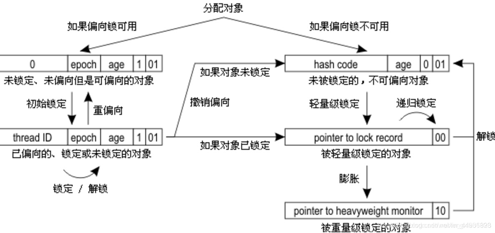
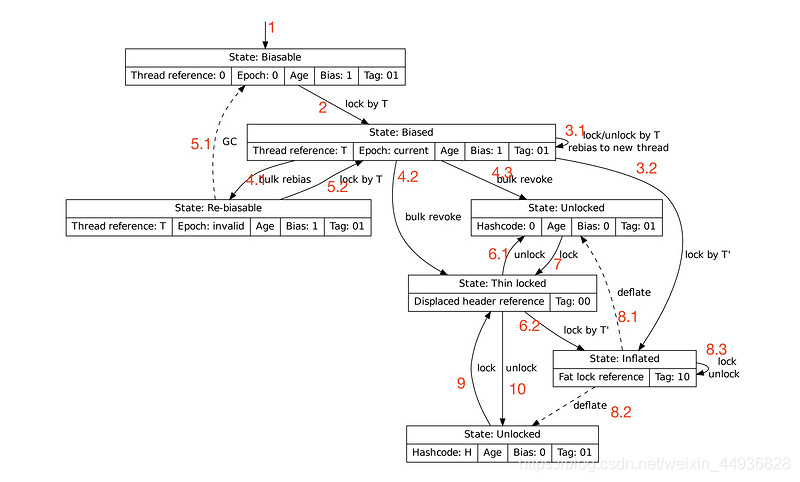
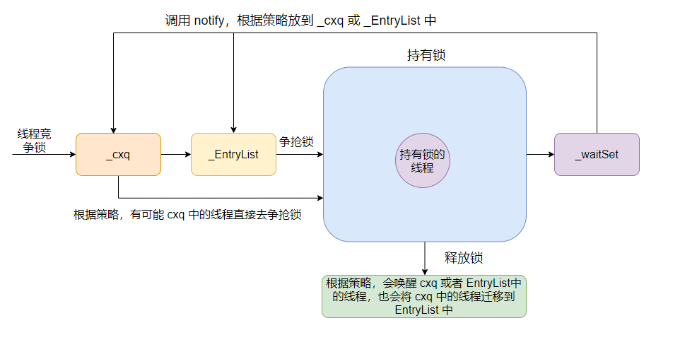

#### 1、知识点网址记录

>- wait-notify应用demo https://blog.csdn.net/jiangzhexi/article/details/81152617
>- Java并发编程之LockSupport、Unsafe详解 https://blog.csdn.net/qq_38293564/article/details/80512758
>- LockSupport解析与使用 https://blog.csdn.net/SecSF/article/details/78560013?depth_1-utm_source=distribute.pc_relevant.none-task-blog-BlogCommendFromBaidu-1&utm_source=distribute.pc_relevant.none-task-blog-BlogCommendFromBaidu-1
>- 线程池源码分析 https://www.cnblogs.com/huangjuncong/p/10031525.html
                https://blog.csdn.net/programmer_at/article/details/79799267

#### 2.线程的状态又那些，状态是如何转换的？
>- 首先Thread类中的内部枚举类public enum State定义了六个状态。
    
>- NEW(新创建)：new Thread()还没有运行start()方法

>- RUNNABLE(可运行)：1、线程执行start方法后NEW进入RUNNABLE状态，
                    2、BLOCKED状态的线程获得monitor锁，BLOCKED进入到RUNNABLE状态
                    3、Object.notify()获得monitor锁、Object.notifyAll()方法获得monitor锁、join方法执行完毕、LockSupport.unpark()方法都会由WAITING/TIMEDWAITING进入RUNNABLE状态
               

>- BLOCKED(被阻塞)：1、线程进入synchronized保护的代码(代码块或者方法),没有抢到monitor锁，RUNNABLE进入到BLOCKED状态
                   2、Object.notify()未获得monitor锁、Object.notifyAll()方法未获得monitor锁、join方法执行完毕、LockSupport.unpark()方法都会由WAITING/TIMEDWAITING进入BLOCKED状态

>- WAITING(等待)：在调用Object.wait()方法、Thread.join()和LockSupport.park()方法,会使用线程由RUNNABLE进入WAITING状态

>- TIMED WAITING(等待)：在调用Object.wait(long timeout)方法、Thread.sleep(long millis)、Thread.join(long millis)、LockSupport.parkUntil(long deadline)和LockSupport.parkNanos(long nanos)方法,会使用线程由RUNNABLE进入TIMED WAITING状态

>- TERMINATED(终止)：RUNNABLE进入TERMINATED状态 1、run()方法执行完毕,线程正常退出 2、出现异常，终止run()方法

### 线程池面试题

#### 1、为什么使用线程池,优势是什么?

线程池的工作主要是控制运行线程的数量，处理过程中将任务放入队列，然后在线程创建后启动这些任务，如果线程数量超过了最大数量，超出数量的线程排队等候，等其他线程执行完毕，再从队列中取出任务来执行。

特点：线程复用；控制最大并发数；管理线程。

优势：

> 第一：降低资源消耗。通过重复利用已创建的线程降低线程创建和销毁造成的消耗。
>
> 第二：提高响应速度。当任务到达时，任务可以不需要的等到线程创建就能立即执行。
>
> 第三：提高线程的可管理性。线程是稀缺资源，如果无限制的创建，不仅会消耗系统资源，还会降低系统的稳定性，使用线程池可以进行统一的分配，调优和监控。
>

#### 2、线程池的几个重要参数介绍?

***corePoolSize：*** 核心池的大小。在创建了线程池后，默认情况下，线程池中并没有任何线程，而是等待有任务到来才创建线程去执行任务，除非调用了prestartAllCoreThreads()或者prestartCoreThread()方法，从这2个方法的名字就可以看出，是预创建线程的意思，即在没有任务到来之前就创建corePoolSize个线程或者一个线程。默认情况下，在创建了线程池后，线程池中的线程数为0，当有任务来之后，就会创建一个线程去执行任务，当线程池中的线程数目达到corePoolSize后，就会把到达的任务放到缓存队列当中；

***maximumPoolSize：*** 线程池最大线程数。这个参数也是一个非常重要的参数，它表示在线程池中最大能维持的线程数；

***keepAliveTime：*** 表示线程没有任务执行时最多保持多久时间会终止。默认情况下，只有当线程池中的线程数大于corePoolSize时，keepAliveTime才会起作用，直到线程池中的线程数不大于corePoolSize，即当线程池中的线程数大于corePoolSize时，如果一个线程空闲的时间达到keepAliveTime，则会终止，直到线程池中的线程数不超过corePoolSize。但是如果调用了allowCoreThreadTimeOut(boolean)方法，在线程池中的线程数不大于corePoolSize时，keepAliveTime参数也会起作用，直到线程池中的线程数为0；

***unit：*** 参数keepAliveTime的时间单位，有7种取值，在TimeUnit类中有7种静态属性；

***workQueue：*** 一个阻塞队列，用来存储等待执行的任务，这个参数的选择也很重要，会对线程池的运行过程产生重大影响，一般来说，这里的阻塞队列有以下几种选择：ArrayBlockingQueue;　LinkedBlockingQueue;　SynchronousQueue;　PriorityBlockingQueue ArrayBlockingQueue和PriorityBlockingQueue使用较少，一般使用LinkedBlockingQueue和SynchronousQueue。线程池的排队策略与BlockingQueue有关；

***threadFactory：*** 线程工厂，主要用来创建线程；

***handler：*** 表示当拒绝处理任务时的策略。

#### 3、线程池默认有几种拒绝策略？

默认有四种：

| 名称 | 作用 |
| --- | --- |
| AbortPolicy | 丢弃任务并抛出RejectedExecutionException异常，默认策略 |
| DiscardPolicy | 也是丢弃任务，但是不抛出异常 |
| DiscardOldestPolicy | 丢弃队列最前面的任务，然后重新尝试执行任务（重复此过程） |
| CallerRunsPolicy | 由调用线程处理该任务 |

#### 4、JDK中默认线程池的创建有几种？

***newSingleThreadExecutor***

创建一个单线程化的Executor，即只创建唯一的工作者线程来执行任务，它只会用唯一的工作线程来执行任务，保证所有任务按照指定顺序(FIFO, LIFO,优先级)执行。如果这个线程异常结束，会有另一个取代它，保证顺序执行。单工作线程最大的特点是可保证顺序地执行各个任务，并且在任意给定的时间不会有多个线程是活动的。使用LinkedBlockingQueue阻塞队列。

***newFixedThreadPool***

创建一个定长线程池，可控制线程最大并发数，超出的线程会在队列中等待。使用LinkedBlockQueue队列。

***newCachedThreadPool***

创建一个可缓存线程池，如果线程池长度超过处理需要，可灵活回收空闲线程，若无可回收，则新建线程。线程默认存活1分钟，使用SynchronousQueue阻塞队列。

与其他Java线程池比较，当新任务到来时，线程池会创建一个线程。如果此任务没有执行完，又往线程池添加任务，线程池又会创建新的线程处理新加任务。如果有任务执行完毕，并且没超过1分钟，这时又有新任务进来，此时不会创建新线程，而是使用执行完测任务的线程进行对新任务进行处理。但是假如线程池中任务都没处理完，又有大批量的任务进来，系统会由于大量线程创建执行而瘫痪。

这种类型的线程池特点是：

- 工作线程的创建数量几乎没有限制(其实也有限制的,数目为Interger. MAX_VALUE), 这样可灵活的往线程池中添加线程。
- 如果长时间没有往线程池中提交任务，即如果工作线程空闲了指定的时间(默认为1分钟)，则该工作线程将自动终止。终止后，如果你又提交了新的任务，则线程池重新创建一个工作线程。
- 在使用CachedThreadPool时，一定要注意控制任务的数量，否则，由于大量线程同时运行，很有会造成系统瘫痪。

***newScheduledThreadPool***

创建一个定长的线程池，而且支持定时的以及周期性的任务执行，支持定时及周期性任务执行。使用DelayedWorkQueue队列。

***newSingleThreadScheduledExecutor***

创建只有一条线程的线程池，他可以在指定延迟后执行线程任务。

***newWorkStealingPool***

创建一个拥有多个任务队列（以便减少连接数）的工作窃取算法线程池。

#### 5、线程池的执行流程是什么？

- 首先检测线程池运行状态，如果不是RUNNING，则直接拒绝，线程池要保证在RUNNING的状态下执行任务。
- 如果workerCount < corePoolSize，则创建并启动一个线程来执行新提交的任务。
- 如果workerCount >= corePoolSize，且线程池内的阻塞队列未满，则将任务添加到该阻塞队列中。
- 如果workerCount >= corePoolSize && workerCount < maximumPoolSize，且线程池内的阻塞队列已满，则创建并启动一个线程来执行新提交的任务。
- 如果workerCount >= maximumPoolSize，并且线程池内的阻塞队列已满, 则根据拒绝策略来处理该任务, 默认的处理方式是直接抛异常。

### ThreadLocal解析

>- 1、应用实例:
     https://blog.csdn.net/qq_27127145/article/details/83894400

### 同步阻塞相关

#### 1.阻塞队列和非阻塞队列的区别?

阻塞队列与普通队列的区别在于，**当队列是空的时，从队列中获取元素的操作将会被阻塞，或者当队列是满时，往队列里添加元素的操作会被阻塞。试图从空的阻塞队列中获取元素的线程将会被阻塞，直到其他的线程往空的队列插入新的元素。同样，试图往已满的阻塞队列中添加新元素的线程同样也会被阻塞，直到其他的线程使队列重新变得空闲起来，如从队列中移除一个或者多个元素，或者完全清空队列。**
 
#### 2.JDK提供了哪些阻塞对了？

- ArrayBlockingQueue ：一个由数组结构组成的有界阻塞队列。
- LinkedBlockingQueue ：一个由链表结构组成的有界阻塞队列。
- PriorityBlockingQueue ：一个支持优先级排序的无界阻塞队列。
- DelayQueue：一个使用优先级队列实现的无界阻塞队列。
- SynchronousQueue：一个不存储元素的阻塞队列。
- LinkedTransferQueue：一个由链表结构组成的无界阻塞队列。
- LinkedBlockingDeque：一个由链表结构组成的双向阻塞队列。

#### 3.synchronized底层原理，wait和notify底层原理？

`synchronized`修饰的方法会给方法标做标记（修饰实例方法则锁是this，修饰静态方法则锁是当前的类对象），如果修饰的代码块则会插入字节码指令`monitorenter`和`monitorexit`，一般会生成两个`monitorenter`指令，因为有异常的情况也需要解锁，不然就死锁了。从生成的字节码我们也可以得知，为什么 synchronized 不需要手动解锁？是有人在替我们负重前行啊！编译器生成的字节码都帮咱们做好了，异常的情况也考虑到了。

`synchronized`深入到JVM层的话，与对象的对象头息息相关，这里将对象头再次展示一下。

<table>
	<tr>
		<td rowspan="2">锁状态</td>
		<td colspan="2">25bit</td>
		<td rowspan="2">4bit</td>
		<td>1bit</td>
		<td>2bit</td>
	</tr>
	<tr>
		<td>23bit</td>
		<td>2bit</td>
		<td>是否偏向锁</td>
		<td>锁标志位</td>
	</tr>
	<tr>
		<td>无锁状态</td>
		<td colspan="2">对象的hashcode</td>
		<td>分代年龄</td>
		<td>0</td>
		<td>01</td>
	</tr>
	<tr>
		<td>偏向锁</td>
		<td>线程ID</td>
		<td>Epoch</td>
		<td>分代年龄</td>
		<td>1</td>
		<td>01</td>
	</tr>
	<tr>
		<td>轻量级锁</td>
		<td colspan="4">指向栈中锁记录的指针</td>
		<td>00</td>
	</tr>
	<tr>
		<td>重量级锁</td>
		<td colspan="4">指向互斥量(重量级锁)的指针</td>
		<td>10</td>
	</tr>
	<tr>
		<td>GC标记</td>
		<td colspan="4">空</td>
		<td>11</td>
	</tr>
</table>

每一个锁都对应一个monitor对象，在HotSpot虚拟机中它是由ObjectMonitor实现的（C++实现）。每个对象都存在着一个monitor与之关联，对象与其monitor之间的关系有存在多种实现方式，如monitor可以与对象一起创建销毁或当线程试图获取对象锁时自动生成，但当一个monitor被某个线程持有后，它便处于锁定状态。

```
ObjectMonitor() {
    _header       = NULL;
    _count        = 0;  // 锁计数器
    _waiters      = 0,
    _recursions   = 0; // 记录重入次数
    _object       = NULL; // 存储锁对象，如synchroinzed(object) 这个object对象
    _owner        = NULL; // 标识当前拥有该锁的线程
    _WaitSet      = NULL; // 处于wait方法的线程，会被加入到_WaitSet
    _WaitSetLock  = 0 ;
    _Responsible  = NULL ;
    _succ         = NULL ;
    _cxq          = NULL ; // 多个线程争抢锁会先存在这个列表中
    FreeNext      = NULL ;
    _EntryList    = NULL ; // 处于等待锁block状态的线程，会被加入到该列表（它这里搞了_cxq和_EntryList两个队列）
    _SpinFreq     = 0 ;       // 注意：线程在任何时候只会出现在_cxq或者_EntryList一个队列中
    _SpinClock    = 0 ;
    OwnerIsThread = 0 ;
  }
```

这里发一下锁的状态变更图


***1) 偏向锁***

> 为什么要有偏向锁？

轻量级锁优化轻微并发情况下共享数据的访问。但实际生产环境下，一段时间内同步方法只会被同一个线程多次访问，从总体看同步方法是在单线程环境中运行。如果使用轻量级锁，每次调用同步方法要通过一次CAS操作申请锁，执行完后同样通过一次CAS操作释放锁，这种CAS操作毕竟会占用CPU资源（这里说的CAS指的是轻量级锁使用CAS将`Mark Word`更新为指向锁记录的指针），所以对这种场景进行了优化，在线程A调用同步方法获取锁时，执行完成后不去释放，线程A再次进入时不需要再次获取锁，直接进入，只有当其它线程申请锁时才会释放。

原理也不难，如果当前锁对象支持偏向锁，那么就会通过`CAS`操作：将当前线程的地址记录到`markword`中，并且将标记字段的最后三位设置为`101`。之后有线程请求这把锁，只需要判断`markword`最后三位是否为`101`，是否指向的是当前线程的地址。同时还需要判断`epoch`值是否和锁对象的类中的`epoch`值相同。如果都满足，那么说明当前线程持有该偏向锁，就可以直接返回。

> 一个对象被认为已经偏向了某个线程必须满足两个条件：
> - `MarkWord`中`Thread Id`是线程T的Id；
> - `Mark Word`中的`epoch`必须是和类的`epoch`相等。

如果下一个线程要获取锁的时候，会检测对象头的`Mark Word`，如果对象是可偏向的，但是偏向线程的ID和当前要获取到偏向锁的线程ID不同，则证明这个偏向锁对象目前偏向于其他线程，需要撤销偏向锁模式。（Revoke Rebias）（注意这里是撤销，而不是解锁，因为现在需要将偏向锁的模式进行膨胀）

偏向锁的撤销是一个很特殊的操作，为了执行撤销操作，需要等待全局安全点（Safe Point），此时间点所有的工作线程都停止了字节码的执行。在进入到膨胀流程的时候，会有一个判断，判断持有这个偏向锁的线程是否正在执行同步代码块，如果持有偏向锁的线程已经执行完了，就应该将偏向锁对象的`Mark Word`置为无锁状态。但是，如果持有偏向锁的线程还没有执行完同步代码块，应该直接将这个偏向锁的膨胀为轻量锁。

后面的就是走轻量锁的逻辑了。

> 这里补充一下，为什么需要等待全局安全点（Safe Point）的时候才能进行膨胀？
> 首先这个此时间点所有的工作线程都停止了字节码的执行。
> 其次就是线程A在占用偏向锁执行同步代码块的时候，线程B也要抢占偏向锁，证明出存在多线程竞争，线程B就需要将这个偏向锁进行膨胀，这也就意味这个线程B需要操作线程A的线程栈，所以需要等待一个时间点，让线程B来操作，这个时间点就是`stop the world`的时候，没有字节码执行的时候。

> 偏向锁膨胀具体流程：

当线程A在通过CAS方式获取偏向锁对象的时候，会在线程A的栈帧中建立一个锁记录（`Lock Record`）。

如果线程B在进行抢占，所以需要撤销偏向锁模式，在全局安全点的时候，如果发现线程A持有偏向锁，但是还没有执行完同步代码块，线程B会遍历线程A里面的栈帧，查找到所有与当前偏向锁对象相关联的锁记录（Lock Record），修改这些锁记录（Lock Record）里的内容为轻量级锁的内容，然后把`最老的`（oldest、栈帧）一个锁记录（`Lock Record`）的指针写到锁对象的`Mark Word`里，就好像是原来从没有使用过偏向锁，使用的一直是轻量级锁一样。

至于为什么是最老的，因为A有可能重入了很多次，则栈帧中记录的是个null，所以需要把“最老的”锁记录的指针写到对象的`Mark Word`里。从而B线程完成了锁膨胀的流程。

> 前面提的`epoch`干啥用的？

这里涉及一个知识点，在每个类中元数据中会包含一个counter和时间戳，先简单理解一下，在这个类的对象，每次偏向锁的在执行一次撤销的时候，都会将counter增加，时间戳用来记录上次执行批量再偏向（`Bulk Rebias`）的时间。

也可以简单理解为是第几代偏向锁。偏向锁在有竞争的时候是要执行撤销操作的，其实就是要升级成轻量级锁。而当一类对象撤销的次数过多，次数到了一定阈值(`-XX:BiasedLockingBulkRebiasThreshold`，默认为`20`，如果每25s的撤销操作小于20，执行批量重偏向，如果超过`-XX:BiasedLockingBulkRevokeThreshold`默认值`40`，则废弃此类的偏向功能，也就是说这个类都无法偏向了)就会把这一代的偏向锁废弃，把类的`epoch`加一。

所以当类对象和锁对象的`epoch`值不等的时候，当前线程可以将该锁重偏向至自己，因为前一代偏向锁已经废弃了。

偏向模式不适合直接就膨胀为轻量锁的逻辑了。如果偏向模式适合，那么就需要重偏向，但是如果遍历堆的话，会非常慢且耗费性能，然后就引出了个epoch概念，更新类的epoch，和那些拿到偏向锁对象的线程的epoch，其余的线程再次要拿取偏向锁的时候发现类的epoch和偏向锁的epoch不同，说明是执行了批量重偏向的操作，这个时候就可以重偏向，将偏向锁的`Thread Id`置为当前线程的Id。

***2) 轻量级锁***

> 首先是为什么要引入轻量级锁？

JDK1.6之前，JVM是没有轻量级锁和偏向锁这一特征的。

1. 为了解决`synchronized`性能低效的问题，才引入了轻量级锁。其实轻量锁就是为了解决`synchronized`中`Monitor`那种模式下，每次进入`synchronized`都要创建一个`MonitorObject`对象，这在已经确定是多线程访问的条件下是没有什么问题的，但是在真实生产环境下，并不是一直处于多线程竞争的，而是处于低竞争的状态，所以就发明出了轻量锁这种机制，大多数情况下线程A会先访问同步代码块，线程A访问完毕后线程B才会访问同步代码块，他们之间的访问类似于交替访问，并没有竞争问题，如果有竞争也只是轻微的竞争，只是几个线程之间竞争进入同步代码块，这时如果使用`Monitor`机制会显得大材小用，浪费空间。

2. 重量级锁会涉及到有用户态切换到内核态进行线程的阻塞和唤醒操作，然后再切换到用户态，这些操作给系统的并发性能带来了很大的压力，有些时候锁定状态可能只会持续很短的一段时间，为了这段时间去挂起和恢复线程并不值得，在申请锁资源时通过一个CAS操作即可获取，释放锁资源时也是通过一个CAS操作即可完成，CAS是一种乐观锁的实现，其开销显然要比互斥开销小很多。

简单说一下就是：<font color="blue">**如果多个线程都是在不同的时间段来请求同一把锁，此时根本就用不需要阻塞线程，连`monitor`对象都不需要，所以就引入了轻量级锁这个概念，避免了系统调用，减少了开销。**</font>

> 轻量级锁加锁过程

- 1、首先在进入同步块的线程会在当前栈帧中创建一个锁记录（`Lock Record`）；
- 2、拷贝锁对象头中的Mark Word到当前栈帧中的锁记录（`Lock Record`）中；
- 3、将`Mark Word`拷贝到`Lock Record`中完成后，尝试使用CAS将`Mark Word`更新为指向锁记录的指针，并将`Lock record`里的`owner`指针指向`object mark word`，如果更新成功，当前线程就获得了锁，同时更新锁标志位为`00`，表示当前对象处于轻量级锁状态。
- 4、如果更新失败，说明这时有两个线程，线程A在进行拷贝并修改锁对象的`Mark Word`的指针的时候，有另外一个线程B也想修改`Mark Word`的指针为线程B的`Lock Record`，所以只会有一个成功的，另外一个就会失败，成功的就是获取到轻量锁的线程，失败的就是没有获取到锁的线程。失败的时候，jvm会先检查这个轻量锁的`Mark Word`的指针是否指向当前线程的某个锁记录，如果是则说明当前线程已经拥有了这个轻量锁，可以直接执行同步块，这是重入锁特性，不是则说明其有其它线程抢占了锁，存在竞争。
- 5、在存在竞争的条件下，轻量锁会立即膨胀（发现存在大量线程竞争，需要增加锁的强度，保证多线程同步）为重量锁，如果升级到重量级锁之后并不，会进行一段时间的自旋争抢到锁（JDK8，源码synchronizer.cpp中）通过自适应自旋（自旋的次数考虑上一次获取到所自旋的次数）如果还未获取到所，则线程入队并阻塞。

> 轻量级锁解锁过程

- 1、在没有竞争的情况下，当持有轻量锁的线程执行完同步方法后，会通过一次CAS操作将当前栈帧中的`Lock Record`重置，置回到之前的轻量锁的对象头的`Mark Word`中，如果重置成功，则释放锁完成。
- 2、但是如果有其他线程在竞争该轻量锁，而且其他竞争的线程在多次自旋后依然无法对象头的指针，那么就会将这个轻量锁膨胀为重量锁。竞争的线程会修改`Mark Word`的锁标识为重量锁的10，然后这个竞争线程就会被阻塞。
- 3、在持有这个轻量锁的线程执行完同步方法后，在通过CAS重置轻量锁的对象头的时候发现，自己的`Lock Record`和轻量锁的对象头不同，因为轻量锁的锁标识已经被其他线程的修改为重量锁标识，所以在释放锁的同时，会唤醒正在等待该轻量锁的而阻塞的线程。

***3) 重量级锁***


 
 先介绍`ObjectMonitor`中几个相关的属性：
 

 
- CXQ队列（_cxq）：竞争队列，所有请求锁的线程首先会被放在这个队列中（单向链接）
- EntryList：CXQ队列中有资格成为候选资源的线程会被移动到该队列中
- OnDeck：任何时刻最多只能有一个线程正在竞争锁，该线程称为OnDeck
- Owner：获得锁的线程称为Owner。初始时为NULL，当有线程占有该monitor的锁的时候，Owner标记为该线程的唯一标识，当线程释放monitor时，Owner又恢复为NULL。
- WaitSet：如果Owner线程被wait方法阻塞，则转移到WaitSet队列

注：每个等待锁的线程都会被封装成`ObjectWaiter`对象，保存了Thread（当前线程）以及当前的状态ThreadState等数据。

> CXQ队列

这个CXQ队列是一个临界资源，并不是一个真正的Queue，只是一个虚拟队列，是由Node及其next指针逻辑构成，是一个后进先出（LIFO）的队列（栈），每次新加入Node时都会在队头进行，通过CAS改变第一个节点的的指针为新增节点（新线程），同时设置新增节点的next指向后续节点。通过这种方式减轻了队列取数据时的争用问题。而且该结构是个Lock-Free的队列无锁队列（实际上就是通过CAS不断的尝试来实现的）。

> EntryList

获得锁得到执行权力的Owner线程在释放锁时会从CXQ队列或EntryList中挑选一个线程唤醒，到底唤醒哪个取决于Monitor的策略（1.可以直接绕过EntryList直接将线程放到OnDeck中。2.将线程插入到EntryList尾部。3.将线程插入到EntryList头部），并会指定EntryList中的某个线程（一般为Head）为Ready（OnDeck）线程（被选中的线程叫做Heir presumptive即假定继承人）。但是并不会把锁传递给 OnDeck线程，只是把竞争锁的权利交给OnDeck（synchronized是非公平的，所以不一定能获得锁），OnDeck线程需要重新竞争锁。这样做虽然牺牲了一定的公平性，但极大的提高了整体吞吐量，在 Hotspot中把OnDeck的选择行为称之为“竞争切换”。这里存储的线程对应java线程状态的Blocked状态。

> Owner

OnDeck线程获得锁后即变为Owner线程，获得执行的权限，无法获得锁则会依然留在EntryList中，在EntryList中的位置不 发生变化。

> WaitSet

如果Owner线程被wait方法阻塞，则转移到WaitSet队列。当wait的线程在某个时刻被notify/notifyAll之后，会将对应的ObjectWaiter从WaitSet移动到EntryList或CXQ队列中（到底如何移动同样取决于Monitor的策略，1.可能将WaitSet队列中的对象头插入EntryList队列中，2.可能将WaitSet队列中的对象尾插入EntryList队列中，3.可能将WaitSet队列中的对象头插入CXQ队列中，4.可能将WaitSet队列中的对象尾插入cxq队列中）

WaitSet存放的是处于等待状态的线程，这些线程在等待某种特定的条件变成真，所以又称为条件队列。这个`Monitor`的`wait`/`notify`/`notifyAll`方法实际上是为上层提供的操作API。所以要调用这个条件队列的方法，必须先拿到这个`Monitor`，相应的，对于同步方法或者同步代码块中，就会有一个推论就是“wait/notify/notifyAll方法只能出现在相应的同步块或同步方法中”。如果不在同步方法或同步块中，运行时会报IllegalMonitorStateException。

> 重量级锁加锁过程


- 1、尝试将Monitor对象的`_owner`通过CAS操作指向当前线程，如果成功，则设置`_recursions`值为1，如果是重入锁，则将`_recursions++`；
- 2、如果CAS失败，则尝试通过自旋来获取锁；
- 3、如果自旋未获取到锁，则将当前获取锁的线程包装成ObjectWaiter对象，插入到`_cxq`队列的头部，并且还会试试能不能CAS成功获取到锁；
- 4、如果还是失败，则看看`_Responsible`指针是否为NULL，如果这个指针为 NULL，表示之前对象锁还没有等待线程，也就是说当前线程是第一个等待线程，这个时候通过`cas`操作将`_Responsible`指向`Self`。接下来会执行退避算法，进行一个短时间的阻塞等待。这个算法很简单，第一次等待`1 ms`，第二次等待`8 ms`，第三次等待`64 ms`，以此类推，直到达到等待时长的上限 `1000 ms`，也就是说在`synchronize`在一个对象锁上的线程，如果它是第一个等待线程的话，那么它会不停滴休眠、检查锁，休眠的时间由刚才的退避算法指定。如果当前线程不是第一个等待线程，那么只能执行无限期的休眠，一直等待对象锁的`exit`函数执行唤醒才行；
- 5、如果不是第一个等待线程，则调用`Self->_ParkEvent->park()`方法对当前获取锁的线程进行休眠。

> 重量级锁解锁过程


- 1、如果`_recursions`不等于0，说明是重入锁，则直接将`_recursions--`就行了；
- 2、根据`Knob_QMode`的值（默认值0）和`_cxq`是否为空执行不同策略。如果`_EntryList`不为NULL，则直接唤醒头节点。如果为NULL，首先将`_cxq`指针赋值给`_EntryList`，然后通过一个循环将原本单向链表的`_cxq`链表变成双向链表，再唤醒头节点。

> 重量级锁的缺点：

由于java的线程是映射到操作系统原生线程之上的，所以线程在放入队列里面的时候是需要阻塞的，在WaitSet里面的线程是需要唤醒的，这时阻塞/唤醒就会产生问题，因为阻塞/唤醒是需要调用Linux内核的命令，但是运行的线程是在jvm虚拟机上，这个时候就会存在操作系统用户态和内核态的转换。

当用户态程序在执行系统调用的时候会切换到内核态, 并跳到位于内存指定位置的指令（这些指令是操作系统的一部分, 他们具有内存保护, 不可被用户态程序访问），内核会执行程序请求的服务，系统调用完成后, 操作系统会返回系统调用的结果。

因为用户态与内核态都有各自专用的内存空间，专用的寄存器等，用户态切换至内核态需要传递许多变量、参数给内核，同时内核还需要保护好用户态在切换时的一些寄存器值、变量等，以备内核态切换回用户态继续工作。而转换状态是需要消耗很多时间的，有可能比用户执行代码的时间还要长。这就是说为什么synchronized未优化之前，效率低的原因。

> 重量级锁降级

大多数文章都说锁只能升级不能降级，其实重量级锁是可以降级的，重量级锁降级发生于STW阶段，如果这个时候没有任何竞争，就可以退回到不可偏向的无锁状态，然后在进行轻量锁的加锁和解锁过程。

虽然说重量锁可以降级为轻量锁的流程，但是如果频繁的升降级的话会对jvm造成性能影响（因为发生在STW阶段）。



> 为什么会有_cxq 和 _EntryList 两个列表来放线程？

因为会有多个线程会同时竞争锁，所以搞了个`_cxq`这个单向链表基于CAS来hold住这些并发，然后另外搞一个`_EntryList`这个双向链表，来在每次唤醒的时候搬迁一些线程节点，降低`_cxq`的尾部竞争。

为什么会降低？因为根据默认策略，如果`_EntryList`中有等待线程的话，会优先唤醒此队列中的线程。这样子唤醒和锁竞争就不会同时在一个队列中竞争。

***4) wait底层原理***

如果线程获得锁后调用`Object#wait`方法，则会将线程加入到`_WaitSet`中。需要注意的是，当调用一个锁对象的`wait`或`notify`方法时，**如当前锁的状态是偏向锁或轻量级锁则会先膨胀成重量级锁**。

***5) notify底层原理***



当被`Object#notify`唤醒后，会将线程从`_WaitSet`头部拿节点，根据策略移动到`_cxq`或`_EntryList`中去，然后再执行`ObjectMonitor::exit`方法来释放锁并唤醒等待的线程。

