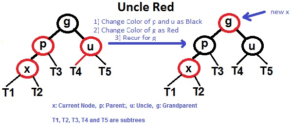
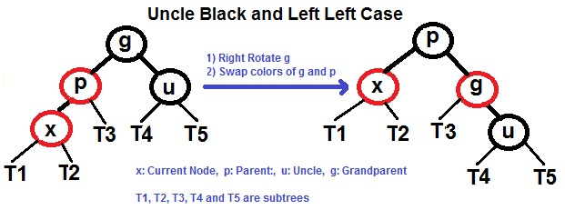
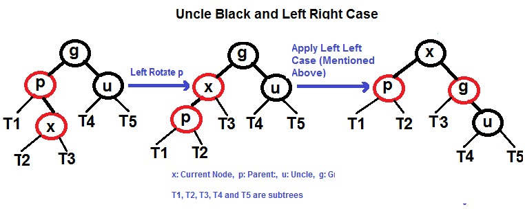
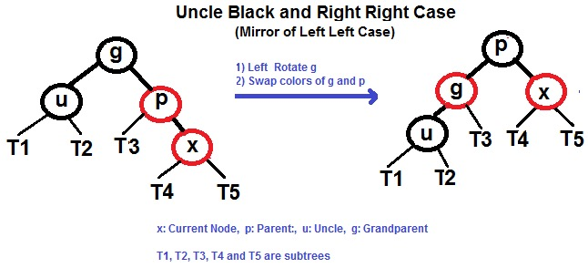
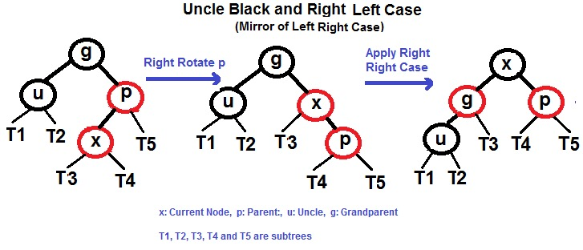

### 一、平衡二叉树

#### 1.平衡二叉树规则

>- 平衡二叉树是一种二叉排序树，其中每一个节点的左子树和右子树的高度差至多等于1；
>- 平衡二叉树的左子树和右子树都是一颗平衡二叉树；
>- 二叉树上节点的左子树深度减去右子树深度的值称为平衡因子BF，那么平衡二叉树上所有节点的平衡因子只能是-1、0和1；
>- 当平衡因子BF大于1时，则右旋。当平衡因子BF小于-1时，则左旋；

#### 2.红黑树的几大操作

>- 左左情况，右旋；
-> 右右情况，左旋；
-> 左右情况，先左旋再右旋；
-> 右左情况，先右旋再左旋；


#### 3.旋转规则

假设根节点为P，左孩子为L，右孩子为R，左孩子下面有LL，LR两个节点，右孩子下面成为RL，RR。

***右旋***
L成为根节点，P为L的右孩子，L的右孩子成为P的左孩子。

***左旋（跟右旋相反）***
R成为根节点，P为R的左孩子，R的左孩子成为P的右孩子。

#### 4.相关面试题（不仅限于二叉树）

***从上到下打印出二叉树的每个节点，同一层的节点按照从左到右的顺序打印。（按层遍历二叉树）***

***输入一棵二叉树的根节点，求该树的深度。从根节点到叶子节点依次经过的节点（包含根、叶子节点）形成树的一条路径，最长路径的长度树的深度。***

***输入一个整数数组，判断该数组是不是某二叉搜索树的后续遍历。如果是返回 true，如果不是返回 false。假设输入的任意两个数字互不相同。***

***请实现一个函数，用来判断一棵二叉树是不是对称的。如果一棵二叉树和它的镜像一样，那么它是对称的。***

***请完成一个函数，如果一个二叉树，该函数输出它的镜像。***

***输入两棵二叉树 A 和 B，判断 B 是不是 A 的子结构。***

***已知前序遍历为{1,2,4,7,3,5,6,8}，中序遍历为{4,7,2,1,5,3,8,6}，它的二叉树是怎么样的？***

前序遍历规则为根、左子树、右子树，中序遍历规则为左子树、根、右子树。


***给定一棵二叉搜索树，请找出其中的第 K 大节点。***

***求二叉树的宽度。***

***手写平衡二叉树左旋***

```java
public void leftRotate(Node node) {
	Node rightChild = node.rightChild;//右孩子
	
	//将右孩子的左节点设置为Node的右节点
	if(rightChild.leftChild != null) {
		rightChild.leftChild.parent = node;
	}
	node.rightChild = rightChild.leftChild;
	//右孩子的左节点设置为Node节点
	rightChild.leftChild = node;
	
	//将右孩子的父节点改成node父节点
	rightChild.parent = node.parent;
	//将祖父节点原node节点位置改成右孩子节点
	if(node.parent != null) {
		if(parent.leftChild == node) {
			node.parent.leftChild = rightChild;
		} else if(parent.rightChild == node){
			node.parent.rightChild = rightChild;
		}
	}
	//node父节点为左孩子
	node.parent = rightChild;
}
```

### 二、红黑树

#### 红黑树节点规则

>- 每个节点都有红色或黑色；
>- 树的根始终是黑色的；
>- 每个叶子节点都是黑色的空节点（NIL），也就是说，叶子节点不存数据；
>- 任何相邻的节点都不能同时为红色（红色节点不能有红色父节点或红色子节点，并没有说不能出现连续的黑色节点）；
>- 每个节点（包括根节点），从该节点到达其可达的叶子节点（NIL节点）的所有路径，都包含相同数目的黑色节点；

#### 红黑树有两大操作

>- recolor (重新标记黑色或红色)
>- rotation (旋转，这是树达到平衡的关键) 我们会先尝试 recolor，如果 recolor 不能达到红黑树的 4 点要求，然后我们尝试 rotation；

***插入规则***
其中G是根节点，P是父节点，U是叔叔节点，X是新增节点。

>- 1.将新插入的节点标记为红色；
>- 2.如果 X 是根结点(root)，则标记为黑色；
>- 3.如果 X 的 parent 不是黑色，同时 X 也不是 root：

> >- 3.1 如果 X 的 uncle (叔叔) 是红色；

> > >- 3.1.1 将 P 和 U 标记为黑色
> > >- 3.1.2 将 G (祖父) 标记为红色
> > >- 3.1.3 让 X 节点的颜色与 G (祖父)的颜色相同，将G标记为当前节点，然后重复步骤 2、3

> >- 3.2 如果 X 的 uncle (叔叔) 是黑色，我们要分四种情况处理

> > >- 3.2.1 左左 (P 是 G 的左孩子，并且 X 是 P 的左孩子)
> > >- 3.2.2 左右 (P 是 G 的左孩子，并且 X 是 P 的右孩子)
> > >- 3.2.3 右右 (和 3.2.1 镜像过来，恰好相反)
> > >- 3.2.4 右左 (和 3.2.2 镜像过来，恰好相反)

3.1所示图（X的P是红色，并且X的U是红色）

1.改变P和U的颜色为黑色；
2.改变G的颜色为红色；
3.X改成G的颜色，G是根节点则标记为黑色。（重复1,2步骤直至到根节点）。



3.2.1所示图（左左，X的P是红色，并且X的U是黑色，U是P的右孩子，X是P的左孩子）

1.将G右旋；
2.G和P的颜色互换。



3.2.2所示图（左右，X的P是红色，并且X的U是黑色，U是P的右孩子，X是P的右孩子）

1.将P左旋；
2.将G右旋；
3.X和G的颜色互换。



3.2.3所示图（右右，X的P是红色，并且X的U是黑色，U是P的左孩子，X是P的右孩子）

1.将G左旋；
2.G和P的颜色互换。



3.2.4所示图（右左，X的P是红色，并且X的U是黑色，U是P的右孩子，X是P的左孩子）

1.将P右旋；
2.将G左旋；
3.X和G的颜色互换。



***删除规则***

一、从树中删除节点X

>- 情况①：如果X没有孩子，且如果X是红色，直接删除X；如果X是黑色，则以X为当前节点进行旋转调色，最后删掉X；
>- 情况②：如果X只有一个孩子C，交换X和C的数值，再对新X进行删除。根据红黑树特性，此时X不可能为红色，因为红色节点要么没有孩子，要么有两个黑孩子。此时以新X为当前节点进行情况①的判断；
>- 情况③：如果X有两个孩子，则从后继中找到最小节点D，交换X和D的数值，再对新X进行删除。此时以新X为当前节点进行情况①或②的判断。

二、旋转调色（N=旋转调色的当前节点[等于情况①中的X]，P=N的父亲，W=N的兄弟，Nf=N的远侄子，Nn=N的近侄子）

>- 情况1：N是根或者N是红色，则：直接将N设为黑色；
>- 情况2：N不是根且N是黑色，且W为红色，则：将W设为黑色，P设为红色，对P进行旋转(N为P的左子时进行左旋，N为P的右子时进行右旋)，将情况转化为情况1、2、3、4、5；
>- 情况3：N不是根且N是黑色，且W为黑色，且W的左右子均为黑色，则：将W设为红色，将P设为当前节点进行旋转调色，将情况转化为情况1、2、3、4、5；
>- 情况4：N不是根且N是黑色，且W为黑色，且Nf为黑色，Nn为红色，则：交换W与Nn的颜色，并对W进行旋转(N为P的左子进行右旋，N为P的右子进行左旋)，旋转后N的新兄弟W有一个红色WR，则转换为情况5；
>- 情况5：N不是根且N是黑色，且W为黑色，且Nf为红色，Nn为黑色，则：将W设为P的颜色，P和Nf设为黑色，并对P进行旋转(N为P的左子进行左旋，N为P的右子进行右旋)，N设为根。


#### 相关面试题

***有了二叉查找树、平衡树为啥还需要红黑树？***

二叉查找树的缺点是：正常的情况下，查找的时间复杂度为 O（logn），有可能出现一种极端的情况查找时间复杂度顿时变成了 O(n)，于是我们引申出了平衡二叉树。
平衡二叉树的缺点是：平衡树要求每个节点的左子树和右子树的高度差至多等于1，这个要求实在是太严了，导致每次进行插入/删除节点的时候，几乎都会破坏平衡树的第二个规则，进而我们都需要通过左旋和右旋来进行调整，使之再次成为一颗符合要求的平衡树。如果在那种插入、删除很频繁的场景中，平衡树需要频繁着进行调整，这会使平衡树的性能大打折扣，为了解决这个问题，于是有了红黑树。

***红黑树有哪些应用场景？***

***构建一棵节点个数为 n 的红黑树，时间复杂度是多少？***

***红黑树与哈希表在不同应该场景的选择？***

***红黑树有哪些性质？***

参考上面“红黑树节点规则”。

***红黑树各种操作的时间复杂度是多少？***

***JDK8以及以后版本HashMap桶在什么条件下链表结构会转换成红黑树结构？***

若桶中链表个数超过8，链表会转换成红黑树。 因为红黑树的平均查询时间为 log(n), 而链表是O(n)，平均是O(n)/2。当节点数为8时，红黑树查询时间3，链表查询时间是4, 可以看出来当为8时红黑树查询效率大于了链表。

