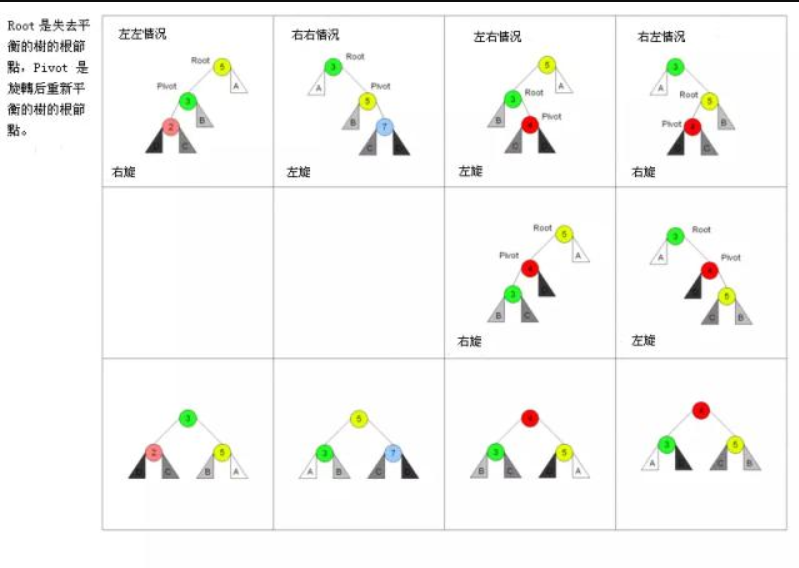

### 一、平衡二叉树

#### 1.平衡二叉树规则

>- 平衡二叉树是一种二叉排序树，其中每一个节点的左子树和右子树的高度差至多等于1；
>- 平衡二叉树的左子树和右子树都是一颗平衡二叉树；
>- 二叉树上节点的左子树深度减去右子树深度的值称为平衡因子BF，那么平衡二叉树上所有节点的平衡因子只能是-1、0和1；
>- 当平衡因子BF大于1时，则右旋。当平衡因子BF小于-1时，则左旋；

#### 2.红黑树的几大操作

>- 左左情况，右旋；
-> 右右情况，左旋；
-> 左右情况，先左旋再右旋；
-> 右左情况，先右旋再左旋；

#### 3.旋转规则

假设根节点为P，左孩子为L，右孩子为R，左孩子下面有LL，LR两个节点，右孩子下面成为RL，RR。

***右旋***
L成为根节点，P为L的右孩子，L的右孩子成为P的左孩子。

***左旋（跟右旋相反）***
R成为根节点，P为R的左孩子，R的左孩子成为P的右孩子。

#### 4.相关面试题（不仅限于二叉树）

***从上到下打印出二叉树的每个节点，同一层的节点按照从左到右的顺序打印。（按层遍历二叉树）***

***输入一棵二叉树的根节点，求该树的深度。从根节点到叶子节点依次经过的节点（包含根、叶子节点）形成树的一条路径，最长路径的长度树的深度。***

***输入一个整数数组，判断该数组是不是某二叉搜索树的后续遍历。如果是返回 true，如果不是返回 false。假设输入的任意两个数字互不相同。***

***请实现一个函数，用来判断一棵二叉树是不是对称的。如果一棵二叉树和它的镜像一样，那么它是对称的。***

***请完成一个函数，如果一个二叉树，该函数输出它的镜像。***

***输入两棵二叉树 A 和 B，判断 B 是不是 A 的子结构。***

***已知前序遍历为{1,2,4,7,3,5,6,8}，中序遍历为{4,7,2,1,5,3,8,6}，它的二叉树是怎么样的？***

***给定一棵二叉搜索树，请找出其中的第 K 大节点。***

***求二叉树的宽度。***

### 二、红黑树

#### 红黑树节点规则

>- 具有二叉查找树的特点；
>- 每个节点都有红色或黑色；
>- 树的根始终是黑色的；
>- 每个叶子节点都是黑色的空节点（NIL），也就是说，叶子节点不存数据；
>- 任何相邻的节点都不能同时为红色（红色节点不能有红色父节点或红色子节点，并没有说不能出现连续的黑色节点）；
>- 每个节点（包括根节点），从该节点到达其可达的叶子节点（NIL节点）的所有路径，都包含相同数目的黑色节点；

#### 红黑树有两大操作

>- recolor (重新标记黑色或红色)
>- rotation (旋转，这是树达到平衡的关键) 我们会先尝试 recolor，如果 recolor 不能达到红黑树的 4 点要求，然后我们尝试 rotation；

#### 相关面试题

***有了二叉查找树、平衡树为啥还需要红黑树？***

二叉查找树的缺点是：正常的情况下，查找的时间复杂度为 O（logn），有可能出现一种极端的情况查找时间复杂度顿时变成了 O(n)，于是我们引申出了平衡二叉树。
平衡二叉树的缺点是：平衡树要求每个节点的左子树和右子树的高度差至多等于1，这个要求实在是太严了，导致每次进行插入/删除节点的时候，几乎都会破坏平衡树的第二个规则，进而我们都需要通过左旋和右旋来进行调整，使之再次成为一颗符合要求的平衡树。如果在那种插入、删除很频繁的场景中，平衡树需要频繁着进行调整，这会使平衡树的性能大打折扣，为了解决这个问题，于是有了红黑树。

***红黑树有哪些应用场景？***

***构建一棵节点个数为 n 的红黑树，时间复杂度是多少？***

***红黑树与哈希表在不同应该场景的选择？***

***红黑树有哪些性质？***

参考上面“红黑树节点规则”。

***红黑树各种操作的时间复杂度是多少？***

