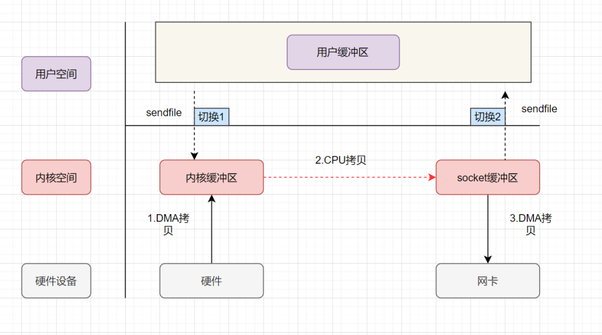

### Linux IO

#### 1. sync、fsync与fdatasync

传统的UNIX实现在内核中设有缓冲区高速缓存或页面高速缓存，大多数磁盘I/O都通过缓冲进行。当将数据写入文件时，内核通常先将该数据复制到其中一个缓冲区中，如果该缓冲区尚未写满，则并不将其排入输出队列，而是等待其写满或者当内核需要重用该缓冲区以便存放其他磁盘块数据时，再将该缓冲排入输出队列，然后待其到达队首时，才进行实际的I/O操作。这种输出方式被称为延迟写`（delayed write）`。

**延迟写减少了磁盘读写次数，但是却降低了文件内容的更新速度**，使得欲写到文件中的数据在一段时间内并没有写到磁盘上。当系统发生故障时，这种延迟可能造成文件更新内容的丢失。为了保证磁盘上实际文件系统与缓冲区高速缓存中内容的一致性，**UNIX系统提供了sync、fsync和fdatasync三个函数。**

- sync：是将所有修改过的块缓冲区排入写队列，然后就返回，它并不等待实际写磁盘操作结束。通常称为`update的系统守护进程`会周期性地`（一般每隔30秒）`调用sync函数。这就保证了定期冲洗内核的块缓冲区。
- fsync：只对由文件描述符`filedes`指定的单一文件起作用，并且等待写磁盘操作结束，然后返回。**fsync可用于数据库这样的应用程序，这种应用程序需要确保将修改过的块立即写到磁盘上**。而除数据外，fsync还会同步更新文件的属性。
- fdatasync：函数类似于fsync，**但它只影响文件的数据部分。仅在需要的时候同步更新文件的属性**。

#### 2.fsync的性能问题，以及与fdatasync区别

除了同步文件的修改内容（脏页），`fsync`还会**同步文件的描述信息（metadata，包括size、访问时间st_atime & st_mtime等等）**，因为**文件的数据和metadata通常存在硬盘的不同地方，因此fsync至少需要两次IO写操作**。

多余的一次IO操作，有多么昂贵呢？当前硬盘驱动的平均寻道时间`（Average seek time）`大约是`3~15ms`，7200转硬盘的平均旋转延迟`（Average rotational latency）`大约为`4ms`，因此**一次IO操作的耗时大约为10ms左右**。

`fdatasync`的功能与`fsync`类似，但是**仅仅在必要的情况下才会同步metadata，因此可以减少一次IO写操作**。

什么是“必要的情况”呢？比如文件的尺寸（`st_size`）如果变化，是需要立即同步的，否则OS一旦崩溃，即使文件的数据部分已同步，由于metadata没有同步，依然读不到修改的内容。而最后访问时间(atime)/修改时间(mtime)是不需要每次都同步的，只要应用程序对这两个时间戳没有苛刻的要求，基本无伤大雅。

#### 3.什么是零拷贝？

零拷贝是指计算机执行IO操作时，CPU不需要将数据从一个存储区域复制到另一个存储区域，从而可以减少上下文切换以及CPU的拷贝时间。它是一种I/O操作优化技术。

*传统 IO 的执行流程*

传统的IO流程，包括`read`和`write`的过程。
- read：把数据从磁盘读取到内核缓冲区，再拷贝到用户缓冲区。
- write：先把数据写入到socket缓冲区，最后写入网卡设备。

- 1.用户应用进程调用read函数，向操作系统发起IO调用，上下文从用户态转为内核态（切换1）；
- 2.DMA控制器把数据从磁盘中，读取到内核缓冲区；
- 3.CPU把内核缓冲区数据拷贝到用户应用缓冲区，上下文从内核态转为用户态（切换2），read函数返回；
- 4.用户应用进程通过write函数，发起IO调用，上下文从用户态转为内核态（切换3）；
- 5.CPU将用户缓冲区中的数据，拷贝到socket缓冲区；
- 6.DMA控制器把数据从socket缓冲区，拷贝到网卡设备，上下文从内核态切换回用户态（切换4），write函数返回；

传统IO的读写流程，包括了*4次上下文切换*（4次用户态和内核态的切换），*4次数据拷贝*（两次CPU拷贝以及两次的DMA拷贝)。

***零拷贝实现方式：***

零拷贝并不是没有拷贝数据，而是减少用户态/内核态的切换次数以及CPU拷贝的次数。零拷贝一般有这三种实现方式：
- mmap+write
- sendfile
- 带有DMA收集拷贝功能的sendfile

*mmap+write*

mmap就是用了虚拟内存这个特点，它将内核中的读缓冲区与用户空间的缓冲区进行映射，以减少数据拷贝次数！

- 1.用户进程通过mmap方法向操作系统内核发起IO调用，上下文从用户态切换为内核态（切换1）。
- 2.CPU利用DMA控制器，把数据从硬盘中拷贝到内核缓冲区。
- 3.上下文从内核态切换回用户态（切换2），mmap方法返回（切换2）。
- 4.用户进程通过write方法向操作系统内核发起IO调用，上下文从用户态切换为内核态（切换3）。
- 5.CPU将内核缓冲区的数据拷贝到的socket缓冲区。
- 6.CPU利用DMA控制器，把数据从socket缓冲区拷贝到网卡，上下文从内核态切换回用户态（切换4），write调用返回。

`mmap+write`实现的零拷贝，I/O发生了*4次用户空间与内核空间的上下文切换*，以及*3次数据拷贝*（包括了2次DMA拷贝和1次CPU拷贝）。

*sendfile*

sendfile表示在两个文件描述符之间传输数据，它是在操作系统内核中操作的，避免了数据从内核缓冲区和用户缓冲区之间的拷贝操作。

- 1.用户进程发起sendfile系统调用，上下文（切换1）从用户态转向内核态
- 2.DMA控制器，把数据从硬盘中拷贝到内核缓冲区。
- 3.CPU将读缓冲区中数据拷贝到socket缓冲区。
- 4.DMA控制器，异步把数据从socket缓冲区拷贝到网卡，
- 5.上下文（切换2）从内核态切换回用户态，sendfile调用返回。

`sendfile`实现的零拷贝，I/O发生了*2次用户空间与内核空间的上下文切换*，以及*3次数据拷贝*。其中3次数据拷贝中，包括了2次DMA拷贝和1次CPU拷贝。

*带有DMA收集拷贝功能的sendfile*

`linux 2.4`版本之后，对`sendfile`做了优化升级，引入`SG-DMA`技术，其实就是对DMA拷贝加入了`scatter/gather`操作，它可以直接从内核空间缓冲区中将数据读取到网卡。使用这个特点搞零拷贝，即还可以多省去一次CPU拷贝。

- 1.用户进程发起sendfile系统调用，上下文（切换1）从用户态转向内核态
- 2.DMA控制器，把数据从硬盘中拷贝到内核缓冲区。
- 3.CPU把内核缓冲区中的文件描述符信息（包括内核缓冲区的内存地址和偏移量）发送到socket缓冲区
- 4.DMA控制器根据文件描述符信息，直接把数据从内核缓冲区拷贝到网卡
- 5.上下文（切换2）从内核态切换回用户态，sendfile调用返回。

可以发现，`sendfile+DMA scatter/gather`实现的零拷贝，I/O发生了*2次用户空间与内核空间的上下文切换*，以及*2次数据拷贝*。其中2次数据拷贝都是包DMA拷贝。这就是*真正的零拷贝（Zero-copy）技术*，全程都没有通过CPU来搬运数据，所有的数据都是通过DMA来进行传输的。

