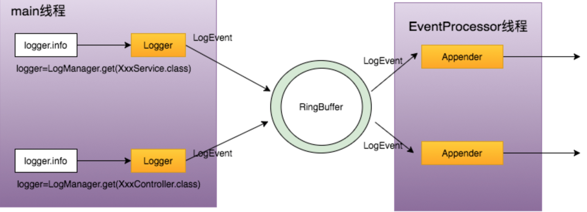

### Log4j2

[disruptor笔记](https://blog.csdn.net/boling_cavalry/article/details/117636483)

[Log4j2官方文档](https://logging.apache.org/log4j/2.x/manual/index.html)

[Log4j2中文文档](https://www.docs4dev.com/docs/zh/log4j2/2.x/all/manual-plugins.html)

#### 1.AsyncLogger和AsyncAppender之间的区别？

```
<!--AsyncLogger有两种，一种是AsyncLogger，还有一个是Asyncroot-->
<AsyncLogger name="com.ddky.top" level="TRACE" additivity="false">
    <AppenderRef ref="InfoAppender"/>
</AsyncLogger>
<Asyncroot level="INFO" includeLocation="true">
    <AppenderRef ref="InfoAppender"/>
</Asyncroot>

<!--异步appender-->
<Async name="AsyncAppender" includeLocation="true">
    <AppenderRef ref="InfoAppender"/>
</Async>
```

| 名称 | 日志输出方式 |
| --- | --- |
| Async Appender | 异步打印日志，内部采用ArrayBlockingQueue，对每个AsyncAppender创建一个线程用于处理日志输出 |
| Async Logger | 异步打印日志，采用了高性能并发框架Disruptor，创建一个线程用于处理日志输出(性能最好，推荐使用) |

#### 2.Async Appender使用什么队列？队列大小是多少？能更改队列类型吗？

通过`Async`标签设置的异步打印日志，内部默认采用`ArrayBlockingQueue`，默认容量为`1024`。

在源码`org.apache.logging.log4j.core.appender.AsyncAppender`中：
```
private static final int DEFAULT_QUEUE_SIZE = 1024;
// 这个在org.apache.logging.log4j.core.appender.AsyncAppender.Builder的默认属性
private BlockingQueueFactory<LogEvent> blockingQueueFactory = new ArrayBlockingQueueFactory<>();
```

队列大小和队列类型可以由标签更改：
```
<!--异步appender-->
<Async name="AsyncAppender" includeLocation="true" bufferSize="2048">
    <AppenderRef ref="InfoAppender"/>
    <LinkedTransferQueue />
</Async>
```

队列类型一共有四种：
| 名称 | 描述 |
| --- | --- |
| ArrayBlockingQueue | 默认实现。个人觉得还是走默认的吧，其它几个不熟悉的话慎用 |
| DisruptorBlockingQueue | 异步RingBuffer环形队列实现 |
| JCToolsBlockingQueue | 使用了JCTools，MPSC有界无锁队列。 |
| LinkedTransferQueue | JDK7的LinkedTransferQueue，此队列没有容量上限，所以bufferSize配置是无用的 |

#### 3.配置多个AsyncLogger会创建出多个disruptor实例吗？

不会的，如果检测到配置了AsyncRoot或AsyncLogger，将启动一个disruptor实例。

同时并不是每个`AsyncLogger`对应着一个处理线程，而是仅仅有一个`EventProcessor线程`进行日志的异步处理。



#### 4.RingBuffer的默认大小是多少？如何进行修改？

`基于log4j2版本2.13.3`在源码`org.apache.logging.log4j.core.async.AsyncLoggerConfigDisruptor`中：
```
public synchronized void start() {
    // ... 省略其它代码
    // 初始化RingBuffer的大小
    ringBufferSize = DisruptorUtil.calculateRingBufferSize("AsyncLoggerConfig.RingBufferSize");
    // 初始化RingBuffer中没有LogEvent需要处理，EventProcessor线程的等待策略
    final WaitStrategy waitStrategy = DisruptorUtil.createWaitStrategy("AsyncLoggerConfig.WaitStrategy");
    // ...
}

// 这个方法可以看到，buffer最少也要 128
static int calculateRingBufferSize(final String propertyName) {
    // 这个是计算出默认的RingBuffer Size，如果是web项目则RINGBUFFER_DEFAULT_SIZE=262144，否则RINGBUFFER_NO_GC_DEFAULT_SIZE=4096
    int ringBufferSize = Constants.ENABLE_THREADLOCALS ? RINGBUFFER_NO_GC_DEFAULT_SIZE : RINGBUFFER_DEFAULT_SIZE;
    // 这里是读取配置文件中的配置 AsyncLoggerConfig.RingBufferSize 的值
    final String userPreferredRBSize = PropertiesUtil.getProperties().getStringProperty(propertyName, String.valueOf(ringBufferSize));
    try {
        int size = Integer.parseInt(userPreferredRBSize);
        if (size < RINGBUFFER_MIN_SIZE) { // RINGBUFFER_MIN_SIZE = 128
            size = RINGBUFFER_MIN_SIZE;
            LOGGER.warn("Invalid RingBufferSize {}, using minimum size {}.", userPreferredRBSize, RINGBUFFER_MIN_SIZE);
        }
        ringBufferSize = size;
    } catch (final Exception ex) {
        LOGGER.warn("Invalid RingBufferSize {}, using default size {}.", userPreferredRBSize, ringBufferSize);
    }
    return Integers.ceilingNextPowerOfTwo(ringBufferSize);
}

// 最终这里可以看到，需要判断是否是WEB项目，如果是WEB项目，这个log4j2.enable.threadlocals默认情况下就是true
public static final boolean ENABLE_THREADLOCALS = !IS_WEB_APP && PropertiesUtil.getProperties().getBooleanProperty("log4j2.enable.threadlocals", true);
```

由上面的源码可以得出`RingBuffer Size`如果是web项目为`262144`，否则`4096`。

如果需要修改此值，则我们需要需要在环境中添加配置文件`log4j2.component.properties`，并且设置`AsyncLoggerConfig.RingBufferSize=n`来直接指定`RingBuffer Size`的大小(PS:`RingBufferSize`是指内部维护的数组)。

#### 5.RingBuffer满了log4j2会怎么办？

如果在`log4j2.component.properties`配置了`AsyncLoggerConfig.SynchronizeEnqueueWhenQueueFull=false`，则会`Wait（其实是park）`在`Disruptor`的`produce`方法上，等待消费出下一个可以生产的环形`buffer`槽；

**默认这个配置为true**，即所有生产日志的线程尝试获取全局中的同一个锁。

```
// 默认为true
static final boolean ASYNC_CONFIG_SYNCHRONIZE_ENQUEUE_WHEN_QUEUE_FULL = PropertiesUtil.getProperties()
            .getBooleanProperty("AsyncLoggerConfig.SynchronizeEnqueueWhenQueueFull", true);

private void enqueue(final LogEvent logEvent, final AsyncLoggerConfig asyncLoggerConfig) {
    if (synchronizeEnqueueWhenQueueFull()) {
        synchronized (queueFullEnqueueLock) {
            disruptor.getRingBuffer().publishEvent(translator, logEvent, asyncLoggerConfig);
        }
    } else {
        disruptor.getRingBuffer().publishEvent(translator, logEvent, asyncLoggerConfig);
    }
}
```

这个是官网的解释，个人觉得默认即可：同步访问`Disruptor`环形缓冲区，以便在队列已满时阻止入队操作。`Disruptor v3.4.2`的用户**会遇到CPU使用率过高的问题，当应用程序的日志记录超过底层appender的处理能力并且环形缓冲区已满时，尤其是当应用程序线程的数量远远超过内核数量时**。通过限制对入队操作的访问，CPU利用率显着降低。**当异步日志记录队列已满时，将此值设置为false可能会导致CPU利用率非常高**。

#### 6.EventProcessor线程的等待策略常用的有哪几种？

`基于log4j2版本2.13.3`在源码`org.apache.logging.log4j.core.async.DisruptorUtil`的`createWaitStrategy`方法中：
```
static WaitStrategy createWaitStrategy(final String propertyName, final long timeoutMillis) {
    // 这里可以看到默认是TIMEOUT策略
    final String strategy = PropertiesUtil.getProperties().getStringProperty(propertyName, "TIMEOUT");
    LOGGER.trace("property {}={}", propertyName, strategy);
    final String strategyUp = strategy.toUpperCase(Locale.ROOT); // TODO Refactor into Strings.toRootUpperCase(String)
    switch (strategyUp) { // TODO Define a DisruptorWaitStrategy enum?
    case "SLEEP":
        return new SleepingWaitStrategy();
    case "YIELD":
        return new YieldingWaitStrategy();
    case "BLOCK":
        return new BlockingWaitStrategy();
    case "BUSYSPIN":
        return new BusySpinWaitStrategy();
    case "TIMEOUT":
        return new TimeoutBlockingWaitStrategy(timeoutMillis, TimeUnit.MILLISECONDS);
    default:
        return new TimeoutBlockingWaitStrategy(timeoutMillis, TimeUnit.MILLISECONDS);
    }
}
```

通过上面的源码可以看到`Log4j2`中可以使用的等待策略有五种：
| 名称 | 作用 | 缺点 |
| --- | --- | --- |
| SleepingWaitStrategy | 三段式，第一阶段自旋，第二阶段执行Thread.yield交出CPU，第三阶段睡眠执行时间，反复的的睡眠 | 推荐使用的一种策略，在特别闲的时候会进入休眠状态 |
| YieldingWaitStrategy | 二段式，第一阶段自旋，第二阶段执行Thread.yield交出CPU | 在不繁忙的时候会占用一定的CPU时间 |
| BlockingWaitStrategy | 用了ReentrantLock的等待&&唤醒机制实现等待逻辑，比较节省CPU | 业务量突增的时候，日志写入线程在一段时间内一直未能被唤醒，可能会导致`RingBuffer`短时间内积压了很多日志事件 |
| BusySpinWaitStrategy | 持续自旋，JDK9之下慎用（最好别用） | 比YieldingWaitStrategy更激进，但是写入日志也会更快速，业务高峰的时候可能还是会有抢不到CPU的情况。使用的是Thread的onSpinWait方法，JDK9以下是空的，造成无限循环 |
| TimeoutBlockingWaitStrategy | 带超时的等待，超时后会执行业务指定的处理逻辑，默认配置。如果对日志写入响应要求高的话，建议使用SleepingWaitStrategy策略 |

当然`disruptor`框架中中实际有8种等待策略。另外三种是：
| 名称 | 作用 | 缺点 |
| --- | --- | --- |
| LiteBlockingWaitStrategy | 基于BlockingWaitStrategy，在没有锁竞争的时候会省去唤醒操作，但是作者说测试不充分，不建议使用 | 作者都没好好策略，你敢用吗？ |
| LiteTimeoutBlockingWaitStrategy | 基于TimeoutBlockingWaitStrategy，在没有锁竞争的时候会省去唤醒操作 | 可用于体验，但正确性并未经过充分验证，不过注释中没有写 |
| PhasedBackoffWaitStrategy | 四段式，第一阶段自旋指定次数，第二阶段自旋指定时间，第三阶段执行Thread.yield交出CPU，第四阶段调用成员变量的waitFor方法，这个成员变量可以被设置为BlockingWaitStrategy、LiteBlockingWaitStrategy、SleepingWaitStrategy这三个中的一个 | 复杂，自旋总不是好的，最后还是基于其它策略 |

#### 7.Log4j2开启全量异步

可以通过如下方式开启：
```
#启动参数方式
-DLog4jContextSelector=org.apache.logging.log4j.core.async.AsyncLoggerContextSelector
#代码方式
System.setProperty("Log4jContextSelector", "org.apache.logging.log4j.core.async.AsyncLoggerContextSelector");
```

开启此功能后，`log4j2`配置文件里**所有logger都自动异步，使用异步队列为Disruptor，队列默认大小4096**。

可以通过源码`org.apache.logging.log4j.core.async.AsyncLoggerContextSelector`看到：
```
protected LoggerContext createContext(final String name, final URI configLocation) {
    return new AsyncLoggerContext(name, null, configLocation);
}

// org.apache.logging.log4j.core.async.AsyncLoggerContext类构造函数会初始化Disruptor队列
public AsyncLoggerContext(final String name, final Object externalContext, final URI configLocn) {
    super(name, externalContext, configLocn);
    loggerDisruptor = new AsyncLoggerDisruptor(name);
}

public synchronized void start() {
    // ...
    // 这里可以看出逻辑与AsyncLogger其实差不多了
    ringBufferSize = DisruptorUtil.calculateRingBufferSize("AsyncLogger.RingBufferSize");
    final WaitStrategy waitStrategy = DisruptorUtil.createWaitStrategy("AsyncLogger.WaitStrategy");
    // ...
}
```

#### 8.如果启用了全量异步，又使用了<AsyncLogger>会如何？

`log4j2`会**新建两个Disruptor队列**，`<AsyncLogger>`使用一个，其他的使用全量的那一个，所以**建议将可能发生阻塞的logger归类使用一个Disruptor**，防止互相影响造成阻塞。

#### 9.includeLocation的值会不会影响性能？

会的，`includeLocation=true`可以让我们在日志中输出当前输出的日志对应代码中的哪一类的哪一方法的哪一行，这个需要在运行时获取堆栈。获取堆栈，无论是在`JDK9`之前通过`Thorwable.getStackTrace()`，还是通过`JDK9`之后的`StackWalker`，获取当前代码堆栈，都是一个**非常消耗CPU性能的操作**。在大量输出日志的时候，会成为严重的性能瓶颈，其原因是：
- 获取堆栈属于从`Java`代码运行，切换到`JVM`代码运行，是`JNI`调用。这个切换是有性能损耗的。
- `JDK9`之前通过新建异常获取堆栈，`JDK9`之后通过`Stackwalker`获取。这两种方式，截止目前`JDK17`版本，**都在高并发情况下，有严重的性能问题，会吃掉大量 CPU**。主要是底层JVM符号与常量池优化的问题。

`基于log4j2版本2.13.3`在源码`org.apache.logging.log4j.core.async.AsyncLogger`的`calcLocationIfRequested`方法：
```
private StackTraceElement calcLocationIfRequested(String fqcn) {
    return this.includeLocation ? StackLocatorUtil.calcLocation(fqcn) : null;
}

public static StackTraceElement calcLocation(final String fqcnOfLogger) {
    try {
        return stackLocator.calcLocation(fqcnOfLogger);
    } catch (NoSuchElementException ex) {
        if (!errorLogged) {
            errorLogged = true;
            StatusLogger.getLogger().warn("Unable to locate stack trace element for {}", fqcnOfLogger, ex);
        }
        return null;
    }
}

public StackTraceElement calcLocation(final String fqcnOfLogger) {
    // ...
    // 这里可以看到是new Throwable()获取堆栈信息，并最终判断类信息来获取行，方法等
    final StackTraceElement[] stackTrace = new Throwable().getStackTrace();
    boolean found = false;
    for (int i = 0; i < stackTrace.length; i++) {
        final String className = stackTrace[i].getClassName();
        if (fqcnOfLogger.equals(className)) {
            found = true;
            continue;
        }
        if (found && !fqcnOfLogger.equals(className)) {
            return stackTrace[i];
        }
    }
    return null;
}
```

解决办法也不是特别好，就是可以自己在日志中添加类名方法名用于快速定位问题代码。

#### 10.如何大量的异常信息导致日志性能低下，占用CPU资源和IO资源？

异常日志性能低下，说到底就是日志量太大。

- 比较简单粗暴的就是使用`-XX:+OmitStackTraceInFastThrow`来使某一个异常抛出过多次数时，自动省略异常堆栈。但是缺点也很明显，就是后面不知道哪里出问题了，造成排查问题极为困难。
- `Log4j2`中提供了黑名单功能，可以指定哪些包的异常栈可以被省略掉。当然了，这一块就会比较繁琐，不方便。
- 使用`Log4j2`异常格式化插件对黑名单进行取反操作来实现白名单的功能，将我想打印的包的信息输出。

#### 11.Log4j2中开启ThreadLocal的影响

如果启用了`ThreadLocal`这种方式生成`LogEvent`，每次不新生成的`LogEvent`用之前的，用`ThreadLocal`存储的，这样避免了创建新的`LogEvent`。但是考虑下面这种情况：
```
logger.info("{}", someObj);
```

这样会造成强引用，导致如果线程没有新的日志，这个`someObj`一直不能回收。所以**针对Web应用，`log4j2`默认是不启用`ThreadLocal`的方式生成`LogEvent`**。

在log4j2的常量中配置类`org.apache.logging.log4j.util.Constants`中：
```
public static final boolean IS_WEB_APP = PropertiesUtil.getProperties().getBooleanProperty("log4j2.is.webapp", isClassAvailable("javax.servlet.Servlet"));
public static final boolean ENABLE_THREADLOCALS = !IS_WEB_APP && PropertiesUtil.getProperties().getBooleanProperty("log4j2.enable.threadlocals", true);
```

**这里也意味着如果是普通Java项目，则会默认开启`ThreadLocal`，所以需要注意**

#### 12.如何防止RingBuffer满了造成线程BLOCK，进而内存占用飙升，大量挂起线程，系统停顿？

在`classpath`下新建文件：`log4j2.component.properties`
```
log4j2.AsyncQueueFullPolicy=Discard #队列满时放弃日志操作，默认策略是等待入队，我觉得可以允许丢弃部分日志吧，防止应用挂了。
# AsyncLogger配置
AsyncLoggerConfig.RingBufferSize=131072 #队列长度，Disruptor使用的不是真正意义上的队列，而是类似于计数器+事件的方式。如果是非WEB项目，可能会比较小
AsyncLoggerConfig.SynchronizeEnqueueWhenQueueFull=true #当队列满时同步入列，这是默认值，实际还是走AsyncQueueFullPolicy策略，这个是默认策略，其实不需要设置
# 如果开启了全量异步可以配置如下
AsyncLogger.RingBufferSize=262144 # 全量异步的队列长度
AsyncLogger.SynchronizeEnqueueWhenQueueFull=true # 上同
```

#### 13.Log4j2 RingBuffer的监控

`Log4j2`对于每一个`AsyncLogger`配置，都会创建一个独立的`RingBuffer`，在现在web服务的流量经常会瞬间达到高峰，造成很难去通过一些系统指标去监控，看似CPU消耗不高，但是可能队列已经满了。

`Log4j2`考虑到了监控`AsyncLogger`这种情况，所以将`AsyncLogger`的监控暴露成为一个`MBean`。

具体代码在`org.apache.logging.log4j.core.jmx.Server`的`registerLoggerConfigs`方法：
```
private static void registerLoggerConfigs(final LoggerContext ctx, final MBeanServer mbs, final Executor executor)
        throws InstanceAlreadyExistsException, MBeanRegistrationException, NotCompliantMBeanException {

    final Map<String, LoggerConfig> map = ctx.getConfiguration().getLoggers();
    for (final String name : map.keySet()) {
        final LoggerConfig cfg = map.get(name);
        final LoggerConfigAdmin mbean = new LoggerConfigAdmin(ctx, cfg);
        register(mbs, mbean, mbean.getObjectName());

        if (cfg instanceof AsyncLoggerConfig) {
            final AsyncLoggerConfig async = (AsyncLoggerConfig) cfg;
            final RingBufferAdmin rbmbean = async.createRingBufferAdmin(ctx.getName());
            register(mbs, rbmbean, rbmbean.getObjectName());
        }
    }
}
```

我们可以在`spring boot`中集成`prometheus`，将`Log4j2 RingBuffer`大小作为指标暴露到`prometheus`中。也可以自己打印到监控日志中并进行报警。

未完待续
