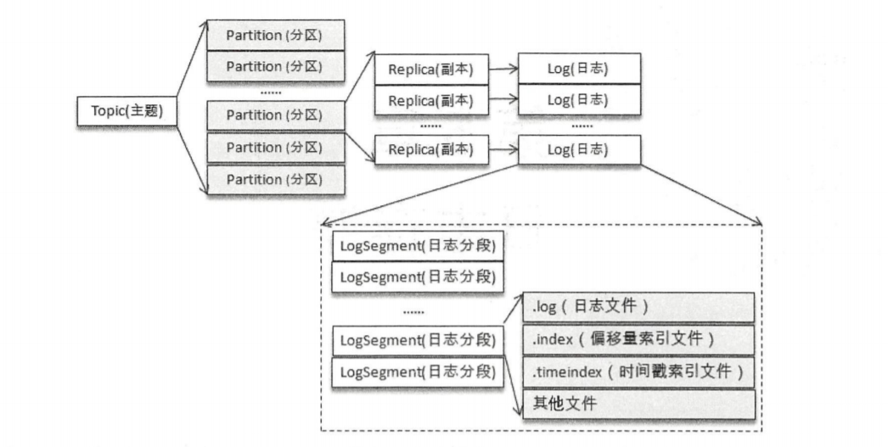
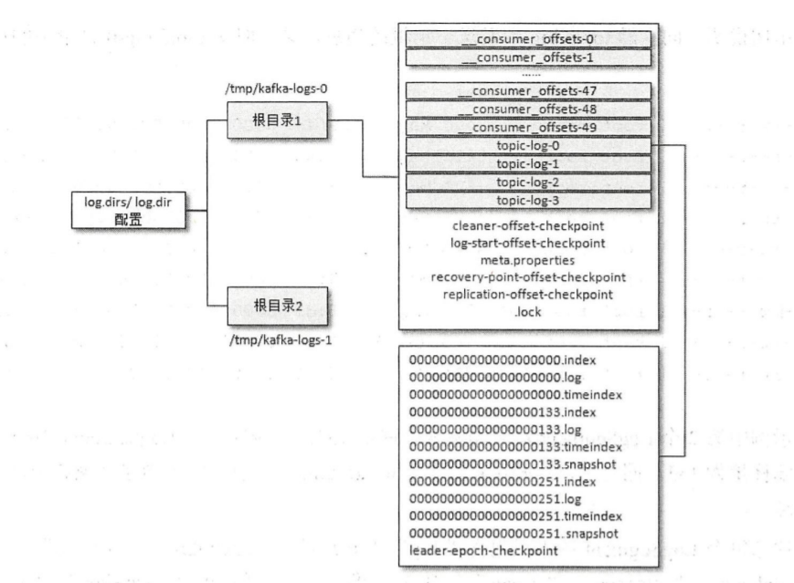
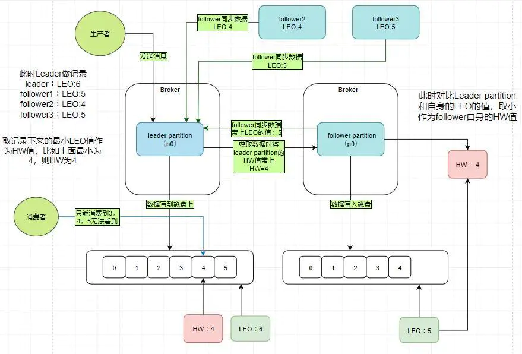

### 消息队列基础

#### 1.消息队列原理

未完待续

### RabbitMQ

未完待续

### kafka

#### 1.kafka的术语解释

> Kafka体系架构术语

- `Producer`：生产者，也就是发送消息的一方。生产者负责创建新消息，然后将其投递到kafka中。
- `Consumer`：消费者，也就是接收消息的一方。消费者连接到kafka上并接收消息，进行执行相应的业务逻辑处理。
- `Broker`：服务代理节点。对于kafka而言，broker可以简单的看作一个独立的kafka服务节点或kafka服务实例。大多数情况下也可以将broker看作一台kafka服务器，前提是服务器上只部署了一个kafka实例。一个或多个broker组成了一个kafka集群。

> 副本消费相关术语

- `AR`：分区中的所有副本统称为`AR`（`Assigned Replicas`）。`AR=ISR+OSR`，在正常情况下，所有的`follower`副本都应该与`leader`副本保持一定程度的同步，即`AR=ISR`，`OSR`集合为空。
- `ISR`：所有与`leader`副本保持一定程度同步的副本（包括`leader`副本在内）组成`ISR`（`In-Sync Replicas`）。`ISR`集合是`AR`集合中的一个子集，消息会先发送到`leader`副本，然后`follower`副本才能从`leader`副本中拉取消息进行同步，同步期间内`follower`副本相对于`leader`副本而言会有一定程度的滞后。
- `OSR`：与`leader`副本同步滞后过多的副本（不包括`leader`副本）组成`OSR`（`Out-of-Sync Replicas`）。
- `HW`：俗称高水位（`High Watermark`），它标识了一个特定的消息偏移量，消费者只能拉取到这个offset之前的消息。
- `LEO`：它标识当前日志文件中下一条待写入消息的offset（`Log End Offset`）。分区`ISR`集合中的每个副本都会维护自身的`LEO`，而`ISR`集合中`最小的LEO`即为分区的`HW`，对消费者而言`只能消费HW之前的消息`。

#### 1.kafka的存储结构

Kafka中的`Message`是以`topic`为基本单位组织的，不同的`topic`之间是相互独立的。每个`topic`又可以分成几个不同的`partition`(每个`topic`有几个`partition`是在创建`topic`时指定的)，每个`partition`存储一部分`Message`。

`partition`是以文件的形式存储在文件系统中，比如，创建了一个名为`page_visits`的`topic`，其有5个`partition`，那么在Kafka的数据目录中(由配置文件中的`log.dirs`指定的)中就有这样5个目录: `page_visits-0`，`page_visits-1`，`page_visits-2`，`page_visits-3`，`page_visits-4`，其命名规则为`<topic_name>-<partition_id>`，里面存储的分别就是这5个`partition`的数据。

`partition`中的每条`Message`由`offset`来表示它在这个`partition`中的偏移量，这个`offset`不是该`Message`在`partition`数据文件中的实际存储位置，而是逻辑上一个值，它唯一确定了`partition`中的一条`Message`。

某些时候可能会如下布局

#### 2.消息传输的保障有哪几层？

一般而言，消息中间件的消息传输保障有3个层级，分别如下：
- `at most once`：至多一次。消息可能会丢失，但绝对不会重复传输。
- `at least once`：最少一次。消息绝对不会丢失，但可能会重复传输。
- `exactly once`：恰好一次。每条消息肯定会被传输一次且仅传输一次。

#### 3.kafka生产者和消费者的消息传输保障分别是什么？

> 生产者

当生产者向kafka发送消息时，一旦消息被成功提交到日志文件，由于多副本机制的存在，这条消息就不会丢失。如果生产者发送消息到kafka之后，遇到了网络等原因中断了，那么生产者就无法判断该消息是否已经提交。生产者可以进行多次重试来确保消息已经写入kafka，这个重试的过程中有可能会造成消息的重复写入，所以这里kafka提供的消息传输保障为`at least once`。

> 消费者

消费者处理消息和提交消息位移的顺序在很大程度上决定了消费者提供哪一种消息传输保障。

如果消费者在拉取完消息之后，应用逻辑先处理消息后提交消息位移，那么在消息处理之后且在位移提交之前消费者宕机了，待它重新上线之后，会从上一次位移提交的位置拉取，这样就出现了重复消费，因为有部分消息已经处理过了只是还没来得及提交消费位移，此时就对应`at least once`。

如果消费者在拉取完消息之后，应用逻辑先提交消费位移后进行消息处理，那么在位移提交之后且在消息处理完成之前消费者宕机了，待它重新上线之后，会从已经提交的位移处开始拉取消息，如此会造成部分消息丢失，此时就对应`at most once`。

#### 4.kafka是如何保证Exactly Once？

kafka从0.11.0.0版本开始引入了幂等（`idempotent`）和`acks = -1`时的`at least once`这两个特性，以此来实现`EOS`(`exactly once`)。

使用时，只需将`enable.idempotence`属性设置为true，kafka自动将`acks`属性设为-1。

#### 5.kafka的isr及其实现方式

在kafka的follower副本与leader副本保持在一定成都的滞后内，则组成ISR（In-Sync Replicas）。如果一个`Follower`宕机，或者落后太多，`Leader`将把它从`ISR`中移除。

对一个节点是否存活有这样两个条件判断：
- 第一个，节点必须维护和zookeeper的连接，zookeeper通过心跳机制检查每个节点的连接；
- 第二个，如果节点时follower，它必要能及时同步与leader的写操作，不是延时太久。

如果满足上面2个条件，就可以说节点时“in-sync“（同步中的）。leader会追踪”同步中的“节点，如果有节点挂了，卡了，或延时太久，那么leader会它移除，延时的时间由参数`replica.log.max.messages`决定，判断是不是卡住了，由参数`replica.log.time.max.ms`决定。

#### 6.HW和LEO是什么，起到什么作用？

`HW`是`High Watermark`的缩写，俗称高水位，它标识了一个特定的消息偏移量（offset），消费者只能拉取到这个offset之前的消息。

`LEO`是`Log End Offset`的缩写，它标识当前日志文件中下一条待写入消息的offset，`LEO`的大小相当于日志分区中最后一条消息的offset值加1。分区`ISR`集合中的每个副本都会维护自身的`LEO`，而`ISR集合中最小的LEO即为分区的HW`，对消费者而言只能消费`HW之前`的消息。

**其作用是有效地权衡了数据可靠性和性能之间的关系**

kafka的复制机制既不是完全的同步复制，也不是单纯的异步复制。事实上，同步复制要求所有能工作的follower副本都复制完，这条消息才会被确认为已成功提交，这种复制方式极大的影响了性能。而在异步复制方式下，follower副本异步地从leader副本中复制数据，数据只要被leader副本写入就认为已经成功提交了。在这种情况下，如果follower副本都还没有复制完而落后于leader副本，突然leader副本宕机，则会造成数据丢失。

#### 7.kafka的rebalance的原因和解决

`Rebalance`本质上是一种协议，规定了一个`Consumer Group`下的所有`consumer`如何达成一致，来分配订阅`Topic`的每个分区。

> 触发`Rebalance`的时机:

- 组成员个数发生变化。例如有新的`consumer`实例加入该消费组或者离开组。
- `Consumer Group`所对应的节点发生了变更。
- 订阅`Topic`的个数发生变化。
- 订阅`Topic`的分区数发生变化。

`Rebalance`发生时，`Group`下所有`consumer`实例都会协调在一起共同参与，`kafka`能够保证尽量达到最公平的分配。但是`Rebalance`过程对`consumer group`会造成比较严重的影响。在`Rebalance`的过程中`consumer group`下的所有消费者实例都会停止工作，等待`Rebalance`过程完成。

> 解决办法

其中订阅`Topic`个数和分区数变化可以认为避免。常见的还是主成员个数的变化。

消费者成员正常的添加和停掉导致`rebalance`，这种情况无法避免，但是时在某些情况下，`Consumer`实例会被`Coordinator`错误地认为 “已停止” 从而被“踢出”Group。从而导致`rebalance`。

当`Consumer Group`完成`Rebalance`之后，每个`Consumer`实例都会定期地向`Coordinator`发送心跳请求，表明它还存活着。如果某个`Consumer`实例不能及时地发送这些心跳请求，`Coordinator`就会认为该`Consumer`已经 “死” 了，从而将其从`Group`中移除，然后开启新一轮`Rebalance`。这个时间可以通过`Consumer`端的参数`session.timeout.ms`进行配置。默认值是`10`秒。

除了这个参数，`Consumer`还提供了一个控制发送心跳请求频率的参数，就是`heartbeat.interval.ms`。这个值设置得越小，`Consumer`实例发送心跳请求的频率就越高。频繁地发送心跳请求会额外消耗带宽资源，但好处是能够更加快速地知晓当前是否开启`Rebalance`，因为，目前`Coordinator`通知各个`Consumer`实例开启`Rebalance`的方法，就是将`REBALANCE_NEEDED`标志封装进心跳请求的响应体中。

除了以上两个参数，`Consumer`端还有一个参数，用于控制`Consumer`实际消费能力对`Rebalance`的影响，即`max.poll.interval.ms`参数。它限定了`Consumer`端应用程序两次调用`poll`方法的最大时间间隔。它的默认值是`5`分钟，表示你的`Consumer`程序如果在`5`分钟之内无法消费完`poll`方法返回的消息，那么`Consumer`会主动发起 “离开组” 的请求，`Coordinator`也会开启新一轮`Rebalance`。

通过上面的分析，我们可以看一下那些`rebalance`是可以避免的：

第一类非必要`Rebalance`是因为未能及时发送心跳，导致`Consumer`被 “踢出”Group 而引发的。这种情况下我们可以设置`session.timeout.ms`和`heartbeat.interval.ms`的值，来尽量避免`rebalance`的出现。（以下的配置是在网上找到的最佳实践，暂时还没测试过）

- 设置`session.timeout.ms = 6s`。
- 设置`heartbeat.interval.ms = 2s`。
- 要保证`Consumer`实例在被判定为“dead” 之前，能够发送至少`3轮`的心跳请求，即`session.timeout.ms >= 3 * heartbeat.interval.ms`。
- 将`session.timeout.ms`设置成 6s 主要是为了让`Coordinator`能够更快地定位已经挂掉的`Consumer`，早日把它们踢出Group。

第二类非必要`Rebalance`是`Consumer`消费时间过长导致的。此时，`max.poll.interval.ms`参数值的设置显得尤为关键。如果要避免非预期的`Rebalance`，你最好将该参数值设置得大一点，比你的下游最大处理时间稍长一点。总之，要为业务处理逻辑留下充足的时间。这样，`Consumer`就不会因为处理这些消息的时间太长而引发`Rebalance`。

未完待续